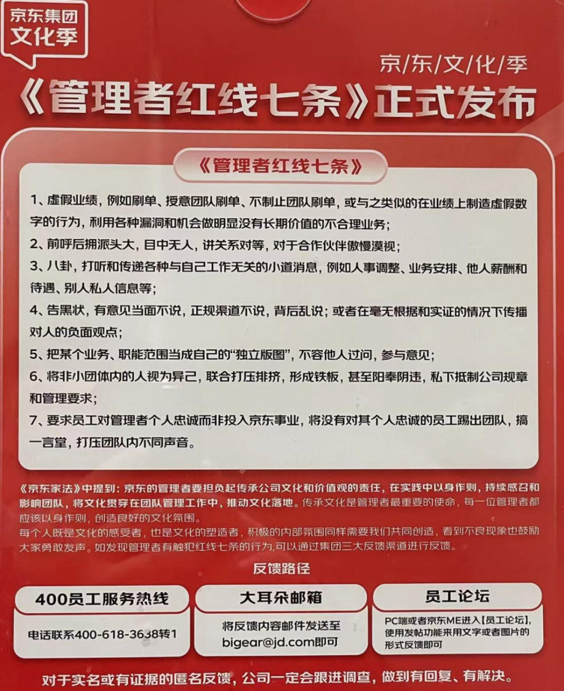

# 刘强东的狠话，谁听进去了

‍‍‍‍‍‍‍‍‍‍‍‍‍‍‍‍‍‍‍在京东，去年12月底爆出的刘强东风暴行动，继续走向纵深。

用几个关键词概括：整风、拆墙、回归初心。

在HRBP的带领下，京东中高层正在开始展开反思会，每个人上台反思自己工作中的问题，反思会从中高层开始，将渗入到每一位京东人。就管理层的个人工作作风，京东画出7红线、11条原则。

针对管理层，京东有了“底线思维”。

**与此同时，子公司的架构调整也已经开始，一周前，京东科技已经率先完成调整，这标志着京东科技年前可以开战略大会了，令其他子公司的人非常羡慕。**

在往常，为了节日气氛，京东在春节前会提前发放工资，今年只能等到节日后，严格按日期发放，差旅报销也有了调整。

风暴传到了每一个京东人。

反思会持续进行

周末的北京，天阴雾淡，缺乏光彩，亦庄的京东大楼也笼罩在这片灰暗之中。

“京东的很多员工住在林肯公园，现在打我们车的越来越多了。”路过京东大楼的时候，百度萝卜快跑的工作人员说，“听说是因为不久前开始，他们的报销额度有新的调整。”

萝卜快跑是百度的无人驾驶出行服务，亦庄是其试点之一，费用打1.5折，极其低廉，10元钱可以畅游亦庄。

在全行业降本增效的背景下，京东也开始注意对成本的压缩。

**另外，陆玖商业评论了解到，今年年底，京东的工资发放也和往年有所不同。今年的大年三十，是在1月21日，按照往年的做法，原定于29号发放的工资，会在放假前发布。今年将不会提前，而是严格按照发放时间，在节后的29号发布。**

同时，在京东管理内部，刘强东12月份掀起的京东风暴，在往纵深渗透。

**一位接近京东的内部人士告诉陆玖商业，京东各子公司管理层，正在进行反思会，顺序先从管理层开始，然后是高P（P9及以上），最后到每一位员工。**

反思会由HRBP带领，每个人上台发言，深挖自己的思想根源，总结自己做得不好的地方，现场有专人做记录。针对管理者的工作作风，京东发布了管理者的7条红线，11个原则。京东把这些内容做成宣传图，甚至张贴在了办公大楼的厕所内。

7条红线的内容，涵盖工作业绩诚信、个人作风、禁止小山头等内容：

1、虚假业绩，例如刷单、授意团队刷单、不制止团队刷单，或与之类似的业绩上制造虚假数字的行为，利用各种漏洞机会做明显没有长期价值的不合理业务；

2、前呼后拥派头大，目中无人，讲关系对等，对于合作伙伴傲慢漠视；

3、八卦，打听和传递各种与自己工作无关的小道消息，例如人事调整、业务安排、他人薪酬和待遇、别人的私人信息等；

4、告黑状，有意见当面不说，正规渠道不说，背后乱说；或者在毫无根据和实证的情况下传播对人的负面观点；

5、把某个业务、职能范围当成自己的“独立版图”，不容他人过问，参与意见；

6、将非小团体内的人视为异己，联合打压排挤，形成铁板，甚至阳奉阴违，私下抵制公司规章制度和管理要求；

7、要求员工对管理者个人忠诚而非投入京东事业，将没有对其个人忠诚的员工踢出团队，搞一言堂，打压团队内不同声音。

张贴内容里还提到《京东家法》，按照家法，传承文化是管理者最重要的使命。京东的管理者要担负起传承公司文化和价值观的责任，将文化贯穿在团队管理工作中落地。

**同时，告示也号召普通员工，如发现管理者有触犯七条红线的行为，可以通过400员工服务热线、大耳朵邮箱和员工论坛。对于实名或者有证据的匿名反馈，一定会跟进调查，做到反馈解决。**

从七条红线内容可以看出，创办二十多年的京东，不可避免地出现了大企业病，出现了山头主义、虚报业绩、拉帮结派、讲究派头等问题。这一点，百度、腾讯、阿里都未能避免。

京东《管理者红线七条》张贴内容

根据媒体之前的披露，从12月份开始，京东从上到下开始搞线下经营理念学习会，京东组织每一位员工，观看长达四小时的视频，听刘强东讲述京东内部的问题，以及徐雷、辛利军等高管的体会。

该人士表示，自己接触了几个京东人，对四小时视频的内容颇为认可，对刘强东掀起的这场风暴并不排斥。

**该人士告诉陆玖商业评论，对于高管的作风监督，京东一直抓得比较严。几年前，京东一号楼，高管用餐，有一个独立的区域，后来被痛批，这个独立的区域就没有了。**

“高管到食堂和大家一起用餐，其实也不太合适。你中午去吃饭，忽然隔壁坐着大领导，也有点尴尬。所以现在这些高管没办法，都在自己的办公室吃饭。”

12月底的反思会，可以看做线下经营理念学习会的纵深延续，京东在继续宣贯刘强东的思想。

京东的墙，谁来拆

在组织架构上，刘强东试图给京东“拆墙”。

上上个周末，京东科技刚刚召开了公司的战略会。

**“哪个公司能开战略会，就说明哪个公司解决了人事问题。”接近京东的人士表示。**

事实上，京东科技在2023年1月5日，就传出了架构调整的消息。京东科技将各个业务整合，重新成立了一个事业部和三个中心——京东云事业部、销售中心、解决方案中心和交付中心，部门四位负责人向京东科技CEO李娅云汇报。

架构调整，就意味着打破了原有的部门结构，整合了这些部门的业务。比如新成立的销售中心，整合了原来京东云事业群、数字城市群、金融云事业部销售拓展、渠道发展、生态合作等职能。

**庙动了，就意味着要搬菩萨。人事也将产生相应的变动。**

比如上述重新整合的销售中心，由原京东科技数字城市群负责人徐丰负责，以前别的事业群负责人，由并列的关系，变成了上下级关系。

**“外围原来对李娅云汇报的人挺多的，这一轮整合，对这些人也是考验。”该人士表示，“这种调整打破了原有的部门墙，也梳理了京东科技的核心。”**

与极兔的合作，也是一个拆墙的例子。

“过去的时候，为了支持物流，京东形成了一个概念，所有京东发货都要用京东物流，京东物流体验非常好，但是也贵。极兔是慢，但是它几乎能做到一块钱发全国。”该人士表示，“有人跟刘强东提了这个问题，刘强东说，首先，极兔的模式我们永远不会去做，京东零售的要交给京东物流，但是我们可以提供物流开放，比如第三方的店。”

“这些东西，零售的CEO是不敢提的，因为京东要支持物流，这是之前的决议，但实际上，这对于京东发展第三方店起到了阻碍。导致很多店有了异心，仅仅把京东的店作为一种品质的认证，以此去和别的平台谈，以更低的价格在其他平台销售。”

从一封管培生的邮件开始

刘强东发起京东风暴，内部有迹可循。

**接近京东的人士表示，在10月份，他们就感觉到，刘强东对京东的一些思路要做调整。**

根据公开报道，从2022年4月份宣布卸任CEO之后，刘强东便不再主持每天的早会，改由徐雷主持。京东每天早上8点半开早会，这是京东日常的一个管理机制，各个
BG、BU 的高管都会来参加。

卸任后的刘强东，只参加SEC(京东战略执行委员会)、SDC（京东战略决策委员会）和每季度的经营分析会。

**除了高管周报之外，刘强东还能收到“密折”，部分高管、中层和管培生群体，可以邮件形式或者通过秘书，向刘强东传递消息。**

大概在10月份，京东的管理层收到了刘强东的一封邮件。

这个邮件，是刘强东转发一个管培生写给他的信。该管培生在发给刘强东的邮件里，提到了京东价格优势已经岌岌可危，应该提供多层次的解决方案。

“老刘总喜欢举一个例子，他去意大利的一个岛，买了一个太阳能灯，大概是九块钱，他也会买这种便宜货，因为坏了就扔嘛。但是京东可能只有50块钱的，只有拼多多有9块钱的。他的意思是，京东也要做，我们有高的，也要有低的。”该人士说。

刘强东还经常举一个例子。京东帮扶某山区，帮着销售那里出产的水果，后来发现经常完不成任务。在SEC的会上，刘强东问起此事，某子公司高管心直口快，说他们产的水果太难吃了。刘强东回复说：“
**你是公司高管，你吃的东西都是进口的，当然觉得它难吃，你知不知道，这种水果，中国有几亿人没吃过？如果让他们一两块钱能吃到，他们会觉得难吃吗？”**

刘强东对后面的追兵很警惕。即使京东一直做高品质，但决不把自己界定在中高端。

“一些人在直播平台卖自家产的东西，卖一些小东西，这叫边缘创新，怕的是他做起来之后，往中间靠拢，卖起京东的核心产品。”一位电商专业人士表示。

大幕刚刚拉开？

“如果海清河晏，天下太平，刘强东自然不会这样，但是现在，边关危机重重，视频直播电商平台对京东造成了很大的威胁。这个时候，只有刘强东才有这个改革力度。也只有他站出来。”

该人士认为，对于一个企业来说，长期利益和短期利益，做法是不一样的。要看到长期利益，就必须大刀阔斧。比如任免子公司的老大和高管，这个时候，也只有刘强东出来。

**“目前，从全球来看，职业经理人在这样一个时期发挥巨大作用的，只占很小的比例，郭士纳这样的是极少数，特殊时期发挥作用的，往往都是创始人。”**

如今的京东，外部面临几个视频电商平台的追击，早在双11之前，京东内部流出“守护京东低价心智专项行动”的截图，显示出京东对低价心智的丢失忧心忡忡，也可以看到京东对直播电商平台的忌惮。

在内部，京东要解决大企业病的问题。刘强东眼中的一些高管，“假大空”，京东零售说实话的人只有1.5个。京东七条红线张贴图显示，京东的大企业病已经到了不可忽视的地步。

“我感觉，京东改革的大幕刚刚开始，年后还会有更大的变化。”该人士说。

在过去的很多年里，行业里有这么一种认知，京东的创新业务几乎全部失败，但是主营业务却越做越好，那么刘强东的风暴，会带来什么不一样的改变呢？

是守成，还是创新。

