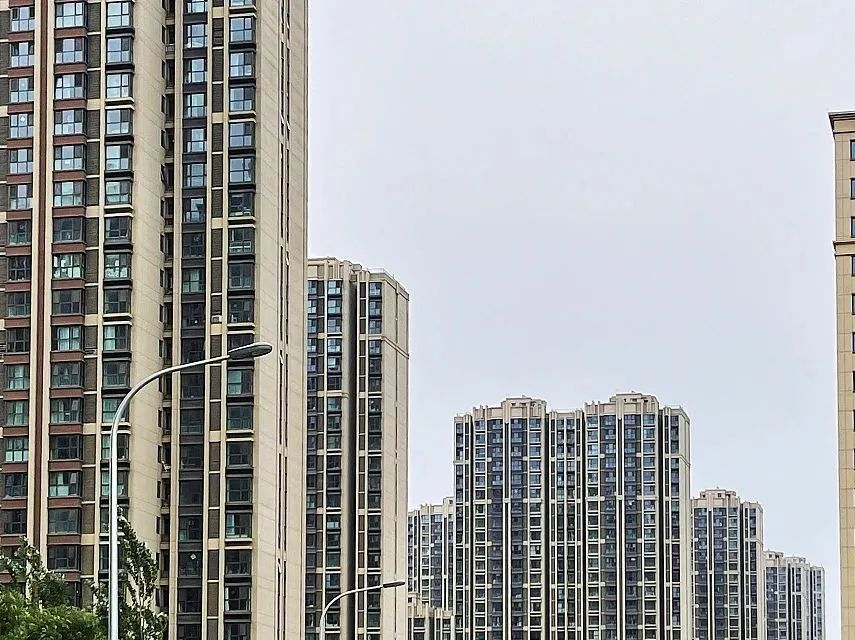

# 北京楼市回暖，中介节前忙签单：万柳6800万豪宅一天迎30多个客户

_来源：视觉中国_

作者 | 郭菲菲

编辑 | 杨布丁

出品 | 棱镜·腾讯小满工作室

当很多打工人踏上过年返乡路时，还有不少人正手携资金冲进楼市。

1月11日上午9点半，一家头部中介品牌的海淀门店里，店长宋佳（化名）正在给手下的20余名经纪人加油打气：“现在市场特别好，大家要两耳不闻窗外事，抓住机会，争取年前多签单！”

“我带的9人小组，元旦到现在已经签过4单。年前我们要冲刺100万的佣金业绩，去年最高月份才到70万。”她告诉作者，往年此时经纪人心态普遍比较散，也不是成交高峰期，过往公司为了激励经纪人签单，还会额外奖励茅台、手机等，但是眼下市场热度超出预期，奖励都不需要了。

春节前的北京楼市，正在悄然复苏回暖。

贝壳研究院于1月12日监测的数据披露，去年12月初防疫政策调整后，2023年1月上旬，北京二手房市场日均带看量明显回升，增幅达40%以上，成交量则较12月翻倍。

根据北京住建委的统计数据，2022年12月，北京二手住宅网签套数为8773套；全年规模则为14.24万套，同比下降26%——这一成交量创下近5年新低。

存量房成色几何，堪称北京楼市晴雨表，在整体成交占比中，二手房占比高达八成。

从一个更宏观的角度来看，房企暴雷声不断，销售断崖，而此轮救市能否奏效，市场普遍寄希望于一线城市消费端的复苏。

“2022全年出台了约600次楼市松动政策，但是政策失效，结果不理想。”同策研究院近期一份研报写道，原因是启动住房消费要具备两个条件：一是要有房价上涨的预期，二是城市之间传导规律是一线影响二线，二线影响三四线，即从高能级向低能级城市传导。“2022年尽管出台众多政策，但是上述两个条件缺失。”

**万柳等明星板块率先回暖**

北京海淀区核心腹地的万柳板块，位置绝佳。这里紧邻颐和园，周边北大、清华、人大等名校云集，顶级学校中关村三小的加持，使得该板块成为北京房价制高点。此前被热议的“万柳少爷”所在的万柳书院即为其中的佼佼者，该小区曾在2022年拍出36万元的成交单价。

麦田房产区域经理辛坤成在这里深耕了12年，他告诉作者，万柳板块的上行景象如今再次出现，比如一天三四套成交、房子挂牌一周即成交、几个客户抢一套房等。但除了少数品质房高价成交之外，其余还是卖的性价比，以跑量为主，“上周末两天谈了9单，五六单要涨价，业主不好签约”。

在他的视角中，从12月中旬开始，改善客户开始率先进场万柳，这里从不缺乏热度，尤其是品质三居和四居，以及万柳华府和书院的豪宅。“最近钓鱼台7号院小区新挂牌了一套350平米的房源，报价约6800万，挂牌当天就有30多组客户去看房，业主一分都不让。”

疫情管控放松之初，万柳板块市场冷清，但阳康过后，成交量开始迅速回暖。

作者了解到，12月上旬，万柳仅成交9套，但下半月成交翻倍至20套；截止到1月14日，21套房源已卖出。

辛坤成介绍称，受多校划片、限价等因素影响，类似蜂鸟家园这样小面积占坑的学区房成交占比并不高，这部分客户对价格相对敏感，而这一波行情也是改善户型首先回暖，随后开始带动起小户型成交，12月份总价超过1500万元的户型成交约为13套，1月份至今成交的80％则是小户型。

类似万柳这样的明星板块，购买力十足，回暖示范效应往往带动其他区域。

麦田房产西二旗区域经理殷程娜观察到，该板块的市场复苏迹象，要从元旦开始，刚需客户开始集中入市。这部分客户之前还很犹豫，但是现在风向变了，带看转化成交比之前要笃定很多：“互联网IT员工是我们成交主力，有位女客户说，一方面担心裁员，收入下滑，连收入证明都开不出来，另一方面又不敢赌明年的行情。”

她以硅谷先锋小区举例称，此前月均成交量三套，元旦开始一周时间，即已成交6套。

往年春节过后，北京市场通常会迎来小阳春行情，量价齐升。此次上升行情提前到来——担心明年房价上涨，提前上车，成为不少购房者的普遍心态。从整体市场成交走势来看，2022年年末出现明显的翘尾行情，并在持续上扬。

诸葛找房以周为单位的统计数据显示，自去年12月12日-12月18日的1592套成交量低点开始，北京二手房的周成交量随后开始攀升，分别达到3214套、2061套以及3828套，单日（12月30日）最高成交量达到908套。

**经纪人节前忙“抢收”**

对于这一波行情回暖，齐磊（化名）早有预期：“我们必须走在市场前面。”

作为朝阳区亚运村板块一家经纪品牌门店负责人，去年11月末疫情封控时，他的策略是将区域的房源进行重新梳理，目标瞄准那些急于成交、有明显缺陷，以及对市场悲观的房源，尽量压低业主的心理价位。“很多需求被压制，外部政策宽松，一旦价格下降，就会有成交，有成交就会有信心。”

“之前业主议价空间还很高，并且给足成交周期。现在我们直接告诉买家，千万不要有谈价的想法，业主不临时涨价就行。”齐磊告诉作者，疫情政策放开后，市场形势马上变了。

麦田的殷程娜亦有同感：现在议价空间非常少，很多挂牌业主也不着急卖，都愿意等节后赌一把，除非是已经换到房，以及有抵押着急用钱的。最近三四百万总价的房源，业主报价上涨一二十万都很正常。

不过，她也表示，刚需客户对价格还是很敏感。“硅谷先锋小区为例，66平米的主力户型，普遍成交价在420万-440万，现在这个价位的房源已经没了，下一波就是450万-460万的价格，但现在暂时还成交不了。”

多位经纪人的共识是，目前市场正处于“去库存”阶段，在这批性价比相对高的房源售罄后，剩下的房源价格会站上新台阶，一旦成交量明显起色，成交价也将上涨，至于涨幅多少，则取决于板块、品质等因素的分化程度、后续政策支持力度等。眼下，买方亦或卖方市场难以界定，超出市场水准的高报价目前仍难以成交。

以北京规模最大的经纪品牌链家为例，其市占率超过五成，截至1月17日中午，链家合计挂牌97246套二手房，这一库存量相较于2022年11月份的10万套高位，水位已有所减少。

“现在经纪人就很兴奋，干得好一个月就能把一年的钱给挣了。”麦田的辛坤成告诉作者，以往公司腊月25就放假了，今年推迟两三天，晚走一天可能就多成交一单，“现在要抢收”。

贝壳研究院近期调研也发现，代表从业者预期的贝壳经理信心指数走势，也预示了后期市场量价的回升。指标值从去年12月以来持续回升，其中二手房成交量KMI回升至47，逼近50的信心荣枯线，而成交价格KMI也升至2022年下半年以来的高位之上。

**客户都不敢冒险加杠杆了**

1月17日，国家统计局数据显示，2022年全国商品房销售额仅为13.33万亿元，规模下降至2017年的水平，其中住宅销售额同比下跌28.3%。

监管层频频出手放松调控，但对于此轮救市而言，北上广深四座一线城市的销售回暖至关重要。

尽管局部有所微调，但北京目前依然是全国楼市调控最严厉的城市。普通住宅认定标准、认房又认贷等政策仍在制约这座城市的购买力，尤其是占据主流的改善置换需求。卖掉手中的房子，再加上自身储蓄，凑足七八成首付后，购房者才能进入二手房或新房市场，连环单也由此形成。

“二手房市场好转，一般50天左右传导至新房市场。”一位TOP
20房企北京项目营销操盘手此前对作者表示，现在新房分化严重，好卖的项目集中在价格适中、位置好的刚需，以及豪宅项目；竞争激烈的改善盘，以及远郊盘去化速度仍旧一般。

另一位头部房企朝阳某项目营销负责人告诉作者，去年11月底信心跌入谷底，客户大多需要置换，自己房子卖不出去，自然就没钱来买新房。往年12月底价格促销，会有一波抄底客户，今年就特别少，自家项目最后两周卖了10多套，但还是远低于预定目标。不过最近客户到访量有所增加，上周末来了60多组，他预判新房行情起码等到年后才能显现。

这位负责人表示，总价1000-2000万标的的新盘在朝阳特别多，同质化高，不具备稀缺性，加上北京土拍卡住“70/90政策”，户型上做不出来花样，客户可选择面太多，新盘竞争也特别激烈，难以卖到备案价。“崔各庄板块某央企项目开盘一年多时间，降价了1万多，还赠送车位，只能靠降价来硬扛着走量。”

“原来客户敢于冒险加杠杆，现在都成了保守型。” 这位负责人补充称，比如现在房子卖了1500万，只会买1200万的房子，手里总想着留点现金。

对于打算今年要结婚的赵卉来说，买房已经迫在眉睫。她和男友三个月前开始看房，目光瞄准了回龙观、北苑板块，但实地观感发现，看得上的次新房超了预算，而买得起的房子大多楼龄老、户型差。

最终在12月中旬，赵卉（化名）选择了北苑的一则新盘，510万的总价，月供1.7万元。那时也是北京楼市最惨淡的日子，正在冲刺业绩的开发商给了20多万元的促销优惠。

“1月份初刚签完合同，开发商就把所有折扣都收回了。之前看过的八九套二手房，有一半也已停售卖出。”在海淀某互联网大厂工作的赵卉告诉作者，一方面自己害怕过了年房价会涨，庆幸现在捡了便宜，另一方面也担心公司继续裁员，到时候还不起月供。“现在杠杆真的拉满了，还靠父母出了不少钱。”

行情寒冬下，类似赵卉这样加杠杆的客户，如今少了很多。二手房的暖冬已至，今年春节，北京很多售楼处都不关门停业了，苦苦挣扎的开发商们还在等风来，希望抓住这波行情。

**腾讯新闻出品内容，未经授权，不得复制和转载，否则将追究法律责任。**

