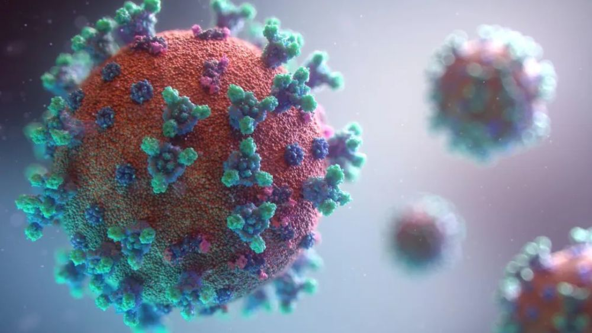

# 德尔塔克戎来了，这意味着什么？

**图源：pixabay**

**撰文 | 项栋梁**

**责编 | 李珊珊**

近期，泰国检出新冠德尔塔克戎变异株（XAY.2）的消息引发广泛关注，人们担心这种“双剑合璧”的变异株会有更强的传播力与毒性。

中国疾控中心1月19日回应称，我国尚未监测到该变异株，且目前尚无该毒株传播力、致病力和免疫逃逸能力等方面足够的研究数据。

首先需要澄清的是，德尔塔克戎（Deltacron）并非什么新鲜东西，近期在泰国检测到的XAY.2变异株此前也曾在部分欧洲与非洲国家检测到，科学界对其保持了必要的警惕和关注，但尚未发现它有什么过人之处，也没有在哪个地区占据过主流地位。甚至德尔塔克戎这个组合名字，也只是媒体为方便传播而起的一个俗称，这个名称曾被用来指代多个不同的新冠重组变异毒株。

目前，这些变异株中还没有任何一个被世卫组织认定为值得关注的变异株（VOC）或感兴趣的变异株（VOI）。

真实的情景是，与民众对德尔塔克戎的“恶意推定”和集中关注不同，科学界面对这一变异株相对比较淡定。

一来，不同毒株发生基因重组是迟早会发生的事情，德尔塔克戎的出现在意料之中。二来，这一变异株此前主要出现在丹麦、南非和以色列三个国家，科学界对其保持了必要的警惕和关注，但尚未发现它有什么过人之处，也没有在哪个地区占据过主流地位。

简而言之，对这个号称德尔塔克戎的XAY.2变异株不必过于恐慌，保持常规注意即可。

不过，新冠病毒重组变异的确是我们需要长期关注的一个点，它有可能加快病毒累积变异位点的速度，有一定可能产生对人类威胁更大的新型变异株。

**1、病毒重组变异不同于杂交水稻育种**

很多人听到德尔塔克戎这个名字首先会想到这是两种病毒杂交的产物，进而联想到杂交优势，以为它肯定比德尔塔和奥密克戎都更强大。这是一种想当然的误解，大概率与事实并不相符。

病毒的重组变异与农作物的杂交育种在原理上有一定的相似之处，都是遗传物质的交换与重新组合，但它们有许多的不同之处。

**第一是基因重组发生的尺度不同。**

病毒是没有性别的生物，它的繁衍靠的是原样复制扩增，正常情况下复制产生的后代和上一代完全一模一样。极偶尔的情况下，病毒在复制过程中发生细微的错误，有个别的碱基被替代，这就产生了变异毒株。

当同一个细胞内有两种变异株在同时复制时，它们之间的一些基因片段就有可能会发生交换和重新装配，把A毒株的某一段安装到了B毒株对应的位置上。这样产生的后代绝大部分遗传物质都是来自B毒株，只有一小部分来自A毒株。

如果我们拿一辆车的改装来打比方，病毒变异相当于换了一个尾灯，而病毒重组相当于从一辆宝马上拆下车门换到了一辆奔驰上。换了宝马车门的奔驰车仍然是一辆奔驰，但具备了一些宝马车的特征。

杂交育种的农作物通常都是有性繁殖的生物。例如水稻会产生花粉，每颗花粉只继承了亲代一半的遗传物质。杂交时，把A水稻的花粉授粉到B水稻的柱头上，结出来的种子就继承了A水稻和B水稻各一半的遗传物质。

还是拿一辆车的改装来打比方，水稻杂交相当于把两辆车都拆散成零件，从成对的零件里各取一半，再拼成一辆新车。杂交的新车前门是宝马的，后门是奔驰的，前轮是奔驰的，后轮是宝马的。

所以说，病毒的重组是发生在基因尺度上的，性状转移的比例会比较小，而杂交水稻的重组是发生在染色体尺度上的，性状转移的比例接近一半（仅考虑核染色体时）。

**第二是筛选的力度不同。**

我们之所以产生杂交水稻子代比亲代更优秀的印象，并不是因为杂交一定能产生优势，而是在无数次杂交试验之后，育种家把具备优势的子代给单独挑选了出来。杂交产生的1000个子代里，可能有999个都不尽如人意，最终只挑出一株产量又高米质又好的杂交水稻来。

杂交是人工选择对物种演化施加的强大压力，对农作物演化方向具有决定性的影响。

病毒的重组变异则是在“自然环境”下发生的，并没有人类基于自身需求而实施的干预。1000次病毒重组事件中，产生的新毒株可能990种都平平无奇，5种有了更强的传播力，5种有了更弱的传播力。（注：此处仅作示意说明，不代表真实数据）

由于病毒重组事件本身发生的概率非常低，一次重组产生新病毒的拷贝数也很少，即便有了更强的传播力，也不一定能突破人体免疫系统和药物的追杀，大概率是被扑灭在萌芽状态。

因为不存在人工选择和扶持，单次的病毒重组即便产生更强后代，也很难流行开来。

**2、德尔塔克戎的三种可能性**

德尔塔克戎这一重组变异株在多个国家被检测到，那么至少说明它的“野外求生”能力不差。但具体到我们关心的，它对人类有多大威胁，还存在几种可能性：

一种可能是它的传播力更强，免疫逃逸能力显著提高。但这样一来它应该很快会成为区域优势毒株，而这种情况在几个月里并没有发生。所以这种可能性是比较低的。

第二种可能是它的传播力变弱了，但因为结构变化导致免疫逃逸能力有所提高。现有疫苗和感染后产生的抗体不能很好地阻止它，给了它机会，但它本身得分能力并不强，因而感染的人不多。这种可能性是相对较高的。

第三种可能性它的传播力更强了，但免疫逃逸能力没有显著变化。这样一来，它在毫无阻挡的情况下可能会有优势，但现实世界中很多人都接种了疫苗，或者感染过德尔塔毒株、奥密克戎毒株，对它有免疫防护，翻不出大浪来。这种情况也是有可能性的。

**3、三种方法评估新变异株的威胁**

有读者要抗议了，你光在这里猜测怎么行，德尔塔克戎到底是什么情况，你倒是去研究一下给个准信啊！

这话很有道理，但研究是需要时间和人力的。当前人类研究评估一种病毒的威胁，主要有三种方法。

**一是用模拟计算来评估。**

科学家获得了某一变异毒株后，会对其基因组进行测序，并对其蛋白质折叠结构进行分析，进而通过这些结构特征来模拟计算其与抗体结合的能力，与人体细胞表面ACE2受体结合的能力，从而评估其传播能力。

印度科研人员Lekha
Salsekar等人1月9日在预印本网站bioRxiv上发表研究，分析了XAY.2毒株在受体结合区域（RBD）的两个关键突变，分别是G446D和F486P，这两个突变点位一个此前被证明会降低传播力，另一个被证明会提高传播力。或许这正是该毒株“不温不火”的原因所在。

随着人类对病毒结构的了解越来越深，AI计算和预测的能力越来越强，通过模拟计算得出的结果正越来越接近真实情况，但这毕竟是“纸上谈兵”，目前还不能作为完全准确可靠的判断依据。

大多数时候，模拟计算给我们的是一个初步的评估结论，提示后续的研究方向。

**二是用体外细胞试验来检测。**

研究人员会在体外培养的细胞或者动物模型中对病毒进行研究，检测现有抗体对病毒的中和能力，检测病毒复制的速度、产生的症状、攻击的部位等。

这些检测能够在一定程度上反映病毒的特点，帮助我们判断病毒传播力、致病力、免疫逃逸能力，以及现有疫苗、药物等手段对病毒的防护作用。

但是，体外试验终究不等于临床试验，离开了人体复杂的系统，相关试验结果并不能完整反映真实情况。这也是为什么很多药物在体外试验中显示出良好的效果，却一进入临床试验就败下阵来。

**三是监测真实世界的数据。**

当今世界上，每时每刻，在每个国家都在进行着大量新冠相关的科研工作，人们在跨国旅行时也经常被采样检测。

一种毒株在感染人群中所占的比例，感染这种毒株后的症状表现，接种疫苗和未接种疫苗者感染的不同比例，都会是这些研究所关注的内容。对于德尔塔克戎，这些研究工作也都是在做的。

但是，由于德尔塔克戎当前感染的人数还不多，传播覆盖的国家也还有限，研究人员和世卫组织手里掌握的数据也很少，不足以分析出有价值的结论来。

因此，并不是科研人员不努力，也不是世卫组织不重视，而是德尔塔克戎本身还没有展现出严重的威胁，没有造成显著的传播结果，还很难给它定性。

**4、小结一下：**

德尔塔克戎是病毒重组变异的正常结果，并不意外；

从发现至今几个月的情况来看，德尔塔克戎还没有展现出严重的威胁来；

病毒重组变异值得关注，也在关注，但德尔塔克戎相关的研究数据还很少，不足以得出结论。

（感谢山东大学公共卫生学院 副研究员邵頔对本文的建议和指正。）

**参考文献：**

1.https://github.com/cov-lineages/pango-designation

2.https://www.biorxiv.org/content/10.1101/2023.01.09.523246v1.full

