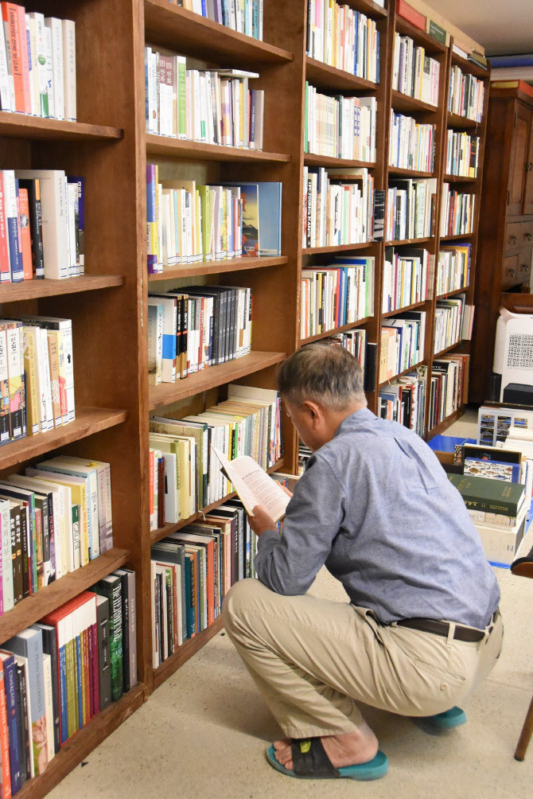
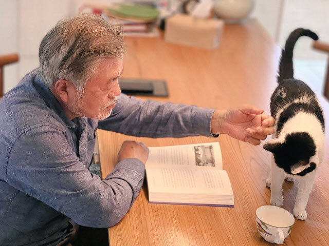
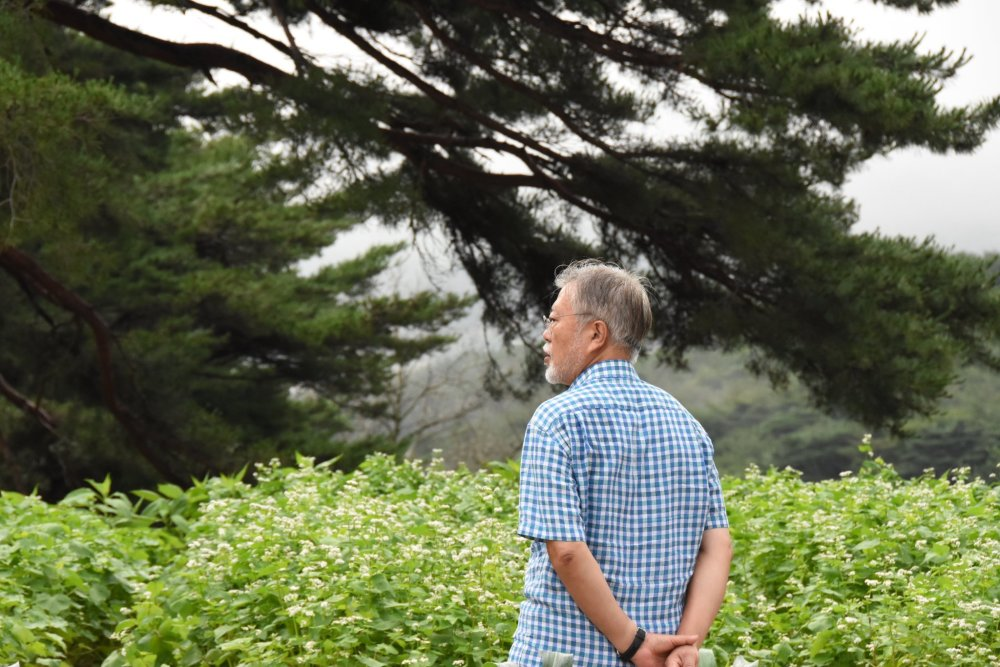
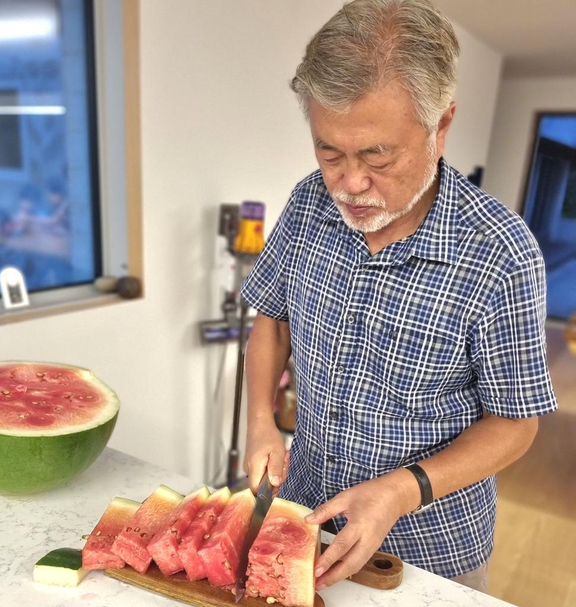

# 文在寅退休后在村里开书店：自己当管理员 打破韩国前总统先例

_文在寅卸任后，在自家书房读书（社交平台）_

**海外网1月18日电**
据《韩民族》1月16日报道，韩国前总统文在寅接受该媒体采访时透露，计划在村里开一家书店，目前店面正在装修，最快2月开业。韩国Wikitree网站说，文在寅是首位卸任后开店的韩国前总统。

_文在寅卸任后，在家读书（社交平台）_

文在寅2022年5月卸任后，一直住在庆尚南道梁山市平山村。他说，平山村原本很安静，自己移居这里后，示威者的噪音和辱骂令村民不堪其扰。为了帮助蒙受损失的村民，自己想到开一家书店。

_文在寅卸任后回乡下养老（社交平台）_

文在寅表示，希望以书为媒，打造一个交流和对话的空间，让作者和读者在此见面，也让爱读书的朋友在此相会。开业后，自己会做管理员，打理店面，推荐好书，并在社交平台分享书店日常。他还计划邀请青少年读书社团，在书店举办历史文化主题的沙龙，或者组织陶艺体验活动。

_文在寅为妻女切西瓜（社交平台）_

据《韩民族》此前报道，文在寅卸任后潜心读书，并不时分享好书。他推荐的10本图书，包括《哈尔滨》《掌柜主义的诞生》等，销量都明显上涨，有的书还登上畅销榜榜首。（海外网
刘强）

海外网版权作品，未经授权不得转载。

