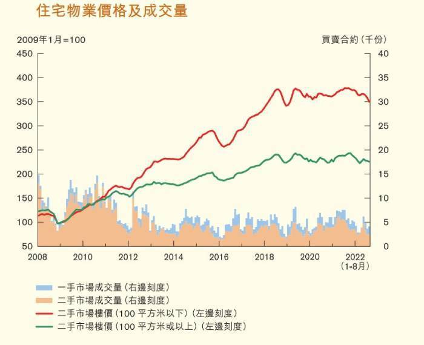
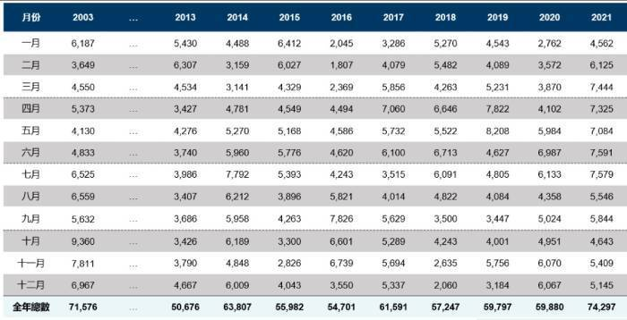

# 香港2022年房价跌回五年前，成交量跌近四成，楼市进入14年来最低谷

本报记者 梁宝欣 李贝贝 深圳报道

2022年的香港楼市，量价齐跌，冷意尽显。

香港土地注册处数据显示，2022年香港楼宇成交量下跌近四成。其中，楼宇买卖合约共59619份，相较2021年和2020年分别下跌38%、18.7%；楼宇买卖合约总值5544.6亿元（港元，下同），较2021下滑39.6%，较2020年下滑11.8%。

在房价表现方面，香港差饷物业估价署数据显示，2022年11月，香港私人住宅售价指数报339.4，按月跌幅扩大至3.3%，按年跌幅扩大至近13.8%。

值得注意的是，截至2022年11月，香港楼价已经连跌6个月，创下2017年7月以来最低。2017年7月，香港私人住宅售价指数报337.5。

自2008年以来，香港楼价仅出现三次下跌，分别在2008年、2020年及2022年。2022年的香港楼市是继2008年金融危机后表现最差的一次。

**楼价跌回5年前**

2022年12月28日，香港差饷物业估价署公布最新楼价指数，香港11月私人住宅售价指数报339.4，按月跌幅扩大至3.3%，按年跌幅扩大至近13.8%。值得注意的是，香港楼价已经连跌6个月，最新的楼价指数接近2017年7月的337.5点，跌回5年前。

其中，2022年前11个月，香港A类单位（实用面积少于40平）、B类单位（实用面积为40至69.9）平、C类单位（实用面积为70至99.9平）和E类单位（实用面积为160平及以上）的楼价跌幅均超过一成，跌幅分别为13.7%、13.4%、10.2%和10.8%。仅有D类单位（实用面积为100至159.9平）的楼价跌幅少于一成，跌幅为5.64%。

此外，香港金融管理局（简称“香港金管局”）在2022年9月发布的《货币与金融稳定情况半年度报告》（简称《报告》）中指出，二手市场楼价在2022年第一季度下跌3.2%后，于第二季度轻微回升0.2%。按面积划分，大型单位（实用面积100平或以上）的价格回升速度较中小型单位（实用面积小于100平）快，部分反映本地家庭升级换楼的需求。此外，住宅价格在7月和8月再度下降。

_香港住宅价格及成交量。
图源：香港金管局《货币与金融稳定情况半年度报告》_

而根据戴德梁行追踪部分受欢迎屋苑的楼价数据，2022年第四季度各类市场的楼价跌幅扩大，其中，代表刚需盘的沙田第一城当季单价跌幅达18.1%，最为显著，其单价回到2017年初水平；代表中端市场的太古城则当季下调14.4%，代表豪宅市場的贝沙湾也在第四季度录得6.4%的跌幅。

公开资料显示，沙田第一城是香港新界沙田区最大型的住宅项目，在20世纪70年代由李兆基牵头，与李嘉诚联手郑裕彤、郭得胜共同开发。

而截至2022年末，反应香港二手房价格的中原城市领先指数CCL报156.77，创2017年以来新低，与2021年同期184.55相比，跌幅为15.05%。

值得注意的是，自2008年以来，香港楼价仅出现三次下跌，分别在2008年、2020年及2022年。2022年的香港楼市是继2008年金融危机后表现最差的一次，2008年和2020年的跌幅分别为15.99%和1.91%。

在租金方面，香港差饷物业估价署数据显示，2022年11月私人住宅租金指数报175.2，按月跌幅扩大至逾1.3%，连跌3个月，按年跌幅扩大至4.2%。今年前11个月累计跌4.1%。

**成交量跌近4成**

香港土地注册处数据显示，2022年香港楼宇成交量下跌近四成，同时也创下自2019年来的新低。其中，楼宇买卖合约共59619份，相较2021年和2020年分别下跌38%、18.7%；楼宇买卖合约总值5544.6亿元，较2021下滑39.6%，较2020年下滑11.8%。

而香港金管局在《报告》中指出，香港住宅物业市场继2022年第一季度放缓后，于第二季度回稳。随着本地第五波缓和，看房和成交活动在市场气氛改善及积压需求获得释放下均有所回升。

地产开发商亦恢复推售新项目，并以具有竞争力的定价策略促销。因此，每月平均成交量从2022年第一季度3352宗的低位上升至第二季度的4975宗。第三季度，市场气氛随着加息忧虑而转向审慎，住宅每月平均成交量于7月和8月回落至3904宗。

_香港楼宇成交量数据。
截图自戴德梁行报告_

针对2022年香港住宅市场成交量情况，戴德梁行分析称，2022年香港住宅市场成交明显放缓，1月至11月，平均每月成交宗数不足4000宗。上半年成交，主要受第五波疫情影响，而在下半年，加息及股票市场动荡等因素促使买家更为审慎，一、二手住宅成交继续放缓。

1月13日，地产经济学家邓浩志在接受《华夏时报》记者采访时表示，2022年香港楼市低迷的原因，首先在于过去连续六七年，香港楼市价格持续上涨，累计涨幅很大，而没有进行相应的调整。

这是属于市场的原因；其次，则与经济不景气有关，如今内地和香港的经济都遇到了很大的困难，市场消费力的投资意愿有所降低；再者，受到内地和香港疫情的影响，使得通关受到一定的限制。

此外，还和香港楼市的“辣招”（楼市调控政策）有关系，“辣招”使得各项税费都增加了，抑制了很多市场需求。

“而最重要的一点，就是美联储的加息。由于香港是联系汇率制度，香港货币政策与美联储高度一致，所以港元会和美元一起持续加息，使得储蓄的收益不断增加，而投资房地产的租金回报收益和投资银行存款之间存在利差。最终出现了银行存款收益更高，投资房产收益更低的情况，导致了资金从楼市流出，流向银行。另外，美联储货币紧缩政策出台之后，由于港元和美元挂钩，使得市场上的资金减少，同时促使以美元计价的投资品需求减少，香港楼市也受到了影响。”邓浩志说。

**香港楼市仍受美联储加息影响**

戴德梁行执行董事及香港研究部主管邓淑贤表示，展望2023年，住宅市场仍受加息及环球经济影响，左右买家入市意愿，同时相信部分业主因为供楼压力加大而增大议价空间。

预计2023年上半年香港楼价仍会维持下跌趋势，但随着市场预期利率有望2023年见顶，下半年楼价或趋向稳定，全年预计调整0—5%。

成交量方面，2022年一手成交减慢使得开发商持货量增加，预估2023年开发商将加快推盘，并会采取贴市开价（根据市场的价格）的策略吸引买家。

“另外，股票市场在2023年若能保持升势，加上有望通关口岸逐步开放等利好消息，相信能带领香港经济和楼市气氛逐渐回暖，住宅成交量或有机会较今年低位回升20%至30%，与2019年、2020年水平相近。”邓淑贤说。

据悉，2023年1月8日，香港与内地实施首阶段“通关”，而广深港高铁于1月15日恢复通车。

对此，邓浩志指出，香港与内地恢复通关，将会复苏香港经济，从而提升市民的消费力以及对楼市的购买力。此外，内地也会有买家去香港购置物业，对香港楼市起到一定的支持。

不过，这个帮助是有限的，因为香港楼市的“辣招”抑制了相关的需求，特别是抑制了外地资金在香港购房的需求。

“所以，我个人认为，香港与内地恢复通关和通高铁，对香港楼市来说属于中等利好，算不上大利好。”邓浩志说道。

《报告》也指出，住宅物业市场受到众多不明朗因素及风险所影响。其中，本地疫情拖延，加上按揭利率上升，可能会抑制置业需求，而市场对环球经济前景的忧虑以及美国加息步伐的不确定性将继续拖累楼市气氛。

长远而言，住宅市场的前景将取决于房屋供应缺口，香港特别行政区政府预计未来几年私人住宅供应量仍会维持在高位。

据了解，香港房屋局于2022年6月底估计，未来3至4年一手私人住宅单位总供应量将维持在9.8万个高位。为加快土地房屋供应，香港特别行政区政府亦已于2022年7月成立土地及房屋供应统筹组及公营房屋项目特别行动工作组，以精简发展程序及释放土地发展潜力。

在邓浩志看来，香港楼市复苏仍存在一定的困难，一是经济复苏的预期有多大，尚未确定，二是美国还处于加息周期中，三是香港楼市的“辣招”仍在抑制外来资金进入香港楼市。

而展望2023年的香港楼市，邓浩志认为，如果从成交量的角度来看，香港楼市应该是见底了。随着通关的恢复，内地游客进入香港消费、购物，甚至购房等，香港楼市成交量将会触底反弹。不过成交价格还没到底部，其中一个很关键的原因是联系汇率制度，美联储仍在加息，今年上半年预估都会处在加息周期，只不过加息幅度会放缓，但仍会继续扩大银行存款和物业投资租金回报之间的差距。

如果美元的利息上升到5%以上，港元利息持续增加，那投资物业将比不过放在银行的收益，而且（资金放在银行）还安全。

“2023年的香港楼市，我认为在价格方面，上半年会继续下跌，下半年保持平稳，具体要看香港经济的复苏和美联储接下来的货币政策。在成交量方面，则会逐步开始复苏，春节后会有小阳春的表现，成交量逐步上升，不过不会上升得很厉害。”邓浩志表示。

责任编辑：张蓓 主编：张豫宁

