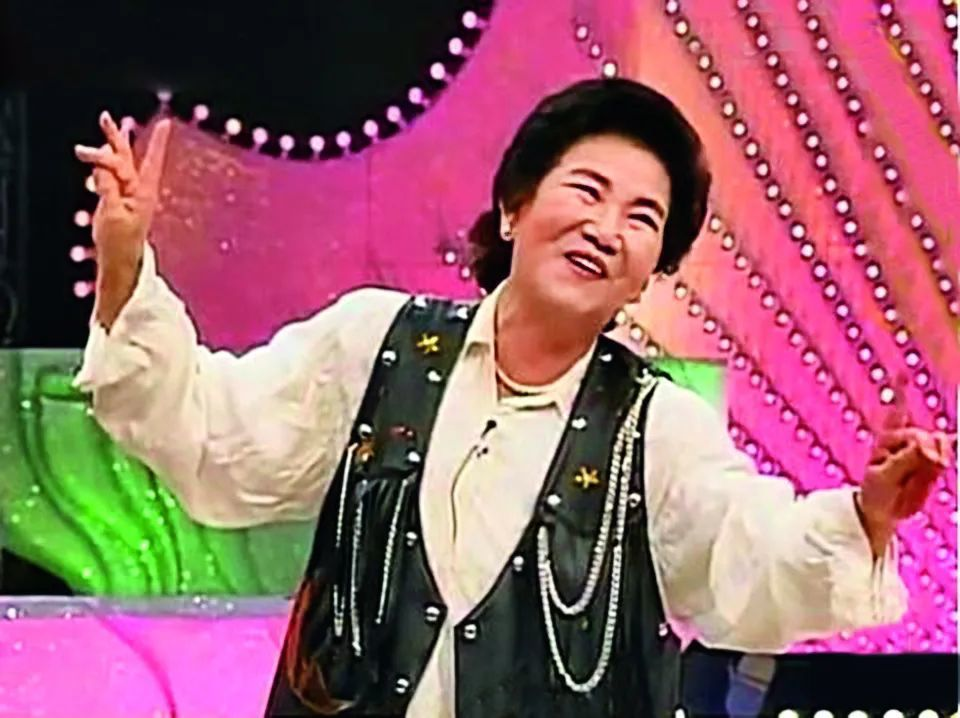
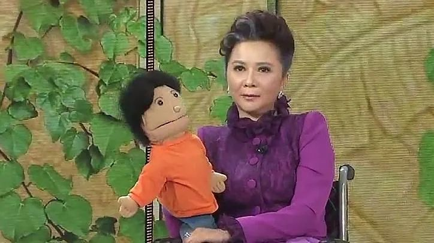

# 40年了！她承包了几代人的笑点

**春晚这个舞台，是中国几代人笑的启蒙。**

作者：朱东君

大年三十啦！兔年央视春晚进入倒计时。

在“阖家看春晚”这项当代新民俗里，语言类节目总是最受关注的。

春晚这个舞台，是中国几代人笑的启蒙。

**笑的魔法**

国家一级编剧石林清晰地记得1988年年底的那个冬日。他从家骑着自行车赶往央视春晚剧组所在地，从南三环到北四环，“整骑了两个钟头”。这位72岁的老牌喜剧人一开口，便透出一丝幽默感。

他是去投稿的。那时他是北京市曲剧团的创作员，与人合作写了一个小品剧本。石林早年学写相声，后来又写戏曲，这是他第一次尝试小品创作。结果团里没用，他在报上看到央视向全国征集1989年春晚的小品稿件，便把作品送了去。门房接过稿纸，转身丢进麻袋。

“我一看完了，这事也就算了。”没承想，之后便接到了央视的电话。在当时提交的剧本上，石林标注了一句话：此作品若选中，建议由中国评剧院赵丽蓉老师出演。

于是，这就有了1989年春晚上的小品《英雄母亲的一天》，英雄母亲赵丽蓉遇上了要宣传典型的电视台记者侯耀文，也就有了“司马光砸缸”“司马缸砸缸”的经典对白。

当《英雄母亲的一天》在春晚舞台上上演时，还是孩子的郑猛津津有味地守着电视机。“那时可看的东西少，基本上一进腊月就开始盼着春晚，确实也不会让你失望，尤其是那些相声、小品，把你逗得哈哈大笑。”如今已经是喜剧评论人的郑猛回忆着自己的春晚情结。

郑猛踩着上世纪70年代的尾巴出生，1986年家里买了电视，1987年，他拥有了记忆中第一届春晚。“最喜欢的肯定是《虎口遐想》，尽管当时还不完全理解姜昆说的内容，但我知道这肯定是挺好玩的一个事，一个年轻人没有搞对象，掉进动物园的狮虎山。”

1987年的春晚还有一个相声也让郑猛印象深刻，就是马季带领着几人表演的《五官争功》，当中就有第二次登上春晚舞台的冯巩。

马季是把相声从舞台推向电视的关键人物。他在上世纪五六十年代业已成名，当80年代电视在中国普及开来时，他便思考把相声由听觉艺术改造为视觉艺术。1984年春晚上大放异彩的《一个推销员》，便是他尝试的成果。人们后来习惯叫这个作品为《宇宙牌香烟》。

电视的普及和春晚的出现无疑是相声一度兴盛的重要助力。不过，随着小品的兴起，相声在春晚舞台上逐渐式微。

1994年春晚小品《打扑克》中，两人用名片打牌，一人出“科长”，另一人出“处长”，一人出“处长”，另一人出“局长”……一人出“相声演员”，说“不仅脸熟，而且喜闻乐见”，另一人出“小品演员”，说“现在相声明显干不过小品”。现场哄堂大笑，春晚相声的黄金年代落幕了。

春晚上的小品，继而成为又一代中国人的喜剧启蒙。1990年出生的许子谅便是由此爱上了喜剧，他现在更为人知的身份是喜剧编剧还珠。“我上小学的时候，就和同桌演春晚上的小品。那时我抢不过同桌，就总演宋丹丹、高秀敏。还记得第一个完整背下来的小品是《昨天今天明天》，现在你说上句我还能接上下句。”

1984年陈佩斯和朱时茂表演的《吃面条》，被普遍认为是春晚历史上第一个小品。这个作品根源于观察生活练习，是戏剧学院里最常见的一种训练学生的方式，原来只是内部教学使用，没想到放在春晚上意外成功。进入上世纪90年代，春晚小品开始逐渐有了主题和戏剧结构。

不少作品至今仍能带来滋养。有一次许子谅和几个人熬夜写喜剧剧本，“实在想不出来了，咋办？就一个接一个看当年的小品。从《卖拐》《卖车》《心病》《拜年》，看到《红高粱模特队》，看到《牛大叔提干》。至少在那一刻，大家能想起来自己当初为什么想做喜剧这件事。”

“是为了给别人带去欢乐吗？”记者问。

“对。把别人逗笑的那一刻，就像魔法一样，是很神奇的一刻，是自己也超级开心的一刻。”许子谅说。

**笑的奥妙**

要让观众笑，演员与编剧，最好是珠联璧合。

石林与赵丽蓉就是这样的关系。

“我们不乏中国母亲的形象，温顺、坚毅、忍辱负重，这样的演员多极了，但幽默诙谐的很少。当年我看了赵老师很多评剧，比如《花为媒》《杨三姐告状》，就觉得这老太太挺有幽默感。”

第一次见面，石林不满38岁，赵丽蓉已年过60。赵丽蓉不认识字，石林就一句一句把《英雄母亲的一天》剧本念给她听。“听完了，老太太抽着根劣质的卷烟说，作者你这是啥意思？我就跟她说，赵老师你想想生活当中，咱们是不是有不实事求是、肆意拔高的现象，我举了好些例子，老太太就联想起来了，加上她对生活的阅历，老太太就全进去了。”

刚开始排演这个小品，与赵丽蓉搭档的是一位名气不大的演员。距离春晚开播还差半个月的时候，有一位老艺术家说，老太太表演太厉害了，她“吃人”，就是根本看不到另一个人了。石林便临时找来侯耀文搭档，成就了春晚上的这一经典作品。

赵丽蓉与巩汉林这对经典搭档也是石林促成的。“1991年，央视要准备一台庆祝建党70周年的文艺晚会，我给赵老师写了一个小品，有一个儿子的角色，找谁来演儿子，当时费了劲，要是跟赵老师配不上，这个戏就完了。巩汉林之前演过一个小品，扮演一个南方人，我有印象，就说要这个演员。这一合作，就延续下来了。”

在1992年春晚上，赵丽蓉和巩汉林搭档演出了《妈妈的今天》。其中，赵丽蓉贡献了精彩的“探戈”表演——“探戈儿就是蹚啊蹚着走，三步一蹿，两啊两回头，五步一下腰，六步一招手，然后你再蹚啊蹚着走。”

“这句台词就是写到这里就有感觉了。”石林说：“喜剧有很多技巧，‘司马缸砸缸’用的是相声的谐音技巧，而这一句用的就是变形技巧。不变形是正剧，一变形就是喜剧。”

喜剧创作并非易事。“我们这一代人创作，习惯从生活中筛选素材。这就像淘金，一般性的题材，淘一两吨沙子，就能炼出金子，喜剧小品得淘10吨20吨沙子，才能炼出这点金子来。”

小品的创作之难，另一位喜剧编剧束焕也有同感：“年轻时老觉得写小品是练手的机会，后来才发现其实小品比影视剧还难写。因为小品是一个即时发生的故事，没有转场，没有时间跨度，舞台上的12分钟，就是生活中的12分钟，在这12分钟里要写一个完整的事件，人物关系要发生变化，最难的是还需要让观众笑得出来。”

在春晚的舞台上，束焕作为编剧一直是与蔡明合作的，从2009年到2019年。在2013年的春晚小品《想跳就跳》中，束焕为蔡明写了一个“毒舌”人设。“我们想塑造一个尖酸刻薄的老太太形象，但其实又特别有正义感，不双标，对谁都一样‘横’，挺可爱。其实我们当时一直没有想到‘毒舌’这个词，是在那天春晚直播之后，我们发现评论区都说这是‘毒舌’，我觉得挺好。”

在束焕看来，春晚是角儿的艺术，一切都是人物。“这个人物，一半是作品中塑造的角色，一半是演员本身。在我们剧本初稿完成后，演员的二度创作非常重要。春晚喜剧作品很多是在不断地排练、磨合、否定之否定中，才创作出来的。有的小品剧本到了最后一稿时，第一稿中的一句话都没了，全部改过了，它是一个生长的过程。”

**笑的绽放**

2022年，束焕与春晚有了新的交集。他是今年央视春晚语言类节目的统筹，从去年夏天开始，他就忙着这件事，阅读候选剧本，跟节目主创沟通，帮他们寻找题材，对每个作品提供一些建议，帮着参谋。

与束焕刚参与春晚时相比，如今春晚语言类节目的主力军已大大不同。“如今小品的领军人物是沈腾，公认的。”

沈腾是2012年第一次登上央视春晚舞台的，表演小品《今天的幸福》。那个节目让郑猛感到了新意。“当年看春晚直播的时候，家里热闹至极，我还没太看明白，这个人怎么从电视里钻出来，又非要从电视穿越回去。如此魔幻的剧情不太可能出现在之前春晚的小品里。”

2022年，许子谅也与春晚有了交集，从纯粹的观看到尝试春晚语言类作品的创作。这年，他参加了央视的一档喜剧类综艺，节目组就是负责春晚语言类节目的团队。“节目组找来很多人，有做脱口秀的，有拍短视频的，有写电影的，有写情景剧的。可以看出，他们很希望通过这种碰撞，做出一些新的东西。”

许子谅也是带着“新”的标签参加节目的，他是sketch（素描喜剧）的编剧，属于当下正火的新喜剧范畴。与传统小品相比，sketch更为片段化，时长短，笑点密。2014年大学毕业后，许子谅便义无反顾投入喜剧行业，先是说脱口秀，后来又成为中国最早一批sketch综艺节目的编剧。

2020年网络综艺《脱口秀大会》第三季“出了圈”，让看脱口秀线下演出成为时兴的文化消费方式。2021年，打着新喜剧概念的网络综艺《一年一度喜剧大赛》又火了，sketch等喜剧形式也开始被越来越多人了解和接受。许子谅明显感觉到，“能接到的活多了，可以挑一挑了”。

虽然平台多了，但无疑，央视春晚的舞台仍是最有吸引力的那一个，“那就是最大的舞台”。

受所参与的央视喜剧综艺节目组邀请，许子谅也为春晚写了一个相声本子，以及几个围绕同一主题的小品大纲，但感觉完成得并不好，自己还越写越焦虑了。不同于给其他节目创作，给春晚写起来“感觉好难，即使写出点东西也自觉哪儿都不对”。

首先是素材上，“春晚不是光给年轻人看，也是给我爸妈、我姥姥姥爷这个岁数的人看的，他们对新喜剧的接受程度还不是很高”。其次是技术上，“新喜剧综艺的表演舞台都很小，有的不过四五米，观众离得近，摄像机也给得很近，节奏快，转播出来就很好看。同样的东西，放在大了几米的舞台上，整个节奏就都不对了，包袱也不响了”。

“我们向很多新喜剧人都发出了邀请。”束焕说，他一直关注着脱口秀和新喜剧在国内的发展，《一年一度喜剧大赛》第一季录制时，他也坐在评委席上。

束焕认为脱口秀和新喜剧对春晚是有加持的。“早先我也想在春晚舞台上来一些颠覆，但后来发现春晚还是有自身一些特定的创作规律，要是直接把新喜剧的优秀作品搬到春晚舞台上，也会很奇怪。所以我们会借鉴新喜剧的长处，糅到春晚的作品里。”

一代人有一代人的喜剧偏好，但毫无疑问，每个年代的人都需要笑。从收音机到电视，从网络到线下，人们接触喜剧的途径越来越多，越来越便捷，喜剧市场上的供给也越来越丰富。

最近，郑猛去看了一场脱口秀专场演出。“台下大部分都是二三十岁的年轻人，现场气氛非常好。现在脱口秀的市场逐渐建立起来，全国的脱口秀厂牌有几十家，剧场也多了，年轻人能轻松获得很好的喜剧体验。”

与此同时，今年春晚正进入最紧张的彩排阶段，束焕也参与其中。“我们挑选的剧本，首先要符合喜剧的规律；二是能跳出以往的一些套路。”至于挑选演员的标准，“很简单，就是会演喜剧。演喜剧就是演节奏，这个节奏感不是真正的喜剧演员就很难掌握”。

束焕希望观众能从今年的春晚节目里获得最简单纯粹的快乐和放松，最好，再有点共情。“这个共情可能是观众看完之后，觉得有一两句话还真是自己想说的。现在有个流行词叫‘嘴替’，能做到让观众觉得，春晚上这人真是我的‘嘴替’，我觉得就很好。”

总监制： 吕 鸿

监 制： 张建魁

主 编： 许陈静

编 审： 苏 睿

