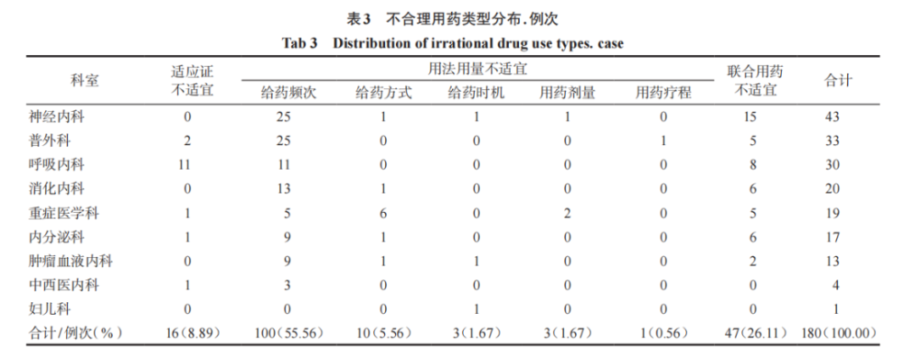

# “千金难求”另一面：被浪费和滥用的Paxlovid

**李昀 吴妮 方澍晨丨撰文**

**高翼 王晨丨编辑**

从来没有一种药，像辉瑞的Paxlovid一样，在短短一个月的时间内，从医药圈人士处破圈到中国二三线城市的老百姓。

2022年岁末，中国放开疫情管控后，巨大的感染基数，重症人数的增多，让Paxlovid这种迄今为止效果最好的新冠口服药以“救命药”和“特效药”的面貌，成为中国民间的高价疯抢的“标的”。

在过去一个月，中国绝大多数地区医院和社区卫生中心完全没有储备Paxlovid，有货的医院，数量极少。广西某县城的一家公立医院，只有一盒Paxlovid，药剂科主任不敢告诉呼吸科主任，被问起时，回答：
**“只能院长批准才能用”** 。在民间，一盒医保价只有1890元的Paxlovid，一度疯涨至过万元。

但医院里的Paxlovid，和民间千金难求的Paxlovid的命运却几乎一致：有严格适应症的药，有的被用在不该用的病人身上，私人千金购买的药也因为缺乏当地医生的指导，而不敢给感染者服用，而束之高阁。

**Paxlovid的被浪费和被错误使用，不仅存在于医疗资源不甚发达的地区，甚至在北京、上海等大城市的三甲医院和社区卫生中心也大量存在。**

即便过去半个月，Paxlovid在中国发生了一些新故事：因价格问题未进医保、它市场上而非疗效上的竞争对手要么进医保，要么初次定价就遵循最新文件，默沙东的莫努匹韦价格是Paxlovid的一半；另外，一些医院和社区卫生中心陆续到货Paxlovid或阿兹夫定，但p药的炙手可热依旧没有改变。

在大多数人们都会加入一两个的“买药群”里，黄牛依然活跃。只是默沙东在中国获批了以后，P药黑市价立刻下降了一些，由1万多下降到9000多，默沙东的M药只有不到一半——3000多元。

但即便如此，一般求购者首选还是辉瑞原版，买不到的话才买默沙东、阿兹夫定，以及辉瑞仿制和默沙东的仿制药。

直至春节前，P药仍呈现一药难求的局面，然而，不仅是北京上海等一线城市，就连广西、东北等地区，这些“来之不易”的P药，并没有真正送到需要者的手里，甚至有被扔掉的现象。P药滥用的背后，也有一些中国医药行业发展不完善的影子。

**-01-**

**北京：许多P药用于危重症和住院病人**

2023年1月中旬，北京已是中国Paxlovid供应最充足的城市之一。不过，在医疗机构，Paxlovid使用起来，限制颇多。

北京的多家社区卫生服务中心表示已经投入使用Paxlovid，不仅要求患者满足65岁以上、有慢性病、处于发病前五天等条件，还需要是该社区的居民。

问题是P药没有覆盖所有的北京社区医院，这意味着一些社区的群众还不能通过这一渠道获得P药。北京一家没有P药的社区医院表示无法提供用药指导，建议患者咨询能够提供P药的社区医院。

到了中日友好医院这样的三甲医院，急诊分诊台的医护人员表示， **除非住院，门诊很难开出Paxlovid。**

买到P药后，合理使用十分关键。

第十版新型冠状病毒感染诊疗方案提到，P药的适用人群是发病5天以内的轻、中型且伴有进展为重症高风险因素的成年患者。对于初次诊断重型新冠患者，和新冠症状出现5天后的患者，Paxlovid的循证依据都不足。

如今，P药的临床投入已经有一段时间，在北京，P药不合理使用的情况依然存在。

但一方面是医院在临床中发现P药存在新的适用情况，《中日医院成人 Omicron 病毒感染初始诊疗方案》提出：对于发病超过 5
天的抗病毒药物的使用，推荐基于核酸检测结果进行。如果核酸持续不转阴，可延长给药时间。不过，也有医院坚持在发病5天内使用抗病毒药物的建议，各大医院的诊疗方案并不相同。

另一方面，临床是动态的，重症患者家属可能抱着殊死一搏的心态，央求医生开P药。广东某医院的一位ICU护士说，即使医院不开，患者也会自己买。有的患者住院自带P药或者P药仿制药。
**患者去世后，这些没有发挥作用的P药被遗落在医院，我们只能销毁。**

**-02-**

**上海：被“荒诞”的规定浪费的P药**

近日，上海社区医院的辉瑞口服药Paxlovid资源已经呈现出供应紧张的状态。据了解，一些社区医院的P药库存已经见底，甚至断供。在这种严峻形势下，沈璐（化名）在很多人看来是幸运的。她的母亲今年76岁，感染了新冠，但户籍所在地的崇明区长兴镇社区医院还暂时有P药储备。

**然而，老人却没法通过这一渠道获得药物。**

一开始老人没有任何发烧、咳嗽等最常见的新冠症状，只是觉得胃部不适，感到恶心。到消化科就诊后，由于考虑到家中成员除老人外都已感染新冠，医生推荐老人做肺部CT检查，怀疑胃部症状是由新冠病毒引起的。检查结果显示，老人已经出现肺部感染症状。

尽管出现显著症状的时长是在5天以内，但老人的健康状况急转直下。老人已经虚弱到没法下床了。在联系各大医院寻求住院未果后，沈璐最后托熟人在浦东区一家二级医院找到了床位。住院后，沈璐发现治疗药物大多为抗生素一类抗炎症的药物，缺乏针对病毒本身的治疗。

沈璐听说P药有阻止病毒复制的效果，而且母亲符合P药用药人群范围。她希望医院能开一些，但医生却表示，现在医院已经没有这种药了，需要病人自己去找货。

根据目前上海市政策，65岁以上且发病时间在5天以内的病人，可以到户籍所在的社区医院申领P药。但现在老人正在住院，无法本人到场社区医院开药——这成了获得P药的最大障碍。“医生说你住进来了，就不可以随便出去。要出去就必须办出院手续。而且现在开药都是跟着住院记录走的，你在什么医院就必须在这里开药。”

长兴镇社区卫生服务中心的医生表示，像沈璐母亲这样的情况，他们也没法提供任何帮助：“我们开药必须本人到场，不可以家属代领。我们这里一共就还剩十几盒药，怎么能随便地交给一个不符合领药条件的人？”

沈璐感到很矛盾。“我们当时是靠关系进去的，现在又闹着要出来，这算怎么回事？这还不是最麻烦的。
**现在床位这么难找，我们一旦离开医院病房，就意味着要自己负责老人的病情了，这么大的风险我们实在承受不起。为了一盒P药，值得么？** ”沈璐声音疲惫地说。

在思想斗争的几天时间里，沈璐从其他人那里听到的一些消息，让她最终决定放弃寻找P药。

“我弟弟咨询了几个相当权威的专家，都说P药有很大的副作用，我们担心母亲会吃出什么毛病来。而且我朋友家的老人，虽然吃了P药但没有明显好转，最后发展到了重症。”

之所以这些消息对沈璐而言如此重要，是因为她并不信任住院医生对P药使用的建议。老人入住的是骨科病房，三张床位里有两张都收治的是新冠病人——由骨科医生负责。

“现在医院各个科室的病房都在收新冠病人。虽然我听说他们这些骨科医生接受了新冠治疗的培训，但是感觉这些医生还是差点水平。我们问医生要不要用P药，感觉对方也是模棱两可，搞得我们越来越拿不定主意了。”

当沈璐回顾这一道P药选择题时，忍不住发出感慨：“本来我和家人的预想都是很理想的，觉得现在社会上有药，应该没什么大问题。但是真的经历下来之后，感觉一切都特别混乱。有床位的地方没有药，有药的地方没有床位。”

沈璐本来还想着要不要通过网络上的渠道买一点P药，但一想到有可能引发副作用，而且到货了可能老人已经过了最佳使用阶段了，就决定不再执着了。“我就觉得算了、算了，太折腾了，还不如安安静静地守在老人身边，随时注意她病情的进展。”沈璐说。

然而，即使是既有床位、又有P药的三甲医院，也没法在最佳时间使用P药。

即使是作为新冠肺炎救治定点医院的上海市浦东医院，在使用P药的初期也存在不合理情况。据统计，2022年4 –
6月，浦东医院使用Paxlovid的病例共计203例，其中136例用药不合理，用药不合理率达67%：浦东医院有16例首诊为重型、危重型患者使用了Paxlovid抗病毒治疗。3例患者在症状出现5天后用药，最长在第10天开始用药。

来源：新冠肺炎患者使用奈玛特韦片/利托那韦片组合包装的用药分析及合理性评价，中国药物应用与监测 2022年10月，刘小林，卢萧萧，瞿 丹，龚婧如，陆惠平

上海一名著名大三甲的医生表示，虽然P药的最佳使用时间是发病5天以内，但有些病人时间超过了，或者已经是重症的，核酸还能测到阳性的，也会因为机制上的合理性而为病人使用。

“比如我接了一个本部过来的病人，就看到他医疗记录里，最开始并没有用，可能各方面原因，然后6.7天复查CT，报了肺部进展，把P药给加上去了，其实并不是最科学的。”这名医生说。

在实际操作中，有很多情况，让医生没有办法根据诊疗方案中的推荐标准进行开药。上述医生提到，理想情况是：
**病人一般出现症状之后立即做核酸或抗原检测，医生可以比较准确判定发病天数。但是“有些病人即使出现了症状，屏了好久，再去测，这个其实就是一个灵活的范围了。**
”

出现症状和核酸阳性之间存在时间鸿沟——这个问题不只是患者个人的检测意愿导致的。“我们其实只是做了抗原，然后结合CT结果，认为老人是得了新冠。实际上，我们住院的时候，医生根本没有要求我们去做核酸，他说就按肺炎来治就行了。”沈璐说。

沈璐的母亲现在下不了床，家属甚至不知道医院里哪里可以做核酸，没有医生建议主动为患者进行检测。沈璐推测：“我估计跟乙类管控有关，因为测血常规就是能判断是不是受病毒感染，现在就是稀里糊涂。”

**-03-**

**广西县城：P药只有一盒，要院长同意、必须是ICU病人才可以用**

小杨（化名）的父亲70岁，有高血压、高尿酸等基础病，之前几次冬季感冒都曾发展到肺炎住院。生活在广西某县。

抗原阳了之后大约七八天，小杨的父亲仍然头痛，咳嗽还加剧了，于是住进了离家近的中医院。CT显示肺部感染明显。医生开了炎琥宁注射液，还有止咳化痰药。

小杨之前听说过P药，向呼吸科主治医师咨询父亲能否用。主治医师表示自己没听说这个药，看过小杨用手机查到的相关信息后，她说可以试试。

小杨在网上看到一份有P药供应的全国公立医院名单，发现其中包括本县人民医院。打电话去问，医院却只承认有阿兹夫定，不承认有P药。她又通过在医院工作的熟人打听，答复是“确实有一盒辉瑞”，但被预订了、不能轻易动。

**“我就心想先转过去，边治边说，反正有阿兹夫定保底。”** 小杨当时想。

人民医院呼吸科已没有病床，辗转之下，小杨的父亲住进了其他科室的病房，由呼吸科医生指导该科室医生治疗。

成功转院第二天，小杨再次找医生谈。“科室医生很耐心，说有这个药一定帮我开，但是查了几次内部系统都没有辉瑞这个药，问我是不是了解错了，让我去找呼吸科医生确认。”她回忆，“呼吸科医生说并不知道医院有这个药，也查不到，让我去药房确认。”

“药房一开始说没有，我很确定有，让他们再查一下。可能有人查到了，就有些言词闪烁，说这个药他们药房没法做主，要问药剂科主任。”

最后，药剂科主任与呼吸科主任电话沟通后给出答复： **P药全院只有一盒，要经过院长同意才行，而且必须是ICU病人才能用。**

“能用上阿兹夫定已经算很幸运了。”医生宽慰小杨，因为阿兹夫定供应也非常紧张。

最后，父亲服用了6天阿兹夫定，身体好转，就停药了，很快出了院回家休养。

后来，小杨自己转阴后一直咳嗽，去发热门诊就医，医生说没有新冠特效药，给她开了3盒治疗带状疱疹用的阿昔洛韦。

**-04-**

**北方某县级市：没有医生知道怎么用**

一位92岁的老人，身患心脏病、糖尿病、高血压等基础疾病。她属于新冠疫情中最高危的人群。她的儿子、儿媳都是当地三甲医院的工作人员，获取医疗资源和信息相对容易。当她出现感染症状时，情况并不严重，只是有些低烧。因为当地送到医院去的是高烧不退乃至昏迷的老人，因此，儿子和儿媳并没有太当回事。

但她在外地工作的孙女，了解老年人感染新冠后的“沉默性缺氧”，表面上症状并不明显，但如果血氧度低于90以下，需要住院。她的一位朋友的奶奶，也是92岁，当天只有一些轻微的咳嗽，第二天一早就过世了，她印象很深。她让父母用紧急买的血氧仪检测奶奶的血氧，已经降到了80多。因为医院住院人数爆满，家里正好有氧气瓶，赶紧给老人用上。

在此期间，孙女花三千多元从朋友处抢到的辉瑞p药也寄到，她的父母紧急问医院的同事，呼吸科主任。但不管是呼吸科主任还是急诊科主任，都表示没有听说过这种药，更不知道怎么用。因为医院并没有这个药，因此更不会有相关的培训。

一个热心的医生，仔细看了说明书，看到用药禁忌，而恰恰这位老人服用的药属于其中，需要减量等一系列复杂的操作，医生建议不用。因此，
**高价买到的辉瑞P药，仅仅被用了一次，就束之高阁。**

一家人在极度的焦虑中，观察老人的血氧饱和度。老人的血氧上上下下，相熟的医生也没了主意，推翻“不用”的建议，让家属自主选择——这距离老人出现症状已有一周的时间，已错过了感染五天之内使用的建议。幸运的是，老人最终的血氧饱和度回复到了90以上。

**-05-**

**美国：另一种意义上的浪费**

在美国，治疗新冠，医生需要严格遵循诊疗指南。轻症患者使用的是被紧急审批的辉瑞P药，默沙东的M药也在诊疗指南上。但在现实中，因为两者的数据相差甚大，绝大多数病人使用的是辉瑞P药，只是少数不能使用P药的才使用默沙东的。

而在危重症患者治疗上，美国的诊疗指南推荐的是瑞德西韦。“在病毒学的概念中，感染五天内是病毒复制期，过了5天之后，是炎症反应期，Palovid在5天后就没什么作用了。”南加大重症室主任乔立人表示，在危重症治疗中，没有医生会给病人使用辉瑞P药。

2022年7月，FDA修改了Paxlovid的紧急使用授权，药剂师也可以开出此药处方。

美国政府也以每疗程约530美元的价格购买了数百万疗程的Paxlovid，这是辉瑞的批量采购折扣价。

**有症状的民众可以登陆一个网站，经过线上问诊开方，免费获得P药，线上护士问一下出现症状的情况，出现了多久后，不用问询者出示任何测试结果，就可以开出P药，民众可以到附近的CVS等药房里取。**

因此，一些并没有症状的患者为了安全，也会上网站上谎报症状拿药。药对民众是免费的，药房和开处方的护士或医生也能赚到钱，开P药非常简单。但很多民众囤了免费的P药之后，也没有用上，就当垃圾扔掉了。
**“反正买单的是拜登政府，没有人会心疼这种浪费。”** 一位医生开玩笑说道。

**-06-**

**为什么在中国对P药的使用无统一标准？**

在中国，医生开药并没有一套限定死的方案。医生开药首先遵循的是“循证”，这类文件一般由行业协会或者各种医学组织指定的治疗方案，通常叫XXX治疗指南。因为是一种全国通用型的版本，所以这种治疗方案常常以保险和安全性为原则

但指南大多是时候起到的是教科书式的作用，并不能完全覆盖掉临床药物的使用。每个医生都有自己的用药风格，而真实世界里病人情况千差万别，也不是一两套诊疗方案能完全限定死的。所以，
**医生在临床上到底会如何开药，大多数时候是一个指南+经验的结果。**

医生的主要KPI是治病救人和学术晋升，“学习新药前沿知识”并不直接体现在自己的日常工作中，医生除非遇到“无药可用”的情况，否则不会主动去了解一款新药的临床使用。因此，某个治疗领域的指南发布距离临床大面积应用，中间隔的时间往往按年计算。而推动一款新药在临床使用的主要推手，其实是制药公司。

回到P药的临床教育上，前段时间有新闻提到北京和上海一些类似医联体的机构在线上培训Paxlovid的使用。
**这种学术会议大部分是学会发起，但是牵头者是药企，医药上市公司高额销售费用里有很大一块比例就在于此。**

而另一边，虽然早在2022年3月份第九版新冠病毒肺炎诊疗方案纳入了Paxlovid，但一来彼时中国还未完全放开，新冠患者人数规模本就不大，重症患者几乎没有。院内基本也没有P药的用武之地，制药公司也就没有推广的场景和必要性，医生也就压根不了解P药到底该如何用。

二来，此次疫情防控的调整比较突然。对于辉瑞本身，立即招聘相应的医药代表，让代表进院教育以及在各市县区组织学术会议都需要大量时间。此外，疫情高发导致的科室内从早到晚连轴转，也减少了医生去接受P药具体用法的接触场景。

当然，辉瑞可以在短期内通过砸钱、砸人力来大幅提升学术教育的活动。但一来供货情况严峻之下，短期大规模投入很难得到什么大的回报；二来，价格和医保带来的可及性这两块，都存在压制因素。辉瑞缺少动机。

最后，还有一个原因，就是此次新冠疫情重症感染书骤增，大量病人涌入急诊病房，以至于很多其它科室也不得不加入到呼吸重症的治疗当中，其中甚至出现妇科和儿科的病床用来住新冠肺炎患者。呼吸科和感染科对P药也都只是“初见”，其它科室更是因为机理不同，理解起来虽然不说有千差万别，但也有不小的障碍。

种种原因，造成现在很多临床医生虽然是新冠患者的直接救治方，但具体对于一款新药的适应证、用药禁忌、服药细节、不良反应处理等等，完全做不到面面俱到。

这背后的一个宏观原因， **一方面还是“临床诊疗”是一个很难被标准化的过程，需要因人而异，对症下药；另一方面，我国在诊疗标准化的路上，做的工作也不够。**

在医药代表进入中国之前，医生要学习新药知识，只能每年申请中华医学会一年举办一次的用药培训会议，很多医院的名额只有个位数。后来随着制药行业逐渐成熟，各种年度、季度学术论坛遍地，每家药企也会牵头去开科室会议，但这需要一家一家的去做，没办法在全国范围内一劳永逸。

很多时候，一款创新药物进医保两到三年后，在一些小地方的三甲医院甚至看不到这款药；不少像心血管、糖尿病等慢病领域的产品，用得最多的还是上个世纪的品种。

**这是药品流通领域的难题，也是医疗体制的历史积弊。**

······

欢迎关注微信交流

