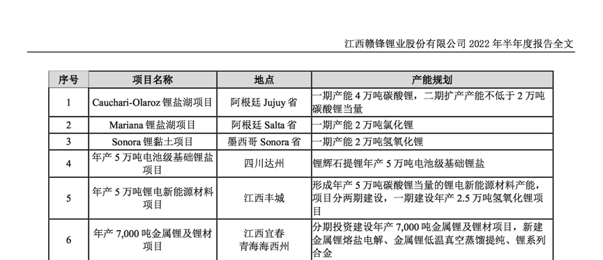

# 假期不停工！多家动力电池企业春节前忙招人，有专家已拉响产能过剩警报

每经记者：黄辛旭 每经编辑：孙磊

“有想年前找工作的吗？坑不多了。”赶在兔年春节前入职国轩高科的肖宇（化名），在职场社交平台上的同行交流圈发起了“求贤贴”。不到一个礼拜的时间，该帖子就吸引了超过100人的回复。

为了保证现有产线满负荷运转，以及为春节后新的产线投产和新工厂开建做好准备，已经有动力电池企业开始启动了招聘工作。“我已经给三家动力电池企业发去了简历，并且都有回复，应该从正月初五开始就要陆续面试了。”正处于求职状态的徐飞（化名）告诉《每日经济新闻》记者。

火热的招聘背后，是过去一年不断攀升的动力电池装车量。根据中国汽车动力电池产业创新联盟最新统计数据，2022年12月，我国动力电池装车量36.1GWh，同比增长37.9%；2022年累计装车量294.6GWh，累计同比增长90.7%。

据不完全统计，截至2022年10月，全国动力及储能电池产能规划已超过6480GWh（含海外规划）。动力电池产能扩张速度还在加速，有机构测算，2023年~2025年，国内一、二线动力电池厂商规划产能复合增速分别为28%和46%。

“很忙，春节也不停工”

“动力电池生产厂家一直处于赶工状态，甚至有的今年春节都不会停工，招聘也比往年提前了不少，再加上要为后面的春招做准备，所以这段时间非常忙。”在某国内动力电池企业负责招聘工作的张亚（化名）说。

记者注意到，为了更快招到人，“提产补贴”“春节补贴”被放置在了招聘信息中醒目的位置。比如，郑州比亚迪正在招聘的操作工（电池生产制造工作）一职，综合工资5000~7000元，如果1月全月支援，奖励最高为1770元；1月10日至31日期间，员工满勤最高奖励为1500元；春节留岗考核奖（最高奖励2000元）。

动力电池企业之所以要加紧招聘，是为了保证订单按时交付，即便是在春节期间，工厂也不停工不停产。据央视财经报道，在合肥一家动力电池生产企业，临近春节，工厂仍然是满负荷运转。该企业负责人表示，从去年到现在，动力电池订单持续增长，尤其是海外的订单增长明显。

国轩高科股份有限公司党委书记、董事长李缜在接受媒体采访时表示：“2022年，国轩高科产能布局突破100GWh，动力电池的装机量同比增长了107%，尤其是海外的业务同比增长了352%。现在，我们各个工厂都是满负荷运转，订单已经排到了2023年的全年。”

西安某动力电池企业员工也表示：“加班已经是自己一年多时间以来的工作常态了，今年春节也会留在工厂，因为只要电池电芯产线没有停，大家就必须加班加点地赶生产。”

扩产成为主旋律

动力电池行业加班加点背后，是国内新能源汽车行业的快速发展。

从工业和信息化部披露的数据来看，2022年我国全年新能源汽车产销分别完成了705.8万辆和688.7万辆，同比分别增长96.9%和93.4%，市占率为25.6%。与此同时，中国电动汽车百人会副理事长、秘书长张永伟表示，2023年新能源汽车产销涨幅和新车渗透率预计都将在40%左右，整体销量规模有望触达1000万辆。

在这样的背景下，为保障动力电池供应链安全稳定，各车企都向动力电池企业给出大手笔订单，且供货周期在5~10年，供货数量达数十GWh甚至上百GWh。比如，宁德时代获得本田123GWh电池订单，成为宝马百亿欧元大圆柱电池订单供应商之一，并与福特等签订合作协议；远景动力也斩获了奔驰、宝马、马自达等车企的订单。

“汽车新产品的投放周期约为2~3年，产业链上游做产能投放的周期比整车厂还要长，可能需要3~5年的时间。”北方工业大学汽车产业创新研究中心主任教授纪雪洪告诉记者，动力电池企业往往会提前布局。

事实上，自2022年开始，“大幅扩产”已经成为动力电池企业的主旋律。而从宁德时代的2022年半年报来看，在电池系统业务方面，目前产能为154.25GWh，在建产能为100.46GWh；锂电池材料正极及相关材料的产能为22.92万吨，在建产能为17.83万吨。

赣锋锂业也在2022年上半年报中披露了公司目前正在筹划及建设中的锂产品项目情况。就在2023年1月18日，亿纬锂能连发两大投资公告，拟总投资155亿元在两地扩产动力及储能电池。

_图片来源：赣锋锂业2022年上半年报_

高工产业研究院近日公布的统计数据显示，2022年中国锂电产业链新签约落地268个投资扩产项目，包括锂电池、材料环节，按公布投资金额的247个项目统计，2022年中国锂电产业投资总金额超1.4万亿元（企业公开的项目总投资额）。

是否会出现产能过剩?

动力电池产业“蒙眼狂奔”的背后，是否会产能过剩已经成为行业需要面对的新问题。

根据浙商证券预计，到2025年全球主要动力锂电池厂商的规划产能将达到4335GWh，其中，宁德时代已披露产能规划超过900GWh；比亚迪规划产能达290GWh；中航锂电、亿纬锂能、蜂巢能源、国轩高科2025年产能规划目标分别为360GWh、311GWh、376GWh、187GWh。

“2023年中国本土市场的新能源汽车增速很可能会下降，加上动力电池企业新建产能释放，随之电池供应一定会过剩。”‍‍‍‍‍‍‍‍‍‍‍‍‍‍11月16日，中国汽车动力电池产业创新联盟副秘书长王子冬在一场会议上谈到了这一问题。

_图片来源：视觉中国_

中国科学院院士欧阳明高预测，我国动力电池产能在2023年可能达到1500GWh，在2030年可能达到3000GWh，分别是今年装机量的5倍和10倍。据不完全统计，国内各大整车企业公布的销量规划显示，2025年国内动力电池的装车量仅需要1000GWh。

实际上，产能过剩的问题已经开始出现。2022年，我国动力电池累计产量约为545.9GWh，同时，国内动力电池累计装车量294.6GWh，我国动力电池出口量为68GWh。简单计算之后，2022年全年电池产量与装车量之间的差额已经高达183.3GWh。对比来看，2018~2021年，国内动力电池产量与装车量差额分别为13.58GWh、23.17GWh、19.75GWh、65.19GWh。

有观点认为，产能过剩之后，动力电池市场的竞争将更加激烈，一直以来，动力电池产业都有头部集中的特点。从公开资料来看，前10家动力电池企业瓜分了95%的市场份额。韩国市场研究机构SNE
Research公布的数据显示，2022年10月，单单宁德时代和比亚迪的装机量分别达到了18.1GWh和7.8GWh，占据的全球市场份额分别达到了37.6%和16.2%。中国汽车动力电池产业创新联盟公布的数据显示，实现动力电池装车配套的动力电池企业已经从2019年的79家下降至2022年的57家。

未来伴随着产能过剩问题的出现，动力电池企业之间的竞争将会进一步加剧，这一行业间的末位淘汰赛或许即将上演。

