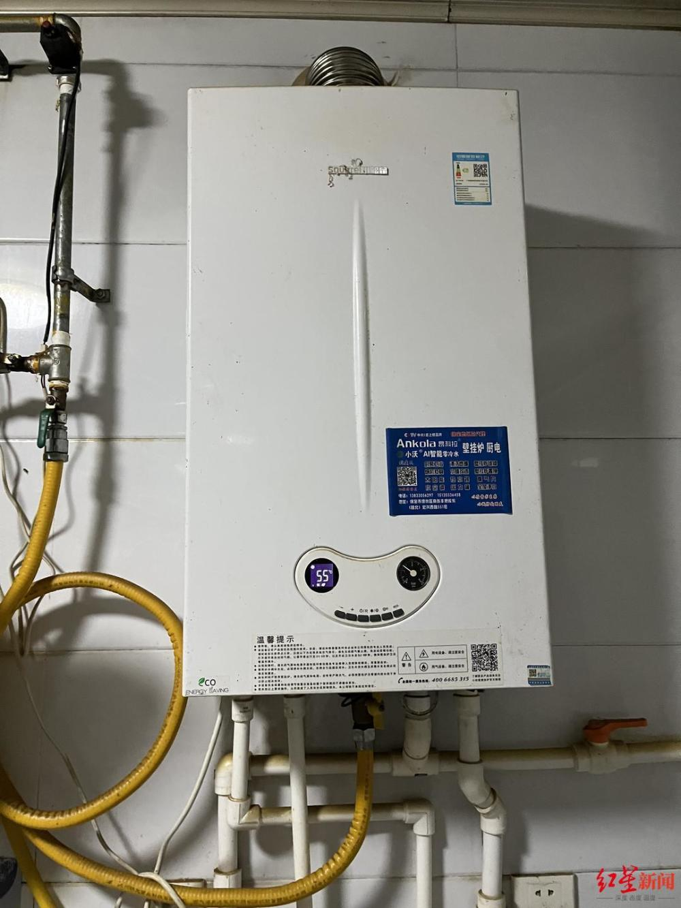

# 北方冬季气荒调查：近期供气紧张缓解，企业遇“市场化进程中的阶段性困难”

严冬来临，北方城市能否持续供暖供气，是关乎人们能否温暖过冬、正常过年的重要民生问题。往往岁末年初，部分城市会遭遇冬季供气不足的挑战，就在前不久，河北多地市民反映自己家乡一到夜里就停气，家中暖气供应不足，另有少许供暖企业称亏损严重……

在1月13日国务院新闻办公室举行的新闻发布会上，国家发展改革委副主任连维良回应了上述社会现象。他强调：“
**任何地方和企业对民生用气都不得限购减供，一旦发现这样的问题，都将严肃追责问责。** ”

针对上述现象，红星新闻记者1月10日前后来到河北保定，并前往当地各个村镇了解情况。

**出租车加气：供应不足主要在前两个月，近期供气紧张缓解、加气站恢复营业**

1月10日前后，红星新闻记者来到河北保定。当地多位市民告诉记者，保定市内的供暖基本能保障，进入1月后，停气停暖的现象已经基本解决。

但作为加天然气的出租车司机于先生，此前也体会过天然气供应不足时，为车加气的不易，这样的不容易尤其体现在去年11月到12月。

为了节省燃油费，于先生3年前特地把燃油车改成加气车。“车用天然气价格是每立方5.25元，算下来一公里约0.35元，比加油能省近2毛，加一次80元能跑一天，这对跑出租的来说可不是小账。”于先生表示。

但每到冬季，于师傅也会遇到加气难的问题。“一到11月，之前常去的加气站就关了，有时候甚至要开10多公里才能加上一次气。”于师傅回忆，去年11月下旬，家住竞秀区附近的他，由于附近加气站关闭，他只能驱车10多公里，赶往北二环钟楼附近的加气站加气。

“那时候大约是下午5点多，大多市区内的加气车都在那里加气，所以排队加气等了近1小时才加上。”于师傅说。

1月11日下午，红星新闻记者在城区乘车前往徐水区的路上也发现，沿途多个加气站处于关闭状态。路过一家加气站时，司机师傅表示：“这里前些天还能排队加气，今天关门了。”

红星新闻记者在一家正常营业的加气站询问工作人员得知，一般停止营业的原因多数是因为供气不足，多久能恢复也并没有确定时间。“我们现在还能正常营业，但不知道是否能一直坚持。”该工作人员同时表示，近期供气紧张已有所缓解，他所在的加气站应该能正常供应。

“尽管北方供气不足，但好在近一年我们加气费都没有涨价，去年7月后还有一定的燃料费补贴。”于师傅这样说。不过于师傅向红星新闻反馈称，目前当地加气站已经大规模恢复营业，出租车加气已经恢复如常。

_记者在保定看到，1月上旬沿途多个加气站暂停营业，但至下旬已基本恢复_

**有停气问题的村镇：享受政府补贴，但采暖费+电费支出加大**

相比城区，村镇用气难，在去年12月末更加迫在眉睫。

“我们村子基本都是每晚11点前后天然气就停了，夜里靠电褥子、小太阳取暖。”家住河北保定固城镇闫台乡北店村的陈先生表示。

据陈先生回忆，这样夜里停气的现象持续了月余。除了夜间停气，陈先生说，平日的天然气供应也不比春秋两季：“最明显的就是做饭时火苗很小，如果两个灶台同时开最大火，另一个基本就打不着了。”

在保定徐水区安肃镇的南张丰村，多位村民也同样在去年12月遇到停气问题。

现年78岁的张奶奶，家住南张丰村西口，她告诉红星新闻记者，她一家5口人都住在一起，从去年11月中旬开始，家里就断断续续开始停气，“我们一般吃了饭就得赶着洗漱，否则就没热水可用了。”

张奶奶回忆，停气集中在去年12月，一般从夜里10点停到第二天凌晨5点多。

过去，张奶奶一家取暖靠的是烧煤。在“煤改气”背景下，2021年前后张奶奶家里装上了壁挂炉。此后，张奶奶全家做饭烧水和取暖，主要靠壁挂炉提供能源。“要保障房间温度达到17°C左右，壁挂炉得开到60°C上下才行。而一旦停气，壁挂炉就会自动关闭。

_保定村民家里安装的壁挂炉_

在张奶奶的记忆里，2021年后，她家里就再没烧过煤炭。彼时为了鼓励农村“煤改气”，她家安装的小型壁挂炉是由政府补贴，其他设备购置安装等费用，也按照总数的85%给予补贴。张奶奶表示，在“煤改气”的过程中，她收到了政府近6000元左右的补偿款。

在用气上，根据2016年9月河北省发布的《关于加快实施保定廊坊禁煤区电代煤和气代煤的指导意见》称，给予采暖用气1元/立方米的气价补贴，每户每年最高补贴气量1200立方米，由省、市、县各承担三分之一，补贴政策及标准暂定三年。

尽管享受了一定程度的政府补贴，但采暖费和电费加起来对一些家庭而言，依旧是一笔较高的费用。

在夜里气温零下的保定，陈先生需要打开家里的空调取暖，并用电褥子、电暖器、小太阳等设备加温。“取暖全靠电解决，费用增加了很多。”

陈先生表示，算下来，仅是晚上用电取代天然气的额外支出，每个月电费就增加300-1000不等。

**缺气症结何在？业内人士：“市场化进程加快，企业阶段性经营困难”**

针对近期徐水区南张丰村村民气荒的问题，红星新闻记者致电保定市徐水区发改委，一名工作人员回应称：“大概从上周日（1月8日）起，全域都不停气了。”该村村民表示，当地停气情况已有明显好转，只偶尔会在深夜停气2～3个小时。

_保定南张丰村_

红星新闻记者了解到，负责徐水区的燃气公司是保定市徐水区普辰天燃气有限公司。该公司针对此前停气的问题回应称，公司的天然气来自石家庄输送的管道气，上游供气不足，所以导致公司为下游输送的天然气也不足。工作人员还表示：“因为规定白天不能影响居民做饭生活，所以只能采取半夜错峰停气的措施。”据其介绍，目前上游供气已经平衡，今冬应该不会再停气。

在对当地的多方采访中，红星新闻记者了解到，河北多地入冬即陷入用气荒，并非今年才有。不少人表示，2018年河北全面推行“煤改气”后，用气荒的现象就有所加剧。但这两年，情况有了较大程度好转。

那么，北方城市为何出现冬季用气荒？信达能源首席分析师左前明告诉红星新闻记者，从我国天然气的来源来看，我国天然气供给端主要有常规气和非常规气，常规气占到总供给的60%左右，还有40%依赖进口管道气，如来自西亚和俄罗斯的管道气，另外还有通过海运形式运输过来的LNG液化天然气。

左前明表示，一方面我国是一个“富煤贫油少气”的国家，天然气资源的自给率不足，且近几年天然气对外依存度在提高。而从去年开始，全球天然气能源短缺也让天然气价格攀升，我国进口天然气的成本随着全球能源通胀而提升。

这是否意味着，北方城市的天然气荒，是否因为我国天然气的总量不够多？对此，国家发改委副主任连维良在1月13日的国新办新闻发布会上已公开回应：我国采暖季天然气资源总量足够，发改委已在采暖季之前组织签订的天然气中长期合同量超出了各地预计需求，进入采暖季以来，实际消费量低于预期。

另根据此前国家发改委公布的数据，2022年12月14日上海石油天然气交易中心LNG交易价约5.6元/立方米，同期国际东北亚地区现货价格折合人民币10.1元/立方米，这说明国内现货交易价格远低于国际水平。

**总量充足，价格稳定，为何河北等地仍现气荒？** 对此，左前明认为：
**“今年多地限购停供现象的集中出现，客观上是因为天然气市场化进程加快，企业市场化购气成本过高，短期内难以有效疏导，出现了阶段性经营困难。”**

保定一家民营燃气公司负责人告诉红星新闻记者，就其经营的企业而言，保定民用天然气限气，主要受到两方面的压力。

其一，是由于公司上游的多个石家庄燃气企业供气量不足，导致分配气量到保定的储备不够，所以他的燃气输出也只能按照实际情况对居民用气进行定量保供。

第二方面压力，在于大部分燃气企业供应民用气上基本“无利可图。”该公司负责人解释称，政府为了保障民生，民用天然气基本采用政府定价，按照当前保定每立方2.78元的定价，他的公司每输出一立方民用气，就会多亏损一笔钱。“尽管今年已经对民用气有一定程度涨价（没立方涨价约0.2元），但依旧是入不敷出。”

从河北政府的公开回应中，也透露一些信息。如在2022年12月27日，河北省邯郸市人民政府援引鸡泽县发改局调查称，目前上游管道天然气采购综合价格约4.3元/立方米；LNG价格约8000/吨，气化后的天然气价格合5元/立方米以上，但鸡泽县居民销售价格2.76元/立方米。这意味着每卖一方气，燃气公司亏损2.24元。

之所以会存在“无利可图”的现象，该负责人认为，是由于天然气的转卖，之后再涨价所致。“我们企业的天然气来自石家庄另一个天然气输送公司，但石家庄这家公司的天然气也是从另一家‘中间商’处获得，这个过程就存在层层涨价的现象。”该负责人表示，作为终端天然气输送公司，往往很难直接从“三桶油”或省一级天然气公司拿到一级气源。“经过转卖，加价，民用气的成本就提高了几成。”

**国际能源通胀形势严峻，要及早制定预案，无条件兜底保供**

不少声音认为，北方城市的“用气荒”，是“煤改气”政策所致。对此，左前明认为，这样的说法有失偏颇。他认为，5年前河北“煤改气”时遇到了全国性缺气问题，但今年的气荒并不只因为天然气存量不够。

据央视财经报道，国家能源局公布2022年能源工作成果显示，2022年国内全力推动油气增储上产，原油产量重回2亿吨，天然气产量超过2170亿立方米；加快推进一批保供应、调结构、稳增长的重大工程，预计全年全国重点能源项目完成投资2万亿元左右。

如前文所述，在国内天然气存量充足的基础上，河北等地仍有气荒问题，更多在于上游天然气气源企业向下输出过程中层层转包，不断加价，以至终端燃气公司向居民输入用气反而存在亏损。

上述负责人告诉记者：终端企业今年之所以出现较大规模燃气不足问题，是由于入冬后用气高峰时段集中，企业和上游供应方签订的气源内合同存量不足，所以需要额外增购气源。

但矛盾在于，增用合同外气源，价格却要比合同内气源价格明显提高，这导致短期内终端企业没有充足资金购入大量气源，即便有资金也不愿加价增购：“加购了多少天然气，就会亏多少钱。”基于此，供气量与需求量的缺口才会出现。

同时，左前明也指出，北方部分城市，的确存在一些企业和民众用不起天然气的问题。他告诉红星新闻记者，从去年掌握的情况来看，企业压力较大，顺价（销售商品的价格高于进购价格）现象明显，且我国天然气价格依靠政府定价。“上游资源的涨价，对于下游天然气使用的传导方面不够顺畅，也是导致民营天然气企业经营难的症结所在。”

对于天然气公司顺价难题，我国天然气能否追随煤炭行业实行市场定价，以鼓励企业增加天然气供应？

对此左前明给出了否定的答案。他认为，民用天然气政府定价和煤炭市场定价不可同日而语。他解释称，民用天然气政府定价是为了保障民生，煤炭则偏工业，企业使用更多，二者无法进行比较。

中国企业资本联盟副理事长、IPG中国首席经济学家柏文喜近期在接受《中国新闻周刊》采访时也指出，之所以天然气不能像煤炭那样实现市场定价，是由于天然气的供应、尤其是城市管道天然气具有较强的排他性，无法引进市场竞争机制，而煤炭供应则是多元化和充分竞争的，这也导致了天然气在终端分销时的管制价格。

那么，在价格政府限定的基础上，是否可以通过补贴来鼓励企业增加气源购入？上述民营燃气公司负责人表示，其所经营的企业盈利大多来自工商业用户，只能以此来对冲居民用气的亏损。且政府补贴的申请，目前还未发放到位。

这不是一个公司的难题。2019年，雄县中燃燃气销售公司曾发文称，上游冬季采购气价上涨至2.968元/立方米，2017-2018年两个采暖季，因气价倒挂公司共计亏损超过4692万元。此时，还处在政府补贴期间。

据红星新闻记者了解，目前河北正着手发放企业补贴，积极推进今冬明春民用气价倒挂补贴工作。据当地媒体报道，2022年-2023年采暖季结束后，河北省将在一个月之内，请第三方对燃气企业购销价格进行核查和核算，针对气价倒挂产生的亏损进行一定程度补贴。

1月13日召开的国新办发布会，国家发改委副主任连维良也对此作出回应，当前要“一企一策”帮助企业纾困，对极端情况下存在弃供、断供风险的，属地政府要及早制定预案，无条件兜底保供。

**如何破局“气荒”？任何地方和企业都不得限购减供**

面对当下的经营难题，上述民营燃气公司负责人指出：“我认为行之有效的办法在于，其一是在价低时购入相当存量的合同气源，以防年底用气荒；其二在于依靠政府政策支持，扶持源头企业给予更多气量输出，同时给予终端企业经济帮扶。”

同时，左前明也指出，弥补气荒还应从供需两端发力。如在供给层面，他表示，短期内国内要加大天然气供给，提升产能的利用率，做到“家里有粮，心中不慌”。在需求层面，当民众承担过高天然气费用时，可做阶段性补贴鼓励民众使用：“天然气涉及民生，不限价不顾百姓生活成本不可取，但应该适当增加财政帮扶，提高居民用气补贴，从而帮助企业收回成本。”另一方面，左前明也表示，要尽力避免大能源公司的垄断行为，坚决查处恶意涨价行为，同时也需要在国际气价上浮的背景下，给予前端企业购气补助，增加终端企业输气扶持。

但从长远来看，左前明强调，国际上能源通胀形势仍严峻，我国应加快对未来几年高价天然气外部环境的应对部署，调整能源格局，在国内产能不足的前提下，仍要立足国情，守住能源安全底线，稳妥推进我国能源转型和结构调整。

对此，连维良在1月13日的新闻发布会上强调，
**对近期出现的居民天然气限购、断供情况，发改委监测到后已立即责成地方政府采取措施，予以纠正。同时，发改委也将举一反三，进一步压实能源保供属地责任，对民生用能不折不扣地落实保供稳价措施。**

连维良重申，从全局看，现在天然气资源总量有保障。因此， **任何地方和企业对民生用气都不得限购减供，一旦发现这样的问题，都将严肃追责问责。**
如果是由于气源合同量不足，国家将协调增供，如果是其他个性问题，由属地政府一事一议帮助解决。

红星新闻记者 杨雨奇 吴阳 实习生 苗睿 河北报道

责编 邓旆光 编辑 邓正彤

