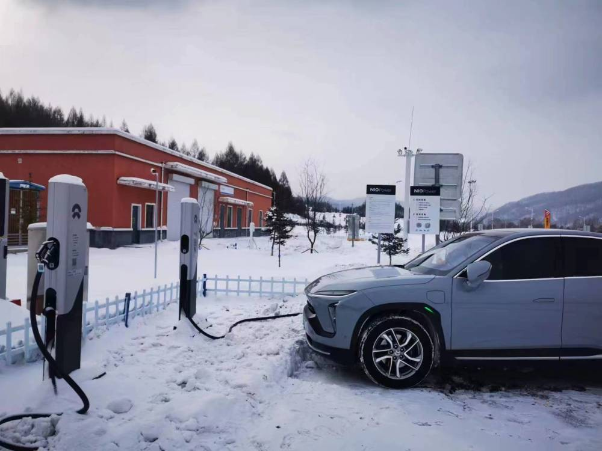
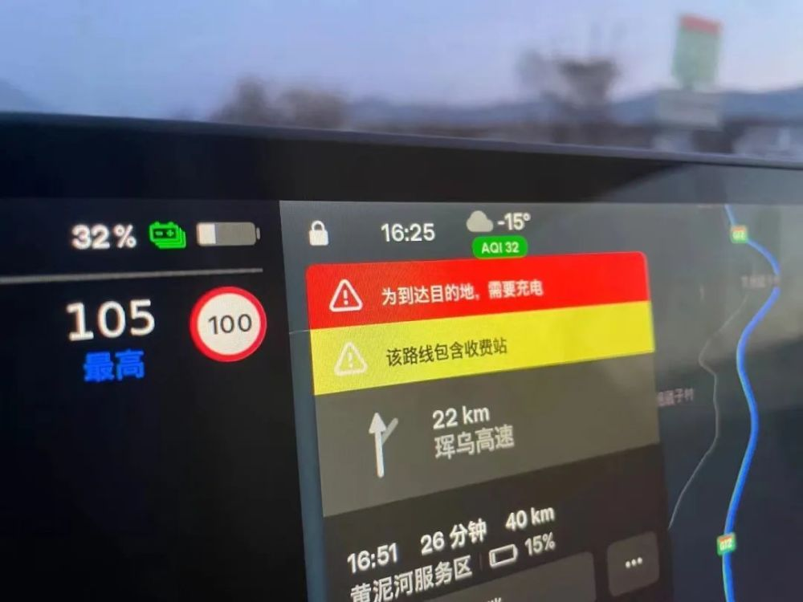
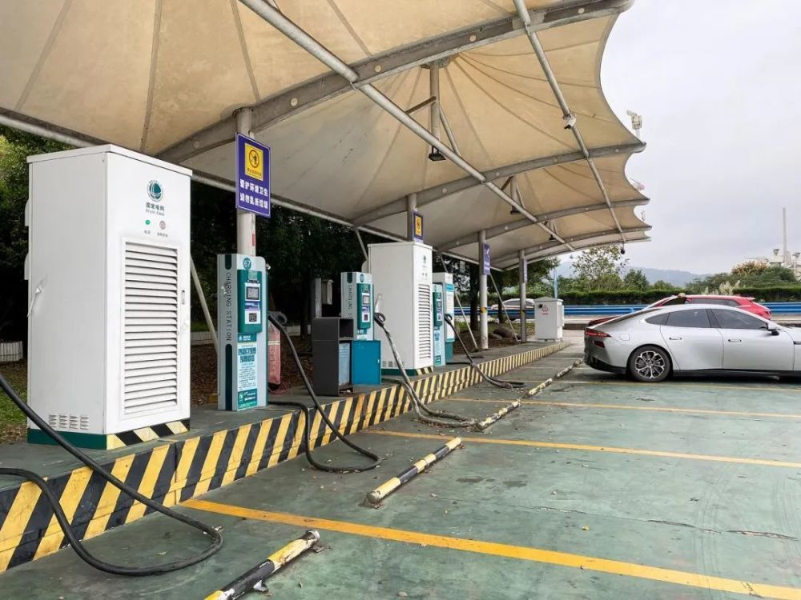

# 我开“电动爹”回东北，一路充了14次电

《烟火人间》是腾讯科技联合市界推出的2023年春节特别策划，记录每一个不平凡的“网事”

**作者 |** 刘冬雪

**编辑 |** 孙春芳

2022年12月16日，任敏在自己的社交平台账号上发表了一篇图文内容，预告自己开电动车回东北老家的计划。

他在文中问：“听说最近降温到零下30度，有没有东北的伙伴，或者开电车去过东北的伙伴，有什么需要注意的吗？”

一些网友在回复中表达了担忧：“没有别的交通工具了吗？”“我劝你别折腾自己更别折腾电车了！”

但任敏最终还是决定开电动车回东北。

无独有偶，另一位年轻人王坦在自己小红书里，也记录了自驾电动车从青岛到牡丹江的经历。

此前，任敏和王坦都没有过冬季开电动车自驾回东北的经历。由于充分的准备和保守的路线规划，二人一路上还算顺利，不过途中也是“险象环生”，因为极寒天气下的电动车续航里程腰斩和充电效率低下，还是给他们带来了不少困扰。

一进辽宁，续航就掉一半

因有私事要处理，任敏一直有回老家白山的打算。防疫政策放开后，回家计划终于有了落地的可能。

要说最方便的返乡方式，通常还是飞机。白山地处长白山西侧，与朝鲜惠山市隔鸭绿江相望，是国家森林旅游区，市内就有长白山机场。不过要从任敏的定居地包头出发到白山，没有直达的航班，两地也没有通高铁。

考虑到2022年12月末正是疫情高峰期，乘坐公共交通出行面临感染的风险。再加上任敏爱好自驾游，几年前，他就有过开燃油车自驾去长白山旅游的经历，他就想体验下开电动车回东北。

虽说曾经的经历给了任敏很大的信心，但毕竟是在冬季，严寒之地对自己的情绪和电动车的性能都会带来很大的挑战，决不可掉以轻心。

最重要的是补能计划。任敏驾驶的是蔚来EC6，12月底包头的气温在0℃左右。蔚来EC6官方标注的续航里程是430公里，但任敏冬天在包头驾驶时，里程都要打个六七折。

而东北地区，气温要比包头低得多。任敏做出了保守的估计，续航里程按照官方标称打5折，也就是说，每跑200公里就得充一次电。

任敏在参考了多个APP的充电地图后，最后选择了先走京藏高速到北京，之后换京哈高速的路线，“这两条路车流比较大，换电站会相对密集一些。”任敏对市界解释。

路线规划好，随身物品收拾齐全，（2022年）12月20日的早上，任敏带着老婆从包头出发了。

王坦是1月5日早上从青岛出发的，目的是回老家过年，同行的还有一位东北老乡。王坦驾驶的是特斯拉model
Y标准续航版，标称的续航里程是435公里。“去年整个冬季，车辆在青岛表现的还可以，续航大概可以维持在350公里左右。”王坦称。

图/受访者提供

和任敏一样，王坦把这次旅程当成一次测试，忐忑之余也把补能放在了整个计划的核心，原则依然是“保守”。

王坦参考了高德、蔚来、特斯拉和国家电网的充电地图，计划采用组合补能的方式每行驶200公里或180公里充一次电，并划定了从青岛河北吉林辽宁黑龙江的路线，全程约2000公里。

与有些人开电动车回东北不敢开暖风不同，王坦本着“再苦不能苦自己”的原则把能开的都开了。空调温度调到21℃，风力两档，同时开启两个座椅加热和方向盘加热。在上述条件下，进入辽宁省以后，车辆的续航就掉到了240公里上下。

据王坦统计，全程车辆共充了14次电。因为担心半路被拖走，每当车辆剩余20%的电量的时候，王坦就会充电了，充到85%-90%再继续上路。

王坦算了一下，充14次电，总共花了699元。此前王坦驾驶一辆1.5t的SUV，加了3箱油，花了差不多800元，两相比较，冬季开电动车并没有省多少钱。不过去年7月份，还是这条路线，王坦只充电8次，消费400元，还是省了不少钱。

而任敏选择的是充电+换电的方式，“一路上我充了7、8次电，其余通过换电的方式。”目前任敏这辆车换电还是免费的，所以补能成本差不多也就是王坦的一半。

“电车白扯”

整体来说，任敏和王坦对近期的东北自驾行还比较满意，满意具体体现在两个维度上，一是充电站的密度，二是便利性。

从山东到河北的这段路上，王坦基本使用的都是国家电网的充电桩，“资源充足，充电速度快，坏桩又少。”任敏给出了较高的评价。

进入辽宁后，王坦采用了“特斯拉+蔚来+国家电网”组合补能的方式。王坦发现，目前东北地区的充电网络有了很大的改善，“举个例子，去年7月我走这条路线的时候，吉林省的大部分高速公路服务区都建设了充电桩，但是没有通电。”

虽然当时王坦的车续航在340公里左右，不必频繁充电，不过需要充电时只能下高速去找充电桩，非常不便。半年过去，情况发生了很大的变化。“这次我发现，吉林省大部分的服务区已经有了充电网络，都是国家电网的，功率在60-120kw之间，基本能满足需求。”王坦90%以上充电都是在高速上完成的。

任敏也发现，京哈高速上充电设施比较完善，“北京到沈阳的高速上，应该至少有3个换电站，自助换电一次10-15分钟就可以完成，另外还有充电桩和超充站。”

而除了充电设施完善度，充电效率也在考验电动车车主们的耐心。王坦一路上都在仔细观察着车辆性能的变化，按照他充电的规律，在进入黑龙江之前，每次充电耗时约为35-40分钟。进入黑龙江以后，随着气温降低，电池温度明显下降，充电耗时直接被拉长至1小时15分钟左右。

图/视觉中国

如果电动车过夜，次日充电效率更是低得可怕。“5日我们在沈阳住了一夜，车在外面放了一晚上。第二天充电功率只有20多kw，可充电桩的功率明明是120kw，因此浪费了很多时间。”

任敏在2021年5月和2022年6月，分别自驾去过杭州和成都。他说，开往东北地区、车流量大高速公路，充电资源并不比南方地区差。不过整体而言，南方的充电资源更均衡，“去杭州、成都的路上，只要有服务区，基本都会装充电桩。”

在东北地区，省会城市之间的高速公路和地级市市区内的充电设备可满足日常需求，不过通往低线城市的路上，充电就比较麻烦。“沈阳至白山高速路段是没有充电设备的，只能下高速去找。”任敏说。

任敏和王坦的经历还只是暂时的，长期定居于东北的电动车车主面对的则是每年长达数月的困扰。王坦观察，因续航和充电的问题，东北地区电动车的渗透率并不高，地级城市还能见到特斯拉、小鹏和蔚来等品牌，要是在县城，基本见不到电动车。他也和当地的燃油车车主交流过对电动车的态度，“对方只回了我四个字‘电车白扯’。”

王坦对此非常理解，就连他自己也认为，在东北想换电车，要做好足够的准备，“至少你要有一个室内的车库，不然就不仅是续航腰斩的事了。”王坦认真的说道。

王坦做过一个粗略的测算，在-15℃的情况下，他的车一晚上车要掉7公里的电。把电池从-5℃预热到10℃又掉了7公里电。等充好电跑起来，3公里的路程直接掉了50公里的电。“不要剩几十公里的电量就停在室外了，不然第二天肯定开不出去。”而有个室内车库，至少可以有个固定的充电桩，充电效率也不至于太低。

黑龙江电动车渗透率2.7%

电动车在冬季续航里程大幅缩水和充电难并非新鲜事了，为了提升电动车在低温环境中的电池性能和充电速度，车企已经做了很多努力。

最近懂车帝在内蒙古牙克石和根河进行2022懂车帝新能源车冬测，覆盖了34个品牌60余款主流车型，其中国产车型占比80%，四驱车型占比67%。除了低温续航、充电等基础测试，冬测还设计了冬季辅助驾驶、24小时可靠性项目，多维度测评了当前电动车综合性能。

根据整场冬季测试结果来看，当今市面上的电动车在基础性能上已经逐渐改善，续航、充电方面有明显提升。

续航达成率（实际行驶的续航里程/官方标称的续航里程）方面，-15℃条件下，测试车型平均续航达成率为48.5%，平均续航里程268公里，分别比去年提升4%和14%。分阵营看，国产车型的平均续航达成率为49.1%，合资品牌续航达成率为45.8%。

另一方面，除了4台微型车外，其他4台磷酸铁锂车型的续航达成率均超过50%，这一点算是反驳了“低温条件下，磷酸铁锂电池的性能比三元锂电池差”的说法。

在电池热管理水平方面，懂车帝在冬测中发现，热车状态下，充电受低温影响较小，冬测平均充电（充满）时间为119分钟，最优车型的最高充电功率为117.9kW（在120kW下测试），平均充电功率为80.5kW。

整体看，自主品牌充电性能优于合资品牌。国产车型快充至满电的平均时间为107.1分钟，相比合资车型的162.3分钟具有明显优势。同续航测试一样，装备三元锂电池和磷酸铁锂电池的车型在充电性能上也没有明显区别。

经过低温续航测试会发现，现阶段，增加电池容量依然是提升冬季续航最有效的途径。续航前十名车型中，有8台车的电池容量超过80kWh；实际续航超过300公里的车型中，73%的车型电池容量都超过80kWh就是最有力的佐证。其实也比较好理解，同样打5折，肯定电池容量高的剩得多。

此外，低温续航上，热管理系统也起到一定决定性作用。动力电池比较舒适的工作温度区间为10到45℃，这也是为什么在冬季充电前，需要先给电池加热的原因。而为了实现温控，大多数电动车都采用了热泵空调+PTC（正温度系数热敏电阻）的组合。

图/受访者提供

然而这里面有个矛盾点，PTC费电、热泵空调畏寒。如果热泵空调和PTC配合不好，也是很难在零下十几度的环境下提供良好的制热效果。总而言之，目前面对极寒天气，车辆本身性能的提升途径比较有限。

据乘联会发布的数据，2022年，我国新能源乘用车批发649.8万辆，同比增长96.3%，市场渗透率达到27.6%，较2021年提升12.6个百分点。不过需要指出的是，各个地区的新能源汽车市场渗透率有很大差距，尤其是纯电动车。

以去年11月的数据为例，上海、海南、广西等地区纯电车的渗透率均超过30%，而同期吉林省纯电车的渗透率是15.76%、辽宁纯电车的渗透率是12%，而黑龙江只有2.7%。

要提高东北地区电动车的渗透率，除了提升车辆本身低温可靠性之外，加快充电基础设施建设也是很重要的环节。

以2025年为节点，吉林省计划全省建成充换电站500座，充电桩达1万个以上，满足超过10万辆公用电动汽车的充电需求；辽宁计划全省充电设施终端保有量超过5万个，满足超过33万辆电动汽车充电需求；黑龙江预计全省累计建成各类充电桩2.5万个，换电站20座。

在东北全面铺开充电网络之前，任敏和王坦不太鼓励大家“说走就走”。倘若真想冬季自驾电动车去东北，二人都建议最好有过长途自驾的经验，提前做好补能计划，确定合适路线，“稳”字为主，不要存在侥幸心理。

（文中任敏、王坦为化名）

