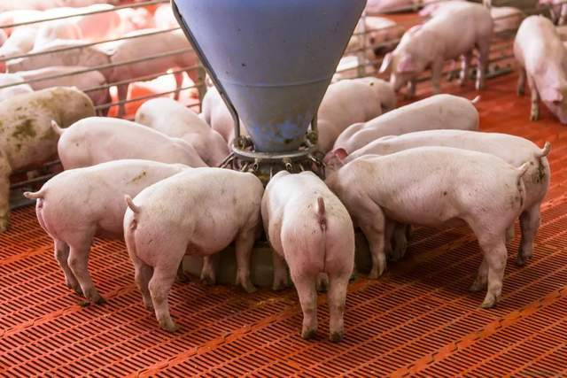

# 春节来碗红烧肉！猪肉价格旺季不旺，年轻一代更偏向于牛羊肉、水产品

年夜饭少不了猪肉。图/图虫创意

每年春节，阖家团聚，一桌子美食总少不了猪肉——红烧肉、扣肉、酱肉、腊肉……因此春节前也是全年猪肉消费旺季，猪价也多呈现上涨态势，但今年却有所不同。

据农业农村部监测，1月13日，全国农产品批发市场猪肉平均价格为23.12元/公斤，与1月6日的25.13元/公斤相比，下降8%。当周的平均价格为24元/公斤，与前一周的25.3元/公斤相比，下降5.1%。

事实上，就在去年10月，我国生猪价格迎来一波上涨趋势，不少消费者还喊贵，国家发改委当时也发布了猪肉价格过度上涨一级预警。

然而不到三个月，猪肉价格却突然“跳水”，从过度上涨一级预警转入过度下跌三级预警，累计跌幅超过40%。猪价为何坐上过山车？难道是红烧肉不香了吗？

**猪价过度下跌引发预警**

“猪肉便宜啦，走过路过不要错过。”

1月16日，在北京市西城区的一家大型超市内，一位猪肉商户正在对来往的消费者吆喝着。

中国新闻周刊注意到，一个月前还“3”开头的猪肉，亲民了不少：前腿肉卖12.98元/斤，前肘卖23.98元/斤，猪蹄卖27.98元/斤，精品五花卖29.98元/斤……

在超市里，降价的不仅仅是鲜肉，肘子、猪蹄等猪肉加工制品的价格，也随着猪肉价格下降而有所降低。大红门熟食的售货员告诉中国新闻周刊，酱肘子一斤只要49块8，还是去骨的，“上个月还卖59块8呢。”

作为北京新发地农产品批发市场的“猪肉大王”，齐尚港一年能卖出10万头猪，为北京众多商超和餐馆供货。这些年来，他见惯了肉价的涨涨跌跌，但对于最近猪价下跌之快也颇感吃惊。

他告诉中国新闻周刊，2022年10月份的时候，新发地销售的白条猪价格还徘徊在32-33元/公斤，然而现在已经降至18-19元/公斤，降幅达40%。

齐尚港的感受与近期全国猪价走势一致。据中国养猪网数据，去年10月20日，外三元价格尚且为28.59元/公斤，然而到了今年的1月16日，价格已经降至14.4元/公斤，三个月降幅近一半，有时日降幅达1-2元/公斤。

老闫是河北的生猪养殖户，他对于猪价的涨跌更为敏感。

整个2022年，老闫一共出栏了500多头猪，其中三分之二是11月之前出的。“那会儿确实赚到了不少，最高的时候一头猪能赚到一千多元。”不过从10月底开始，老闫就发现价格开始走低，尤其是进入12月，每出栏一头就要亏损近两百元。

感受到猪价下跌压力的，不仅仅是老闫这样的中小养殖户，大企业也是如此。

近日，各大上市猪企相继公布2022年12月销售情况。从销售收入来看，除正邦科技、唐人神收入环比增长外，其余猪企均录得不同程度的下滑，牧原股份、温氏股份、新希望、天邦食品、金新农单月销售收入环比分别下滑11.23%、27.69%、17.4%、48.34%、71.64%。

布瑞克农业大数据集团研究总监林国发告诉中国新闻周刊，随着近期猪价恐慌杀跌，养殖利润已经出现亏损。“截至2022年12月月末，行业自繁自养成本为15.6元/公斤至16.5元/公斤，外购仔猪成本在16.5元/公斤至17.5元/公斤，单头利润为-120元/头。”

衡量生猪养殖效益变化的猪粮比价（每周生猪出场价格与全国主要批发市场二等玉米平均批发价格的比值）也能反映出这一点。

国家发改委1月9日消息显示，据监测，1月3日-6日，全国平均猪粮比价为5.93∶1，按照《完善政府猪肉储备调节机制
做好猪肉市场保供稳价工作预案》规定，进入过度下跌三级预警区间。

**年轻一代更偏向于牛羊肉、水产品**

传统的消费旺季，猪肉价格缘何坐上“滑梯”？

在齐尚港看来，猪价变动的背后是供需关系的变化，供过于求是这轮猪肉价格下跌的主要原因。

事实上，每年12月至春节前是生猪供应高峰。数据显示，14家上市猪企去年12月出栏总量为1274.8万头，较11月环比增加9.20%。

“再加上前期养殖户出栏意愿低，大量的生猪二次育肥和延后出栏导致供给增加。”林国发补充道。

反观需求端，却并没有因为新春佳节的到来而出现大幅上涨。

农业农村部猪肉全产业链监测预警首席分析师朱增勇告诉中国新闻周刊，疫情防控政策优化调整后，餐饮和集团的消费不升反降，患者在家饮食清淡，导致猪肉消费锐减。此外，疫情部分时间影响一些区域的流通运输，猪肉购买渠道和猪价上涨，也对猪肉消费产生了阶段性影响。

对于近期猪价下跌，新希望也在投资者互动平台表示：12月份猪价下跌主要缘于疫情影响短期消费需求与物流运输，以及前期二次育肥猪陆续上市。

事实上，猪肉消费的变化，不仅有短期因素作用，还受到肉类消费结构调整的长期趋势影响。“自‘十三五’以来，猪肉在我国居民肉类消费中的比重其实在不断降低。”朱增勇指出。

根据麦肯锡发布的《中国肉食消费市场报告》显示，2017-2021年间，我国猪肉消费占比从63%降至59%，禽类和牛肉则分别从22%和9%升至26%和10%。这其中既有非洲猪瘟带来的影响，也有消费需求变化的因素。

2018年非洲猪瘟暴发，导致2019年至2020年生猪产能受损严重，我国猪肉消费量也由正常年份的5500万－5600万吨，锐减至4500万吨。

而随着消费升级，年轻一代更偏向于牛羊肉、水产品，老年人更偏向于禽肉，这些都会挤占部分猪肉消费。

从欧美发达国家情况来看，居民肉类消费普遍趋势也是猪肉下降、禽肉增长。以德国为例，从肉类消费历史趋势来看，2011年以后肉类消费量总体趋降，猪肉占比下降。2011年，猪肉、禽肉、牛肉在肉类消费中所占比例，分别为63.9%、18.5%、14.6%。10年后，由于人均肉类消费需求下降，导致2021年猪肉产量减少2.4%，牛肉和禽肉产量下降1.6%。三种肉类所占比例，分别为56.4%、23.8%、17.1%。

林国发预计，未来有很大概率猪肉需求将会止步于5000万—5200万吨，难以重回5600万吨的巅峰数据。而禽肉的需求稳步增加，将会从当前2500万吨左右(含有一定进口量)提升到2800万吨。

**猪价涨跌影响巨大**

在我国，生猪是重要性仅次于粮食的农产品，一头连着消费者，一头连着养殖户。

生猪养殖关系重大。图/图虫创意

一方面，猪肉是中国肉类消费的第一权重，也是中国人最主要的蛋白质来源。

国家统计局此前发布的《中华人民共和国2021年国民经济和社会发展统计公报》提到，2021年，猪肉产量5296万吨、牛肉产量698万吨、羊肉产量514万吨、禽肉产量2380万吨。

麦肯锡在《中国肉食消费市场报告》中也提到，中国消费者购买猪肉的频次不仅远超欧美国家，也超出牛肉和禽类10%以上。调查结果表明，近60%的中国消费者每周至少会吃3-5次猪肉。

另一方面，生猪养殖还是很多人的生计来源。

中国不仅是猪肉消费大国，也是生猪生产大国。即便近年来行业呈现向规模化发展的趋势，中小型猪场数量仍然庞大。招商银行研究院2019年底的一份研报指出，中国生猪养殖行业超过万亿产值，其中散户养殖约占一半。

更重要的是，由于猪肉在中国人饮食结构里的特殊地位，猪肉价格在CPI中长期占很大权重，且会对其他畜禽产品等替代品产生传导作用。

2019年，猪肉价格史无前例地涨至高位，CPI随猪价波动的现象十分明显，当时甚至有人给猪价带动CPI结构性上涨的情况起了个名号，叫“猪通胀”。

因此，保持猪价相对稳定之于消费者、行业乃至物价平稳都有重要意义。

刚刚过去的一年，对于生猪行业而言可谓跌宕起伏的一年。朱增勇表示，从全年来看，价格变动幅度不大，但局部震荡幅度很大。

1月，生猪价格受春节备货不佳影响，价格一度跌破15元/公斤。春节后价格进一步季节性回落，到3月21日，已经跌至11.78元/公斤。

随后，国家开启冻猪肉收储，连续13轮，一直持续至6月，再加上养殖成本方面持续承压，猪价开始回升。到7月10日，生猪价格已经回升至23.71元/公斤。

此后，猪价继续保持震荡上行，到10月20日已经涨至28.59元/公斤。随着猪价重回高位，国家启动冻猪肉放储，至11月连续7次放储，累计13.71万吨。

进入四季度，由于多地疫情持续反复，以及南方腌腊灌肠时间推迟，猪肉消费有所受限；再加上大猪出栏加快，进一步加快了猪价的回落，特别是12月中旬前后2周累计下跌近20%，最终以17.64元/公斤收官。

朱增勇表示，回顾过去的一年，养殖户情绪受市场和资本影响明显。因此接下来要加强对市场主体的引导，指导养殖户既要养好猪，也要卖好猪，避免受市场和资本炒作影响。

针对近期生猪价格低位运行的情况，国家发展改革委价格司组织部分大型生猪屠宰企业召开会议，深入分析生猪市场供需和价格形势，建议屠宰企业适当增加商业库存、提振市场需求，促进生猪价格尽快回升至合理区间。

作者：余源

