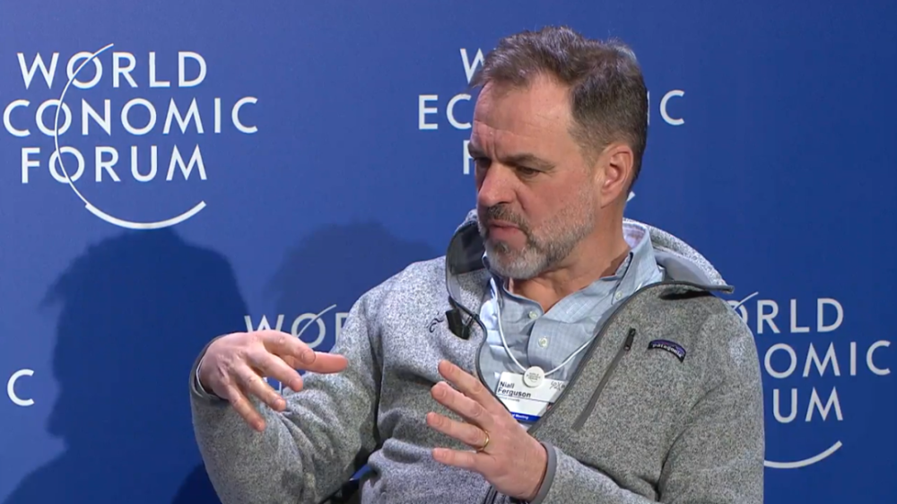

# 英国学者借《三体》形容中美关系，旁边主持人秒懂

在1月17日举行的达沃斯世界经济论坛上，英国历史学者尼尔·弗格森（Niall
Ferguson）借中国科幻小说《三体》来形容中美关系，称美国对华技术遏制“类似于三体人想阻止地球人技术进步”。

据达沃斯论坛官网，弗格森是在参加分论坛“去全球化还是再全球化”时做出的上述表述。

弗格森称，世界正在经历“第二次冷战”（cold war
II）。“美国有一个技术遏制战略”，弗格森认为，美国对华技术遏制“有点像《三体》中三体人试图阻止地球的技术进步”，“这正是美国试图对中国做的事情”。

…the United States has a strategy of technological containment. It's a bit
like in the Three Body Problem where the Trisolarans try to hold the
technological advance of Earth. That's exactly what the US is trying to do to
China.

《三体》书中，三体人利用智子封锁了地球基础物理前进之路，试图以此阻止人类发展，最终占领地球。但在黑暗森林法则和人类的反击下，三体文明暴露在宇宙黑暗森林中，最终被其他文明消灭。

旁边的主持人显然也知道这本书，听完弗格森的比喻后，他顺口提到“《三体》是年度必看的中国科幻小说”，弗格森也“建议所有人都读一读”。

“That's the Chinese sci-fi book of the year. ” “Everybody should read it.”

论坛上，弗格森还进一步指出，他认为“第二次冷战”将变得越来越清楚和真实，未来，全球将在硬件领域划分为两个区块：一个是欧亚大陆区块，“西方对俄制裁正加速这一区块的形成”；另一个是以美国为首的欧美区块。

另据美国消费者商业与新闻频道报道，会上，弗格森还论述了全球化的走向。

他认为，有关去全球化已成主流趋势的观点只是一种“幻想”，并没有数据支撑。现实情况是目前并没有发生重大的去全球化。

The idea that a major trend of de-globalization has begun is a "mirage" that
is not borne out by data, according to the historian Niall Ferguson.

中国日报（ID：chinadailywx）综合观察者网、CNBCnews

