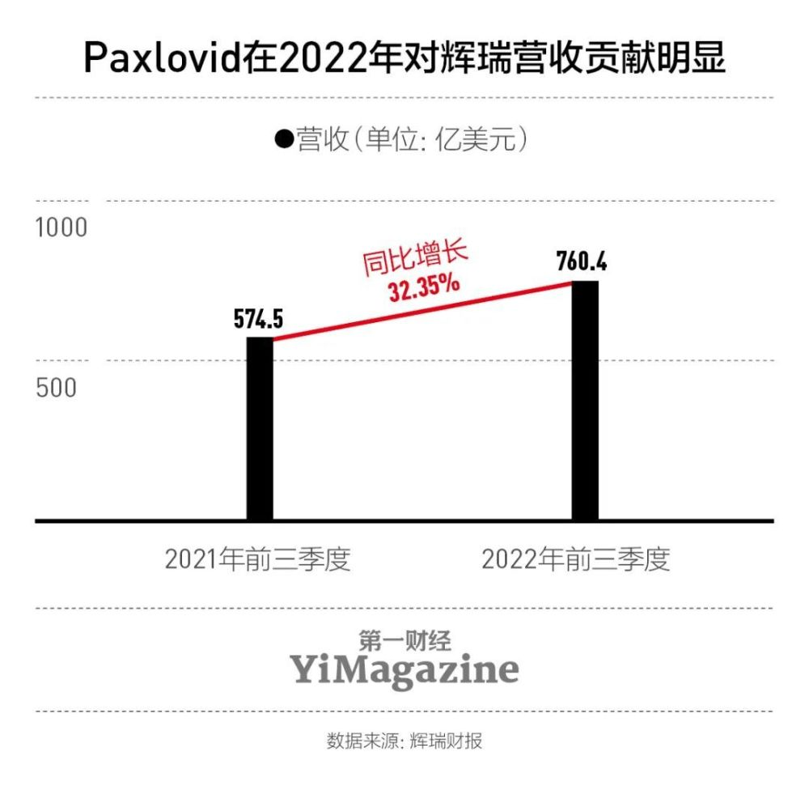
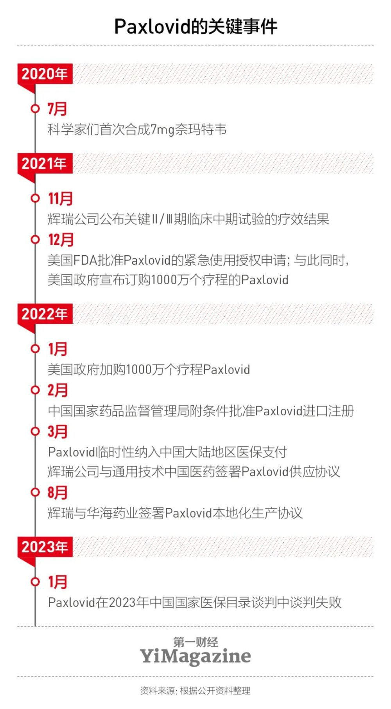
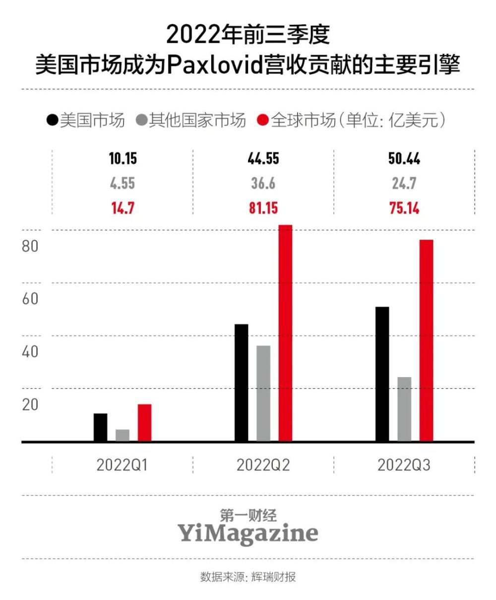
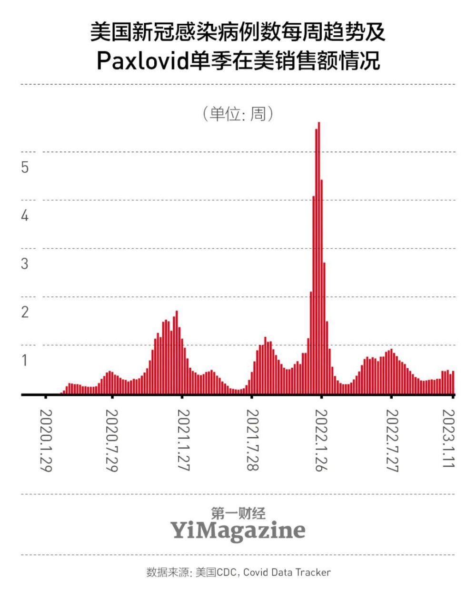
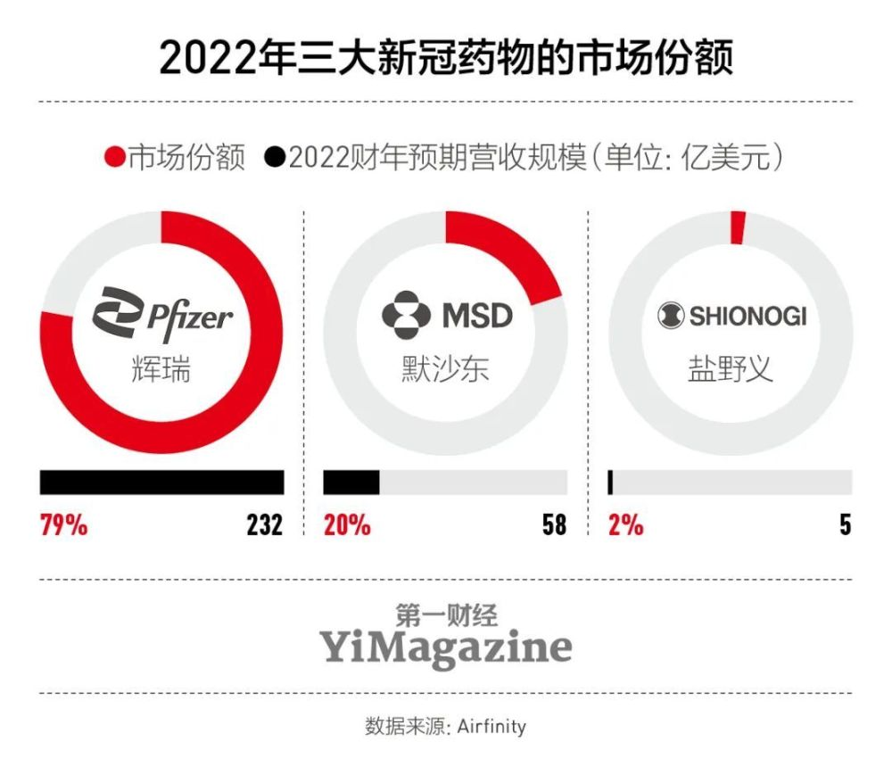
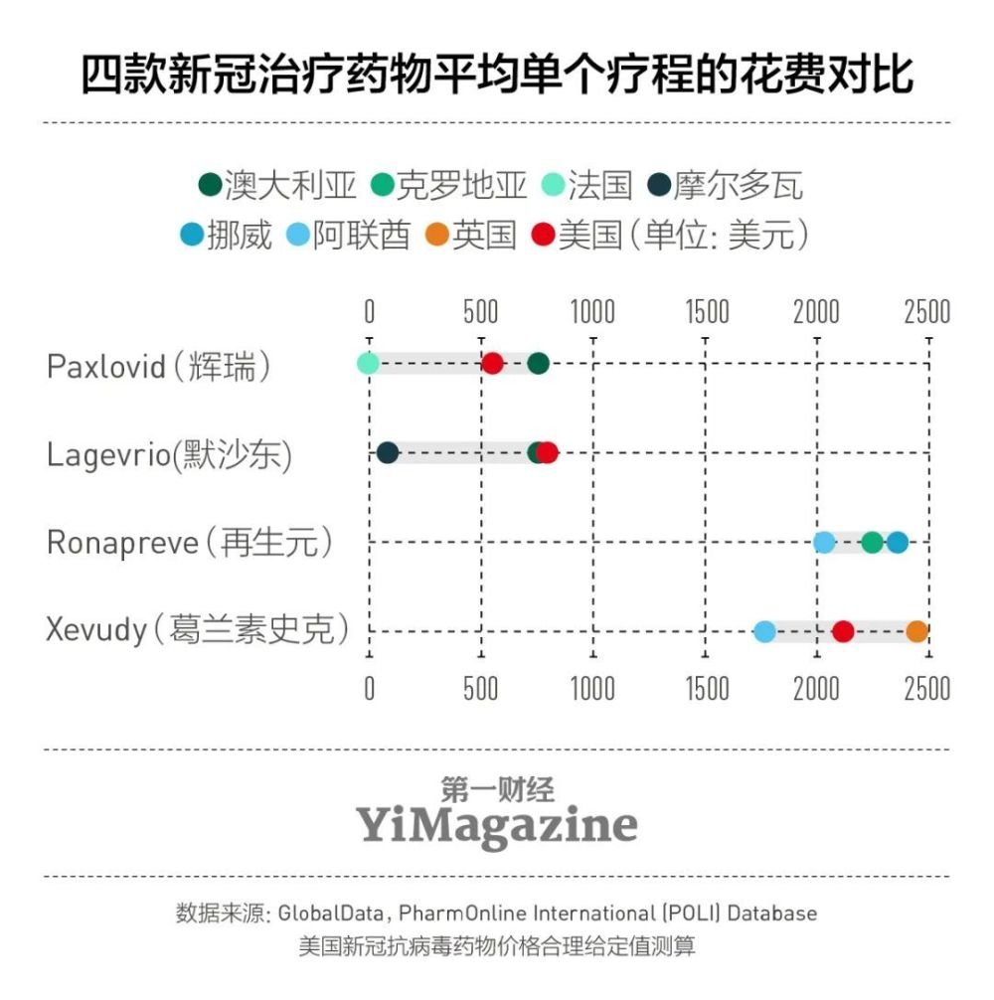

# 辉瑞Paxlovid的价值重估：市场热，临床冷，销量预计会逐年递减

记者 | 文思敏

实习记者 | 崔硕、章菁

编辑 | 王姗姗

市面上从来没有哪一款新药能像辉瑞推出的新冠治疗药物Paxlovid这样，短短几周内就达到被哄抢的超高热度。2023年的元旦和春节，它甚至成为一些商务人士送礼的“硬通货”。

1月15日，家住上海的李一帆在朋友圈晒出他从“黄牛”那里买到的一盒Paxlovid。药盒上印着的是中文药名“奈玛特韦/利托那韦片组合包装150mg/100mg”，有效期仅到2023年8月。李一帆只知道“药是别人买了没用上，所以才转手的”，但并不能判断这盒药的真实性。现在他花4000元是买给老家的父亲——为了躲避传染，老人已经2个多月足不出户——用来“保命”的。

**英国医药数据公司Airfinity预测，对新冠治疗药物的需求可能会使Paxlovid成为有史以来销售最快的治疗药物之一。**
辉瑞财报显示，公司2022年前三季度依靠Paxlovid所斩获的营收已达170亿美元。2022年年初，辉瑞预期Paxlovid全年营收会达到220亿美元。

1月18日，国家医保局正式官宣了2022年国家医保药品目录调整结果，最终共有111个药品新增进入目录，谈判和竞价新准入的药品价格平均降幅达60.1%。阿兹夫定片、Paxlovid、清肺排毒颗粒3种新冠治疗药品通过企业自主申报、形式审查、专家评审等程序参与了谈判，但只有Paxlovid因辉瑞报价高而未能谈判成功。

作为辉瑞自主研发的治疗新冠小分子口服药物，基于III期临床试验分析结果，Paxlovid被认为是目前全球“疗效最好”的新冠治疗药物。

2022年2月，国家药品监督管理局按照药品特别审批程序，经应急审评审批，附条件批准对Paxlovid的进口注册。3月初，辉瑞同通用技术中国医药健康产业股份有限公司（简称“通用技术中国医药”）签订供应协议，由后者在协议期内负责Paxlovid在中国市场的商业运营。双方在2022年12月初宣布上述合作延续至2023年。

**Paxlovid没有纳入医保的消息一出，舆论哗然。**
自2022年3月以来，这款药物被纳入在各地临时医保计划里，早期医保采购价为2300元，随后经医保局约谈，降至1890元。

在新冠病毒感染归属“乙类乙管”之后，国家医保局再次明确，参保患者在基层医保定点医疗机构发生的与新冠治疗有关的门急诊费用，报销比例不低于70%。但这一临时医保政策将在2023年3月31日截止。

此后患者用药将实行全自费。目前一盒Paxlovid在京东、美团、阿里的医药平台可以限量秒杀的“零售价”是2170元。

辉瑞拒绝价格牺牲而选择让Paxlovid这款昂贵的原研药继续以患者自费方式在中国市场销售，显然是出于商业考量。

值得注意的是，1月14日国务院联防联控机制就重点人群健康保障有关情况举行发布会并通报称，全国范围内1月5日达到了住院新冠感染者峰值162.5万人，此后住院的新冠感染者的数量呈现连续下降的趋势。这意味着，“新冠大流行”在本轮感染达峰之后，对Paxlovid的需求量也会相应回落，此前几周因疫情防控政策突然放开而引发供需失衡的局面将逐步缓解。

与此同时，Paxlovid的国产竞争者们也在积极推进临床试验，争取新药早日获批上市。1月中旬以来，接连有对手宣布国家药品监督管理局受理其产品的新药上市申请，先是先声药业的先诺欣，再是君实生物VV116。在加速审批的背景下，业内人士预计，2023年会有超过5个产品争夺国内新冠治疗药物市场，而这些产品的下一步，很可能就是与医保积极合作，实现“以量换价”。

所以，无论从市场需求的变化曲线，还是从竞争格局来看， **2023年Paxlovid想要在中国市场继续走出一条上扬曲线，难度正不断加大。**

“ **中国市场初识Paxlovid** ”

Paxlovid早期进入中国的过程，可以说是一路绿灯。与辉瑞达成进口分销协议的通用技术中国医药，在其相关新闻通稿提及“39个小时完成Paxlovid国外进口、国内运输并交付定点医院的冬奥保障‘首秀’”。

辉瑞生物制药集团中国区总裁彭振科在2022年9月参与服贸会时也曾对外透露，Paxlovid“于2月附条件紧急获批，首批产品3月即抵达中国海关，并被快速用于中国抗疫一线”。

在短短几周内，Paxlovid先是通过了国家药监局的附条件批准进口注册，随后与通用技术中国医药签署Paxlovid供应协议。接着在3月14日国家颁布的《新型冠状病毒肺炎诊疗方案（试行第九版）》，Paxlovid被应用到抗病毒治疗方案中，用于“发病
5 天以内的轻型和普通型且伴有进展为重型高风险因素的成人和青少年”。同月，Paxlovid被临时性纳入中国医保支付，时间为一年。

由于中国贯彻动态清零政策，感染病例数量有限，且操作方式上均为转运至定点医院，实施闭环隔离救治。不仅是普通民众，绝大多数未被列为“新冠定点医院的医疗机构的工作人员，对Paxlovid的接触也十分有限。

张晨是浙江省一所新冠定点医院的业务院长，他对《第一财经》杂志回忆称，院里最早用上Paxlovid大约在去年的2、3月份。这家医院主要接收境外回国的核酸阳性患者，以及少量本土散发病例。上海疫情暴发期间，医院接纳了来自上海的一千多名感染者，其中有少量的高危、年纪较大的病患使用过Paxlovid。

因为开始危重病例并不多，绝大多数病患不管用不用抗病毒药，基本都能在一周到十天左右核酸转阴出院，Paxlovid的“救命”价值在当时并未被放大。一直到去年10月、11月，疫情防控政策还没完全放开，而散发感染病例逐渐增长，但医生开药的态度仍然比较谨慎。他们对这款药的印象更多停留在“价格贵”和“用药不方便”上。

拆开Paxlovid的包装，里面一共分为两个成分：两片粉色的奈玛特韦和一片白色的利托那韦。其中，利托那韦原本是作为HIV病毒抑制剂研发的一款药物，而能有效抑制病毒的成分是奈玛特韦，但它很容易被人体代谢，因此就需要利托那韦来辅助，将奈玛特韦的浓度维持在可以持续抑制病毒的水平。

“有很多药，比如治疗高血压、高血脂、心脏病、肿瘤的靶向药等，都是通过肝药酶代谢，如果肝药酶活性被阻止的话，这些药分解代谢会出问题，有的血液会浓度很高，甚至带来严重不良反应。”张晨介绍说，Paxlovid含有的两组成份中，利托那韦就是肝药酶活性阻止剂，因此用药前临床医生需要先排查病人的肝肾功能，如果有中度或者中度以上的损伤，用量需要减半，甚至可能无法使用，同时专业药师还要评估Paxlovid和其他药的相互作用，然后决策出哪些药要减半，或者换成其他没有相互作用的药，或者先停药——Paxlovid完成5天疗程，再停药3天后，其他药才能恢复服用。

因为涉及这些用药安全问题，所以在临床上才会让医生们觉得“用起来不太方便”。不过，张晨表示，该医院使用过的几种小分子抗病毒药，一共用了2000多例，通过对临床病人的分析总结，疗效上“还是Paxlovid比较好一些”。

**无论如何，Paxlovid仍然是一个需要在医生指导和评估下才能安全使用的药品。**
在临床医生的眼里，老百姓或多或少对这款药有误解。特别是对于氧饱和已严重不足、肺部出现间质性病变纤维化转为重症的患者，Paxlovid的作用并不大。“已经发展到重症阶段，人体消耗会比较大，患者如果服用Paxlovid，还会加重肝肾功能的负荷。”北京市的一位全科医生对《第一财经》YiMagazine表示。

“ **市场热，临床冷** ”

2022年12月疫情管控放开以来，全国更多的非定点医院开始收治新冠感染患者，也能从阳光采购平台申请到Paxlovid。那里的医生同样需要时间来逐步积累使用这款药的专业经验。

北京市三级医院和一部分专科医院，从2022年12月中下旬开始陆续调配到Paxlovid，那时正值北京奥密克戎感染的高峰，所有医院被要求“应接尽接”，接诊量骤增。据《第一财经》YiMagazine了解，北京市对于调配新冠药物的规定是，在三级医院和部分专科医院可以申请调配300至500盒Paxlovid。

北京一家三级医院的的医生告诉《第一财经》YiMagazine，目前全院一共只有10名医生拥有开具药物的权限，两名急诊医生、两名发热医生，其他权限集中在住院部呼吸科、ICU这样的科室。2022年12月之前，他们只是在《新型冠状病毒肺炎诊疗方案（试行第九版）》中看到过这个药品的使用说明。12月20日后，医生们才有了相关培训。先是院内专家组学习和了解药物的使用注意事项、禁忌症，包括并发症，再结合自身的实际经验，对全院更多医生做了培训。

“目前使用这个药物还是固定几名专家，经过会诊之后才能开具。”这位不愿具名的医生说道。

医院开药态度谨慎，除了出于用药安全的考虑，还有其他顾虑。比如，担心药品由此流入地下市场。“我们在开具处方的时候就怕病人拿回去没有吃，拿去倒卖，变相盈利。”北京市一家三级医院医务处负责人对《第一财经》YiMagazine说。此外，用药报销政策的不清晰，也让医院方面担心，如果现在有大规模的处方开具，那么未来一旦针对Paxlovid的使用政策收紧后，可能会有大批量“是否符合规定动作”的审核。

**目前，Paxlovid仍在临时医保范畴内。**
原则上，入院救治费用中80%由医保基金报销，另外20%由财政拨付，先期由医院垫付，后期再由财政支付。但这项政策未来如何收紧仍然不明朗。

“一旦出现不符合规定的操作，就会导致医保拒付，医院则有可能需要承担治疗费用，所以我们也不敢过度使用。”上述医务处负责人表示。

北京市各区的社区卫生服务中心，也是在2022年12月下旬开始做用药培训。但这些社区医院真正配到药，已经是元旦以后，首批能拿到100盒，但首诊医生根据用药指征和用药人群情况填写表格后，需要交给更上级医生审批，审批过后需要“双签字”才能拿处方取药。

**在社区医院，需要是感染5天之内、年龄65岁以上的患者本人就诊，由医生合并评估其基础疾病等因素，判断属于高危人群，门诊就会给开Paxlovid。**

但是，一位北京市基层社区卫生服务机构的全科医生1月10日告诉《第一财经》杂志，在拿到了第一批药后的一个多星期“仅开出5盒药，较预期开出的数量少。”“只要有适应症，我们都会为患者开。其实它的适应症很容易达到，但确实没有那么多来申请的患者。”这位医生说道。

同日，丰台区一家社区医院的一位全科医生表示，他全天只接到过两例开Paxlovid的门诊需求，一查核酸发现都已经转阴。这位医生直言，直到1月中旬，他还一直没有碰到过一个真正符合条件开药的病人，“北京大部分都阳过了，相对来说，（需要药的）就少了。”

作为一款小分子药物，Paxlovid主要作用是通过感染早期抑制或阻断病毒复制来降低病毒量阻止病情进展。简单来说，它的作用是通过早期抗病毒防止轻中症病人转为重症，从而降低病人的住院率。张晨也提到，如果能抓住疾病诊疗的“黄金72小时”，在出现症状后3至5天用上Paxlovid，就能实现“抗病毒关口前移”——年纪大的病人能及时吃上药，减少了重症发病率，就不一定需要入院治疗。对于医院来讲，住院病人变少了，就能避免医疗资源挤兑。

对于Paxlovid来说，这款药更理想的使用场景，应该是在感染高峰到来前。而各级医疗机构也应该是在大流行开始之前就充分做好药品储备和用药培训。

“ **新冠治疗药物的2023年** ”

**虽然2022年前三季度，Paxlovid为辉瑞在全球市场创造了170亿美元的营收，但这条上扬曲线也极有可能在2022年达到了峰值。**

英国商业数据公司GlobalData认为，Paxlovid的前10年销售总收入将达到800亿美元，其中，仅是2022年的销售就占据很大一部分。并且GlobalData预估，自2023年起，Paxlovid的销量会逐年递减，呈现明显的下滑趋势。而这一趋势的原因来自于新冠病毒毒性的持续下降以及疫苗加强针的推广。

目前，根据“两票制”的监管要求，辉瑞把Paxlovid在中国市场的经销交给了通用技术中国医药。重回“自费药”的身份后，公立医疗机构对Paxlovid的订货态度是否积极，将直接取决于“新冠大流行”未来的发展趋势。

辉瑞在过去几季的财报中，也有意将新冠相关营收与其他既有业务之间做出明显区隔，主动向投资者公布在排除疫苗和Paxlovid之后的公司常规业务的增长变化情况。

基于美国新冠的流行病学、住院率和住院费用做的测算，美国临床与经济审查研究所（ICER）就曾更新过一版对Paxlovid的价格估算。在最新的版本中，ICER认为Paxlovid在美国市场的价格应在563美元至906美元之间。在更早的测算中，ICER曾估计一盒Paxlovid的实际价值在3600美元至5800美元之间。

“如果未来因感染新冠病毒的住院或死亡风险增加，那么Paxlovid的相对价值增加。反之亦然，治疗的价值也会降低。”ICER主席Steven
Pearson在书面回复中对《第一财经》YiMagazineYiMagazine表示，“这些风险可能会因疫苗接种率、既往感染率、主流变异株以及医疗护理的变化而发生变化。奥密克戎变异株流行以来的趋势表明，新冠病毒的感染风险正在降低，所以我们最新的价格基准大大低于2022年年初的原始计算值。”

**Paxlovid并非目前唯一入市的新冠治疗药物。**
根据医药数据公司Airfinity的预估，目前全球主要的3款新冠治疗药物辉瑞的Paxlovid、默沙东的莫诺拉韦和盐野义的Xocova，在2022财年可能会分别占据78.64%，19.66%，1.69%的市场份额。

在国家医保局1月6日发布的《新冠治疗药品价格形成指引（试行）》中提到，“在坚持企业自主定价的同时，也有必要关注对新冠治疗药品公平可及的影响。”

1月9日，阿里健康上线开售默沙东的莫诺拉韦，价格为1725元/盒（40粒）。刚刚于2022年11月在日本批准上市的盐野义Xocova，在12月下旬就宣布与上海医药签订了针对中国市场的进口分销协议。此外，2023年1月，盐野义社长手代木功在接受日本媒体采访时提及，计划在中国生产1亿疗程新冠口服药（编注：1个疗程的Paxlovid用量为1盒）。

2022年8月，中国彼时尚处在明确的“动态清零”的防疫政策之下，也许是预见到中国十几亿人未来不可避免会遭遇“大流行”的正面冲击，辉瑞与华海药业就Paxlovid签署了本地化生产协议。但直到目前，据华海药业对外证实，相关的审批手续还未完成。辉瑞处在“产线好建、开工难”的尴尬境地。

一位制药业人士告诉《第一财经》YiMagazine，未来几款外资原研药在国内上市的价格不会太悬殊，基本会“贴紧”Paxlovid的价格。“在没有医保覆盖的情况下，要想吃到便宜的新冠治疗药物，仍然要等待国产药。”这位业内人士说。

（应采访对象要求，李一帆、张晨为化名）

封面图片：董思哲

