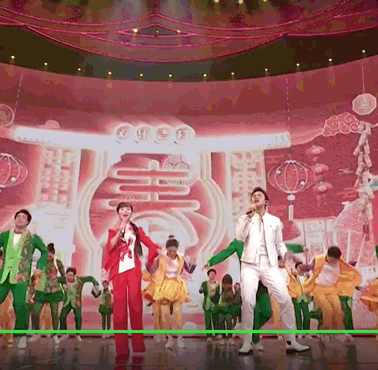
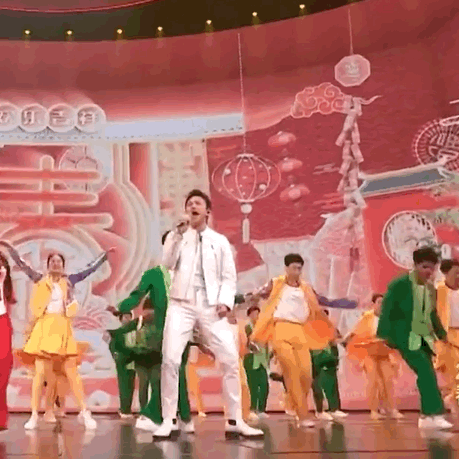
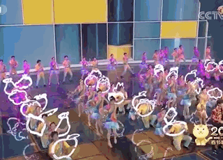

# 邓超上春晚跳得太投入，孙俪调侃不能给邓超近镜头

2023年央视春晚，邓超和王二妮演唱歌曲《好运全都来》，邓超的投入逗笑观众——网友纷纷评论“邓超是今晚春晚最开心的人”、“演绎一种激情四射的舞台油腻风”。

邓超表演刚结束，妻子孙俪就发微博调侃，“今年导演有经验了，就不能给邓超近镜[偷笑]超哥一助跑，赶紧切广角[偷笑]”。原来，去年邓超与李宇春表演节目时，过于激动的他甚至跳出了屏幕。

文/于建

编辑/贺梦禹

