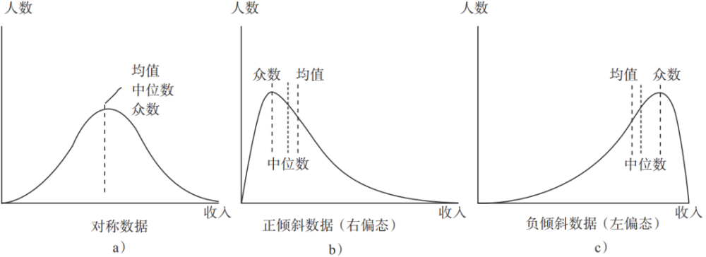
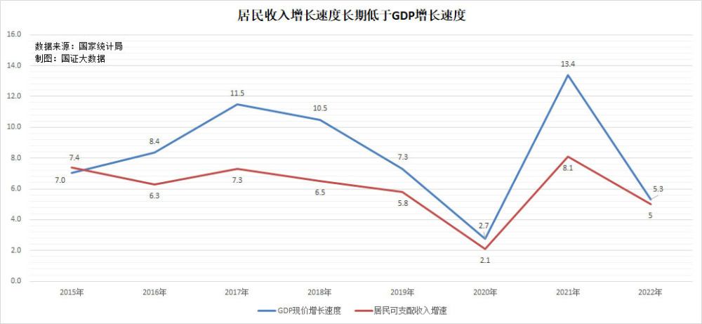
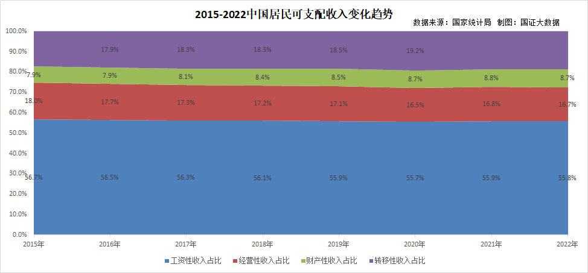

# 去年居民可支配收入增长5％，为何大多数人感觉收入“被增长”了？

内容提要：

  * _1_ 2022年全国居民人均可支配收入同比增长5%；
  * _2_ 统计方法的选择导致大多数人的收入总是低于平均数，产生被平均现象；
  * _3_ 2022年居民收入的真实状态是什么样的？
  * _4_ 疫后经济复苏，要着力提高中低收入阶层的收入。

一、2022年全国居民人均可支配收入同比增长5%

2023年1月17日国家统计局在公布2022年主要经济指标时表示，虽然面对复杂严峻的国际环境和疫情散发多发等多重挑战，2022年居民收入增长仍然与经济增长基本同步，农村居民收入增长继续快于城镇居民。

国家统计局的数据表明， 2022年，全国GDP按现价计算增长5.3%，按可比价计算增长3%。

**全国居民人均可支配收入36883元，比上年名义增长5.0%。** 扣除价格因素，实际增长2.9%，与经济增长基本同步。

其中城镇居民人均可支配收入49283元，名义增长3.9%，农村居民人均可支配收入20133元，名义增长6.3%。农村居民人均可支配收入增速比城镇居民快2.4个百分点。

城乡居民收入比由上年的2.50降至2.45，收入差距继续缩小。

不过，对于全国居民人均可支配收入36883元、比上年名义增长5.0%这样的数据，大多数人似乎都不太能接受，在该新闻下留言点赞最多的一条评论是：
**“我不达标属于被平均一族，我的钱被谁赚走了。”**

为什么国家统计局公布的平均收入与大多数人自己的收入有较大差距呢？

二、统计方法的选择导致大多数人的收入总是低于平均数，产生被平均现象

从统计方法来说，反映一个国家或地区真实的居民收入水平的指标有三个， **即平均数、中位数、众数。**

平均数是统计学中最基本、最常用的一种定义一组数据特征的指标，用来描述数据的平均水平。在居民收入中计算平均数的方法，就是将所有人的收入合计除以人数。

中位数是将数据按大小顺序排列后处在中间位置的数。居民收入的中位数，一般是将所有调查户按人均收入水平从低到高顺序排列，处于最中间位置的调查户的人均收入。

众数是数据集合中出现频率最高的数值，众数的个数不一定是唯一的。居民收入的众数，一般是将居民收入按照五等分或十等分从高到低分组后，将人数最多的那组人的平均收入作为收入众数。

一般而言，如果所有居民的收入符合对称的正态分布特点，居民收入平均数、中位数和众数就会重合为同一个数。

但实际上的居民收入， **总是呈现金字塔结构，属于严重偏左（低收入）的非对称分布。**

在这样的居民收入分布中，如果用平均数来代表居民收入，受高收入人群的影响极大，一些金融或者券商或者研究机构人均几十万的收入很容易拉高平均收入，从而导致收入严重失真。

而众数收入则仅能代表人数之多的低收入阶层的平均水平，也存在失真的状况。

这种情况下，中位数收入再辅助分组收入，一般就能够比较客观地描述真实的收入状况。

三、2022年居民收入的真实状态是什么样的？

大多数媒体在介绍2022年居民收入时，都是这样介绍的：2022年全国居民人均可支配收入36883元，比2021年名义增长5.0%。扣除价格因素，实际增长2.9%，与经济增长基本同步。

这样的数据，的确不能反映居民收入的真实状态，也无法获得大多数网友的认同。

实际上，2022年的真实状态的居民收入是这样的:

**第一、居民收入在GDP中的占比持续降低，居民的获得感持续下降**

居民对收入的感受，首先来自名义收入，就是我拿到了多少钱。

2022年，GDP达到121.02万亿元，比调整后的2021年GDP 114.92万亿，名义增长了5.3%。

2022年全国居民人均可支配收入36883元，比2021年名义增长5.0%，居民收入增长滞后于GDP 0.3个百分点。

0.3个百分点看上去不大，但因为我们的居民收入近几年来持续低于GDP的增长，积累下来的差距可就不小。

与2015年对比， **2022年GDP增长了74.9%，但居民人均可支配收入仅增长67.9%，滞后了7个百分点。**

居民可支配总收入在GDP中的占比，也从2015年的43.7%下降到43%，下降了0.7个百分点。

**第二、居民收入中位数与居民收入平均数的差距持续扩大，说明收入分化现象持续加剧**

2022年，国家统计局公布的居民可支配收入中位数为31370元，比平均数少5513元，比上一年增长4.7%，也比平均数增幅低0.3个百分点，比GDP低0.6个百分点。

居民收入中位数与平均数的差距5513元，描述了大多数人收入被拔高的平均程度。

**居民收入中位数增幅比平均数低0.3%，意味着大多数人的收入增长低于少数高收入群体的收入增长，意味着收入差距的扩大，收入分化现象的加剧。**

一般来讲，衡量收入差距的统计指标是基尼系数。但2022年的分组收入数据和基尼系数都未公布。这种情况下，我们可以用居民收入平均数比居民收入中位数的偏离值来衡量收入差距的基本趋势。

以国家统计局公布收入中位数的2015年开始，我们可以发现居民收入平均数比中位数高13.9%，其后这个数据每年都在扩大，到2022年居民收入平均数比中位数高17.6%，7年时间，居民收入平均数与中位数的偏离值扩大了3.7个百分点。

这就意味着，更贴近大众平均收入水平的数据，实际上比国家统计局公布的居民可支配收入平均值要低很多。

**第三、失业率增加实际上意味着低收入人群收入水平的相对下降**

国家统计局1月17日公布的数据显示，2022年12月城镇调查失业率录得5.5%，这比2021年12月份的失业率5.1%扩大了0.4个百分点。

在我们国家独特的体制内的机关事业单位和国企和体制外的民营企业、个体户、灵活就业人员这两个劳动力市场中，体制内的劳动力市场就业岗位是非常稳定的，失业率也低到可以忽略不计。

因此增加的失业率， **基本上体现在体制外劳动力市场中。**

2021年，城镇就业人员总量达到46773万人,其中国有、集体从业人员5895万，民营40878万。

按此比例推算，实际上2021年12月的体制外失业率为5.8%，2022年12月份为6.3%，增加了0.5个百分点。

失业率增加0.5个百分点，意味着2022年又有0.5%的人失去了工作岗位和工资收入，民营企业和个体户这部分人的收入就会下降至少0.5%。

**第四、在居民收入中，工资性收入与经营性收入占比下降，财产性收入占比增加，使大部分缺失财产性收入的中低收入阶层收入被平均。**

在如今的社会现实中，中低收入阶层对工资性收入和个体户、灵活就业人员的经营性收入依赖程度较高，受收入水平低的限制，缺乏财产性收入。而收入越高，占有的财产越多，财产性收入自然也越高。

2015年，在居民可支配平均收入中，工资性收入占比56.7%，经营性收入占比18%，财产性收入占比7.9%。

到2022年，工资性收入占比下降到55.8%，减少了0.9个百分点；经营性收入占比16.7%，减少了1.3个百分点；而财产性收入占比增加到了8.7%，增加了0.8个百分点。

这一组数据意味着，在国家鼓励财产性收入的这几年，因为财产掌握在中高收入阶层手中，中低收入阶层与中高收入阶层的收入因此在加速分化。

四、疫后经济复苏，要着力提高中低收入阶层的收入

我在多篇文章中强调过，疫后经济复苏靠消费，消费复苏靠增加中低收入阶层的消费能力。

因为高收入阶层的消费水平虽然很高，但消费在其收入中的占比却很低，并且其收入的增加对其消费的带动作用非常小，高收入阶层收入增减对其投资的影响比较大。

而中低收入阶层他们的收入绝大多数都用在消费上，但由于消费能力不足，一直在节衣缩食，艰苦度日。一旦他们能增加收入，其增加部分主要会用在改善消费上，因为他们微薄的收入很难用于投资。

但最近这些年，全体居民的收入水平滞后于GDP的增长速度，中低收入居民的收入，明显滞后于平均收入水平。这就是我们的内需----居民消费疲软无力的主要原因。

因此，疫后经济复苏，我们必须着力提高9亿中低收入阶层，特别是其中6亿月收入1000元以下低收入阶层的收入。

**第一、改革国民收入分配制度，扩大劳动者在GDP中的收入占比。**

这是能够保障居民持续消费、带动经济增长的根本方法，毕竟有钱才能消费。提高居民收入的关键是及时调整集中财力搞投资的分配制度，以达到降低投资率扩大消费率的效果。

同时还需要缩小收入差距，要下大力气将公职人员的收入逐步拉回到社会平均收入附近，重点促进民企、个体户和自由职业者的收入增长。

**第二、完善社会保障体系非常必要，也非常紧迫。**

我们还必须改善社会福利，加强医疗、教育、养老等基础保障，提供更为稳定的、覆盖面足够广的社会保障。

还要着力构建公平的一元化的社会保障体制，尽快缩减公职退休人员与企业退休金的差距。让绝大多数的居民有稳定感和安全感，让居民敢于消费。

**第三、在第一、第二条没有进展之前，将原计划用来投资的钱，拿出大部分平均发给全国人民，直接增加居民收入。**

通过财政转移手段普发补贴，相当于将高收入者的收入转移一部分到中低收入者手中，这是提高居民消费能力，缩小贫富差距，推动经济增长最直接、最有效的方式。

考虑到增加居民收入需要调整国民收入分配制度，有个过程，因此近期可以将大部分用于投资的钱拿出来，改为给每个人普发1万元的疫情补贴。

此建议虽然很多人不理解，认为都发钱等于不发钱，认为普发钱容易养懒汉，认为发钱会推升通胀（其实这都是无稽之谈，我之前的多篇文章都解释了这些问题），至今，我仍然坚持认为这是尽快恢复经济增长的最优解。

【作者：徐三郎】

