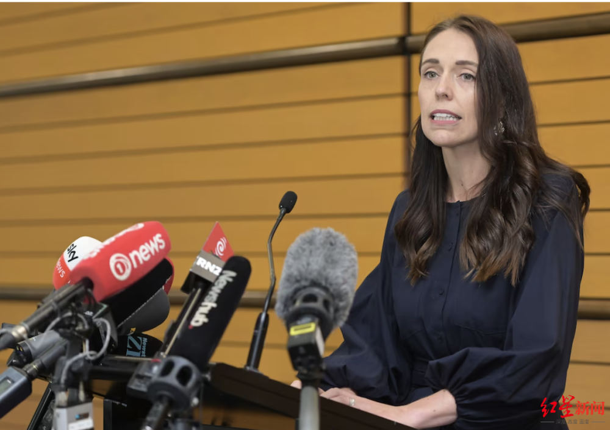
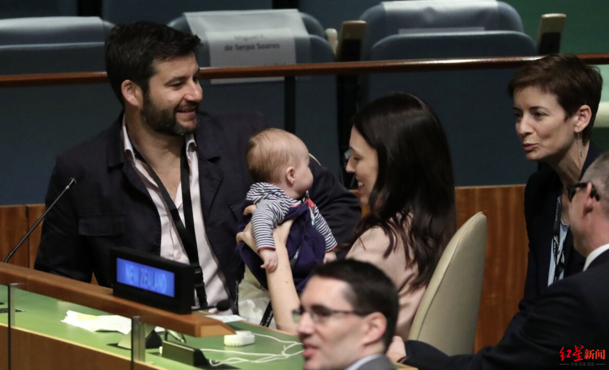
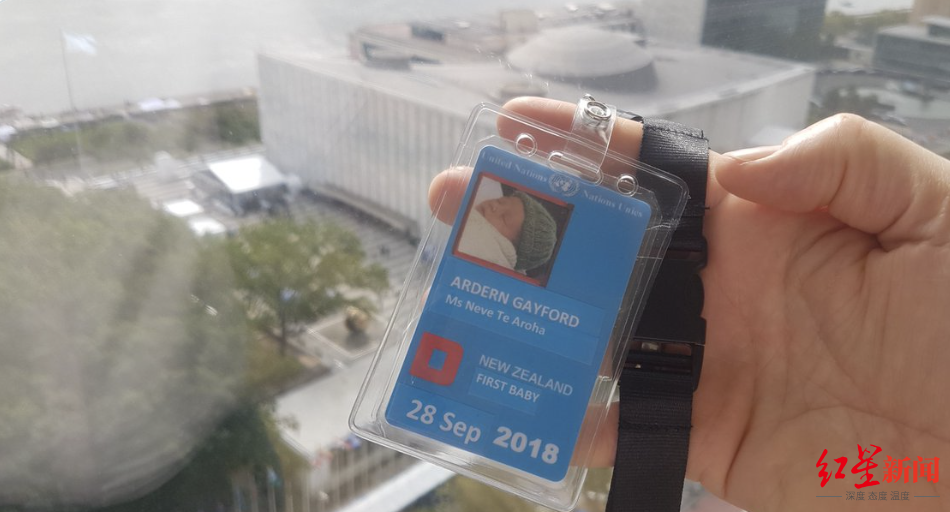

# 回家带娃？新西兰总理宣布辞职背后：想多陪女儿，“终于可以结婚了”

据报道，新西兰总理杰辛达·阿德恩(Jacinda
Ardern)宣布将辞去总理职务，她将在担任总理近6年之后最晚于2月7日卸任。据介绍，现年42岁的阿德恩于2017年首次当选新西兰总理，成为新西兰自1856年以来最年轻的总理，并在2020年获得连任。报道称，其在职期间一直比较受欢迎，近几个月她的支持率有所下降。

_新西兰总理杰辛达·阿德恩宣布将辞去总理职务_

据悉，阿德恩出席工党的党团年度会议时宣布了辞职的消息，她表示，自己“没有足够的精力”完成这项工作，“是时候(离开)了”。“我为总理这个位子付出了所有，而这也让我失去了很多。”阿德恩表示，作为一个国家领导人，自己的确可以拥有很多特权，但这也是充满挑战的，只有拥有充足的准备去迎接未知的挑战，才能从事这份工作。“但是我现在已经没有足够的精力了。”她称，其实自己在2022年年底就开始思考自己是否能继续担任总理一职，得出的结论是——是时候（辞职）了。

**全球第二位任内产子总理，曾携女参加联合国大会**

阿德恩称，自己能够预料到在自己宣布辞职后一定会有很多所谓“辞职真正原因”的分析和讨论，但她明确告诉大家，自己辞职背后没有所谓的秘密和丑闻。“政客也是人，我也是个人。在这6年充满挑战的职业生涯里，我只能说我们尽力了，我认为是时候（辞职）了。”她说道。

据悉，2018年6月，也就是阿德恩当选总理后的一年，她就产下一女，成为继巴基斯坦已故女总理贝娜齐尔·布托后，全球第2位在任内生育的国家领导人。而在其怀孕期间，她就曾表示：“我必须坦承，在我之前，许多女性早已同时做多件事情。”而当时还有报道指出，对新西兰民众而言，阿德恩产子的热度不亚于其他王室产子的热度，人们在生产前还曾举办活动猜宝宝的性别、体重等。阿德恩当时表示，自己能强烈感受到新西兰人民将此视为自己人生难得的大事，而非影响自己工作的事情，“因此他们纷纷祝福我能(生产)顺利”。

据悉，在女儿妮芙(Neve)出生后3个月，阿德恩就“带娃参加联合国大会”，让全世界“眼前一亮”。当时三个月大的妮芙还获得了联合国的临时证件。联合国发言人斯蒂芬妮·杜加里奇形容，阿德恩此行显示，谁也无法比一个职场妈妈更有资格来代表新西兰。

_阿德恩带女儿参加联合国大会_

**辞职决定没提前告诉女儿，“终于可以结婚了”**

在宣布辞职后面对媒体提问时，阿德恩表示自己此前只与小部分人透露过此事，甚至没有提前告诉自己4岁的女儿自己要辞职这一消息。“这个年龄段的孩子很健谈，我不能冒这个险。”此外，她还表示自己很期待花更多的时间与家人在一起，期待女儿今年上学后与她一起共度时光。而在谈到自己的伴侣、妮芙的父亲盖福德时，她表示，“我们终于可以结婚了”。

即便阿德恩称，自己只是因为“精力不够”才辞职，但仍有分析认为她此时辞职可以“体面地离开”。政治分析家爱德华（Edwards）分析称，现在离开，能最大程度上保留她的名誉，“她将‘体面’离开，而不是在输掉选举后被动离开”。据中新网报道，2017年2月，阿德恩参加阿尔伯特山选区补选，以压倒性优势获胜，并在3月成为工党副党首。

同年8月，新西兰大选在即，作为最大反对党的工党支持率降到了24%，党首安德鲁·利特尔为此黯然辞职。阿德恩临危受命，出任新党首。2020年，得益于在处理新冠疫情时“快、准、狠”，使新西兰在一定程度上避免了“毁灭性疫情暴发”，阿德恩成功取得连任。

**阿德恩女儿妮芙的联合国证件**

**谁将成为下一任总理？**

凭借着在国际舞台上鲜活且富有同情心的形象，阿德恩此前获得了很多赞誉和欣赏。然而根据2022年年底的多项调查数据显示，阿德恩及其所在的工党支持率下滑。报道称，其在新西兰受欢迎的程度下降了。

据悉，目前暂不清楚谁将成为新西兰下一任总理。最新民调显示，工党略微落后于反对党国家党。据介绍，新西兰将于2023年10月举行大选。

爱德华指出，目前没有“明显的人”能替代阿德恩。不过他提到了潜在的候选人，如与阿德恩关系较密切的警察和教育部长克里斯·希普金斯（Chris
Hipkins），以及司法部长基里·艾伦（Kiri
Allan）。据悉，1月22日，工党党团将投票选举新党魁。如果有人获得当选所需的65票中的三分之二，则将成为新党魁。新西兰副总理格兰特·罗伯逊已经在一份声明中说，自己不会自荐成为工党党魁的候选人。

红星新闻记者 黎谨睿

编辑 郭庄 责任编辑 魏孔明

