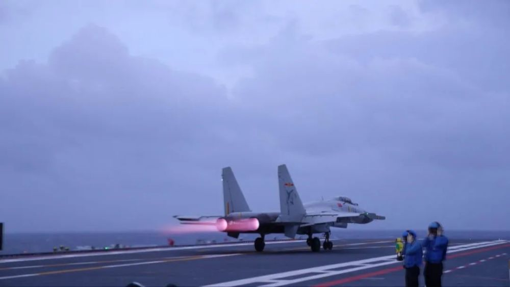
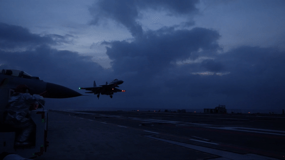
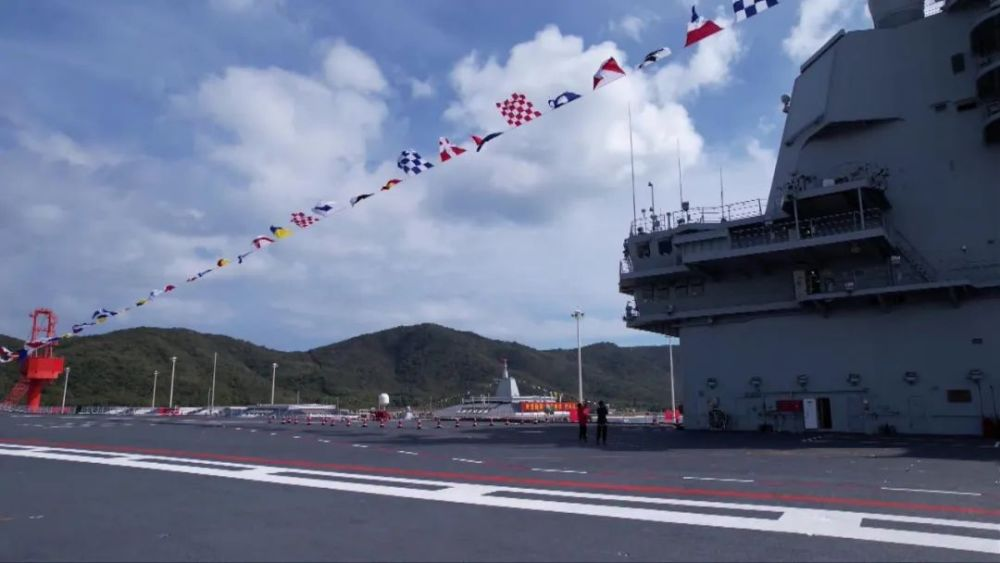
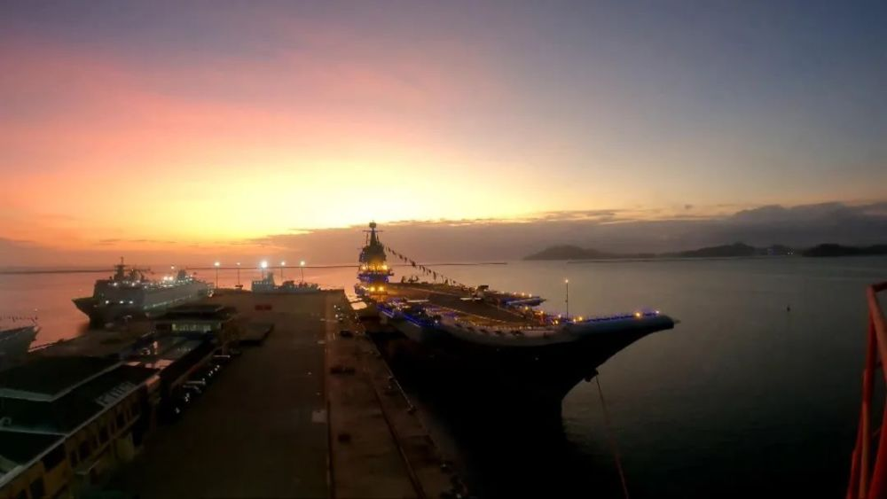
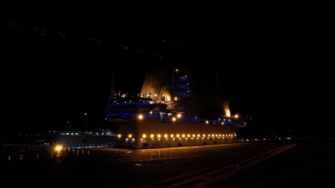
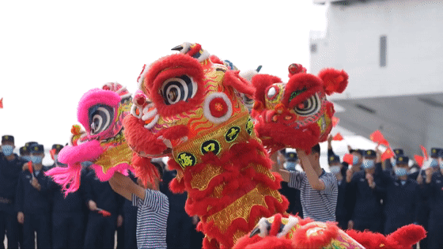
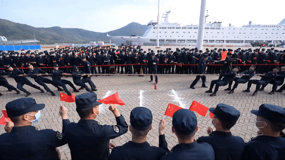

# 山东舰最新画面，难得一见！

挂满旗、亮满灯……这样的山东舰你见过吗？

今天是大年初一，在山东舰上过年是一种什么样的体验？跟总台记者登上国产航母，一起感受独属于“浪花白”的浓浓年味儿！

又一批歼-15飞行员，获夜间航母资质认证。不久前南海某海域，一场实战化背景下的演练拉开战幕。山东舰飞行甲板上多架歼-15战机整齐列阵、蓄势待发。

起飞助理员凌空一指，止动轮挡和偏流板落下。战机分波次依令起飞，奔赴指定空域。此次训练山东舰编队开展海面、空中、水下等多兵种、跨领域、高难度立体攻防作战课目专攻精练。

_训练中_

又有一批歼-15飞行员取得夜间航母资质认证，标志着航母编队体系作战能力进一步跃升。

在战位上迎接兔年，山东舰上年味十足。就在新年前，山东舰刚完成一系列训练任务，靠泊码头。这个新年战士们依然坚守战位战备、执勤、巡更、训练……丝毫不能松懈。

春节期间虽然官兵们不能回家团圆，但山东舰上的年味儿一点也不少。

为了迎接新年，山东舰挂上了满旗，通信旗从舰艏通过舰岛桅杆连接舰艉。

随着夜幕降临，山东舰又亮起了满灯。

灯火通明照亮整个航母甲板。夜色下的航母，壮观威武！

舞狮+拔河

航母上的春节这么过

大年初一一大早，在山东舰航母码头上，官兵们安排了一系列活动，将过年的气氛直接拉满。

山东舰上的这支舞狮队，叫“海魂衫舞狮队”。官兵们以这种特别的方式给大家拜年。

舞狮表演刚结束。山东舰上的拔河比赛开始了。

拔河比赛的两支参赛队伍，是通过年前层层选拔晋级的，这一场是他们的总决赛。比赛哨声吹响，现场欢呼助威声回荡。拔河比赛拉的是绳子，也拉开了新年战备训练的序幕。

**向坚守战位的官兵们道一声：**

**辛苦了！**

**感谢守护，新年快乐！**

