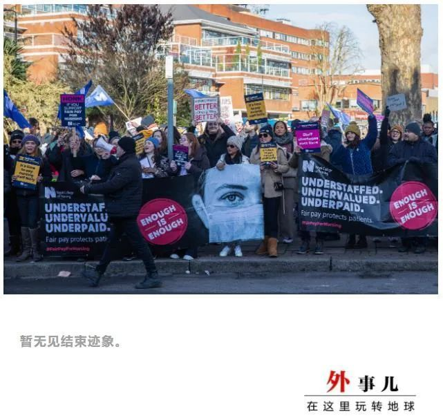
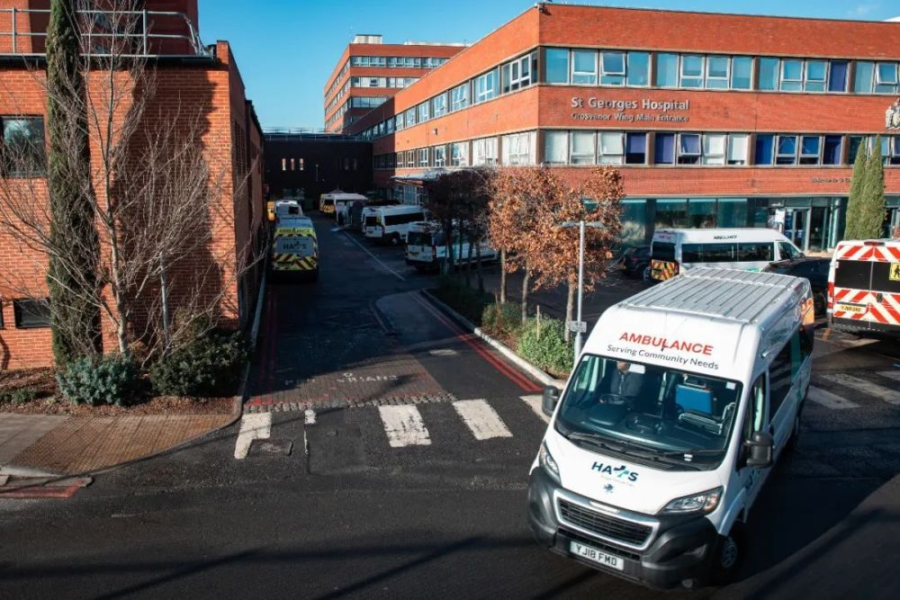

# 英国罢工潮波及救护车：医疗行业将参与其中，铁路民航邮政已陷入瘫痪

英国救护车工作人员将发起新一轮罢工。

当地时间1月20日，英国工会联合会“Unite”宣布，英国救护车护理人员、急救护理人员等将于2月到3月再次举行一系列罢工。路透社报道称，这表明英国政府与医护人员关于薪酬的争议不断加深。

过去半年以来，除了救护车工作人员，英国铁路工人、邮递员和教师等也都参与到英国多个工会发起的罢工行动中，希望借此改善工资待遇，以应对通胀高企、实际工资增长缓慢等问题。

然而，英国政府和工会为了结束罢工所进行的谈判未能达到各方满意的结果，一波接一波的罢工浪潮目前暂未表现出结束的迹象。

薪酬谈判进展缓慢

Unite表示，英国不同地方将在不同日期举行新一轮罢工。其中，英格兰的救护车工作人员将在2月6日、2月17日、2月20日、2月22日、3月6日和3月20日举行罢工。

_当地时间2023年1月19日，英国伦敦，一辆救护车离开图廷的圣乔治医院。图/视觉中国_

2月6日是最近一次即将举行罢工的日期，届时英国最大护士工会组织皇家护理学院等与医疗相关的工会也将举行罢工，这引起了英国一些民众对医疗保健服务的担忧。

Unite还表示，如果英国政府希望他们能够结束罢工行动，需要就目前的薪酬问题进行谈判。

"政府不断试图回避处理罢工事宜或者在未来一次性小幅加薪，这根本不足以解决问题。”Unite的首席官员奥内·卡萨布在当地时间1月20日的一份声明中说。

英国卫生和社会保障部在一封电子邮件声明中称，对工会打算进一步罢工的消息感到失望，并补充说此前与工会就2023至2024年期间关于薪酬问题的讨论是“建设性的”。

“救护车工作人员从事的是一份了不起的工作。令人失望的是，在英国国家医疗服务体系承受流感等带来的巨大压力之际，一些工会成员将继续进行新一轮罢工。”英国卫生和社会保障部的一位发言人说。

过去半年，英国已经遭受了一波罢工浪潮的打击。英国《独立报》称，这是英国近二三十年来最严重的一波罢工浪潮，当时，除了救护车工作人员，铁路工人、邮递员、教师等都参与其中。

通胀高企，实际工资增长缓慢

引发英国多个领域员工罢工的直接导火索是高通胀导致的生活成本飙升。英国通胀高企，食品、燃料和能源费用快速上涨，数百万家庭艰难维持生计。

英国国家统计局2023年1月18日公布的数据显示，英国通胀率仍处于两位数高位。2022年12月的通胀率为10.5%，相较于2022年11月的10.7%有所回落。2022年10月，英国通胀率创下近41年来的新高，在能源和食品价格上涨的推动下达到11.1%。

英国也面临实际工资增长缓慢的问题。2023年1月17日，英国国家统计局表示，与通胀速度相比，工资的增长速度仍然相形见绌。与2021年同期相比，2022年9月至11月的平均工资（不包括奖金）增长了6.4%。这意味着英国的薪资水平继续落后于通胀水平。

英国《卫报》援引英国工会联盟（Trades Union
Congress，简称“TUC”）的分析数据指出，2022年是近半个世纪以来实际工资增长最糟糕的一年。

2022年12月中旬，TUC通过统计英国官方数据发现，由于工资跟不上通胀速度，2022年实际工资（人们赚取的收入与其生活成本的比值）平均每月下降76英镑，公共部门的主要工作人员现在每月实际收入比一年前低180英镑，这意味着工人们的实际工资出现了自1977年以来的最大降幅，也是自二战结束有记录以来第二大的降幅。

薪资谈判陷入僵局

工人们为了争取加薪而举行的罢工行动令英国政府“头疼”。

2022年的罢工行动已导致英国铁路、民航、邮政等领域相继陷入瘫痪状态，时间进入2023年初，情况未见好转，为结束罢工而进行的谈判也陷入僵局。

起初，英国政府打算向英国议会提交反罢工法，要求一些工会成员即使在罢工期间也需要工作，旨在确保公共部门在罢工期间可以保持最低服务水平，但遭到工会的抨击。当地时间1月5日，TUC表示，政府提议的反罢工法意味着工人投票罢工可能会被迫工作，如果他们不工作，就会被解雇，“这是错误、行不通，而且几乎肯定是非法的。”

_当地时间2023年1月11日，英国英格兰陶顿镇，救护人员在陶顿救护站的警戒线附近。图/视觉中国_

当地时间1月9日，英国政府多名部长级官员分别与相关工会会面，试图结束从医疗到交通运输等各个行业的罢工浪潮。其中，交通大臣与铁路工会会面，教育大臣与教师工会会面，卫生大臣与代表救护车工作人员和护士的工会会面，但相关工会对谈判结果并不满意。

而英国政府也面临困难境地。当地时间1月20日，英国《独立报》指出，迄今为止，英国政府在谈判中坚持认为英国面临严峻的经济情况，没有钱批准罢工人员所要求的加薪。

记者 | 朱月红

编辑 | 白爽

