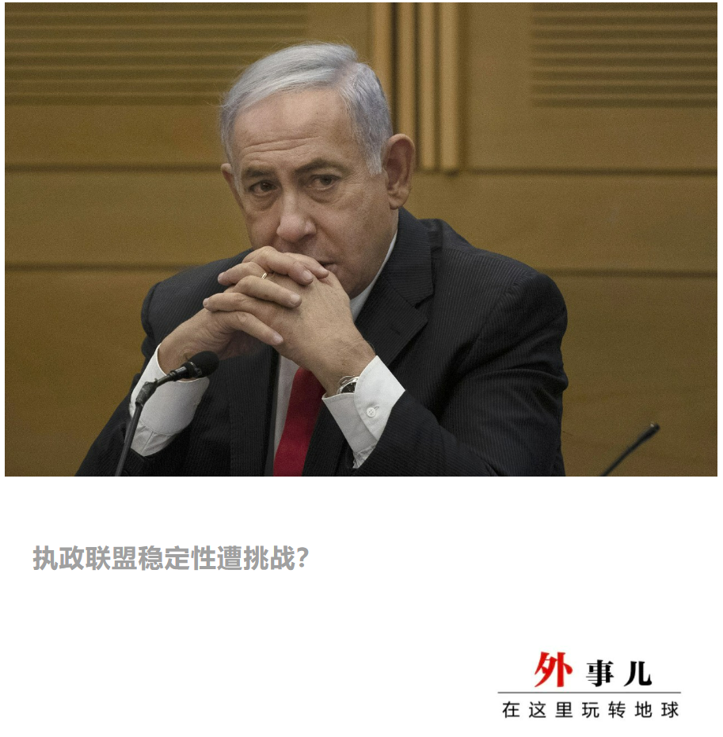
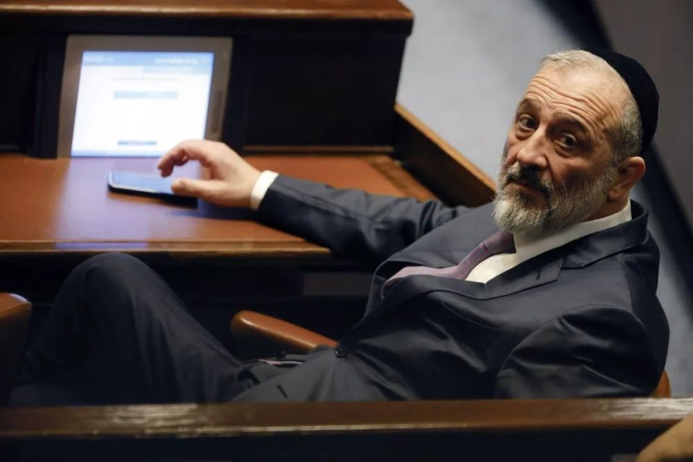

# 上台不足一月，以色列总理内塔尼亚胡“解雇”关键盟友

经过了一个多月的艰苦谈判，利库德集团领导人内塔尼亚胡终于赶在2022年的末尾，率领他的执政联盟重回以色列政治舞台。

然而，“重出江湖”的日子也并非一帆风顺。重返以色列总理之职仅有20多天的时间，内塔尼亚胡的执政联盟就遭遇了一场新的挑战。

当地时间1月22日，内塔尼亚胡遵守了以色列最高法院的一项裁决，在内阁每周会议上宣布解除内政部长兼卫生部长阿里耶·德里的职务。此前，最高法院裁决认为德里有犯罪记录，不适合担任内阁职务。

值得注意的是此解职事件发生的时机。自上台以来，内塔尼亚胡推动了一场司法权力的改革，极右翼政府希望削弱最高法院的权力，限制司法监督，并赋予政客更多权力。美联社指出，以色列陷入了一场关于司法权力的争论，而最高法院裁决解职德里的决定在某种程度上加深了各方对法院权力的分歧。

**内塔尼亚胡指责法院裁决不顾民众意愿**

当地时间1月22日，内塔尼亚胡极不情愿地把老朋友德里解了职。

德里现年63岁，在内塔尼亚胡政府中身兼内政部长与卫生部长之职，同时还是宗教政党沙斯党的领导人，是内塔尼亚胡执政联盟中的关键盟友之一。美联社指出，德里长期以来在以色列政坛扮演着“造王者”的角色，内塔尼亚胡一再依赖他领导的政党加入其政府并支持他的议程。

追根溯源，导致德里被解职的直接导火索在于最高法院的一份裁决。

当地时间1月18日，以色列最高法院裁决称，鉴于德里此前的刑事定罪，以及他在去年因税务欺诈被判刑前表示将退出公共生活，因此针对德里的内阁部长任命不能成立，要求内塔尼亚胡将其解职。

内塔尼亚胡并非不清楚德里的犯罪记录。事实上，除德里外，出任国家安全部长的极右翼政党“犹太力量党”领导人本·格维尔也有犯罪记录。美联社指出，2022年12月，执政联盟专门推动通过了一项法律，允许他们在被定罪的情况下依旧能够出任要职，为他们加入政府扫清了障碍，此举被视为将执政联盟团结起来的关键，但也引发了最高法院的质疑。

_当地时间2022年12月29日，以色列议会议员阿里耶·德里参加以色列议会特别会议。图/视觉中国_

“我怀着极其沉重与悲痛的心情免去德里的职务。”内塔尼亚胡说道，这一不幸的决定（法院裁决）忽视了民众的意愿。沙斯党更是抨击法院的裁决“武断且前所未有”。

此前，外界预计德里的解职将在一定程度上威胁到执政联盟的稳定性。在11月的议会选举中，德里领导的沙斯党赢得11席，成为议会第三大党。据彭博社报道，沙斯党在法院裁决前警告称，如果德里不在内阁之中，沙斯党将退出联合政府。

不过，就目前迹象来看，内塔尼亚胡似乎稳住了局面。据《华盛顿邮报》报道，一方面，内塔尼亚胡表示打算寻求其他合法方式让德里继续为以色列做出贡献。另一方面，短期内，内塔尼亚胡将暂时起用另一名沙斯党成员取代德里，以确保联盟在短期内保持稳定。

德里也没有彻底离开政治活动的打算。在解职后，德里发布声明表示，他对于投票给他本人及沙斯党的40万选民有着坚定的承诺，任何司法判决都不会阻止他为选民服务。他将继续领导沙斯党，并协助内塔尼亚胡政府推进包括司法改革在内的其他议程。

**以色列国内司法改革分歧加剧**

在最高法院要求内塔尼亚胡将德里解职之际，内塔尼亚胡政府正在进行一场针对司法系统的改革。

一月初，以色列司法部长亚里夫·莱文宣布了一系列司法改革措施，将允许议会以简单多数票推翻最高法院的裁决，并在任命法官方面给予政客更多权力等。

根据《今日以色列》的一项民意调查显示，35%的受访者支持内塔尼亚胡的改革法官的任命制度，45%的受访者对此表示反对，只有26%的受访者支持他的政府以一票优势推翻最高法院的某些决定。

新的司法改革还在以色列国内引发了连续三周的抗议浪潮。就在内塔尼亚胡宣布解职德里内阁职务的前一天，有超过10万人在特拉维夫市中心抗议内塔尼亚胡政府的司法改革。《华盛顿邮报》指出，内塔尼亚胡政府的司法议程两极分化，加剧了以色列民众针对国家未来发展的深刻分歧。

_当地时间2022年12月29日，以色列总理本雅明·内塔尼亚胡出席内阁会议。图/视觉中国_

以色列最高法院和左翼联盟率先反对司法改革。据美国有线电视新闻网（CNN）报道，包括以色列前总理拉皮德和以色列最高法院法官哈尤特在内的反对者认为，这将削弱各部门之间的制衡，损害司法系统的独立性。

还有部分反对者主要针对内塔尼亚胡个人。英国广播公司（BBC）指出，有批评人士认为，内塔尼亚胡正因涉嫌腐败受审，他此举改革是想要约束法官，从而避免自己入狱。

改革的支持者则认为，为了纠正最高法院和政客间的权力失衡，司法改革是必要的，可以减少未经选举产生的法官对以色列政府的影响。

正是在此背景之下，面对最高法院针对德里内阁职务不成立的决定，内塔尼亚胡是否会遵守法院裁决尤为令外界关注。《纽约时报》指出，以色列已经陷入一场围绕政府司法改革的激烈辩论之中，内塔尼亚胡解除德里职务的决定虽然避免了与司法部门的直接冲突，但在某种程度上加深了以色列国家内部对司法改革的分歧。

记者 | 栾若曦

编辑 | 唐峥

