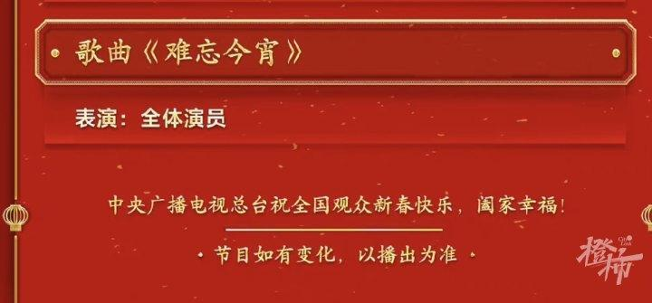
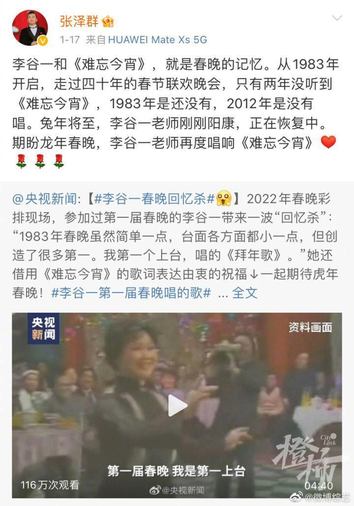

# 今年春晚没有李谷一老师！但最后一首歌还是《难忘今宵》

寅虎辞旧岁，卯兔报春来。每年除夕，中国人都有个雷打不动的传统节目，那就是坐在电视机前和家人一起看央视的春节联欢晚会。

不过，央视春晚今晚发布节目单之后，大家惊讶地发现，往年压轴领唱《难忘今宵》的李谷一，竟然没有出现在演出名单里。#今年春晚没有李谷一#的话题，迅速冲上了热搜。

此前央视主持人张泽群曾发博透露，这是因为李谷一老师刚刚阳康，尚在恢复中，“期盼龙年春晚，李谷一老师再度唱响《难忘今宵》”。

“难忘今宵，难忘今宵，不论天涯与海角，神州万里同怀抱，共祝愿祖国好，祖国好……”自春晚1983年开播以来，此前只有两年没听到李谷一唱《难忘今宵》。一次是1983年，彼时，这首歌尚未诞生；另一次是2012年，《难忘今宵》没在春晚唱响。

1983年，李谷一其实也出现在春晚舞台上，而且是第一个上台，为观众演唱了一首《拜年歌》。1984年，春晚总导演黄一鹤，觉得缺少一首与整台节目相配合的歌曲，特意找到词作家乔羽，定制了一首能够反映家人团聚、祖国大团圆、亲人间的骨肉之情和对未来的希望的歌。这便是《难忘今宵》，一唱就唱到了现在。

来源：橙柿互动

