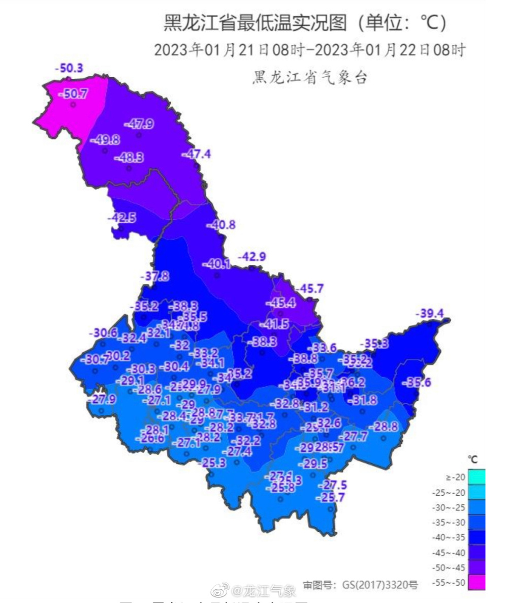

# 北极村、漠河等气象站突破历史最低气温极值 漠河气温低至-50.7℃

中央气象台1月22日10时继续发布寒潮蓝色预警，受强冷空气影响，预计，1月22日14时至1月25日08时，中东部大部地区气温下降6～10℃，华北北部、东北地区东部、江南东部等地气温下降12~14℃，局部18~20℃。上述地区先后有4～6级风，阵风7～8级，甘肃西部、内蒙古西部、宁夏等地部分地区有扬沙或浮尘。我国近海大部海域有6～8级风，阵风9~10级。过程最低气温出现在25日早上，最低气温0℃线将位于云南东部、贵州南部至华南北部一线。

预计，1月22日14时至1月24日14时，新疆北部、西北地区东部、东北地区中南部、华北、黄淮、江淮、江南北部、华南北部等地部分地区将先后降温6～8℃，内蒙古东南部、山西中北部、吉林东部、辽宁东部等地部分地区降温可达10～14℃，吉林东南部降温18~20℃。上述部分地区并伴有4～6级风，阵风7～8级。北部和东部海区有6～8级风，阵风9~10级。

另据黑龙江气象服务中心22日消息，截止到22日早上08时，北极村、漠河、呼玛、新林、呼中、塔河、嘉荫、逊克等 10
个站突破历史最低气温极值。漠河气温再次跌破-50℃，达到了-50.7℃，新年遇到极寒天气，大家一定要做好保暖工作。

（北京青年报记者 李铁柱）

