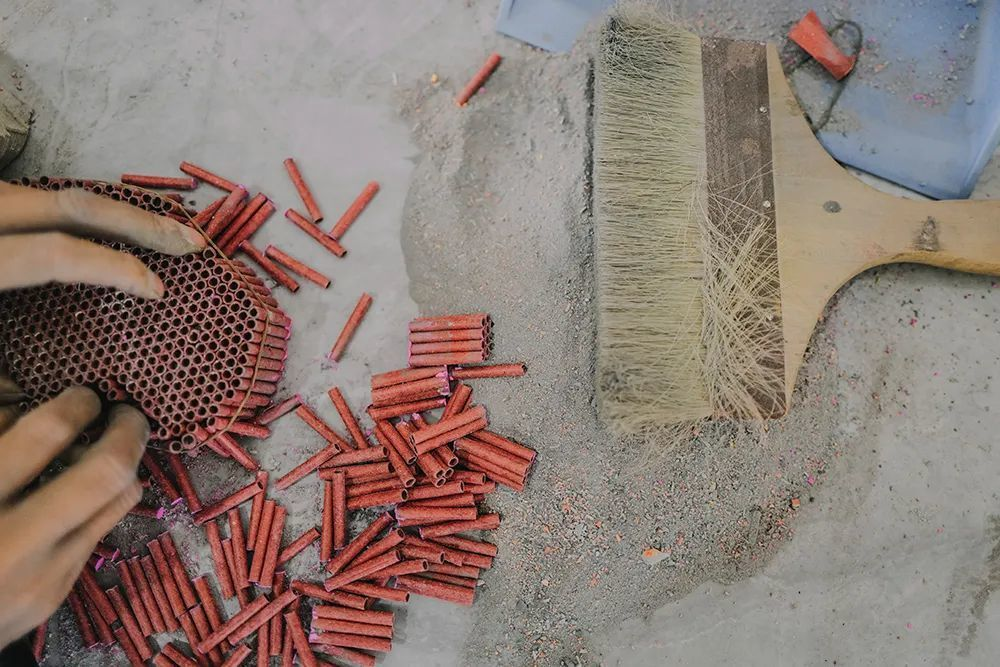
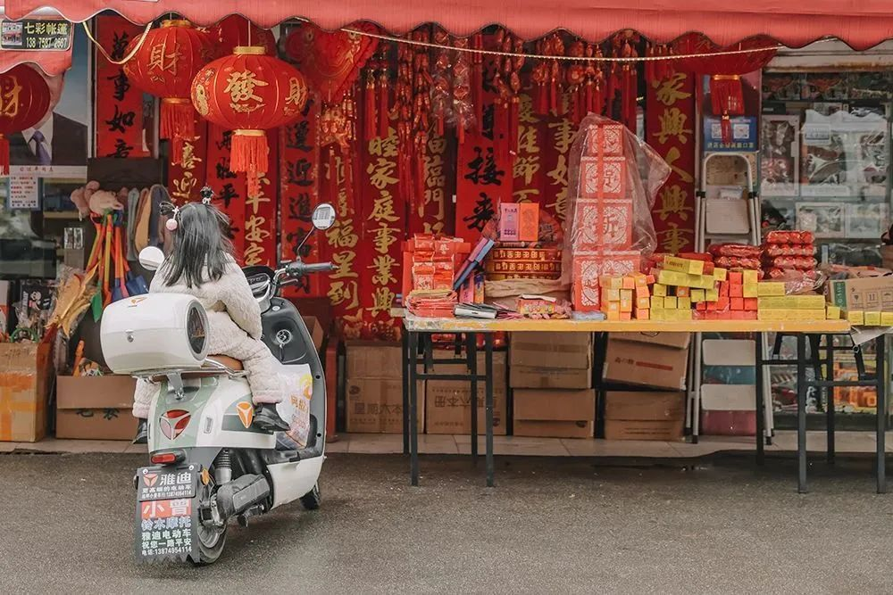

# 报复性放烟花后，“加特林”暴涨十倍，花炮之乡卖断货

**在“花炮之乡”浏阳，今年的烟花价格正在猛涨。**

**一款名叫“加特林”的网红烟花，价格从原来的20元一支，在浏阳已经上涨到60元，到了外地某些城市，甚至能卖到200元一支，直接涨了十倍。一家面临倒闭的烟花厂家，甚至因为卖“加特林”直接活了过来。**

**就连当地的烟花从业者，也完全没有预料到这种情况，说“今年是从未见过的一年”。很多人或许不知道，全国近一半的烟花，都出自湖南浏阳。而在过去疫情三年里，湖南浏阳的烟花生产遭遇了多次停工、滞销的困境，在去年年底放开之前，很多厂家都对今年的烟花销量持悲观态度。**

**但现实却是，今年过年时的烟花生意“很疯狂”。当地一名烟花从业者说：“感觉烟花成了过年必备品一样，哪怕是一个人没钱，但是他还是会舍得去买烟花，（今年）就是有这种感觉。”经过了三年漫长的抗疫之后，人们渴望去放一场烟花。**

**所以，我们在春节前夕来到浏阳，用镜头捕捉了烟花带给这座城市的转机。我们也试图弄明白，烟花是如何支撑以及拯救一座城市。在名为烟花的化学奇迹消散之前，影像和文字会记住它。**

**摄影｜** 尹夕远

**文 |** 祁佳妮

**编辑 |** 易方兴

**运营 |** 栗子

对于浏阳人杨婷来说，硫磺的气味，是她感觉最亲切的气味。

烟花生产得越旺，放得越多，这个气味就越浓。今年，硫磺的气味格外显著。对这个拥有30万烟花行业从业者的小城来说，今年颇有一些特别。在往年，浏阳大大小小的烟花厂，仓库里一般都有存货。而今年，离过年还有十多天的时候，各家的烟花仓库几乎都卖空了。

浏阳供应了全国市场几乎一半的烟花。但今年，货已经供不上了。当地一名烟花销售说，“今年就像报复性消费一样，一个客户平时可能订的是200万元的烟花，但最近突然就又增加了订单，就连经销商自己也没有预料到，有时候会追加百分之二十、三十的订单，总价一下多出几十万。”

某种意义上，这也说明，烟花作为一种传承的文化，并没有那么轻易被人们放弃。

_▲
放烟花是浏阳⼈的⽇常，村⼝⽥间，随处可⻅。_

在浏阳，放烟花的传统就从未中断过。每年大年三十，杨婷全家人都会聚在一起看春晚。主持人零点倒数时，杨婷的父母会赶紧拿上一挂鞭，跑到家门外点火放炮。噼里啪啦声中，父母赶紧合上门跑回家，这就叫“关财门”。

到了大年初一，整座城市凌晨四五点就热闹起来，赶着去财神庙上头香的人们早早放鞭出门，杨婷家也要等开门后再放一挂鞭，这才算开了财门，在爆竹声中迎来崭新的一年。

杨婷从小听着点火后的砰啪声长大。如今她自己成了家，做了母亲，将这个仪式传承了下去。记忆中最鲜明的，是爸妈的衣服上都沾染着一股微微刺鼻的、像鸡蛋放臭了似的硫磺味。

一闻到硫磺味，愉悦的心情也随之而来，“我喜欢这个味道，因为已经习惯了”。谁家搬新家了、做喜酒了、办大寿了，都要在家门口的空地上放点烟花。行人路过，是空气中的硝烟与硫磺味先钻入鼻腔，然后才看见满地红纸屑。

杨婷曾和老公去江苏打工了几年，在外地久了，听着周围有人家放鞭炮，她也要凑过去看一眼，“那可能就是我们浏阳产的鞭炮”。

毕竟她生长在“花炮之乡”浏阳。据说在中国每点燃两根花炮，就有一根产自浏阳。烟花这种劳动密集型的手工产业，为本地人提供了很多就业岗位。

_▲
杨婷在村边的⽥野间放彩烟，硫磺味道弥漫空中，成为⼀种“乡愁”。_

_▲快过年了，烟花⼚的⼯⼈拿着⼚⾥发的年货(⼀箱苹果、两挂鞭炮)准备回家。_

_▲烟花下的大瑶镇（浏阳）。_

不同于中国的多数乡镇，青壮年们要南下或者北上去谋求生存。不少像杨婷这样三四十岁的浏阳人最后还是回归了家乡，在烟花这条长长的产业链上找到自己的位置。

杨婷五年前开始在一家烟花企业做销售，这像是一种传承。父亲年轻时挖煤受了伤，干不了重活，但后来在烟花厂的食堂里做厨师，工作轻松，也能挣钱贴补家用。母亲年轻时有操作证，在药物线上组装，手工给花炮筒插引线、上胶、打胶纸。上世纪90年代，浏阳有不少制作鞭炮的家庭作坊，上小学的孩子也要学会插引这道基础工序。

杨婷说：“因为烟花，我们本地人很少外出务工。”烟花令她自豪，也给了她归属感。

_▲
制作烟花的原材料之一，纸筒。_

_▲
制作烟花的重要成分，硫磺（上）和⿊⽕药。_

_▲
烟花工厂，工人们批量生产纸筒。_

“今年是从未见过的一年。”当地专门拍摄烟花的何晴文如是评价。他很早就嗅到市场回暖的气息。

何晴文与杨婷有时候会一起去烟花厂拍短视频。印象中，烟花厂的仓库永远堆得满满当当，存货足以卖到过完年。工人们大年初八再开工，生产新一年的订单。

但在今年，离过年还有半个月，仓库里的货就搬空了，只有角落堆放着几摞纸箱，其余的烟花一箱箱被运上防爆车，开往山东、内蒙、辽宁这些“禁放令”放宽的省份。他在烟花厂上了九年班，没见过这般景象。

_▲ 烟花产业为浏阳提供了⼤量⼯作机会，他们当中有中年⼈，也有年轻⼈。_

“加特林烟花”的爆火，就是一种人们对放烟花渴望的征兆。

人们点燃绿色引线，将加特林烟花的长柄握在手中，喷口冲向天空。只需等待数秒，就能看到它接连喷射出600多发烟花吐珠，火树银花般地点亮夜空，一把烟花同样玩出了机枪的架势，也有着“向病毒开炮”的意味。

走红的还有水母烟花。何晴文曾将150个水母烟花串联在一起，码在地上，3、2、1，点火。数百只烟花如飞伞一样盘旋升空，又如海底深处发光的水母，在最高处绽放出小小一圈花瓣。

“一朵烟花在天空中是不起眼的，但当很多朵烟花一下子照亮黑黑的天空，一个刚往前走两步的人百分之百会回头。”何晴文说。

_▲ 生产车间里的孩子们。_

_▲
新年将⾄，眼看距离政府规定的药物线停产期限越来越近，⾯对依然⾼涨的市场需求，各加⼯⼚都在开⾜了马力⽣产。_

今年也是运费最高的一年。防爆车从浏阳运输一批烟花到内蒙古，去年只用1万6的运费，今年却涨到5万多，还只是单程。即便如此，十几米长的大货车仍穿梭在城镇里，满载着烟花驶过，“货车非常多，数都数不过来”。

杨婷回忆，烟花厂今年的出货量比往年减少了15%—20%，但订单量却增长了10%—15%。“近五年第一次有这么大的涨幅。”

疫情三年，烟花厂与经销商们也保守了三年。叠加多地出台的禁放政策，许多省份的经销商不敢进货，厂里的订单量一度成为负增长。她以为行业也就这样了。

直到今年年初，“烟花好像一下子就被很多人需要了，大家都在疯狂消费”。外地游客开车来当地买烟花，厂里的销量蹭蹭往上涨，需求市场忽然破开了个口子。加特林烟花也一夜之间身价猛涨，从一支20元涨到60元，有人愿意出更高价，但零售店已经没货了。说起加特林，本地人都不想玩，“不是不好玩，是太贵了”。

_▲
⼊夜的烟花⼚仓库，运输卡⻋仍旧进出不断，把各个品种的烟花运往东北、内蒙、陕⻄等地。_

_▲ 一台车牌号很吉利的小推车。_

_▲
工厂里的监控室。_

_▲
烟花⽣产是⾼⻛险⾏业，安全是每个⼯⼚需要不断提及的重中之重，⻋间外墙粉刷成不同颜⾊进⾏⻛险等级区分，每个⻋间也会严格限制进出⼈数。_

烟花的缺货其实有迹可循。今年的烟花生产周期比往年短了许多。夏天，难耐的高温让厂里工人休了三个月高温假，从七月停工到十月。到了十一月，赶上疫情封控，放开后，工人又阳了一批，产量少了很多。

杨婷感觉，但也是因为疫情，让人们对放烟花有了渴望。

“在许多人的心里，放烟花能驱散不好的东西，并且，把自己的憧憬和愿望倾注在烟花里。”杨婷说。

_▲
在浏阳，大街上哪儿都能买到烟花。_

_▲
黑暗中，烟花装箱工作仍在继续。_

_▲
芭蕾王子，一款美丽却昂贵的烟花，零售价高达600元。_

浏阳的每条街上都有烟花店，隔一千米一家店，宛如茶颜悦色在长沙街头的分布。过年前后，烟花店的存在感更强，孩子们围在店门口叽叽喳喳，在一片红红绿绿的电光花与仙女棒中挑花了眼。

跨年夜那天，听说晚上七点开始有三场烟花表演，杨婷的儿子急得不行，一听外面有了声炮响，就拉着妈妈快点出门。为了不堵车，杨婷的老公骑上摩托，老婆孩子坐身后，一家三口满城市地追着烟花跑。

一晚上，他们去长兴湖，去花炮观礼台，再去浏阳河风光桥。看完一个地方的表演紧接着去下个地方。一边骑摩托车，一边看夜空中璀璨燃烧的烟花。

杨婷最喜欢落叶烟花，打上天空，像树叶一样零落，也像瀑布洒垂下来。她毫无抵抗，一定要看着花火渐渐消失在黑夜里。不过那一晚，“到处都是烟花，礼花挤在空中，都看不太清每朵烟花的样子了”。

晚上回到家，儿子还是蹦蹦跳跳的，兴奋得睡不着觉。杨婷也很久没有这种感觉。“一天到晚很多事情，很多烦恼，但看完烟花，我也跟放空了一样。就觉得好好看，好有味啊！”

_▲
浏阳⾦刚镇，⼀场葬礼正在举⾏，村⺠点燃鞭炮开始仪式。⾦刚镇以⽣产红挂鞭炮闻名。_

_▲ ⼈们在被誉为中国花炮祖师的李畋雕像前燃放烟⽕。_

_▲
浏阳随处可⻅的烟花痕迹，市区最宽的主⼲道之⼀被命名为花炮⼤道。_

_▲
⼩河边刚刚放掉的烟花纸壳。_

_▲ 何晴文正在拍摄烟花视频。_

经历过漫长的十二月，人们在2023年终于有了释放的机会。

今年过年，浏阳女孩寻寻给自己还有弟弟妹妹买了900元的烟花。有烟花棒、地面喷花，还有不少摔炮和擦炮，往地上一扔，再捂起耳朵跑远点，听噼啪声成串作响。

她有个大家庭。外公外婆和几个舅妈都住得近，平时端个碗就能去他们家里吃饭。到了春节，外出读书的孩子们如幼鸟归巢回到家中，她要掰着两只手数数，才数出家里所有的小孩，“加上我，一共十三个”。

除夕夜，整个家族的三十多口人聚在一起。吃完年夜饭，孩子们玩狼人杀和剧本杀，大人们看春晚唠嗑，吃着炸番薯和砂糖橘。

_▲
湖南人的必备年货，熏腊肉。_

_▲
在浏阳，家家有熏腊⾁的传统，杨婷的姐姐杨柳带着孩⼦在熏腊⾁的⽕塘边烤⽕，⼩⼥⼉抱着妈妈送她的圣诞 礼物，⼀只叫“蛋仔”的⼩狗。_

_▲
浏阳的孩子从不缺烟花。_

晚上十一点多，大家点一个火锅，把熏猪脚和糟萝卜炖在一起，在腊香味中边吃边守岁。十二点一到，再结伴着出门看烟花。整座城市都欢腾起来，寻寻听着噼里啪啦不断的鞭炮声，和站在边上的家人说话，只看见她嘴巴在动，但压根听不见说了些什么。

“说起浏阳，我的耳边总是伴随着烟花声，还有空气中的硫磺味，熏猪脚的腊香味。情绪低落的时候，我只想回到那个家。回了家，吃一顿家里的饭，就会被温暖包围着。这都是我们浏阳人的乡愁。”

她知道，真正治愈她的并非烟花，而是与家人一起看烟花时的温情。

文章为每日人物原创，侵权必究。

