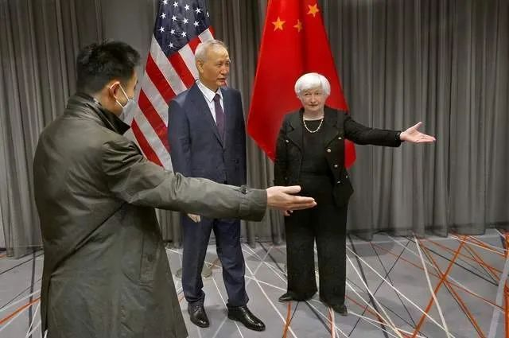
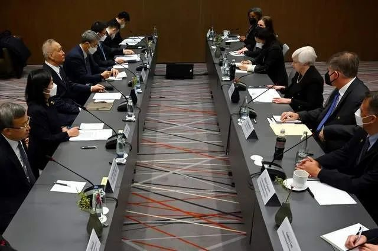
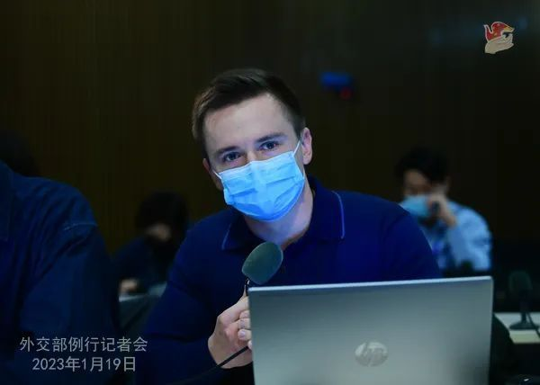
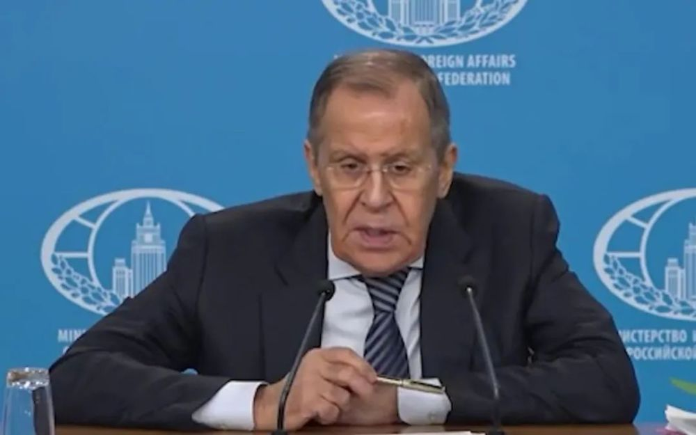

# 新春，中美、中俄怎相处？

**文 | 海上客**

兔年新春将临，中美、中俄之间，都有所互动。

从各种互动中，似乎能看出一些相处之道，也能看出未来中美、中俄双边关系的端倪。

01

中美来说，外交部例行记者会上，发言人汪文斌先是在1月17日基本证实了美国国务卿布林肯即将访华，又于第二天称，没有进一步的消息可以透露。

这究竟是怎么回事呢？

_当地时间1月18日，刘鹤与耶伦在瑞士苏黎世会晤_

**其实，在今年的达沃斯论坛举办期间，中国国务院副总理、中美全面经济对话中方牵头人刘鹤与美国财政部长耶伦当地时间1月18日在苏黎世的会晤，透露了很多信息。**

刘鹤到瑞士，是与中国代表团一起参加2023年达沃斯论坛的。可耶伦并非到瑞士参加达沃斯论坛。

这次中美关键人物之会，是美方在苏黎世“做东”。这么看来，耶伦跑到瑞士去，只为了做一件事——与刘鹤会晤。

既然见上面了，从各路媒体的报道来看，刘鹤、耶伦聊了好久——大约三个小时！直聊到耶伦快要赶不上所乘飞机，快误点了，才不得不散席。由此可以看出，中美双方还有得聊，且涉及方面、内容很是不少。当然，从刘鹤、耶伦的身份来看，中美此次主要是在经济领域有许多共同议题。至于这些共同议题是否能化作共同语言，这就要看下一步中美各个层级有哪些互动了。

总之，中美之间，特别是负责财政、经济的官员的面对面互动，总比不见面要好。

过去两年，刘鹤与耶伦当然有过沟通。据微信公众号“玉渊潭天”分析，2023年1月刘鹤、耶伦之会，是——

两人两年来的第四次沟通、

首次面对面交流，

也是2023年中美第一次当面会谈。

美方的态度不仅主动，且似乎在向其国内等宣示着什么。譬如在场的中国中央电视台记者刘春发现，美方给各路记者留出的拍摄时间较长，足足七八分钟之久。而按照惯例，此等会谈之前的记者拍摄时间大约一两分钟。

_刘鹤、耶伦会晤现场_

至于中方代表张开双臂，面带笑容，自信又开放的姿态，更是显而易见的。

海叔个人认为，其实在美方的视角来看，由中方所说出的——2023年，中国经济将恢复增长，达到正常水平，其实也是美方乐见的。

毕竟，美国是世界第一经济体，中国是世界第二经济体。且中国经济在过去不少年里几乎就是世界经济的火车头。只要中国经济保持正常增长，不仅中国经济本身获益，包括美国在内的国际社会，我看也是从中获益的。

耶伦一定也注意到了，刘鹤在达沃斯掷地有声地表示，中国不会走向计划经济，更强调会保持对外开放。

开放，当然是中美关系维系所需要的。海叔认为，这种开放的精神，不仅中国需要秉持，美国也同样需要重新举起！只有把世界经济的“蛋糕”共同做大，才有益于中美双方。当然，在中国来说，还会认为有益于人类命运共同体。不知道美方怎么看？

02

在1月19日的外交部例行记者会上，俄罗斯塔斯社记者向汪文斌提出一个问题：“俄罗斯外长表示，俄中关系正处于历史最好时期。外交部有何评论？”

_1月19日外交部例行记者会现场
图：外交部网站_

汪文斌答：“在两国元首的战略引领下，中俄走出了大国、邻国和睦相处、合作共赢的崭新道路，给两国人民带来实实在在的好处，也为推动全球治理变革发挥了重要建设性作用。”

**从汪文斌的回答可见，他既没有肯定，也没有否定塔斯社记者所提到的俄外长的判断，而是给出一个定义——“崭新道路”。**

这个崭新道路，目前看，起码有两大收益——

1.对两国人民来说，定有好处；

2.对全球治理变革有正面作用。

确实，中俄是跑不开的邻居，两国能够和睦相处，能够合作共赢，比互相勾心斗角肯定强。这一点，从1989年中苏关系正常化开始，直至如今的历史足以证明。而从全球治理的角度看，中俄合作，有时候亦有一些媒体评论是“背靠背”的关系。但又要明确——中俄之间，不结盟，不对抗，不针对第三方。这一“三不”方针，在去年王毅担任外长时就曾多次向俄罗斯外长拉夫罗夫表示过。如今，当秦刚走马上任担任中国外长以后，再次与拉夫罗夫明确之。

_拉夫罗夫 图：资料_

其实，中俄之间，同样绕不开俄乌冲突问题。那么，不妨看看秦刚再次对拉夫罗夫明确的中方的“四个应该”与“四个共同”。

早在2022年4月，中方便提出解决乌克兰危机要遵循“四个应该”，即——

应该尊重各国主权和领土完整、

应该遵守联合国宪章宗旨和原则、

应该重视各国合理安全关切、

应该支持一切有利于和平解决危机的所付出的努力。

十个月时光过去了，海叔感觉，俄方确实也该对照一下自身是否重视起中方所说的“四个应该”。

至于“四个共同”，亦即——

共同支持一切致力于和平解决乌克兰危机的努力；

共同反对使用或威胁使用核武器；

共同确保全球产供链的稳定；

共同为危机地区的平民过冬纾困。

海叔认为，俄乌危机的化解之道，真正是该在“四个应该”和“四个共同”之中寻找答案的！

_1月8日上午，一辆载有16名旅客的俄罗斯客车缓缓驶入内蒙古满洲里公路口岸客车入境通道，标志着中俄最大陆路口岸满洲里—后贝加尔斯克公路口岸恢复客运通关
图：北京日报_

03

**不得不说，二战之后，美苏“冷战”，但中国走出的是一条与众不同的道路。**
譬如与第三世界多交朋友，且中国一直认为自己也是第三世界的成员。中国一直反对的是霸权主义——无论当年的苏联还是美国，但凡有霸权行径，中国都是谴责的。但与此同时，中国也乐意在互相尊重的基础上，与美苏，包括此后的俄罗斯交朋友。

兔年新春到来之际，中美、中俄怎相处？其实很清晰——谁搞霸权主义，中国一定会表示异议。但如果有些纷争有着其自身的历史经纬和现实的大国博弈，则中国的态度一定是劝谈、劝和。而如果愿意与中国真诚合作，那就不妨坦诚相待，别总是藏着掖着……

总之，癸卯新春，还望大吉大利，希望真正迎来一个多赢的世界。

