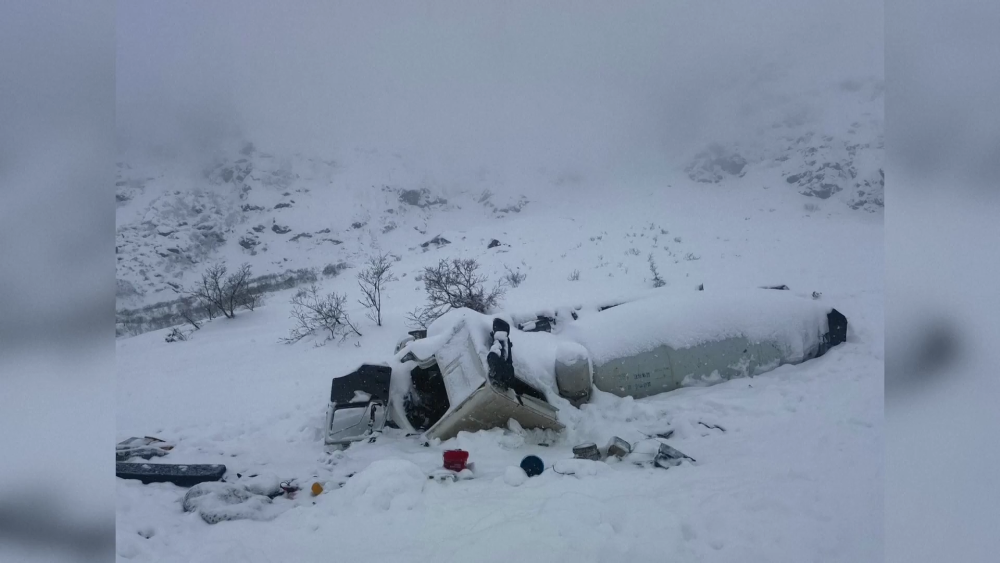
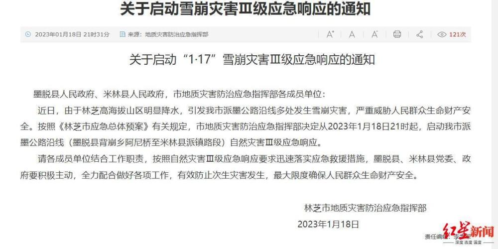
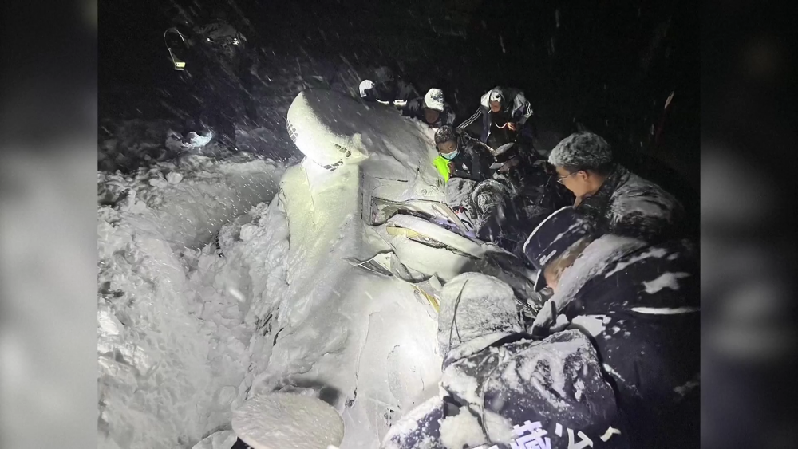

# 派墨公路雪崩为何常发？方圆数公里无人烟，有路段被称“鬼门关”

_1月18日，西藏林芝，被雪覆盖的翻车
视频截图 图据视觉中国_

红星新闻记者丨罗梦婕

责编丨邓旆光 编辑丨王禾

1月17日19时50分许，西藏林芝米林县派镇至墨脱公路多雄拉隧道出口（墨脱方向）发生雪崩，致人员和车辆被困。目前，已发现遇难者8人。据橙柿互动报道，发生雪崩的地点，方圆数公里没有人烟，当地人称“鬼门关”。

而沿线的派墨公路，三年曾多次发生雪崩。仅去年3月底的一次雪崩，就有四人同时被埋，经抢救无效身亡。

为何派墨公路容易发生雪崩？

通过查询相关资料，红星新闻记者了解到，事发地所在的多雄拉隧道是派墨公路上穿越多雄拉山的隧道，而多雄拉山口则位于喜马拉雅山脉北段主脊，海拔4200米左右，该山上终年积雪不化。

华能林芝水电工程筹建处负责人在接受采访时曾表示，派墨公路是华能集团重大援建项目，该公路施工难度大，施工时间长，主要受到汛期大雨、冬季冰雪以及塌方、泥石流、雪崩等地质灾害影响。

对于类似派墨公路这样必须穿过积雪山区的公路雪崩防治，中国科学院新疆生态与地理研究所工作人员郝建盛曾撰文表示，雪崩是山坡大量积雪为在重力驱动下倾泻而下形成的一种常见的自然现象，具有很强的突发性和破坏性，“中科院天山积雪与雪崩研究站的研究人员曾在雪深为0.8米的山坡上，人工爆破出小型雪崩。通过测算，即使是这样的小型雪崩，冲击压力也高达88.7Kpa。如果一个成年人与这个小雪崩正面相迎，就相当于在他身上压了5辆奥迪A6（约9吨）。如果不幸遭遇雪崩，需谨记被埋15分钟内是雪崩救援的黄金时间。”

_林芝市地质灾害防治应急指挥部发布雪灾应急响应通知_

**事故地点被人称为“鬼门关”**

**方圆数公里没有人烟**

墨脱，位于喜马拉雅山脉南麓，西、北、东三面被喜马拉雅山脉和岗日嘎布山阻隔，著名的雅鲁藏布大峡谷在墨脱县奔境而过。由于交通的闭塞，在很长一段时间里，全县上下需要的物资只能靠人背马驮，被称之为“高原孤岛”。

原墨脱县县长欧珠多吉曾公开表示，频发的地震、滑波、塌方、泥石流、高雨量和局部的强降雨几乎“屏风”墨脱于“孤岛”之上。截至2010年，各乡之间仅通骡马驿道，村寨之间只有羊肠小道。而进入墨脱必须要翻越海拔4000米以上的嘎隆拉、多雄拉等雪山。县城通往外界的扎墨简易道路，虽经数十年的屡屡投资、几经修建、数十人付出宝贵生命，仍需分段、分季节年勉强通行2至3个月。

公开资料显示，2009年4月，投资达9.5亿元的墨脱公路新改建工程——北起波密县扎木镇，南到墨脱县县城的扎墨公路全线开工；2013年10月31日，全长117公里、跨越6条断裂带的西藏墨脱公路建成通车，我国全面实现“县县通公路”的目标；2021年5月16日，继扎墨公路之后，第二条通往墨脱县的交通要道——西藏自治区林芝市米林县派镇至墨脱县的派墨公路全线贯通。

但特殊地理环境给当地人带来的自然灾害危险与影响仍然存在。

**据橙柿互动报道，此次发生雪崩的地点，方圆数公里没有人烟，当地人称“鬼门关”，而沿线的派墨公路，往年曾多次发生雪崩造成伤亡。**
当地一从事旅游生意的李先生称，派墨公路是在原始森林开凿的一条公路，原来有一条老公路，但比较破旧难以通行，绕路又远，就又修了这一条派墨农村公路。而这里每年三四月雪最大，“去年3月底，一次雪崩，四个人同时被埋，抢救无效身亡。”

此外，红星新闻记者查看过往报道中看到，2022年12月30日，西藏自治区公安局称，派墨公路因暴雪雪崩加之路段路面结冰暂无法通行。

_西藏林芝，救援人员在翻倒的汽车上工作
视频截图 图据视觉中国_

**海拔落差近3000米**

**派墨公路两段修了六年**

据西藏日报报道，派墨公路起于米林县派镇，至松林口采用特长隧道穿越多雄拉山体后沿多雄河展线，经汗密、老虎嘴，止于墨脱县解放大桥，全线长约66.9公里，分四段建设，工程概算总投资约20.15亿元。

华能林芝水电工程筹建处负责人在接受采访时曾表示，派墨公路沿线主要布置在无人区内，海拔落差2890多米。其中，派墨公路分四段进行建设，即第一段从米林县派镇起线，穿越多雄拉山；第二段从多雄拉隧道出口至嘎玛家；第三段从嘎玛家至阿尼桥；第四段从阿尼桥至解放桥。

该负责人称，派墨公路第一段建设为派镇至多雄拉隧道出口段，长13.615千米。该段于2014年8月29日开工建设，全长4789米的多雄拉隧道为该段的关键性工程，采用双护盾全断面硬岩掘进机（简称TBM）施工，于2017年12月24日实现隧道出口绕洞贯通，2018年底已完工。多雄拉隧道出口至嘎玛家为派墨公路建设的第二段工程，长28.785千米，于2018年11月10日开工建设。2020年8月13日该段已全线贯通。该负责人还说，派墨公路控制性工程主要包括多雄拉隧道和老虎嘴隧道。这条公路施工难度大，施工时间长，主要受到汛期大雨、冬季冰雪以及塌方、泥石流、雪崩等地质灾害影响。

_2021年5月16日，西藏墨脱，贯通后的派墨公路老虎嘴隧道部分洞段实景
图据视觉中国_

**小型雪崩撞上一个成年人**

**等于其身上压了5辆奥迪A6**

那么，什么情况下会诱发雪崩？遇到雪崩该如何救助？以及现在是否有对雪崩的防治措施？通过梳理相关资料，红星新闻记者发现，中国科学院新疆生态与地理研究所工作人员郝建盛曾撰文《雪崩时最高秒速达90米，远超四级飓风！如何自救？》里面详细阐释了许多有关雪崩的内容。

文章里称，雪崩是山坡大量积雪为在重力驱动下倾泻而形成的一种常见的自然现象，具有很强的突发性和破坏性。除了强烈的声波能够诱发雪崩之外，强降雪、温度剧增、雨夹雪、地震和风等自然现象和滑雪、登山、采矿等人类活动引起的震动或声波都能诱发一场难以估量的雪崩灾害。

根据2009—2019年亚洲山区雪崩灾害的统计，多数雪崩灾害事件是由自然因素诱发形成，其中强降雪诱发的雪崩灾害最多，其次是温度剧增诱发，自然因素能诱发多地同时出现的大规模的雪崩，杀伤范围较广。人类活动诱发的雪崩多以个体出现，但由于人处于其周围，该种雪崩往往是致命的。

文中，郝建盛说，根据目前的研究，雪崩起始于28度-50度的积雪较厚的山坡，多发生在坡度为37度的斜坡或沟槽之处。不同地区由于气候和积雪的不同，雪崩发生的高发期也有明显差异。以中国天山西部为例，雪崩主要活动于头一年的11月开始到第二年的4月份，2月底和3月初是雪崩最为活跃的时期。一般当72小时内降雪量超过20mm（新雪积累厚度超过大约32cm）时，该区域就有可能发生大规模雪崩。气温连续数日升高，平均气温在零度以上的时段雪崩也非常活跃。

此外，郝建盛还在文中说，为了研究雪崩，中科院天山积雪与雪崩研究站的研究人员曾在雪深为0.8米的山坡上，人工爆破出小型雪崩。通过测算，即使是这样的小型雪崩，冲击压力也高达88.7Kpa。“如果一个成年人与这个小雪崩正面相迎，就相当于在他身上压了5辆奥迪A6（约9吨）。因此，遭遇雪崩后，生还率很小，救援也十分困难。”

**三个方向可判断危险**

至于如何判断雪崩的危险，郝建盛在文中表示，可从天气、地形地貌和积雪三方面进行判断。即，降雪过后的晴日，温度较高的暖和之日，这都是雪崩活动最为频繁的时期，最好不要出行；关注坡度，尽量避开雪崩易发的山坡，即使是已经发生过雪崩的地方，依然会发生雪崩并容易形成雪崩槽；挖个雪坑，如果下面的雪比上面软，那就说明山坡的积雪稳定性较弱，或用手拍打，看看雪层是否容易塌陷。

**被埋15分钟是黄金救援时间**

但要是不幸遇到雪崩且正在进行雪崩搜救，郝建盛在文中表示，被埋15分钟内是雪崩救援的黄金时间。“在进行搜救时，尽量保持冷静，注意监视受难者位置，眼睛紧盯最后看到他/她的位置；观察不会再有后续雪崩风险后，再迅速展开营救，留下小部分人员继续观测，并让一个具有营救经验的人发令协调进行搜索；在事发区域周围横向搜索，用探杆探明并用雪铲挖。一旦找到遇难者，要快速将其挖出，清理他/她的呼吸气道并立即展开急救，这时体温会缓慢回升，等遇难者清醒后，再让他/她喝下热饮，恢复体温。”

**遇到雪崩该如何自救？**

郝建盛还在文中说，当雪崩迎面而来时，要迅速扔掉所有的行李，快速沿着雪崩而来的垂直方向飞奔，紧紧抱住一块石头或一棵坚固的树，保持游泳姿势游动防止被雪淹没；如果没有及时逃脱雪崩魔爪，被雪崩掩埋，要尝试保持冷静和乐观、确保呼吸顺畅、判断和调整自己所处位置方向、尝试在雪中伸出一只手。“如果看到呼出的气息，就朝它升起的方向挖；如果挣扎后仍然无法逃脱，试着伸出一只手，这可以帮助搜救人员找到你，并让空气流通，避免窒息。”

**雪崩防治有方法**

对于一些道路、能源输送管道必须穿过积雪的山区，郝建盛在文中谈到了对雪崩的防治。“我们可以基于收集雪崩区积雪和气象数据，通过数学模拟计算预警雪崩，通过提前疏散人群和关闭道路等措施，避免直接接触雪崩；其次以‘大禹治水’思想为中心，采取挡泻结合，构建排雪槽，挡雪崩格栅，防雪崩走廊，防雪崩网格等工程设施。排雪槽能不断泄流山坡积雪，进而降低大型破坏性雪崩形成的概率。挡雪格栅可以分割山坡积雪，减小积雪的相互挤压，从增加山坡积雪稳定性。山区林地生态系统也可以有效地减缓雪崩发生频率和雪崩灾害的规模。”

