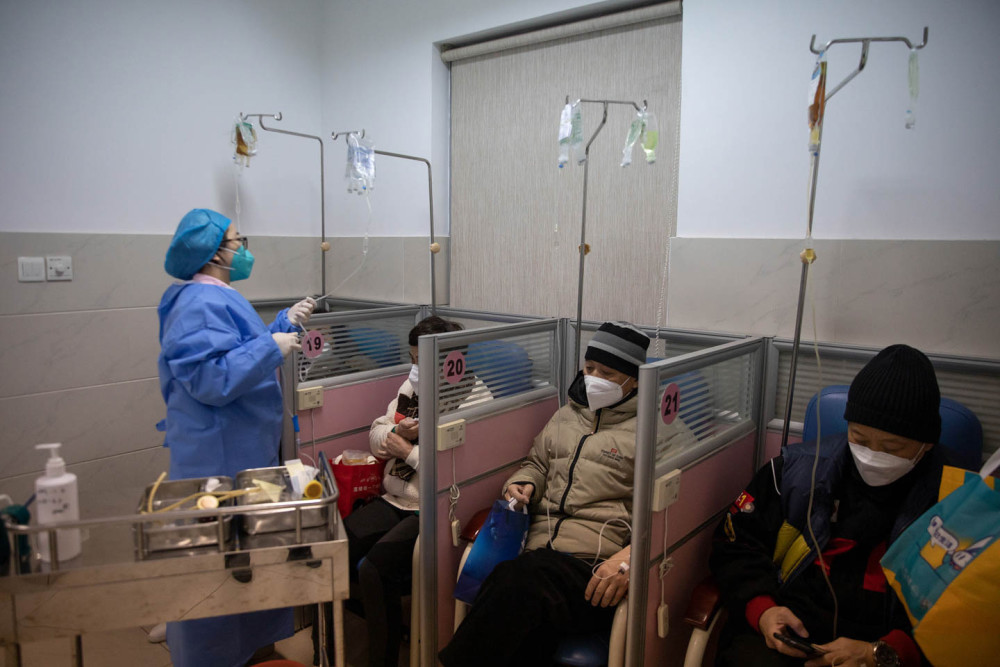
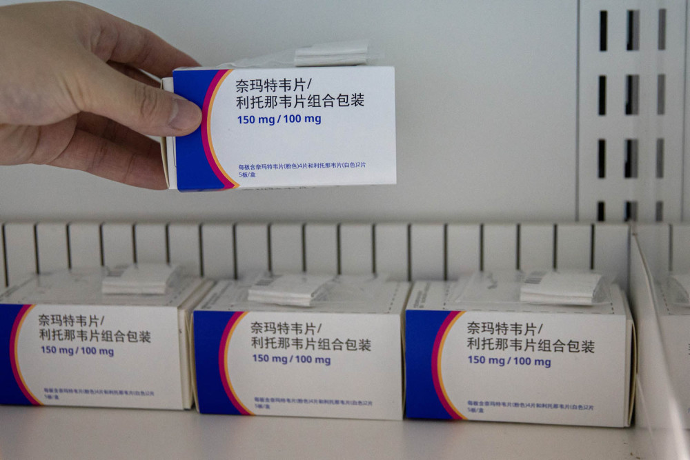
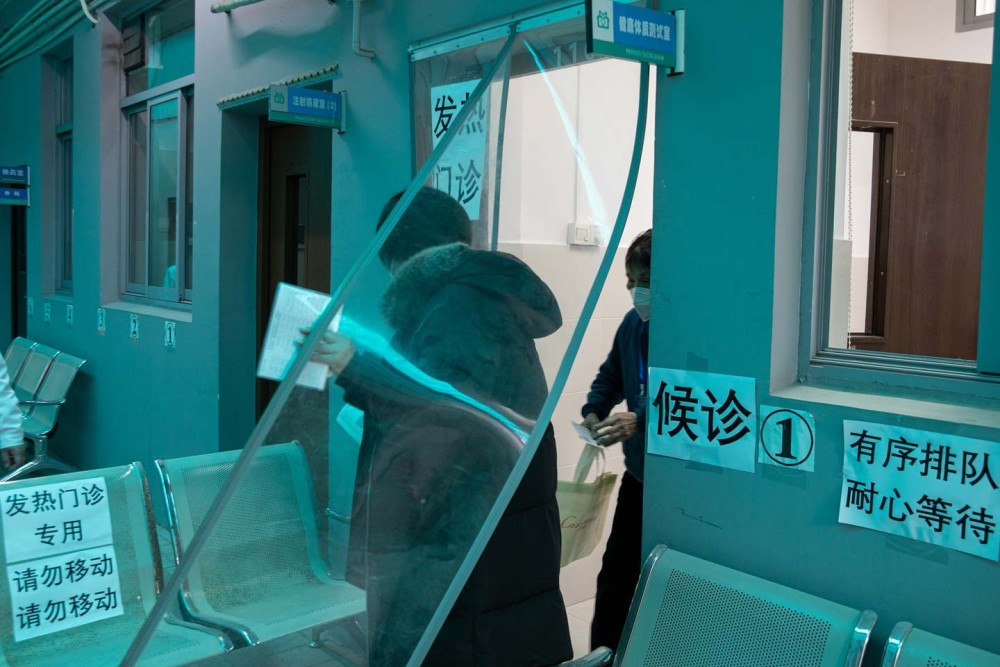

# “到了就没了”：当社区医院能开出Paxlovid后

_2023年1月5日，上海，黄浦区一家社区卫生服务中心内的输液区。（视觉中国/图）_

新冠大流行远未结束。

2023年1月14日，国务院联防联控机制新闻发布会通报，2022年12月8日-2023年1月12日，全国医疗机构累计发生在院新冠病毒感染相关死亡病例59938例，其中新冠病毒感染导致呼吸功能衰竭死亡病例5503例，基础疾病合并新冠病毒感染死亡病例54435例，死亡病例平均年龄80.3岁，65岁及以上约占90.1%，其中80岁及以上约占56.5%。

此外，根据发布会信息，2023年1月5日，在院新冠阳性重症患者数量达峰12.8万人，之后连续波动下降，到1月12日在院阳性重症患者人数回落到10.5万人，全国发热门诊高峰、急诊高峰均已过去。

第一轮感染高峰中，北京、上海等地的治疗经验表明，辉瑞研制的奈玛特韦片/利托那韦片组合包装（Paxlovid）新冠口服药为临床效果最好的药物之一，目前在中国的挂网价（相当于医院采购价）是1890元/盒。

2023年1月8日，第五轮国家医保谈判落幕，Paxlovid谈判失败，未能进入中国医保目录。不过，按照此前执行的新冠药品临时报销政策，该药仍可临时报销至2023年3月31日。

在北京和上海，Paxlovid进社区的消息从2022年12月底开始陆续传出。全网“一药难求”的新冠口服药进社区，无疑赋予了基层医疗机构比以往更显著的“首诊”任务。1月2日，国家传染病医学中心主任、复旦大学附属华山医院感染科主任张文宏在上海一场培训会上强调，社区医院是新冠患者救治的第一道关口，只要用对救治方案，绝大多数患者都能在“黄金72小时”内得到缓解，进而防止由轻症转向重症。在这72小时里，“首先应该将新冠抗病毒小分子药物用下去”。

北上广深之外，“新十条”执行的一个多月里，包括Paxlovid在内的新冠口服药几乎从未下沉至社区医院，连当地三甲医院获得的药品也很少。

而随着春节临近，这些更广阔的地区面临着新的风险。山东济南、浙江绍兴、福建漳州等地均发布提醒，称春节前后因人员密集流动而面临第二波感染小高峰。

南方周末记者走访与联系多地社区医院，试图了解在口服药依然短缺的普遍状况下，基层医疗卫生机构是否在准备扮演起“首诊”角色。

_2023年1月5日，上海，某社区卫生服务中心配备了辉瑞小分子抗病毒药物。（视觉中国/图）_

**北上广深：存药不多，开药条件各异**

公开信息显示，最早将Paxlovid下沉至各个社区医院的是上海和北京，此后跟进的有广州、深圳的部分社区医院。

社区医院的医生们如何把药开给需要用药的人？南方周末记者联系北京、上海、广州、深圳的14家社区医院，发现四地的社区医院对居民领取Paxlovid设置的限制条件各有不同，共同之处则是均存在药品紧缺。

2023年1月6日，北京市海淀区海淀镇社区卫生服务中心工作人员告诉南方周末记者，该中心有30盒左右Paxlovid，本社区65岁以上确诊新冠的居民带上核酸检测结果和患者病史到医院评估，符合开药条件可以直接拿药。

但在朝阳区香河园社区卫生服务中心，该中心不仅要求是本社区65岁以上居民，而且要求有胸部CT结果、抗原阳性证明和基础病史，才能到现场评估是否能开Paxlovid。此外，北京部分社区医院还要求提供二级以上医院出示的新冠确诊证明。

相较之下，上海的社区医院设置的条件相对宽松。如浦东新区金桥卫生服务中心，只要求本辖区内65岁以上患者带身份证、社保卡、抗原阳性结果即可，但因Paxlovid库存紧张，也不是所有人都能拿到药。1月4日，闵行区卫健委表示，全区14家社区卫生服务中心均已储备Paxlovid，后续会根据实际使用情况进行补货。

广州面临的主要问题是Paxlovid供应不足。天河区凤凰街社区卫生服务中心在1月4日发布消息称储备了Paxlovid，是公开信息中广州不多的储备了Paxlovid的社区医院。但该中心工作人员在电话中表示，当时到了少量药，当天就被买光了，“下一批什么时候到还要等通知”。

1月19日，深圳市福田区卫健局发布消息称，该区各社区健康服务中心均已配备Paxlovid，居民购买可选择医保支付或自费支付。电话咨询中，该区某社康中心工作人员表示，需要本社区患者本人到现场测抗原为阳性，在感染五天内方可开药。

除北上广深，其余省市几无Paxlovid下沉至社区医院的信息。南方周末记者咨询重庆、福建厦门、湖北武汉、四川成都、湖南长沙、山西晋城、江西上饶、浙江杭州、宁波的多家社区医院，仅杭州市余杭区仁和街道卫生服务中心、西湖区蒋村社区卫生服务中心明确表示Paxlovid有货，但存量极其紧张，“1月6日前后给社区配了一批药，每个社区是两三个人的量，而且已经卖光”。

但同样是杭州，萧山区一家社区卫生院工作人员则表示，该院从未收到过上级调拨的Paxlovid。值得注意的是，杭州数家三甲医院的医生则对南方周末记者表示，他们医院“Paxlovid不缺”。

重庆、成都、长沙的情况也值得关注。虽然三地的社区医院均无Paxlovid，但重庆市第一人民医院、成都华西医院、长沙湘雅医院工作人员均表示所在医院有药。

为什么这么紧俏？

中小城市对这款全网抢购的新冠口服药的了解，是在第一轮感染高峰之后才开始的。

2022年12月7日，国务院联防联控机制发布“新十条”，调整了防疫政策。江西上饶一家医药公司的经理回忆，此后第一轮感染高峰出现，Paxlovid开始进入中小城市卫健部门的视野，“但初期并没有在小城市引发抢购，大家还没有认识到这个药的疗效”。

“Paxlovid紧俏，是因为这个药每一批进入中国都需要经过海关和药监局审批，获批有时间周期。”这名医药公司的经理说。此外，奥密克戎会在人员流动性最强的一线城市暴发，然后扩散到二三线城市，“所以优先供给一线城市也正常”。

辉瑞在福建某地级市的代理则表示，海关、药监局的审批只是进口药进入中国的第一步，离真正到患者手里还有很长一段路要走，“简单来说，就是需要渠道，药企不能直接卖药给患者，患者必须去医院或者药店才能买到药，对药企来说这就牵涉到渠道铺设成本。”

他进一步解释，在中国，全球大型药企在北上广深的布局最早，渠道也最为成熟，“并且这些地方的患者消费能力是最强的，毕竟进口药都很贵。虽然Paxlovid在中国的挂网价格在全球看都算低的，但对大多数人来说仍然‘吃力’。”

“既然北上广深、杭州这样的大城市既有渠道，患者又有消费能力，并且Paxlovid在中国一直供不应求，那药企和他们在中国的代理，为什么要多花成本铺设三四线小城市的销售渠道？”这名代理直言，“虽然对其他地区的患者来说很残酷，但本质上这才是符合市场规律的。想开药，去大医院。”

Paxlovid开始紧俏之后，他也收到一些医院的求助，希望他能协调供药，“有大型三甲医院的领导找过来，说‘这个药的事情你帮帮我们医院，以后你有新业务，咱们都能谈’。”

一位参加过医保谈判的专家在接受媒体采访时则解释，上海老年群体超过30%，本身有非常大的现实需求，另外，上海的医保盈余排在全国前列，有足够的资本可以购买，该市社区医生水平也比其他地方更高，可以在社区内开药。

在一药难求的大环境下，江西省某地级市一家二级医院在2022年12月下旬幸运地分配到5盒，售价1890，且该省医保不报销。

但该院住院部一位医生透露，“到了以后就没了。”

_2023年1月5日，上海，黄浦区一家社区卫生服务中心内的发热门诊。（视觉中国/图）_

**中小城市：社区医院仍以疫苗接种为主**

一线城市之外，更多的社区医院延续着过去三年的一项主要职能——疫苗接种。

1月中旬，南方周末记者前往江西省上饶市、广东省汕头市的8家社区医院、乡镇卫生院。这些基层医院均无进口或国产新冠口服药，但多数社区医院备有常用退烧药及其他抗病毒药物。也有社区医院推荐以中药治疗为主。

在上饶市，南方周末记者以某小区为圆心，在半径7公里内随机选择了四家社区医院。

上饶市信州区东市街道社区卫生服务中心设了一个临时搭建的棚子作为发热诊室，棚内放有八瓶布洛芬片、一盒抗原试剂、一个体温计和一本门诊登记簿。

登记簿信息显示，从2022年12月9日到24日，有9位65周岁以上老人登记信息领取了药品。导诊台的护士表示，这里不看病、不输液，主要负责接种疫苗。

五六分钟后，物资发放负责人来到了发热诊室。他表示自己只负责发物资，有症状建议去附近医院就诊。至于常用药物，他表示“目前布洛芬量有限，也不提供免费抗原了”。

根据2021年3月公布的《信州区医保定点医药机构名单》，该区共设有26个社区卫生服务中心（站），5个乡镇卫生院。据国务院第七次人口普查数据，信州区总常住人口为545134人，这意味着信州区每家社区卫生服务中心（站）和乡镇卫生院平均要服务17584位居民。

在北门街道社区卫生服务中心，一名带两周岁的女儿来接种疫苗的父亲说，他们家从2022年12月中旬一家四口先后感染新冠。他和妻子每天在电商平台蹲点抢连花清瘟胶囊和布洛芬，跑附近药房问，“也没想到来社区医院”。

伴随第一波感染高峰出现的大量科普信息，同样受限于客观条件，难以下沉到中小城市。

上饶市广信区罗桥街道卫生院距离县城驾车十余分钟。该院医生表示，如果实在不舒服可以来输液，因为不确定具体感染程度，一般都会打抗病毒药和消炎药。“这里条件也就这样，还是更建议先去医院拍片，如果有肺部感染，可以吃点像阿莫西林之类的消炎药。”

距广信区车程约半小时的清水乡卫生院在2022年12月中下旬承担了较大的新冠接诊压力。一位老医生表示，当时就诊的患者数量很多，“我们只能拍普通的胸片，类似白肺这种专业级别的拍不出来”。针对高风险人群的治疗方案，该院一位专科医生同样表示，“输液会好得快一点，补液一般是打激素、抗生素、维生素B6这些。”关于口服药，他说，“辉瑞和阿兹夫定？我们怎么可能会有？”

此外，在广东汕头市小公园街道社区卫生服务中心，医生强烈建议南方周末记者服用中药治疗新冠。

在这些社区医院、乡镇卫生院，一个普遍存在的问题是医护资源紧张、应对新冠的专业设备缺乏。部分社区医院仅有一个全科诊室，且都没有配备血氧监测设备、输氧设备，而在第一轮感染高峰中，这些设备已经被证明具有重要作用。

**“不能‘摆烂’‘躺平’”**

“强求社区卫生院具备接诊新冠患者的能力，对社区医院是不公平的，也不符合国家医疗体系建设对基层卫生医疗机构的定位。”福建某地级市卫健部门一位不愿具名的干部表示，“但也绝不是说社区医院就可以‘摆烂’‘躺平’。”

他解释，第一轮感染高峰严重挤兑了二级、三级医院的医疗资源，除北上广深外，基层医疗卫生机构几乎全线失守。“分级诊疗制度形同虚设，患者全部往三甲医院跑，连二级医院都不愿意去，教训不可谓不深刻。但是，根据目前的情况，面对春节前后可能存在的群体感染风险，社区医院依然几乎没有任何针对性准备。”

2015年9月8日，国务院办公厅发布了《关于推进分级诊疗制度建设的指导意见》，分级诊疗制度内涵即基层首诊、双向转诊、急慢分治、上下联动。基层首诊，即有就医需求，可以首先在就近的基层医疗卫生机构进行初诊。值得注意的是，国家对基层首诊的政策是坚持群众自愿原则。

“国家对社区医院的定位是既要做基本医疗服务又要做公共卫生服务，它是特殊的医疗机构。”国家卫健委下属机构一位要求匿名的学者对南方周末记者表示，“目前看来，社区医院并不能满足居民日常就诊的需求。”

他分析，一方面是因为社区医院的资源配置相对较弱，另一方面则是运行机制不到位，“2010年之后，政府财政把基层医疗卫生机构负担起来，缺乏激励机制，按照收支两条线，干多干少是一样的。”此外，疫情三年，社区医院主要做公共卫生服务，如核酸采集，相应就缺少做公共医疗的时间。

华中科技大学公共卫生学院教授吴志刚也为社区医院“喊冤”。虽然他也遇到过去社区医院看病却无药可开的情况，但他指出，“新十条”发布之后，不仅社区医院没有准备好，三甲医院也没有准备好，“还有药物，在区域间分配不均的情况，也是一个全国性的普遍问题”。

但大医院在资源协调、人才储备方面的优势，使得它们能迅速调配到临床急需药物和设备，医生也能跨科室接诊，因而迅速成为第一轮感染高峰中的绝对诊疗主力。相较之下，社区医院迟迟不见改变。

“问题在于医疗改革不同于中国以往所有的改革，以往的改革多数都是增量改革，医疗改革是存量，是要触动三级医院的。”北京大学医学人文学院教授王岳说，即便没有疫情冲击，分级诊疗制度也只在福建三明等进行了彻底医改的部分地区真正实行，一个重要原因就是三明等地实行医生年薪制，薪酬不再与接诊量、开药量挂钩。

这些因素都最终造成“大家都涌向了三级医院，造成看病难问题”，王岳说。

2023年1月8日起，国家卫健委对新型冠状病毒感染实施“乙类乙管”。“社区医院应该大有用武之地了，关键就是它们要提前准备好。”吴志刚说，需要提前准备的包括治疗方案、设备和药物，“在这种时候，上级医院一定要派出医疗人员进驻社区医院，以分流上级医院的患者人群”。

南方周末记者 翟星理 南方周末实习生 周雨睛 陈悦琳 邓林

