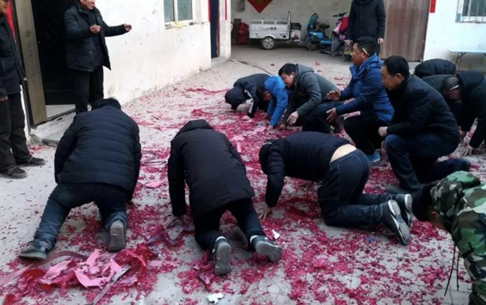

# 为何拜年反成一种负担？“我们熟，但无话可说”

刘升

【导读】过年、拜年是中国人最重要的文化习俗，但过去十多年来，很多人都感慨“没有年味儿”。
**本文分析了近年出现的某种心态：害怕拜年、严格控制时间“走马观花”式拜年、宁愿加班或出去旅游，也不愿拜年。“坐十分钟就走”对拜年人和被拜年的长辈来说，都成了相顾无言的“默契”。**

作者认为，这种急匆匆的拜年方式不仅发生在年轻人身上，也悄悄影响着长辈。 **随着经济差别越来越大，家庭生活差异也在变大，**
尤其是城乡之间，条件好的和条件差的都不愿意谈。 **另一方面，家庭的事情开始变成“别人家的事情**
”，变成了每个人的私事，于是，家庭之间的事情也变得不太好聊天，聊得太深就显得有些窥探别人隐私的目的。
**于是，“找话说”就成为拜年中的真问题，所有的话题都只能泛泛而谈。**
为了避免无言的尴尬，棋牌麻将这些娱乐方式反而迅速流行，正如网上流行的段子，打的不是牌，而是时间。其实质，就是通过打牌、打麻将等方式来消耗拜年的时间。

而这一切，都与社会分层和分工的出现息息相关。随着人们的异质性增加，人们也越来越个体化，先天的亲戚之间也因经济、地位、工作等差别的不断增加而从“亲密关系”走向“半亲密关系”，以至于出现了“我们很熟，但我们无话可说”的情况。而这种心态又将如何影响中国人的家庭关系，值得注意。

**本文转自“新乡土”，原题为《为什么拜年成了一种负担？》，** 特此编发，供读者参考。

**为什么拜年成了一种负担？**

**▍“缺席”的堂妹**

除夕之后，就是拜年。

我的家乡是鲁东南的一个小村庄， **按照家乡习俗，大年初一主要是给同一个房头的长辈拜年，毕竟，这些都是“自家人”**
，在我的家乡，虽然房头概念已经模糊，但多年来人们都还是延续着传统的过年风俗：只要父母还在世，除夕夜大多是要和父母一起过，以突出阖家团圆的气氛，之后，
**我们这些晚辈就会在大年初一按照长幼有序的原则逐一到同一房头的长辈家中拜年。**

但今年，二叔叔家的堂妹却没有参与初一的拜年活动。二叔叔夫妻两人很多年前已在市区安家，但由于其父母亲属仍住在村里，所以他们每年都要回村里过年，并要等给所有亲戚拜年结束之后才返回市区家中。他们两人有一个正读高二的独生女，往常每年也都要跟着他们回村过年和拜年。
**但今年，他们的独生女却只在除夕夜吃过年夜饭，在没有给村里的长辈亲戚拜年的情况下，在大年初一早上就已从村里返回市区。**
对此，二叔叔夫妻两人在初一到我家拜年的时候很无奈的表示，他们女儿是回市区“上班”了。
**原来，我这个堂妹觉得拜年很无聊，于是就利用春节期间在市区超市找了一个给人家促销饮料的工作机会，据说一天能赚200元，从大年初一工作到大年初七。**
因此，堂妹在大年初一一大早就返回市区“上班”，自然，整个拜年期间，我们的所有亲属都没能见到我这个小堂妹，
**这也就意味着，从去年拜完年到明年拜年期间的差不多两年时间，我们几乎都不会见到我这个小堂妹。**

这让我回想起二十多年前，我的大爷一家人曾在东北打工，但每到过年，他们一家都要带着子女回山东老家过年。那个时候坐不起飞机，只能坐火车，但火车也没有动车，更没有高铁，只有普普通通的绿皮火车，
**从遥远的黑龙江回村一次要好几天的路程，而且火车票还很难买，据说大爷每次都要排队很久才能买到票。有时候实在买不到，就是找人托关系或者多花钱、甚至于买站票都要回家过年。**

而现在，从市区到村里，不足一小时的车程，堂妹却没有选择留在家里拜年，我想，堂妹并不仅仅是因为那一天200元的“工作”才不参与拜年，
**只是对她而言，或许“工作”比拜年更有意义。**

**▍“未能成行”的旅游和“补缺”的看电影**

实际上，不仅仅是堂妹的“缺席”， **即便是全程参与了拜年的我们，也只能说是身体上参与拜年的同时，在思想上也大多开了“小差”。**

本来今年过年期间，哥哥和嫂子也打算利用春节假期外出旅游，但在家里父母的反复劝阻之下，他们最终被迫修改了出游时间，
**因为在我农村的父母看来，春节期间外出旅游还是显得不合适，**
毕竟，年后还要去给亲属拜年，在传统的农村地区，因为外出旅游而不去给家里长辈拜年的理由似乎还是说不过去。但在哥哥和嫂子看来，首先，拜年并不是那么重要，
**其次，拜年作为一个形式，也并不需要七天那么长时间，** 因此，利用难得的春节七天时间来拜年显然有些浪费，不如趁这个时间出去给自己旅旅游。

虽然哥哥和嫂子的旅游计划在父母的劝阻之下未能成行，但我们的拜年过程却也并没有显得更加丰富。大年初一，按照家乡的拜年习俗和我们的拜年习惯，我和哥哥、嫂子作为家中小辈一起到住的相对较近的五个本家拜年，
**虽然是上午10多点才出门去拜年，但因为在每家停留的时间都非常短**
，所在纵然是最后在二奶奶家和几个亲戚吃了午饭，但由于大家缺少共同话题，都不知道聊什么，又因为哥哥开车，饭桌上也没喝酒，
**这样，大年初一的拜年过程就变得非常快**
。且为了避免逗留时间过长而相对无言的尴尬，我，哥哥，嫂子三个人在吃完午饭之后就赶快找了一个借口离开，至此，大年初一的拜年任务完成。
**但出来之后才发现，此时才仅仅是下午两点多一点，回家显然时间太早**
，且因为当天拜年工作已经全部完成，所以回家也是无事可做，于是，三人一合计，临时决定去看电影，于是驱车直奔电影院，到了电影院却发现，虽然是大年初一，但选择看电影的人还真的非常多，以至于买电影票都要排队，
**看来，在这个本属于拜年的日子里，有闲暇时间的人还比较多。**

实际上，无论是哥哥“未能成行”的旅游计划还是我们在拜年间隙临时决定的看电影，都是在从传统的拜年活动中抽出的时间，
**也就是说，我们将拜年的时间挪到了这些娱乐活动中。**
我想，这也可以从一个侧面理解为什么近年来我国的旅游市场和电影市场如此火爆。据报道，2016年我国的电影市场和旅游市场都取得大丰收，其中，春节“7天时间，全国各地影院大约输出了34亿票房，比去年同期增幅甚至达到了75%。”而同样，2016年“今年春节假日期间，全国共接待游客3.02亿人次，比上年同期增长15.6%，实现旅游收入3651亿元。”
**在这两个看似喜人的数据背后，不知道有多少是像我们这种，是通过挪用拜年时间来进行的这些活动。**

**▍“控制时间”的集中拜年**

拜年作为一种传统民俗，是过年必不可少的内容，但现在，由于缺少共同语言，以至于拜年正在变成一种负担和任务，而为了较少痛苦的完成这个任务，“快”就成为了拜年的重要策略。
**今年过年，为了尽快完成拜年任务，我们也是“集中”拜年，突出“快”字，**
其中，大年初一走了五家，大年初二又走了五家，大年初三走了四家，至此，用了三天时间，新年拜年任务算是完成。
**为了能够在短时间内完成如此紧凑的行程，严格控制时间就成为拜年的重要内容。**
通常，拜年时间大多选择在上午，除了要在最后一家亲戚家吃午饭外，剩下的几家通常都是坐坐就走，因此预留的时间一般不会太多，过去那种去一个亲戚家就是一天的拜年方式显然不再适用，为了控制时间，在去亲戚家拜年之前，大家都会约定好时间，
**如果没有安排吃午饭，哥哥一般都会在进门之前就和我约定“十分钟”或者“半小时”，而我自然也非常明白，这个“十分钟”或者“半小时”的意思就是进去坐十分钟或者半小时的时间就要走，**
到时候大家就需要做好配合，如一起起身，找个理由离开等，实际上亲属也早已有大家不会久坐的准备，所以也都不会过多挽留。正是通过这样严格控制时间的拜年策略，在三天时间，完成了以前大约一周的拜年任务量，而虽然说现在拜年用了三天时间，但
**如果严格计算，就会发现，真正的拜年时间真的没有那么多，如，拜年过程中，为了避免没有话题的尴尬，晚去早走成为控制时间的策略之一，通常都是上午10点左右出门，下午3-4点左右回家**
。这样，严格计算起来，去14家长辈家中拜年，即便加上中间吃饭时间，可能也就15个小时左右，平均起来，加上路上时间，每个长辈家中也才能分到一个小时左右。可见，拜年过程之高效。

记得过去，家里还没有汽车，需要开摩托车去拜年，因此，为了拜年，早上要提前出发，带的东西虽然不多，但在每一家停留的时间都会相对较长，大人忙着聊天，孩子也就成群结伙的跑出去玩。现在，家家都有了车，出行方便了很多，但不知不觉中，拜年串门的动力也少了很多。现在拜年，大车小车，大包小包，带的东西越来越多，但人们能聊的话题和停留时间却越来越少。
**实际上，约定“十分钟”或者“半小时”的拜年时间并不是因为拜年时间太少，反而是担心预留时间太多而不知道时间怎么用，因为即便是亲戚，能够聊天的内容也并不多，所以，为了避免相对无言的尴尬，最好的方式莫过于在出现无话可说的尴尬之前离场，**
于是，严格控制拜年时间就显得非常必要。过去拜年，是拜年聊天的同时顺便吃个饭，现在，即便是在安排了吃饭的亲戚家，也只是吃饭的同时顺便聊聊天。这种不同的结果就是，以前正月里知道要拜年，所以总是提前出发，可以到亲戚家多坐会，多聊聊天，而现在是上午10点多才出门，到亲戚家拜年也就是口头寒暄几句，如果没有安排吃饭，通常都是将东西送到之后就走，甚至连坐都不坐，
**甚至从进门到出门可以在几分钟内完成，高效的同时也显得拜年非常匆忙，拜年也就变成了蜻蜓点水式的“到此一游”。**

**▍走向新形式的人际关系**

我想，在堂妹看来，或许并不是每天赚那200元钱的“工作”比拜年更重要；对我们来说，也并不是说拜年期间的那个电影、旅游或者其他娱乐本身比拜年更有意义。
**无论是堂妹选择直接不参与拜年还是我们那种匆匆忙忙“到此一游”式的集中拜年，只是说，大家只不过是因为很难找到拜年的意义，所以需要找一种替代方式来挥霍时间而已。**
而这种急匆匆的拜年方式和对拜年过程的看淡，在我的家乡正在成为常态。这种变化不仅仅是年轻人，即便是长辈之间，互相之间也已经很少出现那种有说不完话的场面，更多的是寒暄之后的沉默。因为缺少共同语言，拜年已经很难称得上是一个值得期待的事情，更像是变成了一个不得不应付的任务和一种变相的负担，作为一种传统的习俗，不去拜年似乎说不过去，但去了又往往无话可说，为了避免尴尬，算着时间就成为最好的方式。即便如此，当拜年的聊天内容没有了，形式也就随之不断简化。

固然，这其中有一些不愿意坐下来聊天的情况，但更多情况似乎是，人们因为找不到共同话题而没办法坐下来聊天。聊工作？从大的方面而言，今年还是在重复去年的工作，不用聊也大体知道彼此在做什么，
**而如果聊的太具体，一是不关心，二是听不懂，职业的差异越来越大，在银行工作的堂哥与从事汽修的堂弟之间虽然年龄相差不大，但因为工作差别太大，以至于双方也很难在工作中找到共同语言，**
更不要说与在家务农的姨父、在工厂生产线上班的表哥等人能够有共同话题；聊生活？
**社会分层的形成和隐私意识的崛起让很多话题已经难以继续。一方面，不好谈，随着家庭差别越来越大，家庭生活有了非常大的区别，尤其是城乡之间，条件好的和条件差的都不愿意谈，**
因为谈不到一起去。已经处于社会中上阶层的大姐一家也难以与在为生存奋斗的表哥一家找到太多共同语言，即使是他们年龄相仿的孩子，当在农村长大的表哥家的孩子在满大街放鞭炮的时候，从小在城里长大的大姐家的孩子显然更愿意自己一个人在家里玩IPad。
**另一方面，不愿意谈，家庭的事情开始变成“别人家的事情”，变成了每个人的私事，于是，家庭之间的事情也变得不太好聊天，聊得太深就显得有些窥探别人隐私的目的。**
这样，“找话说”就成为拜年中的真问题，因为亲戚彼此间的共同话题越来越少，所有的话题也都只能泛泛而谈，饭桌上、酒桌上出现无话可说的尴尬场面反而成了常有的情况，为此，近年来，每到年关，网络上都会出现各种应对拜年聊天的“春节应对攻略”，如学生版本的：

“叔叔阿姨好.....还没毕业.....在XX大学念书.....是学XXX的.....对，就是那个专业.....基本能适应.....饭菜还可以.....一月初就放假了，二月末回学校.....学习挺好.....对象？我还小，我先进屋了.....过年钱？不要不要.....”，

而工作的人的版本包括：

“嗯没怎么长变.....在xxx上班.....工资不高.....工作忙，还没谈朋友.....正准备要孩子.....我先去帮忙了等等”

这些都被戏称为“春节必背句型”。实际上，不仅仅是代际之间存在这种思想观念的冲突；同龄人之间同样存在各种冲突，即便是我这个常年在外读书的人，回村之后，对于村里那些和我同龄的小伙伴而言，大家年龄虽然相仿，但生活和工作差距太大，他们无论是从事汽修、养殖、建筑还是其他工作，对我而言，他们的具体工作似乎都离我很远，而他们的生活，和我这样一个在校生也已经基本没有交集，我虽然努力从他们的工作和生活中寻找大家共同关心的话题，但不可避免的，大家能够共同参与的聊天内容也变得非常少。加上现代通讯方式的发展，让拜年过程中已经很难有什么新鲜事可以拿出来聊天，于是，见面“聊什么”就成了大家非常头疼的事情。大家对串亲戚拜年的期待少了，也就自然变得不那么热心。因此，为了避免这种无话可说的尴尬局面，大家只有缩短拜年的逗留时间，于是，拜年就显得非常有效率，一天都几家都成为普遍现象。

**“酒逢知己千杯少，话不投机半句多”。而当拜年少了共同语言，剩下的也就只是吃顿饭的形式**
，为了避免“沉默无语”的尴尬境地，要么就是尽快离场，于是，出去旅游、看电影等新的娱乐方式就成为度过离场后剩余时间的重要方式；要么就是换一种大家都能够参与的方式，比如，打牌，麻将甚至于赌博，这主要是在饭前饭后，一方面，来宾此时立刻离场显得不合适，另一方面，主客相互之间又找不到合适的聊天主体情况下，为了避免无言的尴尬，棋牌麻将这些不需要太多共同语言，容易操作，能够做到全民参与，带有一定娱乐性，且非常容易消耗时间的娱乐方式在拜年这个缺少共同话题又不得不参与的活动中就变得不可或缺。在我的家乡，最近十多年来，麻将等娱乐方式从无到有，并且迅速发展，且过年往往成为人们打麻将的重要时间。
**实际上，固然有很多人是打算通过麻将的方式来赚钱，但也有很多人是通过棋牌、麻将等娱乐方式来缓解无言的尴尬。** 此时，对大家而言，打牌本身并不是目的，
**正如网上流行的段子，打的不是牌，而是时间！其实质，就是通过打牌、打麻将等方式来“浪费”掉拜年的时间。**

过去，拜年作为维系亲属之间情感的重要纽带，是过年的重要内容，人们自然非常重视，年前就会将屋子打扫干净，准备好各种美食，自己也穿戴整齐，做足各方面准备以迎接各方亲属的拜年，而随着社会从传统农业社会走向现代工商业社会，社会分工走向多样化，人们的社会流动加快，社会专业化也日趋增强，社会分层和城乡差距出现，
**在这个过程中，人们的异质性增加，人们也越来越个体化，在农村由“熟人社会”走向“半熟人社会”的同时，先天的亲戚之间也因经济、地位、工作等差别的不断增加而从“亲密关系”走向“半亲密关系”**
，随着亲戚之间同质性的减少，彼此之间所能提供的互助也变得越来越少，亲属之间的互助网络变得越来越松散，异质性的增加带来了越来越大的差异性，工作、生活、兴趣等方面的差别越来越大，甚至于变得难以有效对话，以至于，出现了“我们很熟，但我们无话可说”的情况，于是，面对拜年，越来越多人感觉“心累”，通过旅游、看电影、棋牌等方式逃避拜年的意愿也越来越强烈。

2015年在浙江绍兴一些农村调研的时候发现，作为东部沿海的发达地区，当地农村发达的工商业早已取代农业占据主导经济地位，
**当地的贫富已经出现非常大的差别，富者年入百万，穷者勉强温饱，这种经济上的巨大差别实际上已经对当地农村人际关系造成了非常大的影响**
，于是，虽然传统的血缘关系还存在，但新的业缘关系、趣缘关系迅速发展，到了过年，有钱人更愿意找一帮和自己经济水平差不多的朋友出去一起旅游或娱乐，毕竟，一方面，这些人经济水平差不多，大家有能力和有意愿一起玩，也就是所谓的玩得起；另一方面，从功利主义出发，这些人显然对他们以后的发展更有用。
**于是，亲戚不如朋友，后天的业缘关系、趣缘关系开始逐渐代替先天的血缘关系、地缘关系，过年中一帮志同道合的朋友一起出去旅游娱乐的新的过年形式开始形成。**

**本文转自“新乡土”。** 欢迎个人分享，媒体转载请联系版权方。

