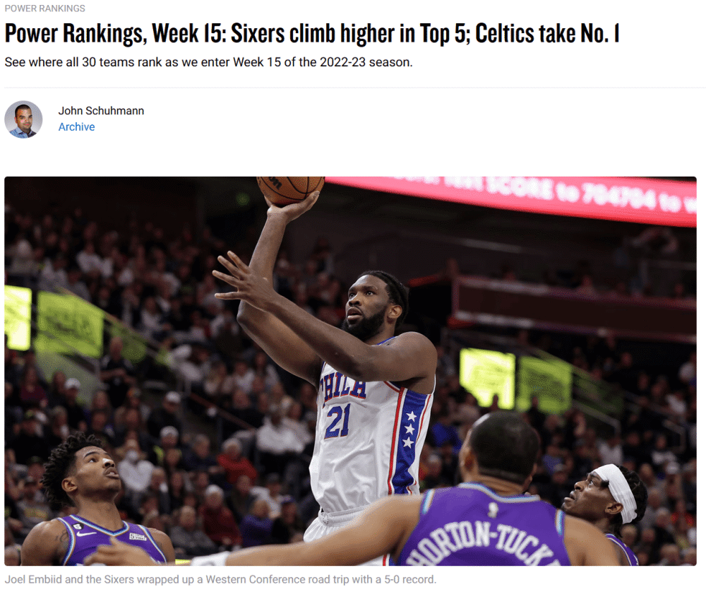

# 体育早知道｜湖人4换1得到八村垒 姆巴佩50分钟5球创纪录

编者按：湖人送出纳恩和三个次轮选秀权，从奇才得到八村垒。法国杯1/16决赛，大巴黎7-0横扫卡塞尔，姆巴佩50分钟5球1助。

早间必读

根据NBA著名记者Shams带来的报道，湖人队已经和奇才队达成一笔“4换1”的交易，具体的交易内容为：湖人送出纳恩和三个次轮选秀权，从奇才得到八村塁。

法国杯1/16决赛，大巴黎7-0横扫卡塞尔，这场比赛的主角是姆巴佩，他一个人贡献5球1助攻，创造纪录！

欧洲足坛上演多场精彩较量，大巴黎7-0晋级，姆巴佩5球1助攻。热刺1-0击败富勒姆，凯恩成为队史射手王，国米则爆冷输给恩波利。

足球战报

法国杯1/16决赛比赛展开争夺。巴黎圣日耳曼队在客场作战，他们的对手是卡塞勒队。本场比赛成为了大巴黎的进球大战，经过了90分钟比赛的较量，他们以7-0的比分大胜对手，其中姆巴佩在本场比赛上演五子登科，内马尔打入1球并助攻2次。

意甲第19轮，国际米兰主场0-1不敌恩波利，结束此前联赛、欧冠、杯赛8场不败（上一次主场输球是2022年10月1日不敌罗马）。什克里尼亚尔染红，德弗赖打中门框，巴尔丹齐打入唯一入球。

足球早报

热刺客场1-0击败富勒姆，凯恩打入全场唯一进球，成为热刺队史的并列射手王！一项项纪录，在这位超级射手面前被打破。

梅西的未来是人们关注的话题，他与巴黎的合同2023年夏天就要到期，巴黎希望阿根廷巨星继续留队，并且准备好了一份续约合同。但名记罗梅罗爆料：“梅西目前无意与巴黎圣日耳曼续约，世界杯夺冠让他改变了想法。”那么，35岁的梅西将何去何从呢？

阿森纳冬窗转会运作加速，在3000万签下特罗萨德后，枪手又完成了第2笔引援，22岁的波兰国脚基维奥尔以2500万欧元来投。本赛季冬窗阿森纳花费5500万引进2人，阿尔特塔目的很明显，就是为了争冠补强阵容深度，要与曼城战至最后。

根据罗马诺透露，曼城向萨斯菲尔德支付了800万美元的违约金直接将他买断，双方签下一份5年半的合同。据悉，佩罗内不会被外租，而是会在南美U20锦标赛过后加盟曼城。

英超球队埃弗顿官方宣布兰帕德下课！这也是他执教以来第二次被解雇。前切尔西传奇成为本赛季英超第7名下课的主教练，之前6人分别是帕克、图赫尔、杰拉德、拉热、哈森许特尔和波特(被切尔西挖走)。

冬窗转会市场上，切尔西是绝对的大户，他们已经花费超过2亿欧元签下了6名球员，但这还不算完，蓝军仍然想要继续补强；巴萨也在未雨绸缪，希望找到布斯克茨的替身，在世界杯上一举成名的悍将阿姆拉巴特进入视线，大巴黎有望在冬窗捡漏，从国米低价引进强力后卫什克里尼亚尔。

篮球早报

NBA官方公布了第14周的东西部周最佳球员。雄鹿的霍乐迪当选东部周最佳球员，这是他本赛季首次当选周最佳，生涯第2次获此殊荣。湖人的詹姆斯当选西部周最佳球员，这是他本赛季第2次当选周最佳，生涯第67次上榜。詹姆斯67次当选周最佳，也继续刷新这一奖项的历史纪录。

据名记Woj报道，湖人送走纳恩和3个次轮签，正式得到八村垒。距离交易截止日越来越近了，NBA更多的交易已经在酝酿中。湖人和马刺仍有可能达成关于威少的交易，篮网、热火和老鹰有意伊巴卡，快船不考虑交易莱昂纳德，和掘金等队竞争森林狼的里德，猛龙和马刺商讨三方交易，雄鹿有意得到雷迪什，而尼克斯也对雄鹿的格雷森-
阿伦感兴趣。

交易细节曝光，湖人加价引援八村塁为詹姆斯新增帮手，并且希望在今夏和他续约；湖人赚大了吗？专家坦言湖人简直是抢劫。

马刺队记者LJ Ellis报道了有关珀尔特尔的交易进展，包括湖人、凯尔特人、猛龙等队都对其有意。

美媒认为湖人有可能还有后续交易，并列出了三大新方案。值得一提的是这三笔方案的交易筹码都是威少和首轮签，而终极方案的目标是公牛的拉文。

NBA官方公布了最新实力榜。凯尔特人队力压掘金队重返榜首，76人队升至第3位，勇士队排名第12位，湖人队排名第20位，火箭队依旧垫底。

综合早报

乒坛兔年第一战——WTT多哈支线赛迎来首个正赛日的较量，此前一直休息的中国队健儿们也将正式登场，目前赛程已经出炉，第一天国乒共有15场外战，分别来自男单、男双、女双3个项目，而女单、混双则是首轮轮空，所以暂时不会参与竞争。

重要赛事预告

08:00 NBA常规赛 雄鹿VS活塞

08:00 NBA常规赛 凯尔特人VS魔术

09:00 NBA常规赛 老鹰VS公牛

09:00 NBA常规赛 森林狼VS火箭

10:00 NBA常规赛 黄蜂VS爵士

11:00 NBA常规赛 马刺VS开拓者

11:30 NBA常规赛 灰熊VS国王

次日

01:30 德甲第17轮 沙尔克04VS莱比锡

03:30 德甲第17轮 拜仁VS科隆

03:30 德甲第17轮 霍芬海姆VS斯图加特

03:30 德甲第17轮 柏林赫塔VS沃尔夫斯堡

03:45 意甲第19轮 拉齐奥VS AC米兰

