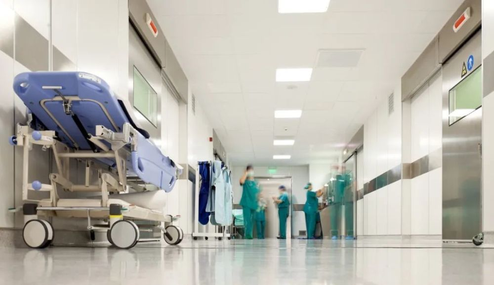

# 医院爆满，那奖金呢？去年疫情高峰中有的医院一些科室奖金反而减少了

1月20日，除夕前夜，小远回到曾经工作过7年的医院探望当时的同事。

这是河南一家市级三甲医院，三年疫情之前，小远因身体原因辞去医生的工作。这次回来，新建的住院大楼已经投入使用，前同事们依旧忙碌，
**小远当时的带教医生已连续加班了很多天。**

按照1月14日国务院联防联控机制新闻发布会通报的数据，国内发热门诊的新冠阳性感染者检出比例当时降到了10.8%，新冠的压力减小了。

但 **冬季是疾病高发期，医院门诊量仍在持续增加。** 1月12日，全国普通门诊量是913.5万人次，恢复到以往的水平。

每逢假日，医生依然要工作。 **在去年12月疫情高峰中，一些科室的奖金反而还减少了。**

01 忙是常态，不必“过度放大”

2022年12月份的疫情冲击，对一些医生来说是有预期的。

“医生本就是一个没有节日和假期的职业，轮到你当然要上。”一位医生表示， **北方秋冬季本就是流感、心脑血管等疾病的发作高峰，**
这种时候基本都是全员上岗，尤其是呼吸、心内这几个科室，直接住在医院就行。

在多数医院，急诊都是最累的，白班、夜班、下夜班“三班倒”。疫情管控放开之后，全国急诊诊疗人次在今年1月2日达到了152.6万人次的高峰。尽管随后的接诊量持续下降，但到了
**1月12日仍有109.2万人次。**

小远在医院工作了7年，待得最久的是急诊。那时候她喜欢跟着120出诊，每天像打了鸡血似的。这一次，她回医院探望在急诊时的带教老师，“本想请他吃个饭，但最后却只是一起点了顿外卖。每个科都缺人手，都没办法调人”。

去年12月中旬，河南宣布2023年3月底之前全省卫生健康系统取消节假日， **对此，多数受访医生没有感到意外。**

冬季就诊高峰期叠加新冠疫情，全国医院都面临挑战。

平时，医院其实有一套自己的管理体系，每个患者要进行的每一步操作，都有流程指引，“人再多也不会乱”。

但当海量患者同时涌入，院内“软实力”确实会面临更大的考验。

相对来说，国内医护人员数量还是匮乏的。以护士为例，按照国家卫健委《全国护理事业发展规划（2021-2025）》，
**全国护士总数在2025年时要达到550万，在规划之初尚有50万的缺口。**

被认为是“金饭碗”的医护工作，其实要熬到高年资才会有不错的待遇。广东某医院一位退休肾科医生就表示，自己年轻时该看的病人都看了，该发的论文都发了，如今就是在安然地享受退休生活。

**很多年轻的医生护士，其实很需要好的报酬。** 但过去三年，他们并非全都得到了应有的回报。

02 最怕付出得不到回报

**“地方的补贴是不到位的，一毛钱没有。”** 提起网络上流传的部分一线城市为医护发放疫情补助的消息时，山东某沿海城市一名基层医院的医务工作者干脆地说。

该院隶属一家局级机关单位，医院规模小病人少，12月疫情期间不太忙，还能回家过年。

抗疫补贴是2022年12月20日国家卫健委新闻发言人米锋提到的，他在国务院联防联控机制新闻发布会上表示，
**要落实好临时性的工作补助和绩效工资等激励政策。**

有的省份很快就开始了激励，12月22日，浙江省印发《关于进一步落实关心关爱医务人员激励保障政策的通知》后，据《浙江日报》报道，当地医生已收到总计14500元的抗疫奖金，
**包括5500元的抗疫补贴和9000元的新冠疫情激励保障。**

健识局注意到， **除了一线城市或经济较发达地区，**
很多医护士没有特殊补贴，南方某地一位一线护士对健识局称，医院只是正常发放加班费和年终奖，并没有额外补贴。

而且， **一些地区不仅没有补贴，工资还降了。** 小远所在医院的一名主任医生就表示：自己这几个月收到的奖金反而比以前低了。

健识局了解到，“降薪”和12月的抗疫直接相关。 **医生薪资一般由“底薪+提成+绩效奖”构成。**
底薪一般不会变，医生收入增加主要靠治疗费、药械费和绩效奖。集采政策推行之后，药械中能拿到的分成少了，治疗费就成为收入的最主要部分。

治疗费按人头来算，要扣除耗材等各类费用，接诊量越大拿到的越多， **前提是接诊病人不亏钱。**

疫情放开之后，新冠患者占门诊绝大部分。医院全员出动， **各科室都在用自己科室的耗材接诊新冠患者，导致治疗成本增加。**
有医生表示：“比如我是心血管内科，但我收来的病人是呼吸科的。所以人头算在呼吸科，但耗材费却是我的。”

这样算下来， **接诊一个患者，很多科室要搭进去不少成本，** 导致医护人员奖金有所下降。

按照这个逻辑，呼吸科应该是近来拿到最多奖金的科室。但据一些呼吸科医护表示：到手薪资与往常无异。

**付出与收入不成正比，这是多数医护当前苦恼的问题。**

有医生对健识局表示，客观而言，相较于其他技能职业，医生的收入并不算低，“过去工作虽然辛苦，但看到工资条的那一刻心里还是开心的， **现在只剩一声叹息。”**

小远已经转行好几年，曾带过她的老师笑着问：“你现在哪儿赚钱，要不我找你去吧？”

03 让资源向“人”倾斜

2022年9月，国家卫健委拟“使用财政贴息贷款改造更新医疗设备”的消息引起广泛关注。总共2000亿元的贷款将被用于医院改造升级。

新冠疫情以来，这只是大笔流向医院的补助资金中的一项。但健识局注意到， **大量资金其实主要都是用于采购设备或基建项目，鲜少有直接落到医护头上的。**

过去那些固定投入的资金补贴，还在不断减少。

2022年3月，国家卫健委公布的部门年度预算显示，当年投入到公立医院综合医院、妇幼保健医院、其他专科医院三项中的预算资金分别为51.15亿元、1.41亿元和12亿元，同比减少10.19%、23.88%和7.43%。

**公立医院要“勒紧裤腰带”，首先受影响的就是医护收入。**

此前，国家卫健委的一项委托调查显示， **2020年，国内130多家医院的2万余名一线临床医生的税后年收入中位数是15万元，**
只比两年前高了3万元左右，对收入不满的医生比例超过70%。

来自基层的数据则更为明显：2021年7月，一项名为《中国社区全科医生工作压力现状及其影响因素研究》的调查显示，研究随机抽取的3200多名社区全科医生中，
**近八成的人认为自己薪资过低，经济压力大。**

长期的沉没成本与远低于预期的回报，导致越来越多的人对医生这一职业望而却步。小远家五代从医，但她决意不让自己孩子学医，
**“如果他实在好奇，我就要直接说，我不可能养你到30岁。”**

新冠疫情在国外直接加剧了医护的逃离。国际上的多项调查显示，欧美国家的医护人员离职意愿在这两年持续上升。以新加坡为例，2022年一季度放宽边境防疫措施后，医院护士的流失率达到了4.4%，较之往年同期最多高出了1.7%左右。

国家卫健委也在想办法，要求将 **医务人员在疫情防控中的表现作为职称评审、岗位聘用的重要内容。** 但近在眼前的工资奖金，或许才是一线医护人员最想要得到的。

撰稿 | 古月

编辑｜江芸 贾亭

运营 | 贾赛轩

插图 | 视觉中国



