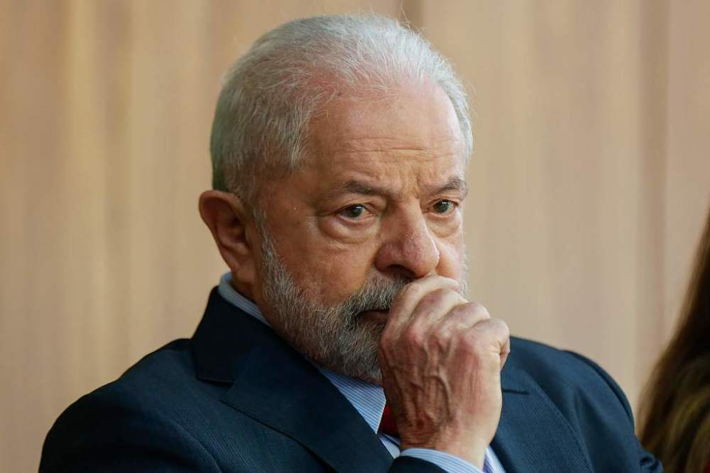

# 卢拉称前政府对亚诺玛米人实施“种族灭绝”，博索纳罗否认

【环球时报-环球网报道 记者
王佳琳】据英国路透社22日报道，500多名亚诺玛米儿童因疾病死亡，巴西卫生部宣布亚诺玛米地区进入医疗紧急状态，巴西新总统卢拉称前政府对巴西亚马孙亚诺玛米人实施“种族灭绝”。

21日，卢拉前往巴西北部的罗赖马州，走访该州首府博阿维斯塔的亚诺玛米诊所。看到诊所里的患者人满为患。22日，卢拉在社交媒体上发文称：“我在罗赖马州看到的不仅仅是一场人道主义危机，更是一场种族灭绝。这是一个对巴西人民苦难无动于衷的政府对亚诺玛米人有预谋的犯罪。”

巴西总统卢拉 资料图

巴西亚马孙新闻平台Sumauma援引其他媒体数据报道称，在博索纳罗担任总统的4年任期中，570名亚诺玛米儿童死于本可预防的疾病，包括营养不良、疟疾、腹泻以及非法采金活动引起的畸形。

报道称，几十年来，不断有矿工前往亚诺玛米人的聚居地非法采金，自博索纳罗于2018年上任并提出让当地采金活动合法化后，那里的非法采金活动数量成倍增加。

河流被污染，森林被毁坏，亚诺玛米人的主要食物来源——鱼、野猪等动物受到影响。卢拉表示：“2万名非法矿工受到了前总统的鼓励，他们来到亚诺玛米人的聚居地，用汞污染河流，造成破坏和死亡。”

此外，卢拉表示，亚马孙地区的非法采金活动于博索纳罗在任期间飙升至15年来新高，新政府将严厉打击亚马孙地区的森林非法砍伐，结束非法采金活动。

巴西内阁部长索尼娅·瓜贾哈拉表示：“我们必须追究前任政府的责任。该政府让当地情况变得更糟，成年人的体重像儿童一般，儿童更是瘦成皮包骨头。”

博索纳罗拒绝对此负责，称此类指责是“左翼闹剧”，博索纳罗表示，亚诺玛米人的医疗保健一直是其政府的优先事项之一。

