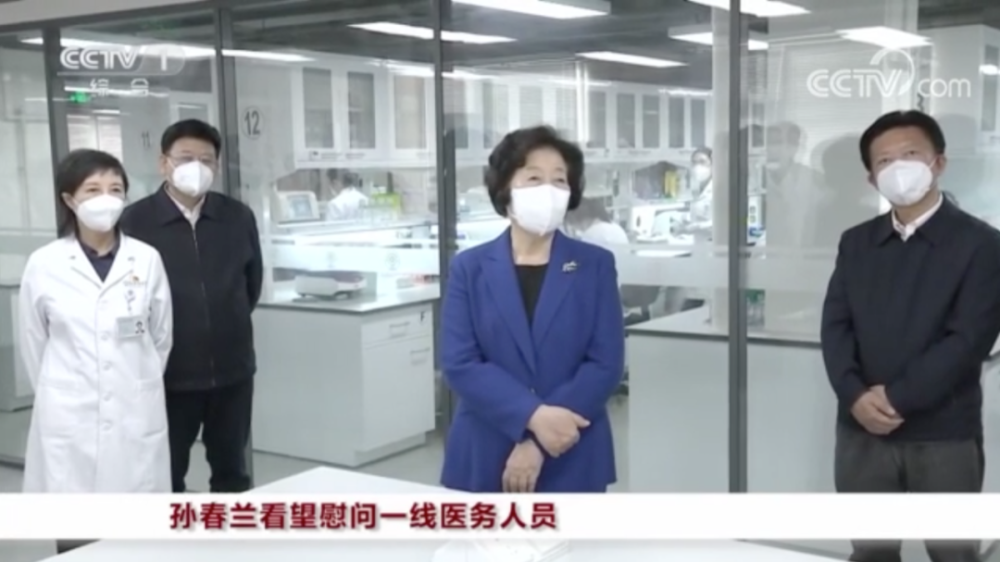
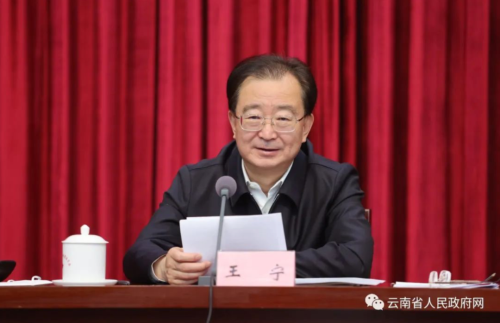

# 国务院副总理新年首次外出调研，省级党委书记密集作部署

**撰文 | 高语阳**

1月19日，国务院副总理孙春兰到中日友好医院国家呼吸医学中心、北京大学人民医院重症监护病房调研新型冠状病毒感染医疗救治工作，看望慰问一线医务人员。

这是今年孙春兰首次调研疫情相关工作，上次调研是在2022年12月13日，孙春兰到北京市调研指导疫情防控工作。

政知君注意到，连日来，多个省份密集召开全省新冠疫情防控工作会议。另外，多位省级党委书记召开专题会议对疫情防控工作进作最新部署。

**救治任务仍然较重**

这是1月8日我国对新冠病毒感染实施乙类乙管以来，孙春兰首次调研新冠病毒感染医疗救治工作并召开座谈会。

孙春兰上一次调研是在2022年12月13日，当时，孙春兰前往北京朝阳医院、首都儿科研究所、清华大学附属垂杨柳医院、连锁药房、建国门社区卫生服务中心等了解相关情况，并表示，要把工作重心从防控感染转到医疗救治上来，工作目标是保健康、防重症，确保防控措施调整转段平稳有序。

时隔一个多月，我国疫情形势已经进入新阶段，防控工作重点发生新变化。

孙春兰在最新调研中指出，
**近期全国整体疫情已处于较低位流行水平，防控工作转段平稳有序，医疗救治成效明显，在院重症患者数量稳步下降，但救治任务仍然较重。**

根据新华社报道，孙春兰在国家卫生健康委召开座谈会，研究进一步加强医疗救治工作。

孙春兰指出，新冠患者救治已经有一套成熟的诊疗技术和有效的治疗药物，要加强重症救治组织工作， **根据各地疫情形势选派国家专家巡诊指导。**

要主动做好老年人、基础疾病患者等重点人群的健康监测、用药指导等服务， **把防重症的关口前移到家庭和社区。**

另外， **要加强临床救治研究工作，深入评估病毒的致病机理和临床特点** ，为更有针对性地采取治疗措施提供循证依据。

**境外变异毒株已成为优势毒株**

1月19日，国务院联防联控机制召开新闻发布会，国家卫健委医疗应急司司长郭燕红介绍， **各省已经度过了发热门诊、急诊和重症患者这三个高峰。**

全国发热门诊就诊人数在2022年12月23日达到峰值，2023年1月17日就诊人数较峰值下降了94%，已经回落到2022年12月7日前的水平。

全国急诊就诊人数在2023年1月2日达到峰值，1月17日就诊人数较峰值下降了44%。

全国在院的阳性重症患者人数在2023年1月5日达到峰值，1月17日较峰值数量下降了44.3%。

政知君注意到，近日，多位省级党委书记也对所在省份疫情防控阶段做出了判断。

1月18日，山西省委书记蓝佛安主持召开省委疫情防控专题会。

蓝佛安指出，经过全省上下共同努力和有效应对， **我省单日感染率降至低流行水平，重症患者数量呈稳步下降态势，总体上渡过了感染高峰期。**

同时，蓝佛安也表示，当前，我省本次疫情已处于低水平流行状态， **但境外变异病毒已成为优势毒株，流行趋势加大，必须始终保持高度警惕。**

黑龙江省委书记许勤1月17日在新冠病毒感染疫情工作领导小组会议上指出，
**目前，黑龙江省感染人数、发热门诊和急诊人数、重症人数多日呈下降趋势，疫情总体趋于相对平稳。**

宁夏回族自治区党委书记梁言顺1月16日上午在全区疫情防控工作会议上说，1月8日实施“乙类乙管”以来，自治区指挥部和各地各部门充分准备、有效应对，
**全区已顺利度过感染高峰，实现平稳有序转段。**

青海省委书记陈刚在1月16日召开的全省疫情防控工作会议上指出，实施“乙类乙管”以来， **全省基本平稳渡过感染高峰期。**

**高度警惕春节前后可能出现的感染新高峰**

政知君注意到，多省份省级党委书记在作最新部署时提到了两个关键词：春节假期、境外变异毒株输入。

宁夏回族自治区党委书记梁言顺16日在部署疫情防控工作时表示，度过高峰期不代表疫情过去、没有风险，我们必须坚决克服松懈麻痹思想，
**高度警惕春节前后可能出现的感染新高峰。**

梁言顺指出，要聚焦春节这一重要时间节点，加强防疫知识和常识宣传， **针对可能出现的新一波流行高峰和聚集性疫情，制定应对预案，做足充分准备。**
要聚焦社会面这一重要基础， **高度重视防范境外疫情输入，全时段开展疫情监测预警。**

“春节前后人员流动大，疫情防控任务重。”黑龙江省委书记许勤在17日的会上指出：

坚持底线思维、风险意识，科学精准防重症、防反弹、防麻痹、防聚集性感染， **扎实做好春节及新阶段疫情防控各项工作** ；

要加强监测预警， **及时掌握病毒变异情况，摸清疫情变化趋势** ，及时采取有效措施进行应对， **确保疫情不反弹** 。

甘肃省委书记胡昌升在17日召开的全省疫情防控工作会议上也谈到了“确保春节期间疫情不反弹”。

胡昌升说，倡导群众春节期间少聚集，最大限度降低疫情传播风险。

“春节期间人员流动增多，疫情防控压力将进一步增大。”陕西省委书记赵一德在1月17日召开的全省疫情防控工作会议上说，
**疫情监测预警要再靠前，完善外防输入应对措施，严密防范境外病毒变异株输入传播。**

云南省委书记王宁在18日上午召开的全省疫情防控工作会议上说， **随着返乡人员增多，疫情传播风险增大，切不可放松警惕、疏忽大意**
，必须慎终如始做好各项工作。

他还提到， **要抓好外防输入** ，既守牢境外疫情输入防线，又有效保障口岸畅通。

**资料丨中国政府网 各省份党报**

**【版权声明】本文著作权归北京青年报独家所有，未经授权，不得转载。**

