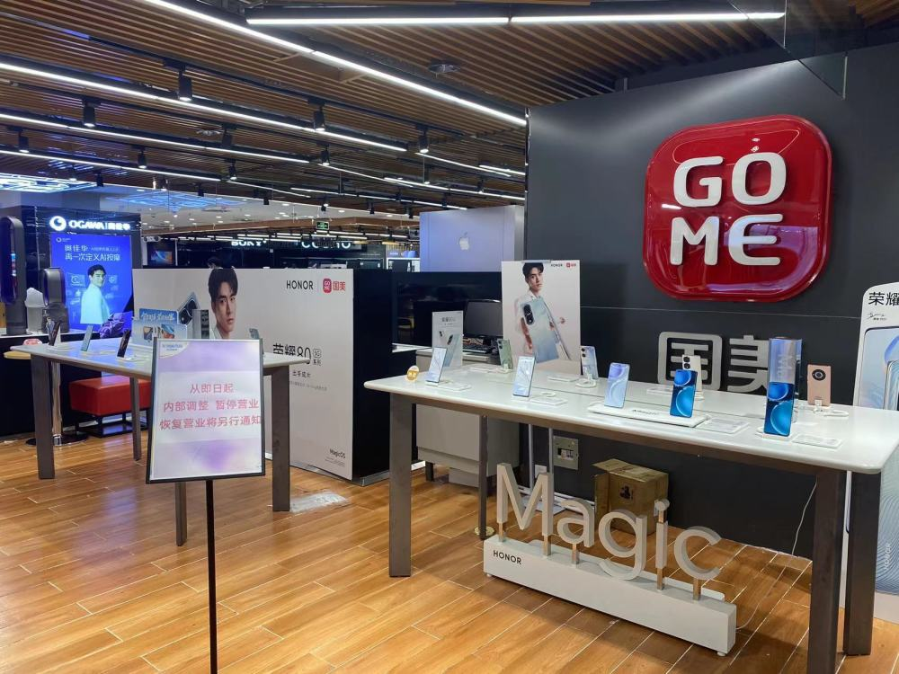

# 国美年关难过：黄光裕忙还债，18年老员工无奈离职

本文来源：时代财经 作者：张雪梅

_图源：时代财经摄_

临近年关，黄光裕再次出手缓解国美债务压力。

日前，国美零售（00493.HK）发布公告称，拟将企业第一及第二债权人的债务资本化，分别向两家公司发行43.48亿股和36.33亿股新股，通过债转股的形式清偿债务，这两家公司均为黄光裕全资持有。

在资本市场大秀财技，黄光裕却没能在战略改革上令国美真正跟上时代。日前，上线两年、曾被管理层寄予厚望的“真快乐APP”更名回“国美APP”。

2021年初，黄光裕回归国美，原国美在线APP正式升级为兼具购物和娱乐、社交功能的APP——真快乐。作为其线上零售的主战场，除了电器数码以外，还开启了个护美妆、食品酒水、服饰鞋帽等商品多元化销售。

然而，经过两年改革，真快乐APP并未成为国美新的增长点，一位门店负责人告诉时代财经：“花费人力物力对它进行一年推广后，带来的收益几乎为零。”

进入2022年下半年后，国美处境愈发艰难，拖欠薪酬、高管离职、门店关闭等消息频频曝出，国美则将重点放在直播带货上，12月30日，国美电器董事长黄秀虹更是亲自下场。国美官方数据显示，当晚3小时的直播共吸引12.6万网友参与，不过详细销售数据未公布。

该场直播同样是依托于真快乐APP，与抖音等平台相比，流量差异较大，且开播时出现卡顿、杂音等多个小插曲。与高层倚重该APP不同，不少员工对真快乐的接受程度并不高，甚至责怪它拖垮了国美的线下门店。

**没有互联网基因，真快乐APP出圈难**

2021年12月31日，崔波离开了国美，这个他工作了18年的地方。他对时代财经坦言，这是一个无奈的选择，“如果当时不接手新零售店，不推广真快乐APP，我可能现在还在国美。”

2020年4月，崔波所在区域正式开始筹备新零售导购店，他成为门店负责人，该店经营面积1800平方米，有26名员工。在此之前，他在国美从销售一路做到科室主任、品类主管等，经验丰富。

虽然门店升级是国美积极转型的尝试之一，但却并未取得预期效果。“升级为新零售导购店后，在低线级城市水土不服，且这类门店的先期投入很大，例如终端设备比之前普通门店成本高很多，本意是想用设备减少人工的投入成本，但似乎不适用于家电的终端卖场。”他透露。

这也与门店原本的业务产生较大冲突，“真快乐APP引流全靠门店员工地推，推个小车拉着一堆赠品，用二维码去扫客”。最多的时候，崔波在市内一个区安排了8个点，每个点至少2名员工，如果遇到新楼盘开业，一个点最多放过6名员工，这也直接导致门店面临无员工可用的窘境。

店里一个电器品类只有一个导购，“人都放出去了，客人来后无人接待，尤其是家电品类，需要面对面进行产品介绍、功能演示等，单纯放一个ipad作用不大。”这种情况贯穿了2021年全年，但真快乐APP给该门店带来收益几乎为零。

崔波认为，花了大力气地推却没有带来预期收益，最根本的原因是APP操作过于繁琐，包括界面设计、APP使用以及优惠券换券、销券等都不直观。“国美的优惠券分几部分组成，第一部分是厂家给的优惠券，第二部分是企业自己的优惠券，直接在真快乐APP买单很难提供厂家优惠，就算有优惠，顾客可能也不会使用。”

在这种情况下，真快乐APP线上销售80%-90%都是内部人员在实操，在社会层面的转化并不理想。

崔波表示，有顾客对门店反映过APP操作繁琐的问题，他们也向上反映过，但并未得到解决，“我之前管理的门店，是用最传统的做活动、做厂促、拉横幅、扫街等方式，把人引到门店，在线下进行爆破，这个玩法玩了很多年，门店也一直是盈利状态。”

真快乐APP上线后，崔波和员工地推、扫街，将流量引向线上，但是线上因操作繁琐、优惠券等问题很难留客，不仅没有带来新的增长点，反而占用了一部分成本，对线下门店生意产生影响。

从2021年5月开始，崔波所在门店出现了发不出工资的情况，他本人也几乎月月只拿底薪，没有绩效，收入受到较大影响后，他在当年年底离开了国美，他负责的门店也在2022年正式闭店。

作为一家以线下实体门店为主的传统电器零售商，国美无法一跃成为具有互联网基因的新型电商企业。无论是远离一线已久的黄光裕，还是国美自上而下的员工，对于新零售都没有十足的准备。

而这个从2021年就埋下的隐患，在2022年全面爆发，去年下半年以来，国美出现拖欠员工工资、供应商货款，门店大量关闭，高管离职等问题。

**11月工资待发，中层也下场直播**

2022年下半年开始负面缠身的国美，终于在去年底迎来了好消息，公司陆续下发此前拖欠员工的9月、10月工资。司龄5年，在国美担任中层的于鹏此前告诉时代财经，目前他所在区域正在补缴员工社保，接下来应该会发11月工资，不过12月要暂缓。

去年12月，国美下发员工安置方案，员工可以根据方案A、B选择离开或者留下，“选择留下的员工比较少，这也对当下工作产生一定影响，因为交接面临问题。”于鹏透露，“这段时间由于整个战略的转变、跟供应商的矛盾，以及现金流问题，国美在经营上比较困难，迎来了闭店潮。”

对于过去两年，于鹏感触颇多。“2021年初真快乐APP上线的时候，我觉得构想是可行的，将购物、社交、赛事结合在一起，加上整个国美线下门店、员工，以及之前打下的社群基础做支撑，是可以把线上做起来的。”

在安排工作时，于鹏会指示线下门店加上真快乐APP的二维码，线上广告也会增加一些跳转。“当时大家都很积极去推动，那段时间公司也招了很多年轻人，新鲜血液注入后，工作也更有趣一些。”

但由于上传下达不到位等原因，真快乐APP并未如于鹏所预想的那样成长起来。他告诉时代财经，跟门店员工沟通过之后，发现他们并不理解为什么要推广这个APP，“一方面APP前期无法带来销售，另一方面还会浪费他们的卖货时间，比起线上直播，在店里或者微信上多和客人聊天，订单来得更快。”

操作繁琐也是真快乐APP推广难的原因之一，此前门店员工销售时，一般是直接在电脑系统买单，输入员工号实现优惠，但是真快乐上线后，员工需要帮助客人在手机移动端下单、支付等，程序更为复杂。

真快乐APP的发展阻力还包括供应商。于鹏表示，门店很多促销员是厂家派来的，厂家也有自己的线上业务，如果在促销员的帮助下完成线上下单，就会引发争执：这是厂家的单，还是线上真快乐APP的单？因此对于区域供应商而言，在销售数据上比较难区分。

不可忽视的是，国美改革的这两年，市场也发生了较大变化。疫情之下，实体零售面临挑战，消费氛围、线下体验减少，也为APP推广带来阻力。于鹏有时也会反思，这个战略如果放到疫情前的话，可能效果会更好。

目前，他仍然留在国美与之并肩奋斗，线下门店大量关闭后，国美将重点放在了直播带货上，除了在国美APP，也会在抖音等平台寻找突破口。于鹏也开始下场直播，他自嘲道：“我肯定没有门店做了十几年销售的员工那么熟悉商品这些东西，还是需要形象好、专业性强的员工来开拓这项业务。”

他对时代财经表示，虽然现在国美的资金较为紧张，无法请来专业团队操盘直播，导致效果不佳，但是大家都在努力，他相信，直播带货和全员推手的战略仍是有生命力的。

只是，面对日新月异的市场，对债务压力不小的国美来说，留给黄光裕的时间或许并不多了。

（文中崔波、于鹏均为化名）

