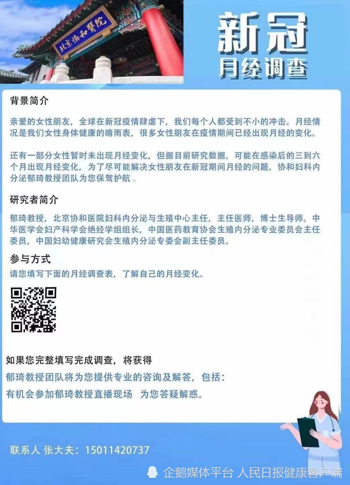

# 新冠感染后对月经有影响吗？北京协和专家：还需要更多数据研究

**人民日报健康客户端记者侯佳欣**

“以前经期一直挺准时的，阳了之后一直没来，又是吃红枣又是煮姜茶，折腾了好一通算算时间，推迟了整整17天。”浙江宁波的包冉（化名）告诉人民日报健康客户端记者。

包冉的情况并不是个例。在社交媒体平台上，“阳了之后月经不准”的讨论区内，来自全国各地的网友都在分享自己的情况。“推迟10天了，肚子空痛””……此外，“阳康”经期准确的网友也有出现痛经、量少、时间变长等问题。

不过与此同时，也有部分网友反馈，阳了之后并未发觉月经出现变化。在北京工作的徐一（化名）告诉人民日报健康客户端记者，阳康之后的经期较往常没有什么变化。

**新冠感染后对月经有影响吗？**

北京协和医院妇科内分泌与生殖中心主任郁琦告诉人民日报健康客户端记者，一些女性在感染新冠后出现了月经不调、痛经等问题，这与新冠感染是否有直接关系，仍待进一步论证。目前，国际上也有不少针对这一问题的研究。但由于样本量较小，且多为横断面研究，论证结果仍需要时间检验。

“北京协和医院目前正在开展一项新冠月经调查，主要聚焦新冠感染对于月经的影响。”郁琦介绍，这项研究正处于收集阶段。数据采集完毕后，将进行横断面研究和纵向研究。横断面研究主要聚焦月经变化的主要特征及占比情况，纵向研究则聚焦远期影响等。

郁琦称，国外研究数据，新冠感染对于激素水平没有太大影响，但可能会对女性的月经情况有所改变。这对我国的情况是否有参考意义，新冠感染对于月经变化究竟有无影响，尚待进一步研究和调查，希望更多的女性能够参与这份调查，让样本量更加充足，进一步提升研究的精准度。

