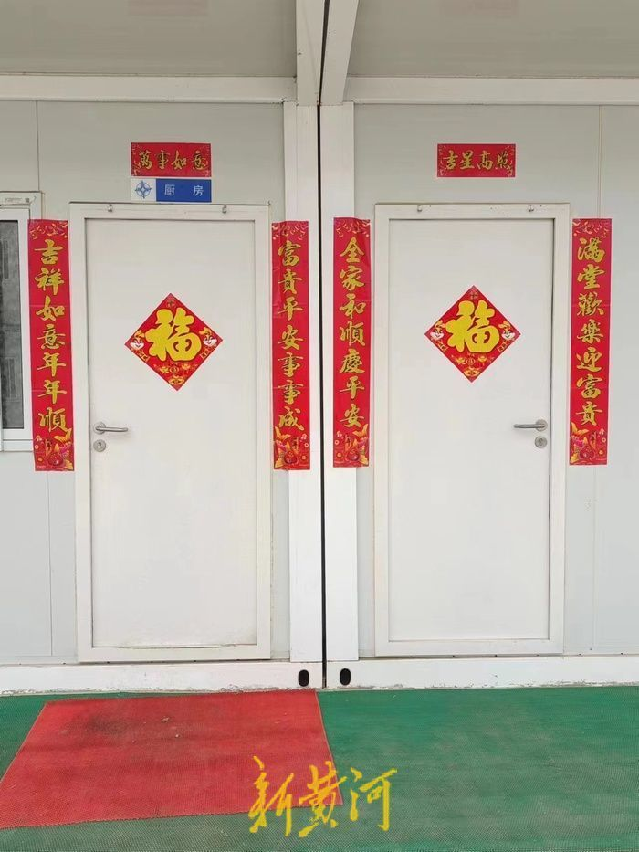
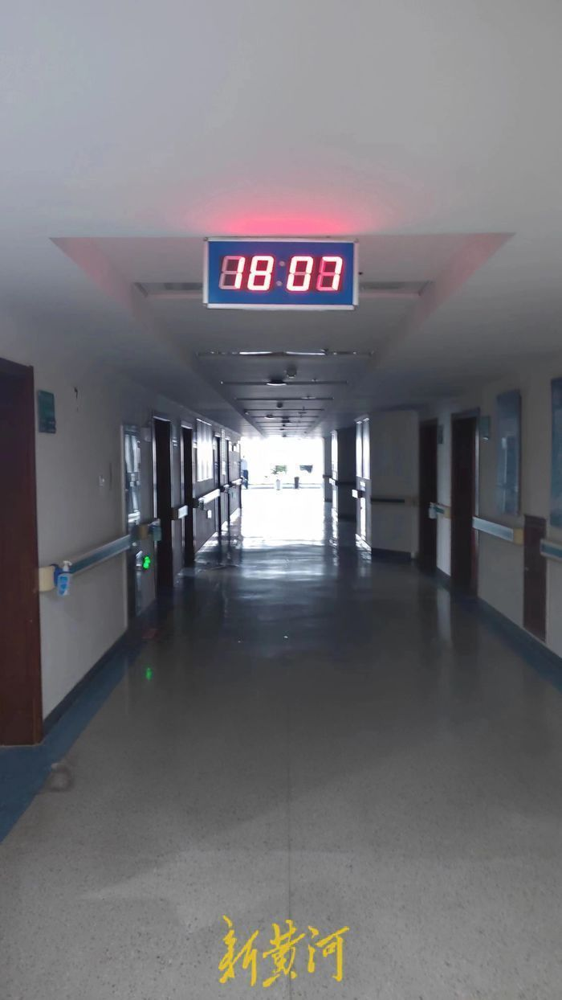

# 春节“不归人”：疫情三年后，他们依旧不回家

编者按：回家过年，是春节永恒的主题。岁末年初，随着优化疫情防控“二十条”“新十条”的相继实施，我国新冠疫情防控进入新的阶段。今年春节，大家迎来不受限制的返乡之旅，曾经熟悉的感觉回来了。跌宕起伏的时代洪流与裹挟其中的个体冷暖交融，也赋予了这个春节特别的意义与期待。为此，新黄河客户端发起《返乡之路》春节特别策划，听听天南海北远行的游子们，讲述“回家”或“留守”的故事。

“疫情三年，今年必须回家好好过个年。”春节前的社交媒体上，这一说法代表了很多网友的心声。根据交通运输部预测，今年春运期间全国客流总量约为20.95亿人次，比去年同期增长99.5%，数据已经恢复到2019年同期的七成。

与此同时，还有不少的人，今年依旧没能回家过年，成为春节“不归人”。回家的理由只有一个，不回家的理由却不尽相同，有的因为工作原因被迫就地过节，另一些则是主动选择留下：要么忧心自己回去会增加家人感染风险，要么是因为回家开销大，或是单纯厌倦了被催婚、催生。新黄河记者采访了三位春节不回家的人，以下是他们的故事。

_一顿年夜饭，承载着很多游子的念想
本文图片均由受访者提供_

**“安全起见，还是先不回了“**

“家里人刚阳完，安全起见，还是先不回了。”放假前夕，同事问小茹何时回家，她回答道。小茹是1月2日自己做抗原发现阳性，最难受的是第五天，“感觉要把心肝脾胃肾都咳出来……”她心想，年轻人“阳了”都这么难受，老年人可怎么办。于是当天再次嘱咐家人备点药，并且注意防护。但不到一周时间，四川老家的家人还是都“中招”了。

症状最严重的是患有糖尿病的奶奶，视频聊天时，奶奶说自己食欲差、全身无力，“应该是感冒了”，说话间，小茹发现奶奶咳嗽不止，便劝说她赶紧去医院治疗。经过住院治疗，老人在春节前顺利出院。小茹告诉记者，“之所以不回家，是害怕我带回去不一样的毒株，给家人造成二次感染，毕竟老年人抵抗力差。”

除夕夜，小茹在家庭群中看到了一家人的合影，这是去年春节才开始的习惯。2021年，一位发小爷爷去世，老人不喜欢拍照，因此没有单人照片，一家人从家庭合影中截出来一张才有了遗照。发小跟爷爷感情很深，之后回家时总会回想起以前爷爷在屋里的场景，她很后悔没能将那些片段一一拍下来。小茹知道后也开始记录长辈们的日常生活，并且有了每次家庭聚会拍照的习惯。

1月19日，身在上海的小茹收到了家里寄来的满满一箱年货，有香肠腊肉、泡凤爪、排骨等，“是妈妈带病做的，也全都是我爱吃的。”离家后，她曾尝试做过排骨，但做了好多次，都不是家里的味道，“如果条件允许，今年年假只想回家。”

**打工人都有最常用的“理由”**

除夕前一周，22岁的小庄正盘算着何时回家，工作群突然发来要安排人员值守的通知，小庄看着消息犯了难。去年毕业后，他如愿进入这家工程建设类的央企，担任内业资料员。虽然刚工作半年，机警的小庄已经摸到了一些职场门道：职场中，除了要有真才实学，人情世故同样重要。他觉得这是一个难得的表现机会。更何况，对没什么积蓄的年轻人来说，三倍工资足够有吸引力。

小庄是家中唯一的孩子，从小到大生活在父母的荫庇之下。他坦言，工作以前自己很少操心家里事情，不过在工作后某一个时刻，他突然觉得该承担起家庭责任了。而目前他能想到的方式，就是好好工作、多赚钱。

主动报名留守项目的当天，小庄给父母打电话说不回家过年的事，“没想到我这么快就用上了打工人最常用的理由”——工作太忙。他记得，刚说完电话两头出现了短暂的沉默，随后爸妈宽慰道，“没事，工作重要。其实我们早前也想着你不回来，已经商量好了去你叔家过年的。
”小庄急忙接一句，“等正月初八大家收假了，我应该可以调休，到时候我回来。”电话那头又传来声音，“那你回来想吃啥？”其实公司为留守的六人专门配备了一名厨师，除夕当晚大家也能吃到饺子，他想了想说，“还是想吃家里的饺子。”

_小庄所在项目工地图片_

**和父母的“代沟”有点大**

在青海西宁某三甲医院肿瘤内科上班的任强，由于科内有住院病人需要照护，所以全年采取排班制，这次自然也不例外，春节期间他的班次排在大年初一晚上和初六白天。上班五年来，任强春节只回过一次老家，他说，其实即便工作允许，今年也不一定能回去。

_大年初一任强夜班前拍摄_

任强自己算过一笔账，不算和朋友聚餐等的费用，单往返车票、给亲朋好友孩子的压岁钱、拜年礼的开销最少在一万五千元左右，这几乎两人存款的一半，“回家代价有点大”。任强研究生毕业后进入现在的医院工作，每月工资加绩效收入在五千至七千元之间，去年他还曾被抽调去做核酸检测工作，收入最多时刚刚过万。妻子身体不太好，婚后便当起了全职家庭主妇，日常开销加房贷算下来，小任有时候甚至需要靠父母接济。

更大的问题则源于和父母的“代沟”，任强说，自己和妻子都是学医出身，“职业中见过了太多生离死别，更在乎及时行乐。加上我媳妇儿身体不好，所以我俩是坚定的‘丁克’（不生育人群）。”很显然，双方父母并不同意。所以每次回家基本上不欢而散，这是任强不愿回家过年最重要的原因。

无独有偶，在豆瓣“过年不回家之春节恐归族”群组中，怕催婚、催生，怕被拿来跟别人作比较均是高频话题，在无力改变长辈看法的前提下，他们宁可选择在出租屋自己过春节。不过，群组成员们似乎没有丢失仪式感，不少组员为自己挑选了礼物，喜欢热闹的年轻人则额外建了群，相约一起吃年夜饭或者去玩桌游，费用均摊。对他们来说，春节回家过年不再是唯一的选择。（文中人物均为化名）

新黄河记者：张博 编辑：周全

