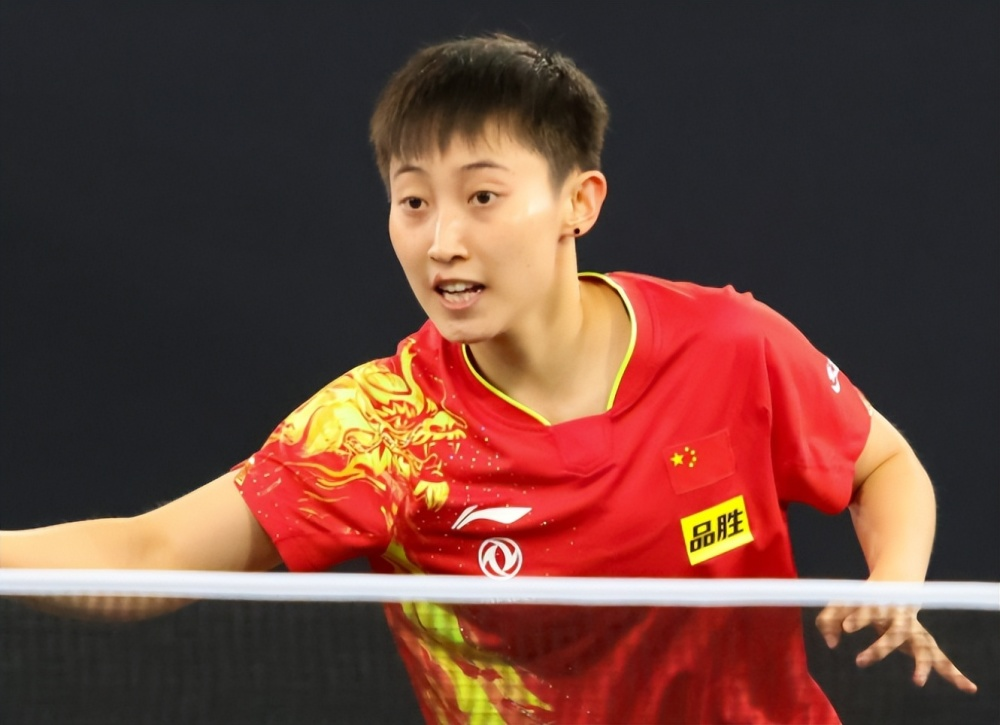
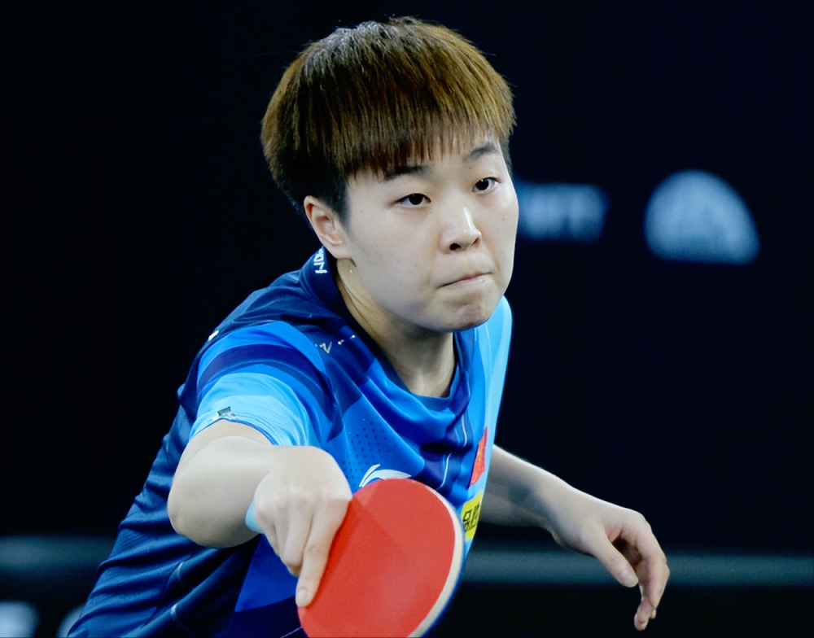
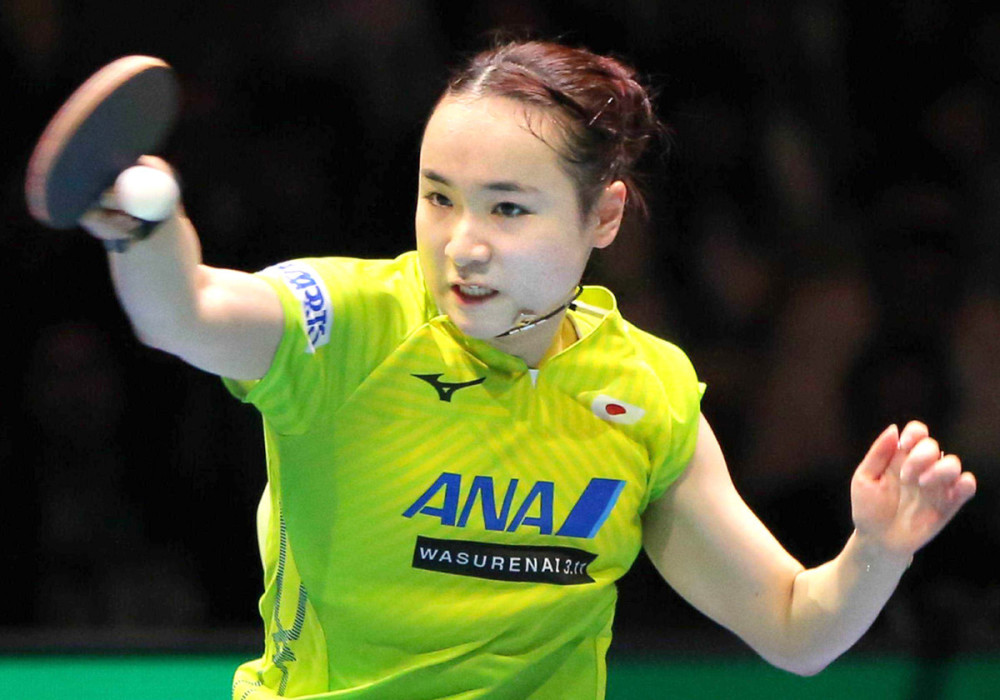
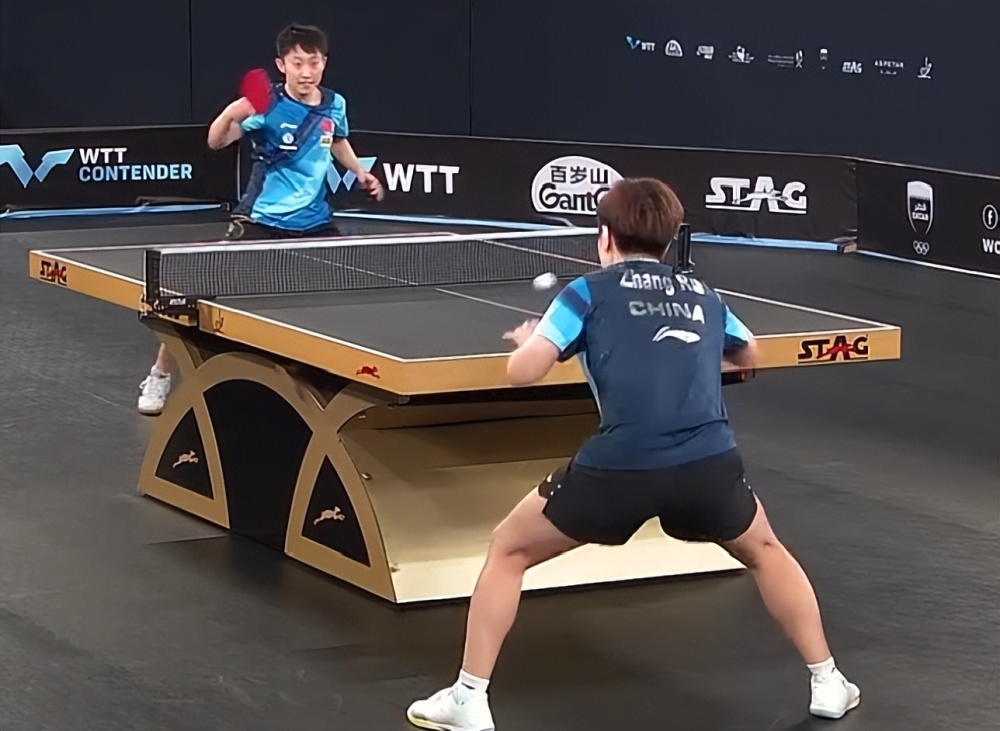

# 除夕夜喜讯！国乒包揽女单冠亚军，非主力立大功，称雄海外赛场

2023年除夕夜，中国乒乓球队依旧在遥远的中东征战WTT卡塔尔赛，北京时间1月21日晚，女单决赛落下帷幕，国乒选手张瑞、范思琦上演强强对抗，结果连赢强敌徐孝元、田志希、巴特拉晋级的陪练选手张瑞2-0领先、3-4被翻盘，范思琦大逆转夺得女单冠军。

虽然比赛有输有赢，但两位运动员都没有在本站比赛的女单项目中输外战，都是好样的：除夕之夜，让我们一起为二位的精彩发挥喝彩吧！

张瑞、范思琦都是国乒一队排名中游的非主力，前者是横拍生胶运动员，平时经常模仿伊藤美诚给全队担当陪练；后者则是主流的横拍两面反胶选手，技术相对更均衡，所以这场比赛的关键就在于范思琦能否摆脱张瑞的生胶快攻突击。

如前所说，张瑞在前面的比赛中发挥得非常不错，连续淘汰了三位国乒劲敌，另外还将队友陈熠拉下马——虽然一直在模仿伊藤美诚，但她仍然保持了自己的特色。

比赛开始后，张瑞很快便进入了状态，不断取得领先优势，利用自己的速度压制住了范思琦，随即以11-6拔得头筹——和伊藤美诚比起来，张瑞的球路没有那么怪，但动作更加舒展，尤其正手基本功非常好，这就是她的全面性优势。

第二局张瑞又是不断压制队友，上来就领先5分左右，打得范思琦节节败退，很快又以11-5再下一城，赢得比上一局还要轻松，状态非常不错。

第三局范思琦开始组织反击，还了对方一个11-5，逐渐找到了自己的手感。第四局范思琦再接再厉，又以11-7拿下，成功追平大比分，两人再次回到了同一起跑线，真是刺激！

第五局是大家争夺的关键，范思琦10-7领先被追到只差1分，但还是在暂停过后11-9险胜逆转，反而将张瑞逼入了绝境。第六局张瑞背水一战，以11-7将比赛拖入决胜局！第七局大战，张瑞终究还是无力回天，范思琦以11-5结束战斗，由此而4-3惊险拿下女单冠军。

最后再次向中国队表示祝贺，期待大家下一站的女单表现同样精彩！

