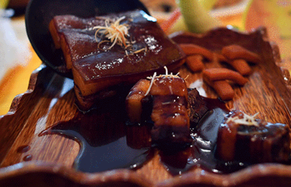
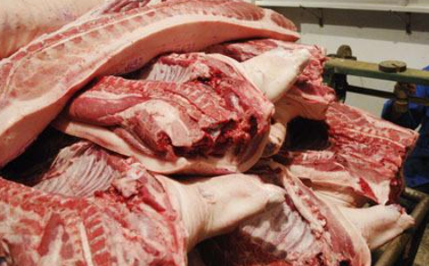

# “猪肉没有以前香了”，是我变了还是猪变了？

无论是逢年过节还是家常便饭，我们的餐桌上总是离不开猪肉，各种猪肉制作的美食，如红烧肉、糖醋排骨、酱肘子等总是让人食指大动，口水直流，可随着年龄的增长，猪肉的味道似乎逐渐变得平淡无味。

有的小伙伴或许会安慰自己，是自己戴上了童年滤镜，把那时难得吃上一回的猪肉味道给美化了，现在则用上了“原相机”，再回头一切都不一样了。

事实真的如此吗？

一个可能会让人难过的结论是：实际上并不是大家丢掉了童年滤镜，而是猪肉真的不如以前香了。

**01 我们吃的猪肉品种变了**

由于国民经济的增长和人口的增多，我国居民对于肉类的需求开始急剧增大，其中需求最迫切的就是猪肉。

猪肉一直都是中国人餐桌上最主要的肉类，2020年国家统计年鉴数据显示中国人平均的猪肉消费量达到了18.2千克，远超牛羊鸡鸭等其他肉类。

面对急剧增长的猪肉需求，加快出栏时间、加大出栏数量成为各大养殖场的首要目标。

传统土猪大多生长周期较长（约一年出栏），料肉比也更高（简单说就是吃得多长得少），这些缺陷导致其难以满足庞大的猪肉需求。同时，在对于猪肉的选择上，随着社会的发展，人们也不再钟情于肥肉，反倒开始对瘦肉青睐有加。

因此，早在上个世纪，引进洋猪的计划就已经开始。

为了解决吃肉问题，我国从上世纪五十年代开始大规模引入国外的猪种，现在这些洋品种猪的猪肉已经占据了我国90%的猪肉市场，主要有美国的杜洛克猪，英国的大白猪和丹麦的长白猪三个品种。

**02 土猪肉vs洋猪肉**

在不少已经步入中年的人——尤其是有过农村生活经历的——的儿时记忆中，餐桌上难得一见的猪肉总是喷香无比。

在一块烹饪得当的红烧肉上，总可以看见由细嫩的肉和雪白的脂肪层构成的清晰漂亮的纹理，无需放油，肉块上就能包裹着鲜亮的油光，并散发扑鼻的香气，让人一瞧便口水直流，一口咬下更是入口即化，唇齿留香。

之所以能够呈现如此诱人的品质，关键在于传统土猪的品种大多生长周期较长，吃得多长得还慢，这让它们得以拥有硕大的身躯，存储大量脂肪，肌肉纤维也更为纤细，口感上自然也就更细嫩。

现在占据着我们餐桌的洋猪肉，在细嫩和鲜香上早已不复当年的水平，略显平淡的滋味和稍微发柴的口感，再加上自己没有高超厨艺的加持，做出来的菜肴就很难再让人将其评价为美味。

洋猪生长快、上市周期短，出栏时脂肪含量低而瘦肉占比高，但肌肉纤维更粗，口感上也就更粗糙，这也让它虽然出现在无数家庭的餐桌上，却还是叫人不敢恭维的原因。

**03 猪肉好不好吃由脂肪决定**

普通猪肉和土猪肉口感上的巨大差别主要取决于它们的肌内脂肪含量，肌内脂肪是藏于肉类肌肉内部的脂肪，含量的高低直接决定了口感的优劣。

土猪肉相较洋猪肉含有更多肌内脂肪，烹饪后鲜嫩、多汁，脂肪在高温下还挥发出让人口水直流的诱人香气，将原本平平无奇的猪肉的口味提升好几个档次。

据不完全统计，中国有12个传统土猪品种的肌内脂肪含量平均能够达到5.8%，而目前市场主流的洋猪的平均肌内脂肪含量在2.3%左右，肌内脂肪含量的不同加上肌肉纤维粗细的区别，造就了二者在口味上的巨大差距。

**那为什么脂肪含量不同就会产生这样的差异呢？**

原来这都是嗅觉在发挥作用。

不知道大家在吃东西的时候有没有留意过这样的细节，比如可乐和雪碧都是汽水且都是甜的，喝到嘴里味道却相差很大，这是为什么？聪明的各位肯定立刻想到了两者的差别，那就是气味不同。

嗅觉作为人体味觉的重要组成部分，在让人感受食物味道层次这方面发挥着决定性作用，可以说没有嗅觉吃很多东西都会味同嚼蜡。土猪肉更为丰富的脂肪含量使其在烹饪时会挥发更多的香气，大大丰富了人们的口感体验。

在未来很长一段时间内，猪肉仍会是我们餐桌上最主要的肉类。尽管现在的猪肉口味变得略为平淡，但换来的是更为亲民的价格和可靠的蛋白质来源，也算是“有得有失”。

洋品种猪大量占据市场，让猪肉这道曾经逢年过节才能品味到的幸福味道变成如今无数人餐桌上的生活日常……如果考虑到今天可以随便吃猪肉这一点，这么一看，碗里的猪肉好像也没有变得不好吃嘛～

来源：数字北京科学中心

