# 全球一线城市房价比较：前十大高房价城市，中国占一半

文：任泽平团队

**导读**

我们已连续4年跟踪全球一线城市房价，全球核心城市的房产是投资者大类资产配置中一个重要选项，2021年我们发布的
**《长期抗通胀的三大硬通货》提到，人口流入的都市圈的房子为硬通货之一** ，在全球货币超发的时代，一线城市核心区域房产是少数能够跑赢印钞机的资产之一。

我们选取纽约、伦敦等具有代表性的全球核心城市进行对比，
**在考虑持有成本后，以使用面积算，纽约、伦敦、东京市中心房价收入比分别为12、18、12，北上广深分别为55、46、35、32，纽约、伦敦、东京市中心租金回报率分别为2.5%、2.5%、2.1%，而北上广深分别为1.5%、1.8%、1.3%、1.0%。**

**中国内地一线城市绝对房价、相对房价依然位居全球前列，全球前十大高房价城市，中国占一半。**

**由于人口持续流入、土地供给严重不足、优质公共资源富集以及曾经流动性过剩，中国内地一二线城市房价并非由当地中位数收入人群决定，而是由全国高收入人群决定；加上中国居民收入统计不全、高储蓄率、高经济增速等情况，使得房价收入比、租金回报率不具备国际可比性。**

**为了落实中央“房住不炒”，促进房地产长期健康发展，二次房改的关键是城市群战略、人地挂钩、金融稳定和房地产税。**

**根据二十大报告，建立多主体供给、多渠道保障、租购并举的住房制度。**

**相信通过稳楼市、住房制度改革等一系列长短结合的措施，中国房地产有望实现软着陆和长期平稳健康发展。**

**风险提示：** 部分地区数据缺失，国际数据统计存在偏差等。

**目录**

**1 中国内地核心城市绝对房价和相对房价均居全球前列**

**1.1 核心城市房价高和涨幅高是世界普遍现象**

**1.2 北上深绝对房价位居世界前列**

**1.3 中国内地一线城市房价收入比高，租金回报率不足1.9%**

**1.4 考虑持有费用后北上广深与国际都市相对房价差距缩小**

**1.5 北上广深房贷利率和居民房贷压力较高**

**2 1000万人民币能买什么房子？**

**2.1 核心区能买到的住宅使用面积差距不大**

**2.2 纽约和伦敦的外围区能买面积更大的住宅**

**3 中国内地核心城市高房价明显存在泡沫吗？**

**3.1 中国内地核心城市高房价主要源于什么？**

**3.2 房价收入比和租金回报率的国际可比性很差**

**4 启示**

**正文**

**1中国内地核心城市绝对房价和相对房价均居全球前列**

与西方相比，中国城市行政区划内面积较大，比如北京达1.6万平方公里，广州、上海、深圳分别为7434、6341、1997平方公里，而东京、伦敦、纽约、巴黎分别为2188、1577、789、105平方公里。

**为增强可比性，我们分别选择中心区以及距离市中心8公里左右的区域（我们将其定义为外围区）进行比较。**
具体来看，北京中心区指东城区和西城区，外围区指四环与五环之间区域；上海中心区指内环，外围区指中环与外环之间区域；纽约中心区指曼哈顿中城和下城，外围区指距离曼哈顿8公里左右区域；伦敦中心区指伦敦一区，外围区指三区与四区之间。

**为保证数据口径统一，市中心与外围区房价数据来源于全球最大的生活信息网站Numbeo。**
我们通过大量搜集各国的房产中介网站公布的中心区与外围区各个楼盘售价和租金数据验证了Numbeo数据的合理性，Numbeo显示2022年5月纽约市中心房价为99640元/平方米，市中心1居室房屋租金为22532元/月。

作为验证，我们通过在美国最大的房产中介网站Zillow搜集大量楼盘数据得出的纽约市中心房价和租金分别为97392元/平方米、360元/平方米/月，相差不大。此外，通过房价对比验证，Numbeo口径下的“非市中心房价”指的是外围区房价。

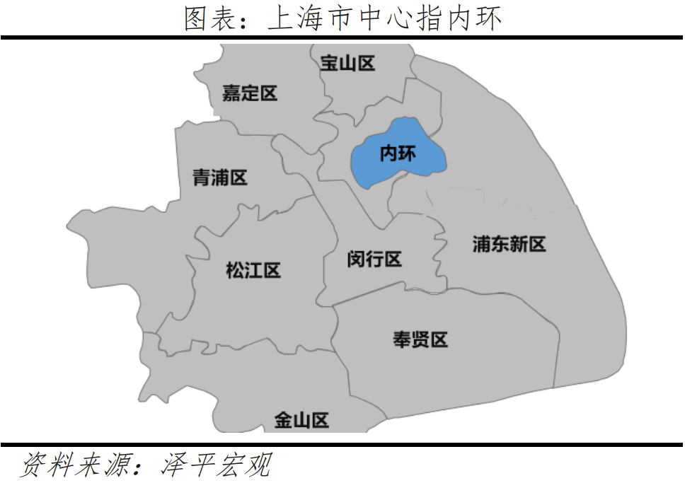

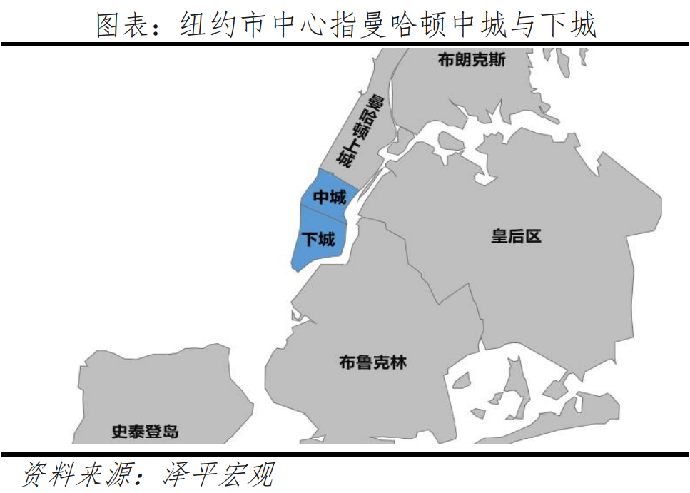

**1.2 核心城市房价高和涨幅高是世界普遍现象**

**2009年Q1-2022年Q1北上广房价上涨超3.5倍，高于全国平均。** 由于新房区位逐渐外移及限价等，以二手房衡量房价涨幅更有效。

全国层面缺乏二手房价数据，以新房价格计算，2010年6月-2022年4月百城新建住宅价格指数从9042元/平方米升至16193元/平方米，上涨0.8倍。根据房产中介数据，2009年一季度北京、上海、广州房价分别为12030元/平方米、14902元/平方米、6986元/平方米，2022年一季度分别上涨到44405元/平方米、51539元/平方米、24630元/平方米，分别上涨2.7倍、2.5倍、2.5倍。

其中，优质学区房涨幅达7倍以上，如北京育才小学划片小区耕天下，2009年2月12900元/平方米，2022年5月达110201元/平方米，上涨7.5倍。

**从国际经验看，核心城市房价高、涨幅高于其他地区是世界普遍现象。**
在英国，根据英国政府网站数据，1968年-2022年2月，大伦敦地区房价从0.44万英镑/套上涨至53万英镑/套，英格兰地区从0.34万英镑/套上涨至29.6万英镑/套，全国从0.36万英镑/套上涨至27.7万英镑/套，伦敦地区房价涨幅达119倍，高于英格兰地区的86倍和全国的76倍。

在美国，1975年Q1-2022年Q1，美国、纽约市、纽约-泽西-白原分区（纽约都会区分区之一）、洛杉矶-长滩-
格伦代尔分区（洛杉矶都会区分区之一）房价分别上涨8.6、10.2、13.1、22.4倍。

在日本，房地产泡沫破灭前，1975-1991年东京区部、横滨、名古屋、京都、大阪、神户等六个核心城市地价上涨4.5倍，其他城市上涨1.7倍。

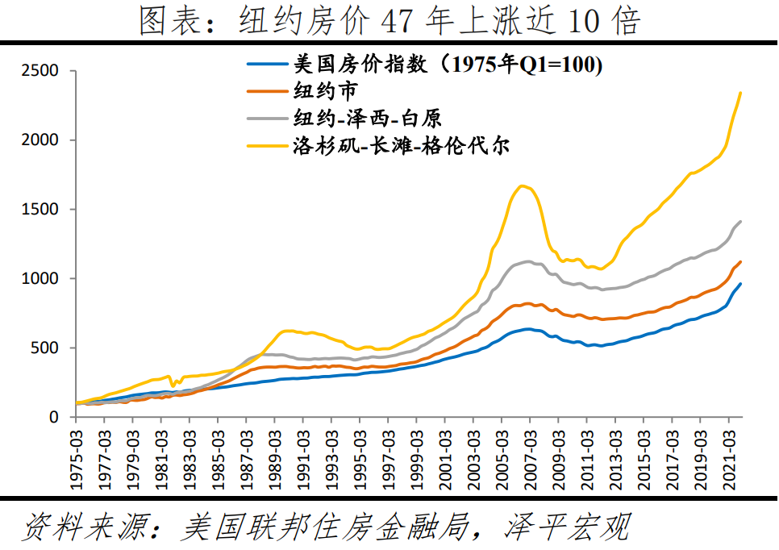

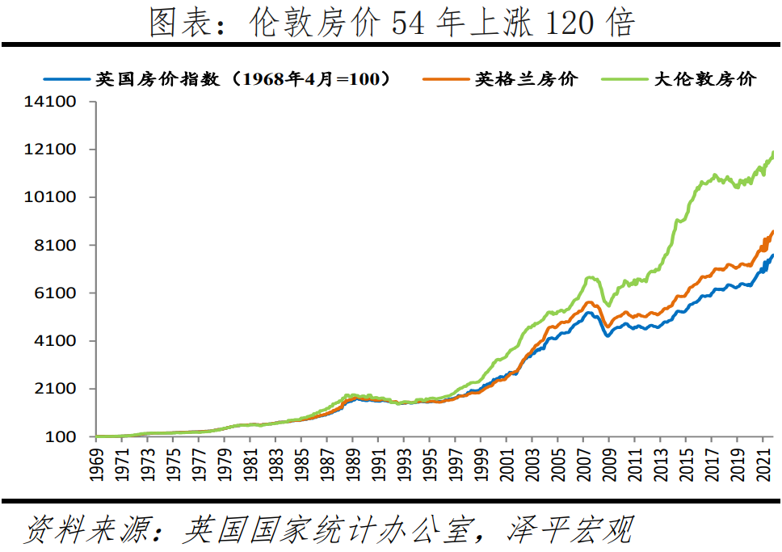

**1.2 北上深绝对房价位居世界前列**

**换算为可比的使用面积后，北京、上海和深圳市中心及外围区房价均处于世界前列，但顶级豪宅价格低于国外。**
国际房价比较需注意统计口径。中国内地住房面积统计口径为建筑面积，包括使用面积、墙体占用面积、公摊面积，而大多数国家和地区是套内面积或使用面积。

如中国香港采用套内面积，套内面积=建筑面积-公摊面积；美国、英国、韩国等是使用面积，使用面积=套内面积-
墙体占用面积。一般而言，套内面积约为建筑面积的80%，使用面积约为建筑面积的70%。

**在中心区域，**
根据Numbeo数据，2022年5月中国香港以218388元/平方米位居第一，首尔以150948元/平方米位居第二，伦敦以113551元/平方米位居第八，纽约以99640元/平方米位居第十四，北京、深圳、上海分别以134796元/平方米、124458元/平方米、124113元/平方米位居全球第四、第五、第六，广州以92699元/平方米位居第十七。

**换算为使用面积后，**
北京、深圳和上海中心区实际房价分别为192566元/平方米、177795元/平方米和177305元/平方米，超过首尔，仅次于中国香港，广州为132428元/平方米，位居第八。但中国内地一线城市中心区的顶级豪宅单价低于国际大都市，比如纽约中心区最贵的豪宅是位于曼哈顿中城的公园大道432号，俯瞰纽约中央公园，单价约48.3万元/平方米。

而上海浦东中心区最贵的豪宅是位于陆家嘴金融区紧邻黄浦江的汤臣一品，单价约25.7万元/平方米，以使用面积算，单价为36.7万元/平方米，浦西中心区最贵的豪宅是紧邻太平湖的翠湖，单价约23.4万元/平方米，以使用面积算，单价为33.4万元/平方米。

**在外围区域，**
中国香港以148394元/平方米位居第一，北京以76324元/平方米位居第二，上海、深圳分别以65134元/平方米、51411元/平方米，位居第七、第二十五，依然处于世界前列，但相对中心区域排名有所后移，广州以41051元/平方米位居三十八。换算为使用面积后，北京、上海和深圳城市外围区房价分别为109035元/平方米、93048元/平方米和73444元/平方米，位居第二、第三、第五，仅次于中国香港，广州为58644元/平方米，位居第十六。

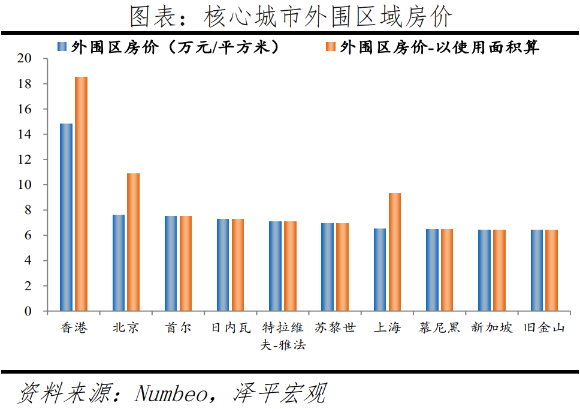

**1.3 中国内地一线城市房价收入比高，租金回报率不足1.9%**

**以使用面积算，北上广深市中心房价收入比分别为54、45、35、32，高于纽约的7，东京的9，伦敦的14；外围区房价收入比均在10以上，同样高于纽约、伦敦和东京。**
Numbeo只公布了全市房价收入比，我们采用Numbeo公布的房价平均数据和人均可支配收入，以及我们整理的人均住房面积计算市中心和外围区的房价收入比。

根据Numbeo，2022年5月，北京、上海、广州、深圳市中心的房价收入比分别为38、32、24、22，外围区的房价收入比分别为22、17、11、9，而纽约市中心和外围区房价收入比分别为7、4，伦敦市中心和外围区房价收入比分别为14、6，东京市中心和外围区房价收入比分别为9、6。换算为使用面积后，中国内地一线城市实际房价收入比更高，北京、上海、广州、深圳市中心的房价收入比分别为54、45、35、32，外围区的房价收入比分别为31、24、15、13。

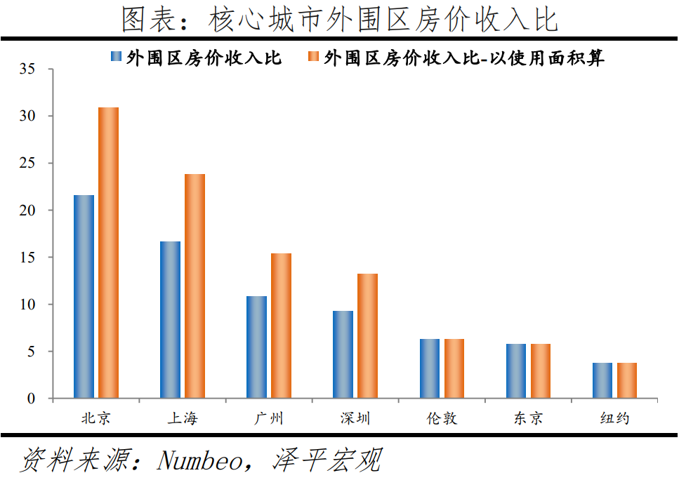

**北上广深市中心租金回报率不足1.9%，低于纽约的4.6%、伦敦的3.2%、东京的2.8%。**
租金回报率是住房每年租金与售价的比值，租金回报率低意味着投资房地产的现金贴现率低。根据Numbeo2022年5月数据，在全球主要482个城市中，市中心的静态租金回报率平均值为5.70%，中位值为4.54%，外围区的静态租金回报率平均值为7.46%，中位值为5.29%。

其中，纽约市中心与外围区的租金回报率分别为4.62%、5.82%，伦敦为3.23%、4.60%，东京为2.75%、2.54%,而北京、上海、广州、深圳市中心租金回报率分别为1.49%、1.81%、1.34%、1.05%，外围区租金回报率分别为1.61%、1.95%、1.44%、1.28%。我们使用中国房地产协会旗下中国房价行情网数据进行验证，2022年4月年北京、上海、广州，全市范围的租金回报率分别为1.88%、1.68%、1.63%。

**1.4 考虑持有费用后北上广深与国际都市相对房价差距缩小**

**国际核心城市普遍征收房地产税、且物业费等较高，持有成本明显高于中国内地。**
在不考虑房地产税从个人收入所得税中扣除情况下，纽约市房地产税率为0.8%，市中心物业费约为104元/平方米/月，外围区物业费约为80元/平方米/月；除此之外，业主还需根据房产面积和档次的不同，每年缴纳1000-5000美元的房屋保险费。伦敦业主需要缴纳市政税，约占房价的0.3%-1.2%，实际税率随房价上升而下降，伦敦市中心物业费约为44元/平方米/月，外围区物业费约为23元/平方米/月。

东京业主每年需要缴纳房屋评估价1.4%的不动产税和0.3%的市政建设税，房屋评估价约为售价的20%，市中心和外围物业费分别为22元/平方米/月、13元/平方米/月。

中国内地除上海和重庆作为试点外尚未推出房地产税，而且物业费较低，北京、上海、深圳市中心的物业费约为4.3元/平方米/月，外围区物业费约为3.5元/平方米/月，广州市中心物业费为2.9元/平方米/月，外围区物业费为2.4元/平方米/月。

**考虑持有费用后，以使用面积算，纽约、伦敦、东京市中心房价收入比分别为12、18、12，北上广深分别为55、46、35、32，纽约、伦敦、东京市中心租金回报率分别为2.5%、2.5%、2.1%，而北上广深分别为1.5%、1.8%、1.3%、1.0%，差距明显缩小。**

各地住房持有成本不同，为较准确比较实际的房价收入比和租金回报率，我们将房地产税、各项物业（管理）费等持有阶段的费用纳入考虑。假设居住30年，将这30年的持有费用按照假定5%的折现率计入房价，计算折现后的房价收入比。

纽约市中心和外围房价收入比分别为12、6，伦敦分别为18、8，东京分别为12、7，北京、上海、广州、深圳市中心的房价收入比分别为39、32、25、23，外围区的房价收入比分别为22、17、11、9。

以使用面积算，北京、上海、广州、深圳市中心的房价收入比分别为55、46、35、32，外围区的房价收入比分别为31、24、16、13。考虑持有费用后，纽约市中心和外围租金回报率分别为2.53%、3.34%，伦敦分别为2.47%、3.71%，东京分别为2.12%、2.11%，北京、上海、广州、深圳市中心的租金回报率分别为1.47%、1.78%、1.32%、1.03%，外围区的租金回报率分别为1.58%、1.91%、1.41%、1.25%。

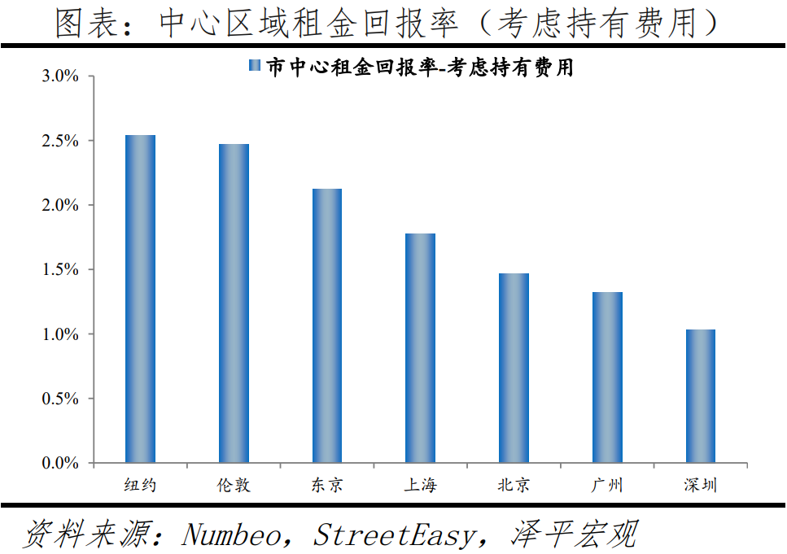

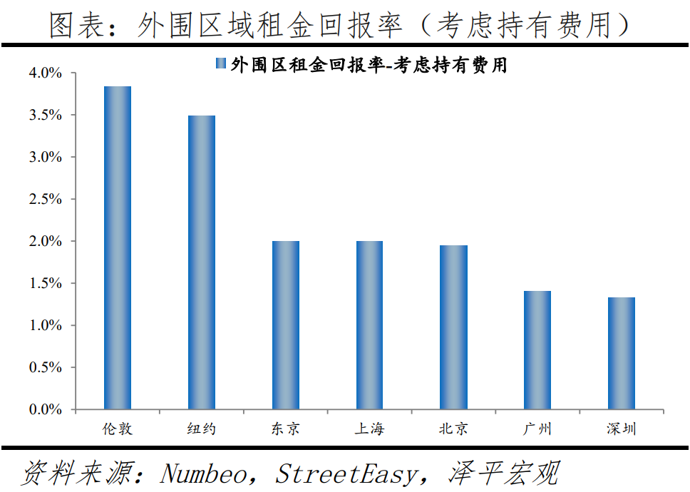

**1.5 北上广深房贷利率和居民房贷压力较高**

**北上广深房贷利率与首付比例高，北上广深首套房贷利率超4.4%，纽约、伦敦、东京均低于3.6%。**
从房贷利率看，中国内地个人房贷利率以贷款市场利率报价(LPR)来计算，首先央行给商业银行规定贷款基准利率，各地商业银行根据基准利率、银行额度、客户资信和风险情况在基准利率基础上浮动。

随着2022年房地产调整政策的放松，如央行下调5年期LPR利率等，一线城市房贷利率出现不同程度下调，北京、上海、广州、深圳的首套房贷利率为4.45%-5.4%，二套房贷利率为5.2%-5.65%；但仍高于纽约、伦敦、东京的房贷利率（3.0%-3.6%）。

从首付比例看，按商业贷款计算，北京首套普通住宅为35%，非普通住宅为40%，二套普通住宅为50%，非普通住宅为70%；上海首套住宅为35%，二套普通住宅为50%，非普通住宅为70%；深圳、广州首套住宅均为30%，城市无房但有住房或公积金贷款记录，则首套住宅分别为40%、50%，非普通住宅分别为70%、70%，二套普通住宅分别为70%、70%，非普通住宅为80、70%。

纽约为10%-30%，伦敦为5%-15%，北上广深首付比例较高。（普通住宅与非普通住宅根据容积率、单套建筑面积、实际成交价格等综合界定，如广州普通住宅为容积率在1.0（含）以上、单套住房建筑面积为144平方米（含）以下、实际成交价格低于同级别土地住房平均交易价格1.2倍（含）以下，反之为非普通)。

**北上广深居民房贷压力居世界前列，居民抵押贷款占收入比例超280%，是纽约、伦敦、东京的3-4倍。**
根据Numbeo定义，抵押贷款占收入比例指每月抵押贷款与家庭收入的比率（越低越好），贷款负担能力指数指抵押贷款占收入比例的倒数（越高越好）。

根据Numbeo的数据，2022年在全球主要的482个城市中，北京、深圳、上海、广州居民抵押贷款占收入的比例分别为422.78%、353.96%、348.33%、284.27%，分别高居第九、第十三、第十四、第二十六；伦敦、东京、纽约居民抵押贷款占收入的比例分别为92.59%、74.5%、68.09%，排在150名以后。

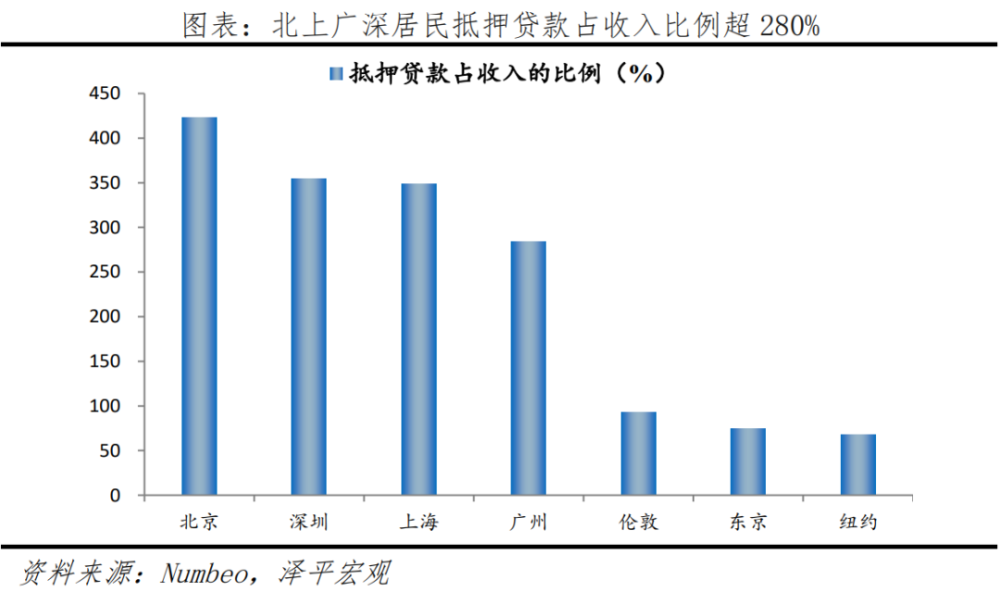

**2 1000万人民币能买什么房子？**

为增强直观认识，我们从自住出发，假定有1000万人民币预算，讨论在北京、上海、纽约、伦敦核心区和外围区分别能买什么品质的住宅以及持有费用。为增强可比性，我们将核心区的选房区域缩小在距离CBD或金融商业区2.5公里内范围，且避开单价明显较高的豪宅楼盘。

**2.1 核心区能买到的住宅使用面积差距不大**

**1000万在北京、上海、纽约、伦敦核心区域CBD附近能购买的住宅使用面积差距不大，在61-69平方米左右；纽约和伦敦市中心住宅持有费用远高于北京和上海，纽约超16万人民币，伦敦超6万元，北京和上海不足7000元。**

在北京核心区，可购买西城区三环内的玺源台72平方米的二居室（使用面积接近50平方米），均价14万元/平方米，北接长安街，南依莲花河，西连西客站，东望金融街，属于首都功能核心区,物业费5461元/年。

在上海核心区，可购买陆家嘴金融区的浦江茗园87平方米两居室（使用面积约61平方米），均价11.5万元/平方米，紧邻各大金融机构，物业费3174元/年。

在纽约核心区，可购买曼哈顿1 Wall
Street公寓64平方米一居室，均价15.6万元/平方米，地处金融区中心，距离华尔街200米，房地产税8万元/年，物业费9.2万元/年，合计17.2万元/年。

在伦敦核心区，可购买London
Dock公寓69平方米一居室，均价14.5万元/平方米，位于泰晤士河北岸、伦敦金融城和金丝雀码头中间，为伦敦的心脏地带，距离CBD约1公里，步行10分钟即可到达火车站，市政税3万元/年，物业费3.8万元/年，合计6.8万元/年。

**2.2 纽约和伦敦的外围区能买面积更大的住宅**

**1000万在北京、上海外围区可购买使用面积在76-124平方米左右的住宅，而在伦敦、纽约外围区域可购买的使用面积分别为120、130平方米左右。**

在北京外围区，可购买南四环附近国韵村174平方米四居室（使用面积约122平方米），均价5.7万元/平方米，周边公园较多，有旺兴湖郊野公园、宣颐公园、碧海公园三大生态公园，但生活相关配套相对不完善，物业费7934元/年。

在上海外围区，可购买日月光水岸花园109平方米两居室或三居室（使用面积约76平方米），均价9.2万元/平方米，靠近2号线广兰路站，物业费2524元/年。

在纽约外围区，可购买皇后区27-28 Thomson
Avenue123平方米四居室，均价8.1万元/平方米，地铁30分钟可到达曼哈顿中城，房地产税2.1万元/年，物业费8.2万元/年，合计10.3万元/年。

在伦敦外围区，可购买Beaufort Park公寓127平方米三居室，均价7.9万元/平方米，位于伦敦西北四区，8分钟步行至地铁站，是传统白人居民区,
市政税3万元/年，物业费3.8万元/年，合计6.8万元/年。

**3 中国内地核心城市高房价明显存在泡沫吗？**

**3.1 中国内地核心城市高房价主要源于什么？**

**1）人口长期大量向一二线核心城市集聚，近10年一线城市人口年均增速2.37%，人口持续流入但增速放缓；二线城市人口年均增速1.91%，人口持续流入且增速小幅上升；三、四线城市人口年均增速0.43%、-0.49%，人口持续流出。**

房地产长期看人口，人随产业走、人往高处走。从国际经验看，人口不断从低收入地区到高收入地区，从城市化到大都市圈化。中国内地核心城市优质公共资源富集、产业特别是高端产业高度集聚，人口长期大量流入。总体看，2000-2020年一线、二线人口占比分别由3.7%、19.31%增至5.88%、24.39%，三、四线则由30.87%、42.98%降至30.50%、36.92%。

从趋势看，2000-2010年、2010-2020年，全国人口平均增速分别为0.57%、0.53%，一线人口年均增速分别为3.42%、2.37%，人口保持集聚，但增速放缓；上述两个时期，二线人口年均增速分别为1.53%、1.91%，人口持续流入且增速小幅上升；三线人口年均增速分别为0.53%、0.43%，略低于全国平均；四线仅为0.16%、-0.49%，明显低于全国平均，表明三、四线城市人口仍持续流出。

**2）核心城市优质公共资源高度富集，户籍制度使得公共资源与户口挂钩、户口基本与房产挂钩的情况更加促进高收入人群集聚。**
从教育看，2021年北京、上海一本率分别为43%、22%，分别为全国第一、第十；985大学数量分别为8所、4所，合计占全国的31%；211大学数量分别为26所、9所，合计占全国的29%。

从医疗看，北京、上海2020年三甲医院分别为56、39个，虽合计仅占全国的6.9%，但集聚了最顶级的医疗资源，如协和医院、301医院等。在现行户籍制度下，户口不仅是单纯的户籍登记，而且附带了区域教育医疗等公共资源。并且，按现行规定，户口要么登记于个人房产下、要么通过单位挂靠于集体户，这使得户口与住房基本挂钩。

核心城市的房子不仅是具有居住功能的建筑物，而且捆绑了一系列的稀缺资源和优质福利。尽管当前部分城市允许租房入学，但条件较多、且排序一般在户口和住房均在本学区的家庭之后。在国际上，尽管美国也有学区制度，但家庭在学区拥有居住资格即可，可采用租赁方式；并且，美国的学区分布相对均匀，并未主要集中在部分大城市。此外，尽管北京、上海近期人口增长放缓、甚至陷入负增长，但流出的主要是中低收入人群，高收入人群很可能仍在持续流入。

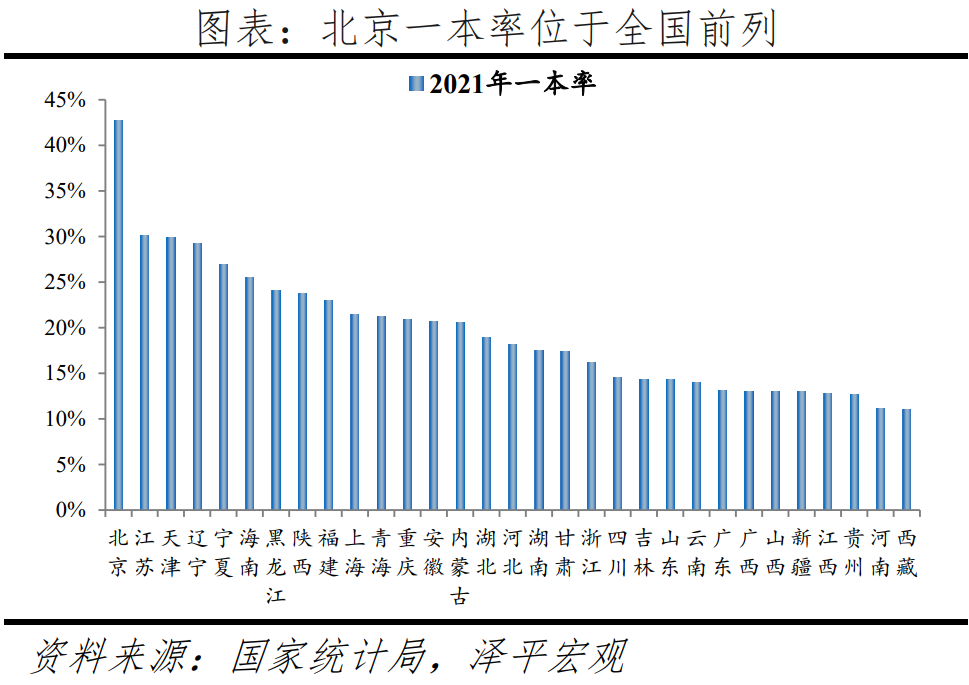

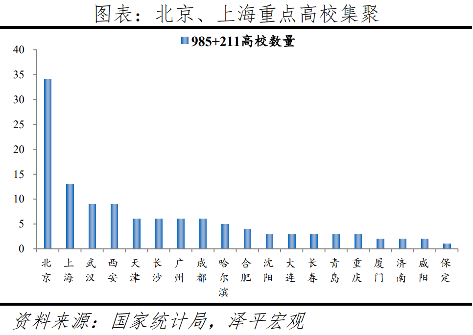

**3）在土地资源计划配置、城乡二元制度、中小城市战略等因素影响下，建设用地在城镇、乡村之间配置失衡，城镇用地在地区、城市之间配置失衡。**
中国城乡二元户籍制度与土地制度无法调动了市场对人口和土地的有效配置，导致进城不能落户、迁徙不能定居的农民工不愿无偿放弃乡村宅基地，农民工群体在城镇和乡村“双重占地”。2009-2016年人均城镇建设用地仅增长5.8%，而人均乡村建设用地增长21.5%。

中国城镇化战略长期存在“控制大城市规模、积极发展中小城市”的倾向，与人口迁移趋势背离。分地区看，2009-2016年东部城镇建设用地增量比例低于城镇人口增量比例12.9个百分点；而中部、东北、西部分别高1.7、4.4、6.8个百分点。分规模城市看，2006-2018年1000万人以上城市城区人口增长46.8%，建设用地仅增长41.7%；20万人以下城市人口增长2.1%，建设用地增长22.9%。

**4）货币超发使得广义货币增速多高于名义GDP增长，刺激一线城市的房地产价格快速上涨。**
从国际看，1987-2022年2月英国房价年均增长6%，虽高于4.1%的名义GDP年均增速，但仍然低于7.1%的广义货币年均增速；1960-2021年美国房价年均增长4.5%，而名义GDP和M2年均增速分别为6.3%、7.2%。

从大都市圈看，在美国，1975-2021年，纽约-泽西-
白原分区房价年均增长5.8%，低于同期M2的6.9%，与GDP的5.8%相同。在日本，1975-1991年六个核心城市地价年均增长11.2%，其他城市地价年均增长6.4%，同期M2年均增长约9%。在中国，过去四十年广义货币供应量M2年均增速15%，1998年以来全国新建住房销售均价年均复合增速达7.72%，低于同期M2增速近8个百分点，而一线城市房价基本与M2增速持平。

**3.2 房价收入比和租金回报率的国际可比性很差**

**“房价收入比4-6是合理区间的国际惯例”为讹传，国际并不存在一个客观标准。**
房价收入比反映的是居民家庭对房价的支付能力，比值越高，支付能力越低。Weicher(1977)最早使用房价收入比作为住房支付能力判别指标,其房价收入比为每套房屋销售价格中位数与家庭年收入中位数之比，计算了1949-1975年美国房价收入比，大多数位于2.8-2.9。1989年10月香港大学专家伯纳德指出，发达国家房价收入比在1.8-5.5,发展中国家一般在4-6。后来,伯纳德搜集到较多国家房价收入比资料后,发现一些经济落后的发展中国家房价收入比远高于6。1998年联合国统计了96个经济体房价收入比，最高为30,最低为0.8,平均值8.4,中位数6.4，彻底否定了4-6倍是国际标准的论点。然而部分中国学者和相关机构在引入房价收入比概念时，忽视中国经济水平、文化传统、房地产发展阶段等因素，不约而同地引用“4-6”这个所谓“国际标准”进行国际比较，这显然是有问题的。

除土地供给不足外，加上中国居民收入统计不全、高储蓄率、高经济增速等情况，使得房价收入比、租金回报率不具备国际可比性。

**中国经济增速在全球较高，核心城市相对房价高是成长性的反映。**
如果把经济体或城市比作一家公司，住房可类似为这家公司的股票，房价是股价，租金回报率是股息率。以中国股市为例，由于成长性不同，主板和创业板的股票估值不具备可比性。在主板，公司业绩增长稳定但不具备爆发性，估值一般；在创业板中，公司业绩增长较快，股票估值较高，高估值是对未来盈利的提前反映。当前中国经济虽从高速增长阶段转向高质量发展阶段，但经济增速在全球仍较高。核心城市是中国经济的核心，高端产业集聚、人口大量集聚，成长性更具优势。

**由于人口结构变化，居民消费观念改变等因素，近年中国居民储蓄率虽有小幅下滑，但仍高达35%，是欧美发达国家2倍以上，高储蓄率推升房价收入比，房子也被当成储蓄替代品，同时中国的文化传统、婚育观念等也在一定程度增加对住房需求。**
根据OECD统计口径，居民储蓄率指居民储蓄余额/可支配收入总额。中国居民储蓄率远远高于欧美发达国家，2021年中国居民储蓄率高达35%，而美国、法国、德国、日本和英国仅仅分别为17%、16%、15%、12%、7%。居民储蓄率高意味着中国居民的购房资金准备相对充足，进而推升房价收入比至一个较高水平。

**4 启示**

长期住房制度建设。根据我们对《全球房地产》的研究，德国房价长期稳定主因是实行以居住导向的住房制度设计、有充足稳定的住房供给和规范发达的租赁市场、严厉遏制投机性需求和开发商暴利行为、稳健的货币和房贷政策、多核心且均衡发展的城市体系。

**根据我们对美国、日本、英国、中国香港、德国、新加坡等住房制度和房地产市场的研究，结合中国住房制度现状和发展阶段特点，建议以城市群战略、人地挂钩、金融稳定、房地产税为四大支柱构建长期住房制度。**

**一是推动都市圈城市群战略。**
根据对世界上几十个国家上百年的人口大迁移研究发现，人口往都市圈城市群迁移集聚是基本规律，人随产业走，人往高处走。符合国际规律，中国人口持续向珠三角、长三角城市群集聚。近10年珠三角、长三角城市群年均常住人口增量超180万人，成渝、中原城市群年均常住人口增量超65万人，但东北、西部等区域近年面临产业结构单一，呈现人口流出趋势。

分省份来看，中国人口从东北、西北向东南沿海城市群流动，2010-2020年年均常住人口增量前五的省是广东、浙江、江苏、山东、河南，此时期甘肃、内蒙古、山西、辽宁、吉林、黑龙江等6省人口萎缩，全部位于北方。具体来看，2000-2010年粤、浙年均常住人口增量分别为191.0万、85.0万人，2010-2020年粤、浙分别为216.9万、101.4万人，江苏两个时期分别为56.2万、60.9万人。

分城市看，人口持续向少数核心城市集聚。近10年深圳、成都、广州年均常住人口增量超55万，郑州、西安、杭州、重庆、长沙年均常住人口增量超30万。这些城市均为所在都市圈的核心城市，近年城市发展较为快速、“抢人”力度较大。

**长期以来，在“控制大城市人口、积极发展中小城市和小城镇、区域均衡发展”的小城镇派思路错误影响下，人口向大都市圈集聚，但土地供给向三四线城市倾斜，人口城镇化与土地城镇化明显背离。由此形成了人地分离、土地供需错配，这是导致一二线高房价、三四线高库存的根源。**

**党的十九大报告指出，以城市群为主体构建大中小城市和小城镇协调发展的城镇格局。**

**二是以常住人口增量为核心改革“人地挂钩”，优化土地供应。**
未来应坚持都市圈城市群战略，推行新增常住人口与土地供应挂钩、跨省耕地占补平衡与城乡用地增减挂钩，如东北和西部地区售卖用地指标，可以有效解决目前东北、西部用地指标大量浪费的问题，以及东南沿海用地指标短缺的问题。严格执行“库存去化周期与供地挂钩”原则，优化当前土地供应模式。丰富商品房、租赁房、共有产权房等多品类的供给形式，形成政府、开发商、租赁中介公司、长租公司等多方供给格局。

根据我们在《哪里的房价控制得好：长沙篇》中的研究，全国大部分一二线城市房价大涨的背景下，长沙的房价、房价收入比、涨幅在主要城市处较低水平。2021年长沙二手房均价1.1万元/平方米,低于武汉、郑州、南昌等二线城市；近10年长沙房价收入比维持在6—7，处于全国下游水平；近10年长沙商品住宅年均涨幅低于9.4%，低于大部分二线城市。长沙房地产调控得好的原因在于，
**长沙是典型多中心组团空间结构，土地供应量大，并且严格限制土地成交溢价率，**
设定商品房“成本+利润+税金”价格构成，既确保房企一定的盈利空间，也确保了房价相对稳定。

**三是保持货币政策和房地产金融政策长期稳定。**
根据我们在专著《全球房地产》中的研究，“房地产过度金融化”是风险之源。实行长期稳定的住房信贷金融政策，稳定购房者预期，支持刚需和改善型购房需求，同时抑制投机性需求。规范房企融资用途，防止过度融资，同时支持房企合理融资需求，提供一定时间窗口让存在问题的房地产企业有自救机会，即自身债务自清。

从德国看，中性稳健的货币政策与住房金融体系，是德国房价长期稳定的住房制度“三支柱”之一。二战后，
**德国央行首要目标是保持物价稳定，严格自律不超发货币；**
德国M2增速与经济增速基本匹配，货币供应水平合理，2020年M2占GDP比重102.9%，在主要发达国家中处于中等水平，低于欧元区126.2%的平均水平。
**在稳健货币政策和温和通胀水平背景下，德国房价和物价基本保持长期稳定**
，1970-2020年名义房价指数上涨185%，CPI指数上涨162%，远低于同期美国、英国等发达国家。

**四是稳步推动房地产税试点。**
随着大开发时代结束，存量房时代下土地出让金减少、交易环节税收减少，推出房地产税替代土地财政是大势所趋。从国际经验看，房地产税通常被成熟市场经济体作为地方财政收入的重要和稳定来源。2021年10月，全国人大常委会授权国务院在部分地区开展房地产税改革试点工作。

但稳增长是今年宏观经济的头等大事。财政部表示，综合考虑各方面的情况，今年内不具备扩大房地产税改革试点城市的条件。未来有必要建立科学的经济模型评估房地产税对各方影响。

