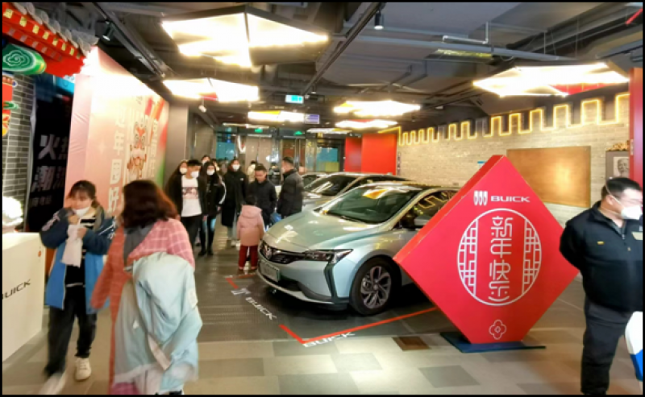

# 北方县城车市调查：新能源车不受青睐

春节期间，不少外出打工的人已经踏上归途，奔赴团圆。《华夏时报》记者也早早收拾行囊，回到了县城的老家。一眨眼，已是阔别三年。虽然早早的就离家读书、工作，但家乡依旧是见证了我成长的地方。如今，我也见证了家乡的成长。

还记得三年前，家乡的马路上出现最多的就是大众品牌的燃油车。然而此次回家，记者发现马路上除了品牌种类更多外，甚至还有了新能源汽车。这也意味着，新能源汽车正在下沉。为此，记者也在放假关门前，对车市做了探访。

**价格比4S店低，但买车者少**

由于记者老家不属于地级市，因此并没有4S店，大多都是一些汽贸店。这些汽贸店的特点就是没有单一品牌的束缚，店内可以摆放多个品牌。例如，记者走访的这家汽贸店就摆放了一汽大众、上汽大众、一汽丰田、哈弗、长安、北汽等品牌的车型。

该店销售人员对《华夏时报》记者表示：“我们只做燃油车型，在这种县城里大部分车商也都是在做燃油车型，价格会比4S店稍微低一些。并且还可以根据需求去选定车型，即便是店内没有摆放的，也可以下订。”

或许是由于临近过年的原因，记者并没有看到有客户进入附近的汽贸店。“店内是没有试驾车的，有部分消费者是去市里的4S店试驾，然后再回到这里买。不过，这样的消费者也不多，大部分都是直接去市里买了。”销售人员表示，店内的顾客很多都是熟人，或者熟人的朋友，一些没有交集的消费者还是会选择去4S店购买。

汽车分析师王坤对《华夏时报》记者表示：“在北方的城市当中，愿意在县城买车的消费者一直都不多，毕竟北方的地级市较少，大多都是汽贸店。而汽贸店大多都是以信息差为本，在服务方面有所欠缺，这也是很多消费者宁愿选择去城市中的4S店也不在汽贸店买车的一大原因。”

除了买车者较少外，记者还了解到，大部分县城中的消费者选择的车型都有着共同的特征，就是空间大、性价比高。因此，长城哈弗H6就成了不少消费者的购车首选。此外，长安CS75、上汽大众朗逸、一汽丰田卡罗拉也成为了县城当中的热销车型。

此外，虽然在马路上记者也看到了特斯拉Model 3和理想ONE等新能源车型，但在实际探店中，记者只看到了五菱宏光MINI
EV和雷丁汽车有售。“目前县里消费者对于新能源车型的接受程度还不高，即便是全国热销的五菱宏光MINI
EV也只有少数人会买，就路况而言，我们在售车时，也会首推燃油车型，毕竟现在充电设施少，电车跑不了多远。”销售人员表示。

由此来看，新能源车型在下沉市场虽然有所推广，但由于充电设施还没有普及，消费者对纯电车型的顾虑还有很多。

**商超展、小蓬车成宣传首选**

虽然县内没有4S店，但市里的经销商还是会针对县城以及乡镇做一些适当的宣传，以吸引消费者到店购买。

记者此次回家就发现商超内汽车品牌正在做展览，销售顾问也在积极的向消费者介绍车型。“每年都会做一些展览，自疫情开始商超展就做的多一些。一是为了推广品牌，二是为了发掘下沉市场的购买力。”销售人员对记者表示。

除了县城，记者还了解到，在农村地区，时不时会有小蓬车（宣传车）进入乡下腹地进行广播宣传，这其中有优惠也有进店礼等促销政策。这种宣传方式一般会出现在节前，平时只会在有车展的时候使用。不过这种宣传方式有一个弊端就是一晃而过，乡镇的消费者很难有机会和销售人员深入交流。

对于较为偏远的农村而言，获取汽车政策的方法较少，想要了解汽车优惠只能通过打电话或者进店咨询。不过，记者此次前往农村时发现，汽车也正在慢慢普及，很多民房前都有停放，大多为SUV车型。

记者随机询问了几位门前停有汽车的车主，大多都是从亲戚朋友那了解到汽车品牌后，再从网上查阅信息进行对比，选择适合自己的车型，再经历村民的口口相传。目前整个村子当中出现频率较高的汽车品牌就是长城哈弗和长安，而这两个品牌，也是整个县城中最畅销的品牌。

至于新能源车，村民压根不考虑，一是路况不允许，二是实用性太低。因此，即便有新能源下乡的政策，也无人问津。对此，王坤表示：“在使用场景上，乡村的用户更注重车辆的经济实用性。目前电动车的基础设施建设大多集中在大城市当中，乡村还没有普及。因此，即便开展了新能源汽车下乡，在短时间内也难以撬动下沉汽车市场的爆发力。”

汽车行业观察员赵永琦也有同样看法，他表示：“虽然新能源汽车增长速度很快，但是在农村消费者的消费观念较为保守，对新能源汽车接受程度不高。并且因为充电设施不完善，对于农村的居民而言容易造成出行困难。其次，补贴针对的是15万元以下的车型，而在这个价位，燃油车有很多选择，新能源汽车并没有竞争能力。”

通过此次探店，记者发现，虽然汽车保有量有所增长。但在县城中，消费者在购车时更加谨慎，购买的车辆大多都是具备较高性价比的车型。这也就导致市场出现了两极分化，符合需求的品牌不愁卖，其他品牌成交难。不过，可以预见的是，随着国家政策的不断推进，县级城市的购车市场也将进一步被激发。这时，或许会出现更多的市场机会。

