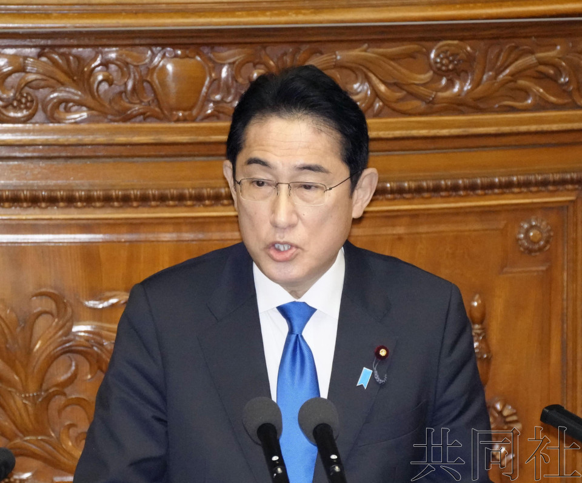

# 岸田文雄发表施政演说，美媒发现他急的点：发展军备和扭转低生育率

【环球时报-环球网报道 记者
丛超】日本首相岸田文雄1月23日在施政演说中渲染称，日本面临“二战结束以来该地区最严峻的安全环境”，因此要在未来5年及以后，根据新通过的安保战略推进军事建设，他还强调将解决出生率迅速下降的问题，“这样国家才能维持国力”。美国媒体在报道标题中总结称，“岸田文雄当务之急：发展军备和扭转低生育率”。

_1月23日下午，日本首相岸田文雄发表施政演说。_

据日本共同社23日报道，岸田文雄当天表示，日本已经站在能否作为一个社会继续运作的边缘，生育和育儿政策的问题已经到了“机不可失，时不再来”的状态，这个问题已经不能再拖了。岸田说，他将于今年6月前向国会提交计划，把育儿相关的预算翻一倍，此外，还将于今年4月设立新的“儿童家庭厅”。岸田强调，儿童政策“是对未来最有效的投资”。

据日本厚生劳动省推测，2022年日本新生儿数量将跌破80万人，刷新有记录以来的新低。按照预测，今年1月1日日本人口数量总共有1.24亿人，同比下降0.43%。在人口结构方面，65岁及以上人口占到总数的29%，而0-14岁的青少年占比只有11.6%。

岸田施政演说还着重提及所谓“强化防卫能力”，他声称，日本的新安保战略是基于现实的模拟。岸田再次表示，日本将在5年内增加近一倍安保预算，达到43万亿日元（100日元折合5.2元人民币），并提高网络和情报能力。但多出来的安保预算从哪里来一直是一个问题，只能通过增税获取，而这遭到日本国民的普遍反对。岸田已经面临着反对派议员，甚至来自他所在的执政党越来越多的批评。

值得注意的是，日本共同社注意到，岸田宣称，这虽是日本安全保障政策的大转变，但“坚持‘专守防卫’这一点丝毫不变”。

去年12月，岸田政府正式通过新版安保战略三文件，引发巨大争议。岸田在施政演说中称，这是日本安全政策的“急剧转变”。中国外交部发言人曾多次强调，近年来，日本在军事扩张的道路上越走越远。日本大幅增加防卫支出，大力发展反导、外空、高超音速武器等军事技术，强化美日军事合作，谋求发展“反击能力”等行为都对地区和平与稳定形成破坏，甚至有人鼓噪要同美国“核共享”。中韩等周边国家对日本的动向都表达了担忧和反对。

