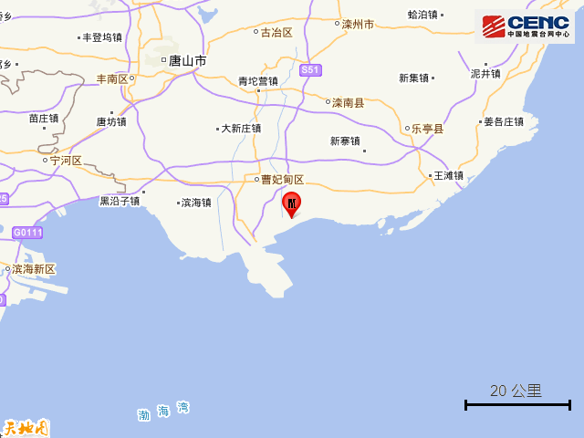
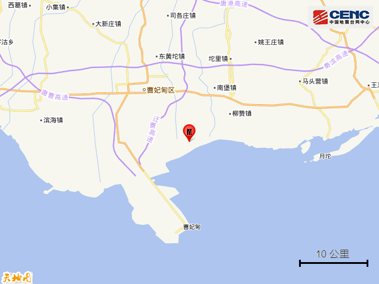
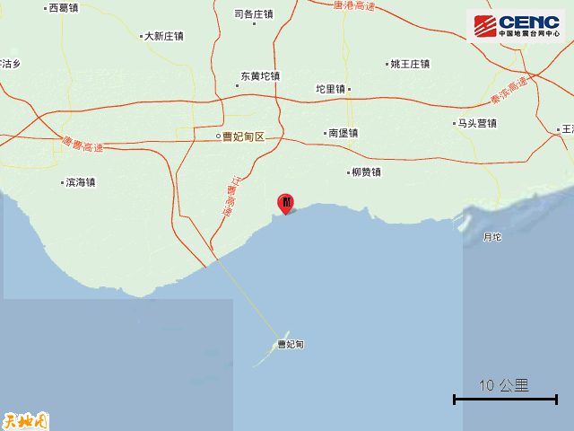
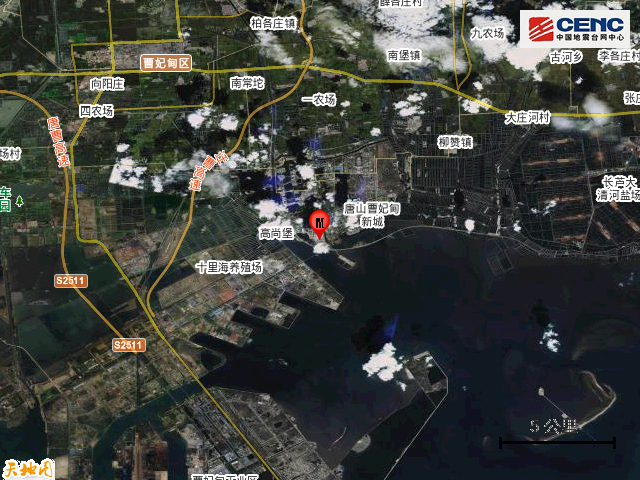
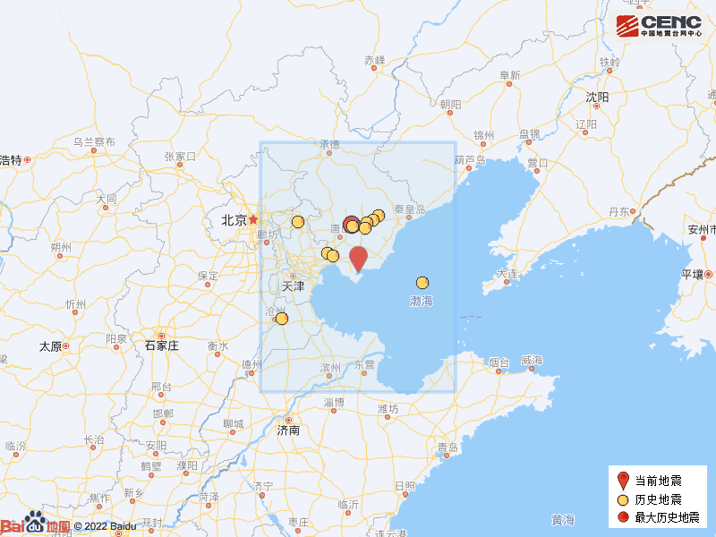

# 河北唐山市曹妃甸区海域发生2.4级地震

据中国地震台网正式测定，1月23日13时53分在河北唐山市曹妃甸区海域发生2.4级地震，震源深度12千米，震中位于北纬39.15度，东经118.56度，距海岸线最近约0公里。

震中5公里范围内平均海拔约-8米。

根据中国地震台网速报目录，震中周边200公里内近5年来发生3级以上地震共11次，最大地震是2020年7月12日在河北唐山市古冶区发生的5.1级地震（距离本次震中71公里），历史地震分布如图。

