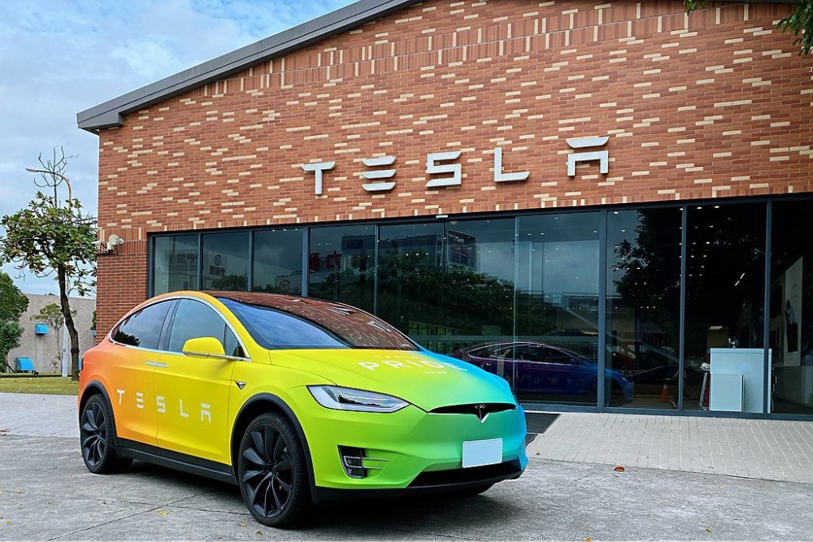

# 特斯拉第四季度营收利润同创历史新高，电动车总产量同比增长44%

腾讯科技讯
1月26日消息，特斯拉周三盘后发布了该公司截至2022年12月31日的第四季度及全年财报。财报显示，特斯拉第四季度总营收为243.18亿美元，同比增长37%；归属特斯拉股东的净利润为36.87亿美元，同比增长59%。

**划重点：**

  * _1_ 特斯拉第四季度总营收为243.18亿美元，同比增长37%。其中电动车营收为213.07亿美元，同比增长33%。
  * _2_ 特斯拉第四季度出售碳积分获得的营收为4.67亿美元，较去年同期的3.14亿美元增长49%。
  * _3_ 特斯拉第四季度归属普通股股东的净利润为36.87亿美元，同比增长59%。
  * _4_ 特斯拉第四季度电动车总产量为439,701辆，同比增长44%；电动车总交付量为405,278辆，同比增长31%。

**一、营收利润双超华尔街预期**

**1.营收超华尔街预期**

特斯拉第四季度总营收为243.18亿美元，较上年同期的177.19亿美元增长37%。其中，特斯拉电动车营收为213.07亿美元，较去年同期的159.67亿美元增长33%；发电和储能业务营收为13.10亿美元，高于上年同期的6.88亿美元；服务和其他营收为17.01亿美元，高于上年同期的10.64亿美元。

特斯拉第四季度总营收超出华尔街的预期。Refinitiv的统计数据显示，华尔街之前预计特斯拉第四季度的营收为241.6亿美元。

**2.利润超华尔街预期**

特斯拉第四季度归属普通股股东的净利润为36.87亿美元，较上年同期的23.21亿美元增长59%，好于上一季度的33.92亿美元；归属于普通股股东的每股摊薄收益为1.07美元，相比之下上年同期归属于普通股股东的每股收益为0.68美元，上一季度为0.95美元。不计入某些一次性项目（不按照美国通用会计准则），特斯拉第四季度归属于普通股股东的调整后净利润为41.06亿美元，较上年同期的28.79亿美元增长43%；调整后归属于普通股股东的每股摊薄收益为1.19美元，相比之下上年同期调整后归属于普通股股东的每股收益为0.85美元，上一季度为1.05美元。这一业绩好于华尔街此前预期。Refinitiv的统计数据显示，华尔街分析师平均预期特斯拉第四季度调整后每股收益为1.13美元。

**3.电动车产量交付量同环比增长**

特斯拉第四季度电动汽车总产量为439,701万辆，较上年同期的305,840辆增长44%，高于上一季度的365,923辆。其中，Model
S/X产量为2.06万辆，较上年同期的1.31万辆增长57%，高于上一季度的1.99万辆；Model
3/Y产量为41.9万辆，较上年同期的29.3万辆增长43%，高于上一季度的34.6万辆。

特斯拉第四季度电动汽车交付量为40.53万辆，较上年同期的30.9万辆增长31%，高于上一季度的34.4万辆。其中，Model
S/X交付量为1.71万辆，较上年同期的1.18万辆增长46%，高于上一季度的1.87万辆；Model
3/Y交付量为38.8万辆，较上年同期的29.7万辆增长31%，高于上一季度的32.5万辆。

**4.现金储备持续增长**

截至2022年12月31日，特斯拉持有的现金和现金等价物达到221.85亿美元，较截至2021年12月31日的177.07亿美元增长25%，较第三季度末的211.07亿美元增长逾10亿美元。特斯拉现金和现金等价物的增长，主要受自由现金流达到14亿美元，但部分被债务偿还4.97亿美元所抵消。

**5.公司点评**

2022年第四季度和2022年公司业绩再创历史新高。第四季度，特斯拉营收、运营利润和净利润均创出历史新高。2022年，特斯拉整体营收达到815亿美元，同比增长51%；净利润同比增长一倍以上，达到126亿美元。

进入2023年，宏观经济形势的不确定性，特别是利率上行仍将在短期内对特斯拉业绩构成影响。鉴于让公司走到今天这一步所需的文化，特斯拉团队习惯于挑战。近期内，我们将加快降低成本的路线图，提高生产率，同时继续专注于路线图的下一阶段。

在任何情况下，我们都为短期的不确定性做好准备，同时专注于自主、电气化和能源解决方案的长期潜力。我们坚持不懈的成本控制和成本创新是我们相信没有其他原始设备制造商比我们更有能力度过2023年，并最终取得长期成功的原因。

**二、财务总结**

**1.电动汽车营收环比增长**

特斯拉第四季度总营收为243.18亿美元，较上年同期的177.19亿美元增长37%。

特斯拉第四季度来自于电动汽车业务的营收为213.07亿美元，与去年同期的159.67亿美元相比增长33%，高于上一季度的186.92亿美元。其中，特斯拉第四季度来自于电动车汽车销售业务的营收为202.41亿美元，高于上年同期的150.25亿美元，高于上一季度的177.85亿美元；来自于电动汽车租赁业务的营收为5.99亿美元，低于上年同期的6.28亿美元，不及上一季度的6.21亿美元；特斯拉第四季度出售碳积分获得的营收为4.67亿美元，高于上年同期的3.14亿美元，高于上一季度的2.86亿美元。特斯拉第四季度来自于发电和储能业务的营收为13.10亿美元，高于上年同期的6.88亿美元；服务和其他营收为17.01亿美元，高于上年同期的10.64亿美元。

特斯拉第四季度营收实现同比和环比增长，主要受电动汽车业务营收环比增长的推动。特斯拉第四季度电动汽车总产量为439,701万辆，较上年同期的305,840辆增长44%，高于上一季度的365,923辆；电动汽车交付量为40.53万辆，较上年同期的30.9万辆增长31%，高于上一季度的34.4万辆。

**2.利润创历史新高**

特斯拉第四季度运营利润和净利润同创历史新高。其中，特斯拉第四季度运营利润为39.01亿美元，较上年同期的26.13亿美元增长49%，高于上一季度的36.88亿美元；运营利润率为16.0%，相比之下上年同期为14.7%，上一季度为17.2%。

特斯拉第四季度归属普通股股东的净利润为36.87亿美元，较上年同期的23.21亿美元增长59%，好于上一季度的33.92亿美元；归属于普通股股东的每股摊薄收益为1.07美元，相比之下上年同期归属于普通股股东的每股收益为0.68美元，上一季度为0.95美元。不计入某些一次性项目（不按照美国通用会计准则），特斯拉第四季度归属于普通股股东的调整后净利润为41.06亿美元，较上年同期的28.79亿美元增长43%；调整后归属于普通股股东的每股摊薄收益为1.19美元，相比之下上年同期调整后归属于普通股股东的每股收益为0.85美元，上一季度为1.05美元。这一业绩好于华尔街此前预期。Refinitiv的统计数据显示，华尔街分析师平均预期特斯拉第四季度调整后每股收益为1.13美元。

**3.现金储备增长**

截至2022年12月31日，特斯拉持有的现金和现金等价物达到221.85亿美元，较截至2021年12月31日的177.07亿美元增长25%，较第三季度末的211.07亿美元增长逾10亿美元。特斯拉现金和现金等价物的增长，主要受自由现金流达到14亿美元，但部分被债务偿还4.97亿美元所抵消。

特斯拉第四季度资本支出为18.58亿美元，高于上年同期的18.10亿美元，高于上一季度的18.03亿美元；自由现金流为14.2亿美元，较上年同期的27.75亿美元减少49%，不及上一季度的32.97亿美元。

**三、其他财务和运营亮点**

特斯拉第四季度运营支出为18.76亿美元，较上年同期的22.34亿美元减少16%，高于上一季度的16.94亿美元。其中，研发支出为8.1亿美元，相比之下上年同期为7.4亿美元；销售、总务和行政支出为10.32亿美元，相比之下上年同期为14.94亿美元；重组和其他支出为0.34亿美元，相比之下上年同期未有该项数据。

特斯拉充电基础设施的增长超过了其商店和服务中心的增长。截至第四季度末，特斯拉拥有764个商店和服务点，4678个超级充电站（共有42419个超级充电站连接）。这些数据表明，商店和服务中心的数量同比增长19%，充电站的数量同比增长35%。

**四、业绩展望**

特斯拉表示，该公司计划尽快扩大产能，实现2021年初制定的年复合增长率达到50%的目标。因为诸多因素的影响，特斯拉一些年份的增长速度会更快一些，一些年份会更慢一些。2023年，特斯拉仍将努力实现50%年复合增长率的目标，全年电动车产量达到180万辆。（腾讯科技/无忌）

