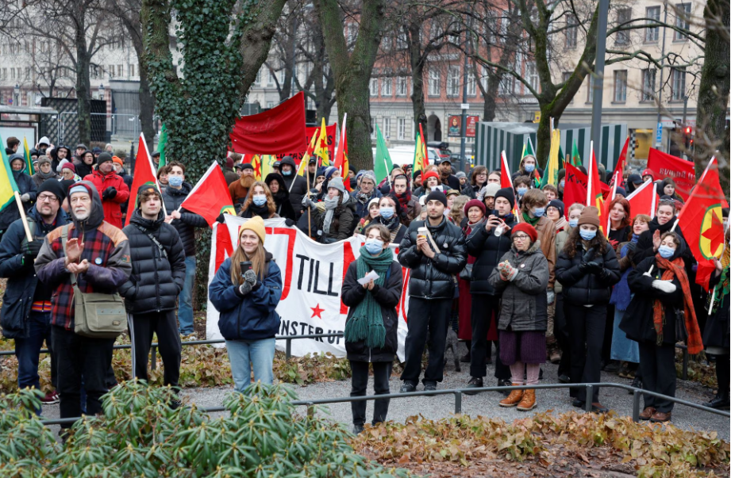
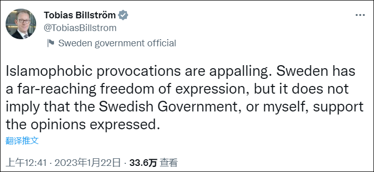

# 瑞典首都街头焚烧古兰经，土耳其怒了：召见大使、严厉谴责

（观察者网讯）如今，瑞典距加入北约仅剩“一国之遥”，土耳其的反对引起瑞典国内不满情绪。当地时间1月21日，瑞典首都斯德哥尔摩一连举行了三场涉及土耳其和北约的抗议活动。期间，一名极右翼政党的领导人在土耳其大使馆附近公开焚烧了《古兰经》，以示对土耳其的不满。

这一举动引发轩然大波。土耳其外交部发声谴责、瑞典驻土大使被召见、瑞典防相访问计划被土方取消……一时间，瑞典和土耳其的紧张关系加剧。

_丹麦极右翼政党领导人焚烧《古兰经》，视频截图_

据路透社和英国《每日电讯报》报道，焚烧《古兰经》的人是拥有丹麦、瑞典双国籍的丹麦极右翼政党“强硬路线”的领导人帕鲁丹（Rasmus
Paludan）。帕鲁丹声称，他的抗议针对伊斯兰教，以及土耳其总统埃尔多安“试图影响瑞典的言论自由”。

帕鲁丹过去举行过多次针对伊斯兰教的示威活动。去年，他曾宣布会在穆斯林斋月期间举行焚烧《古兰经》的“巡回演出”，在瑞典各地引发了骚乱。

同日，斯德哥尔摩还举行了另外两场示威活动：一场反对瑞典加入北约、支持库尔德人；一场支持土耳其人。当地警方表示，三场示威活动均平静结束，且事前都得到了警方的许可。

在抗议瑞典加入北约、支持库尔德人的示威活动中，活动组织者之一、“反对北约联盟”发言人佩特森（Thomas
Pettersson）对路透社表示：“我们将继续反对瑞典加入北约。”

_21日，斯德哥摩尔举行多场示威活动。图自路透社_

《古兰经》被公开焚烧一事，令土耳其方面极为不满。

“我们以最强烈的措辞谴责对圣书的卑鄙袭击……”土耳其外交部在第一时间发布声明，称瑞典政府“允许这种以言论自由为幌子、以穆斯林为目标、侮辱我们神圣价值观的反伊斯兰行为，是完全不可接受的”。土耳其外交部敦促瑞典对涉事者采取必要行动，同时召见了瑞典驻土耳其大使。

另据土耳其每日新闻网（hurriyetdailynews）报道，土耳其还取消了瑞典国防大臣的访问计划。

“瑞典防相琼森（Pal Jonson）1月27日访问土耳其的计划已经失去了价值和意义，所以我们取消了此次访问”，土耳其国防部长阿卡尔（Hulusi
Akar）21日表示，尽管土方早已发出警告，但“这个人还是得到了示威许可”，“没有人可以将这种行为称作言论自由和思想自由”。

同日，约200名抗议者聚集土耳其首都伊斯坦布尔，作为对《古兰经》被焚烧一事的回应，在瑞典驻土耳其大使馆前点燃了瑞典国旗。据法新社记者报道，有抗议者呼吁土耳其与瑞典断交。

与此同时，伊斯兰国家的谴责声音也如潮水般涌来。截至目前，包括阿联酋、沙特阿拉伯、约旦和科威特在内的多个国家谴责发生在瑞典的焚烧《古兰经》的行为。

瑞典则紧急“灭火”。瑞典外交大臣比尔斯特罗姆（Tobias
Billström）在推特发文称：“伊斯兰恐惧症者的挑衅行为令人震惊。瑞典有广泛的言论自由，但这并不意味着瑞典政府或我本人支持所表达的观点。”

_推文截图_

去年5月，瑞典和芬兰正式提交了加入北约的申请。但土耳其的反对令两国的入约进程蒙上阴影。根据北约制定的规则，瑞典和芬兰若想成为北约成员国，必须得到北约现有成员国的一致同意。换言之，土耳其对两国加入北约一事存在“一票否决权”。

去年6月，土瑞芬三国敲定“入约”备忘录。备忘录中，瑞芬两国承诺将支持土耳其的反恐工作，包括承认库尔德工人党（PKK）为被禁止的恐怖组织，引渡土方认定的与2016年在土耳其发动未遂政变的“居伦运动”有关的“恐怖分子嫌疑人”。

不过，瑞典入约进程仍不顺利。瑞典方面认为，该国已经履行了备忘录中部分要求，是土耳其“要的太多了”。但土方坚称，瑞典“做的还不够”。

当地时间1月14日，土耳其总统发言人易卜拉欣·卡林透露，在今年6月的国内大选结束前，土耳其不会就瑞典和芬兰加入北约一事提请议会表决批准。15日，土耳其总统埃尔多安再次要求瑞典向土耳其引渡130名“恐怖分子”，并称这是瑞典获得加入北约权利的必要条件。

**本文系观察者网独家稿件，未经授权，不得转载。**

