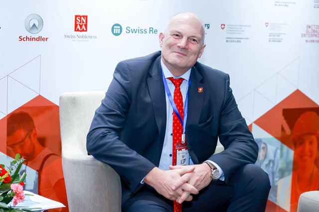
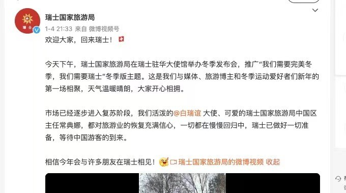

# 瑞士驻华大使：中国游客在瑞士很受欢迎，在欧洲很受欢迎

20日，文化和旅游部发布恢复旅行社经营中国公民赴有关国家出境团队旅游业务相关事项通知。

从2023年2月6日起，试点恢复全国旅行社及在线旅游企业经营中国公民赴有关国家出境团队旅游和“机票+酒店”业务。即日起，旅行社及在线旅游企业可开展产品发布、宣传推广等准备工作。

涉及的国家和地区包括：泰国、印度尼西亚、柬埔寨、马尔代夫、斯里兰卡、菲律宾、马来西亚、新加坡、老挝、阿联酋、埃及、肯尼亚、南非、俄罗斯、瑞士、匈牙利、新西兰、斐济、古巴、阿根廷。

瑞士驻华大使白瑞谊（Jürg Burri）18日告诉第一财经记者：“我们正在准备（迎接工作）。中国游客在欧洲很受欢迎，在瑞士很受欢迎。”

白瑞谊对记者表示，对于去瑞士旅行的游客，目前瑞士官方没有任何限制或障碍。

**正在进行能力建设**

如前所述，瑞士位于中国文旅部恢复旅行社经营中国公民赴有关国家出境团队旅游业务涉及的首批国家和地区名单之中。

第一财经记者看到，瑞士旅游局在其微博账号多次发布内容，欢迎中国游客归来。比如，在1月4日，瑞士旅游局在微博上写道：“欢迎大家，回来瑞士！一切都在慢慢回归中，瑞士已做好一切准备，等待中国游客的到来。相信今年会与许多朋友在瑞士相见！”

白瑞谊对第一财经记者表示：“我们将看到申请签证以及希望去瑞士旅行的这种势头复苏，我们正在再次进行能力建设。”

他解释道，目前可能在接待方面，瑞士还没有为接待大量中国游客来访做好准备。同时，他并不认为“境况会一下子恢复到2019年”。

“这可能需要步骤。我的诸位同事现在正在努力。”他说，可能要看的是“五一”或者“十一黄金周”的（数字）。

20日，在外交部例行记者会上，中国外交部发言人汪文斌表示，中国政府发布新冠病毒感染实施“乙类乙管”总体方案和中外人员往来暂行措施后，出入境人员数量逐步增加，许多国家热烈欢迎中国游客到访。

他说，近期，中国公民出境旅游意愿明显上升，恢复旅游活动条件更加成熟。根据中外人员往来暂行措施，中方本着安全有序的原则，着手试点恢复中国公民出境旅游。主管部门将指导旅游企业周密组织实施，我们也提醒游客，出行前做好自我健康管理和监测，严格遵守我国及当地防疫要求，确保健康出行，愉快旅游，平安回家。

近期，联合国世界旅游组织（UNWTO）在最新发布的《2023年全球旅游业晴雨表》（下称“晴雨表”）中预测，2023年全球国际游客抵达人数可能恢复到疫情前水平的80%-95%，具体取决于经济放缓情况、亚太地区的旅游恢复情况等因素。

UNWTO数据显示，2022年全球国际游客抵达人数是2021年的两倍，达9亿人次，恢复到疫情前水平的63%。其中，欧洲在2022年迎来了5.85亿游客，达到了疫情前水平的近80%。

**目前瑞士对游客没有任何限制或者障碍**

1月11日，瑞士联邦委员会表示，不会对从中国乘机赴瑞士的旅客实行强制检测措施。

瑞士联邦委员会给出的解释是，瑞士已经有相当比例的人口接种疫苗，奥米克戎变异株对瑞士不会构成较大风险威胁，中国出现其他变异株的可能性不会高于其他地区。

当然，瑞士也将继续对病毒传播情况进行系统监测，密切关注事态发展，特别是在识别新变异方面。如有必要，将及时调整边境卫生措施。

不过，世界上也有一些国家选择对有中国旅居史的旅客出台一些强制检测措施。

白瑞谊对第一财经记者表示，瑞士之所以作出上述决定，是因为“到目前为止，我们还没有看到需要做出这样（实行强制检测）决定的相关证据或者数据”。他说：“我们没有说永远不会这样做。这不是原则。但是到目前为止，我们也从未看到能推动我们这样做的证据。”

