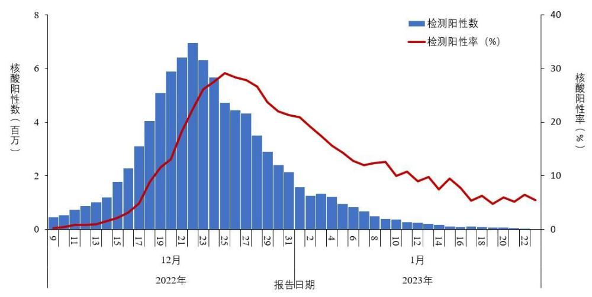

# 中疾控发布全国新冠感染情况：在院死亡病例数1月4日达到峰值

**一、感染监测数据** **（一）全国报告人群新冠病毒核酸检测结果。**
2022年12月8日以后，全国（不含港澳台，下同）不再开展全员核酸筛查，实行愿检尽检，同时部分地区对重点人群开展定期核酸检测。各省份利用已有的核酸检测信息系统，实时掌握核酸检测数据。受居民检测意愿影响，各省份核酸检测量不断减少，如12月9日检测量为1.5亿，2023年1月1日降至754万，1月23日降至最低28万。
2022年12月9日以来，各省份报告人群核酸检测阳性数及阳性率呈现先增加后降低趋势，阳性人数12月22日达到高峰（694万）后逐步下降，2023年1月23日降至最低1.5万；检测阳性率12月25日（29.2%）达高峰后逐步下降，1月23日降低到5.5%（图1-1）。

_图1-1
全国报告人群新型冠状病毒核酸检测阳性数及阳性率变化趋势（数据来源于31个省（区、市）及新疆生产建设兵团报告）_

**（二）全国报告人群新冠病毒抗原检测结果。**
2022年12月以来，部分省份建立居民抗原检测信息收集应用程序（APP），居民可自愿上传抗原检测结果。结果显示：各省份报告抗原检测量较低，呈现逐渐减少趋势，从2022年12月19日的最高189万下降到2023年1月23日的最低10.5万；抗原检测阳性数及阳性率自2022年12月9日快速上升，12月22日达高峰（33.7万、21.3%）后波动下降，2023年1月23日降至最低，分别为4773和4.5%（图1-2）。

_图
1-2 全国报告人群新型冠状病毒抗原检测阳性数及阳性率变化趋势 （数据来源于31个省（区、市）及新疆生产建设兵团报告）_

**二、全国发热门诊（诊室）诊疗情况**

**（一）总体就诊人数结果**
。全国（不含港澳台）发热门诊（诊室）就诊人数于2022年12月23日达到峰值286.7万人次，随后连续下降，2023年1月23日下降到6.3万人次，较峰值下降了97.8%（图2-1）。

_图2-1
全国发热门诊（诊室）诊疗人数变化趋势 （数据来源于31个省（区、市）及新疆生产建设兵团报告）_

说明：自2022年12月9日起，监测二级以上医疗机构发热门诊诊疗量；12月21日起，增加监测社区卫生服务中心和乡镇卫生院发热诊室诊疗量（不含村卫生室和社区卫生服务站）。

**（二）农村发热门诊就诊人数结果。**
全国乡镇卫生院发热门诊（诊室）就诊人数于2022年12月23日达到峰值92.2万人次，随后波动下降，2023年1月23日下降至5.0万人次，较峰值下降了94.6%（图2-2）。

_图2-2 全国农村地区乡镇卫生院发热门诊（诊室）就诊人数变化趋势 （数据来源于31个省（区、市）及新疆生产建设兵团报告）_

说明：农村发热患者诊疗量为乡镇卫生院发热诊室诊疗量（不含村卫生室）

**（三）城市发热门诊就诊人数结果。**
全国二级以上医疗机构和城市社区卫生服务中心发热门诊（诊室）就诊人数于2022年12月22日达到峰值195.4万人次，随后连续下降，2023年1月23日下降至1.2万人次，较峰值下降了99.4%（图2-3）。

_图2-3
全国城市发热门诊（诊室）就诊人数变化趋势 （数据来源于31个省（区、市）及新疆生产建设兵团报告）_

说明：城市发热门诊诊疗量含二级以上医疗机构和社区卫生服务中心（不含社区卫生服务站）。

**（四）哨点医院监测结果。**
2022年12月9日起，在我国已建立的824家流感监测网络哨点医院（包括国家级哨点医院546家、省级哨点医院278家）和402家国家级网络实验室开展新冠病毒核酸检测。结果显示：2022年9月-12月上旬，哨点医院每周流感样病例（体温≥38℃，伴咳嗽或咽痛之一）数量稳定在10万左右，至第51周（12月19日-25日）达到最高60万；流感样病例占门（急）诊就诊人数比值在2.7%-3.6%区间波动，第50周（12月12日-18日）明显上升至8.5%，第51周达到最高12.1%，第52周起快速下降，2023年第3周（1月16日-月22日）已下降至2.0%，回落至本轮疫情之前水平（图2-4）。

_图2-4
全国哨点医院报告的流感样病例数及占比变化趋势 （数据来源于824家哨点医院）_

网络实验室对流感样病例标本同时进行新冠病毒和流感病毒检测，从2022年第49周（12月9日），新冠病毒阳性率开始逐渐增加，在第51和52周期间达峰值后开始波动下降；同期流感病毒阳性率则逐步降低，至12月下旬降至极低水平（图2-5）。

_图2-5 全国哨点医院流感样病例新冠和流感病毒阳性率变化趋势 （数据来源于402家网络实验室）_

**三、住院诊疗情况**

**（一）在院新冠病毒感染者结果。**
全国在院新冠感染者于2023年1月5日达到峰值162.5万人，随后持续下降，1月23日下降至24.8万人，较峰值减少了84.8%（图3-1）。

_图3-1
全国在院新冠病毒感染者每日变化情况 （数据来源于31个省（区、市）及新疆生产建设兵团报告）_

**（二）在院新冠病毒感染阳性重症患者结果。**
全国在院新冠病毒感染者中，重症患者数量于2022年12月27日至2023年1月3日期间每日增量近1万，1月4日增量明显下降，1月5日达到峰值12.8万，随后持续下降，1月23日下降至3.6万，较峰值下降了72.0%（图3-2）。

_图3-2 全国在院新冠病毒感染阳性重症患者变化情况
（数据来源于31个省（区、市）及新疆生产建设兵团报告）_

**（三）在院新冠病毒感染死亡病例结果。**
在院新冠病毒感染死亡病例数于1月4日达到每日峰值4273，随后持续下降，1月23日下降至896，较峰值下降79.0%（图3-3）。

_图3-3
全国在院新冠病毒感染死亡病例变化情况 （数据来源于31个省（区、市）及新疆生产建设兵团报告）_

**四、新冠病毒感染本土病例病毒变异监测情况**

我国持续开展新冠病毒变异监测，2022年12月后在每个省份选择部分哨点医院开展门（急）诊病例、重症病例、死亡病例及部分特殊人群病毒变异监测。同时开展陆路、水路和空港口岸入境人员病毒变异监测。监测结果表明，此轮疫情流行株为BA.5.2和BF.7，未发现新的变异株。

**（一）总体情况。**
2022年9月26日-2023年1月23日，全国共报送18906例本土病例新冠病毒基因组有效序列，全部为奥密克戎变异株，存在69个进化分支，主要流行株为BA.5.2（70.8%）和BF.7（23.4%），BA.2.76等13个进化分支构成比在0.1%-1.3%之间，54种进化分支的构成比小于0.1%（共占1.1%）（图4-1）。

_图4-1 全国新型冠状病毒变异株变化趋势图_

说明：1.采样日期：2022年9月26日至2023年1月20日；

2.图中标记的数字分别为BA.5.2和BF.7进化分支有效基因组序列数量。

3.“其它”指全国范围Omicron变异株构成比小于0.1%的进化分支。

**（二）12月以来本土病例病毒变异株监测情况。**
2022年12月1日至2023年1月23日，全国共报送10165例本土病例新冠病毒基因组有效序列，全部为奥密克戎变异株，共存在24个进化分支。主要流行株为BA.5.2（70.2%）和BF.7（28.3%）（表4-1）。共发现重点关注变异株11例，其中1例XBB.1、1例BQ.1.1.17、4例BQ.1.1、3例BQ.1.2和2例BQ.1.8。

**表4-1 全国新冠病毒变异株情况** （2022年12月1日至2023年1月23日）

**（三）新冠病毒变异分省份情况。**
北京和天津以BF.7为优势株；江苏和内蒙古BF.7和BA.5.2基本持平；其他省份均以BA.5.2为优势株（图4-2）。

_图4-2
各省份新冠病毒变异监测情况_

说明：1.采样时间：2022年12月1日-2023年1月20日。

2.图中标记的数字分别为BA.5.2和BF.7进化分支有效基因组序列数量。

**五、新冠病毒疫苗接种进展**

2020年12月15日全国启动新冠病毒疫苗大规模接种后，接种速度明显加快，5天完成1亿剂次接种，单日最高接种2474万剂次。我国积极稳妥推进接种工作，截至2023年1月20日，累计完成接种34.88亿剂次（图5-1）。全人群第一剂次、全程接种覆盖比例分别达到92.9%和90.5%（图5-2）。

_图5-1
分月新冠病毒疫苗累计接种剂次 （数据来源于31个省（区、市）及新疆生产建设兵团报告）_

_图5-2
分月全人群中第一剂次接种、基础免疫全程接种覆盖率 （数据来源于31个省（区、市）及新疆生产建设兵团报告）_

根据近期开展的老年人专项摸底调查数据，60岁以上老年人接种覆盖人数占老年人群的96%。全程接种、第一剂次加强免疫接种人数分别占符合接种时间间隔老年人群的96%、92%（图5-3）。

_图5-3基于摸底人口数的60岁以上人群新冠病毒疫苗接种率
（数据来源于31个省（区、市）及新疆生产建设兵团报告）_

说明：1.第一剂次接种率测算中分子为接种目前附条件上市或紧急使用新冠病毒疫苗至少1剂次的人群，分母为近期老年人专项摸底调查人数。

2.全程接种率测算中分子为接种灭活疫苗2剂次、腺病毒载体疫苗1剂次、重组蛋白疫苗3剂次的老年人群，分母为接种灭活疫苗1剂次、腺病毒载体疫苗1剂次和重组蛋白疫苗2剂次的人群，并且接种后间隔满28天（4周）。

3.第一剂次加强免疫接种率测算分子为完成第一剂次加强免疫接种老年人群，分母为接种灭活疫苗2剂次、腺病毒载体疫苗1剂次的人群，且全程接种后间隔满3个月。（由于重组蛋白疫苗实施加强免疫接种的时间短，接种3剂次重组蛋白疫苗人群目前未包括在分母中）。

