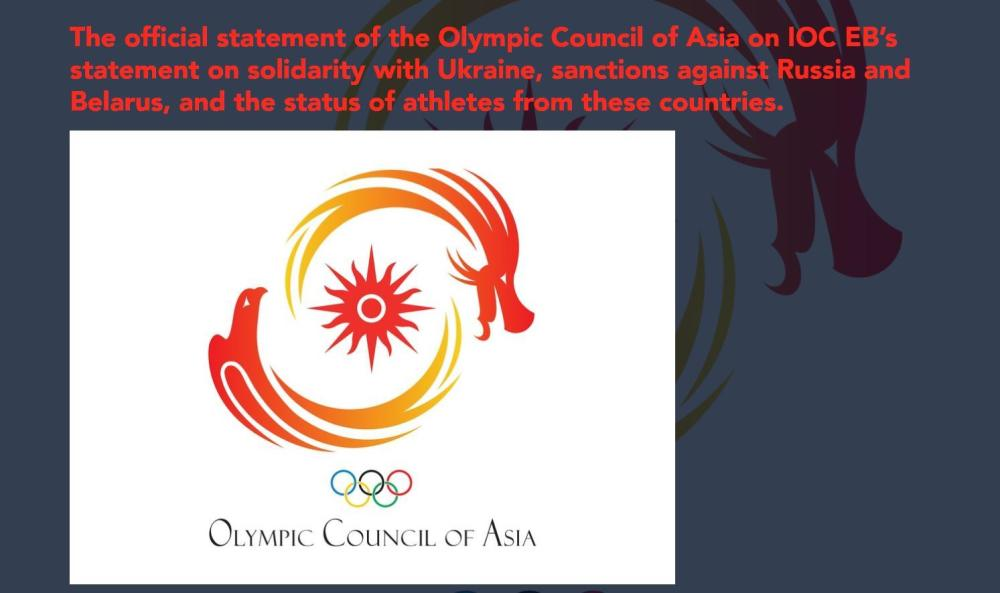
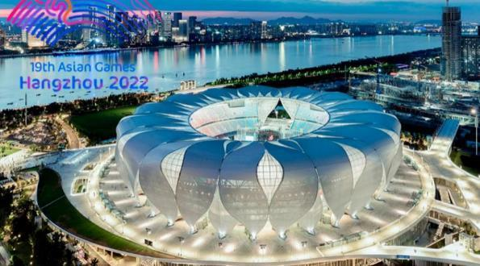

# 亚奥理事会：有意邀请俄罗斯运动员参加亚运会

中新网1月26日电 北京时间26日，据亚奥理事会网站消息，亚奥理事会有意邀请符合条件的俄罗斯和白俄罗斯运动员参加亚洲比赛，包括亚运会。

亚奥理事会表示，相信体育团结的力量，所有运动员，无论其是哪国国籍，所持的是什么护照，都应该能够参加比赛。

此前，国际奥委会召开执行委员会会议，会后宣布将继续对俄罗斯和白俄罗斯实施制裁。俄罗斯和白俄罗斯运动员可作为“中立运动员”参加比赛，但不能代表其国家或其国家的任何其他组织。(完)

