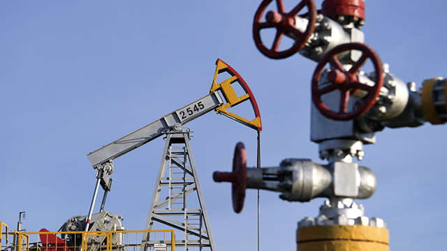

# 俄罗斯供应冲击将至？欧佩克正陷入两难境地

新年以来原油市场走势跌宕起伏，对衰退的担忧一度令国际油价回落近10%，而对中国需求复苏和俄罗斯能源出口因制裁下滑的担忧让多头蓄势待发。

原油经纪商PVM Oil Associates高级市场分析师瓦尔加（Tamas
Varga）在接受第一财经记者采访时表示，俄乌冲突成为了影响全球能源格局的历史性事件。今年的市场同样充满了不确定性，短期波动取决于潜在的经济压力和俄罗斯原油被动减少，非欧佩克增产也是扰动因素。他认为，转折点可能在下半年到来，中国进一步复苏和全球经济企稳预期有望恢复需求端的活力。

**俄乌僵局如何发展**

去年2月，乌克兰局势升级引发了新一轮地区能源危机。欧洲天然气价格创下历史新高，国际油价也一度逼近金融危机时期高位，这成为全球性通胀浪潮的最大推手，在许多国家和地区造成了严重的生活成本危机。

随着乌克兰局势升级，西方联盟对俄推出了多项制裁令，能源成为了重要目标。七国集团（G7）、欧盟和澳大利亚从去年12月起对俄罗斯海运石油实施60美元/桶的限价令。西方国家希望利用其对世界海上保险、融资和航运服务的控制权来限制俄罗斯的石油输出。作为回应，俄罗斯总统普京宣布，从2023年2月1日起五个月内，禁止向那些对俄罗斯石油限价的国家供应原油和成品油。

瓦尔加向记者表示，这一次的地缘政治危机打破了原有的能源格局，近几十年来形成的油气供应体系几乎破裂。直接结果就是，各国开始寻找替代能源方案，比如重新购买煤炭和启动核电站，推动加快太阳能和风能的部署。虽然欧洲今冬的能源局势较为乐观，但危机风险并未远去。

新的一年，乌克兰局势的走向对全球经济和能源供应形势依然有至关重要的影响。在西方联盟价格上限实施后，对俄罗斯出口下降的担忧有所加剧。俄罗斯副总理诺瓦克（Alexander
Novak）表示，作为回应，俄罗斯可能将石油产量减少5%至7%。

油价低迷和出口受限正在冲击财政状况。第一财经记者注意到，俄罗斯今年政府预算是按照乌拉尔原油70.10美元/桶的价格为基准，俄财政部部长西卢阿诺夫（Anton
Silanov）此前表示，油价上限可能意味着俄罗斯的预算赤字进一步更大。俄罗斯联邦储蓄银行（Sberbank）估计，如果乌拉尔原油的平均价格为55美元/桶，卢布兑美元汇率保持在67左右，政府将需要每月出售约合15亿美元的外汇储备以弥补财政缺口。

瓦尔加认为，莫斯科已经将重点坚定地放在了亚洲，并获得了丰厚回报。他预计，俄罗斯在亚洲地区的市场份额可能会继续保持高位，因为买家继续积极响应乌拉尔石油带来的实惠价格。问题是，亚洲地区的需求扩张空间正在变得愈发有限，而俄罗斯进一步拓展市场的尝试面临考验。

随着2月5日新一轮成品油禁令的临近，欧洲正在加速进口俄罗斯柴油，新禁令预计将进一步收紧市场供应，并加剧价格波动。根据国际能源署（IEA）的测算，预计在欧盟制裁全面实施后，2023年第一季度俄罗斯产能损失将扩大，预计下降140万桶/日。瓦尔加担心，阶段性供应紧张会导致更多的价格冲击。

**产油国策略分化**

今年全球原油产能有望小幅增长，但各国策略有所不同。

作为占据全球产量近一半的联盟，产油国组织OPEC+在去年末的部长级会议上维持了原先的生产计划，该组织去年10月刚结束了疫情以来持续近两年的减产周期。为了支持石油市场的平衡和稳定，OPEC+坚持积极主动和先发制人的方针，及时采取额外措施应对价格变化。
“市场受到许多不确定性因素的影响，包括全球经济发展、疫情因素以及持续的地缘政治紧张局势。”OPEC+强调。

由于俄罗斯是成员国，OPEC+也在密切评估对俄石油制裁对市场的影响。如果有必要，联合技术委员会JTC和联合部长长期监督委员会(JMMC)将可以在很短的时间内作出反应，维持油价在合理区间。按照目前的计划，现有生产配额将持续2023全年。

相比之下，
非OPEC+产油国增产意愿较高，不少国家希望获得更高的市场份额和油气收入，这对试图稳定市场的OPEC+而言无疑是潜在威胁。欧佩克和IEA市场报告预测，2023年非OPEC+供应量预计将平均增加3%-4%，达到接近5000万桶/日的水平。

北美地区潜力较大。美国原油产能将进一步释放，不过通胀压力和员工短缺可能抑制增长空间。美国能源信息署（EIA）短期展望将2023年美国原油产量调整至1234万桶/日，较去年增加近100万桶，从而超过2019年创下的历史纪录。邻国加拿大的石油产量今年将达到590万桶/日，比2022年增加11万桶。

巴西去年10月产量达到320万桶/日，超过了2020年1月的317万桶峰值水平。作为拉丁美洲最大的石油生产商，这种强劲的表现预计将持续到2023年。IEA预计，新的一年巴西石油产量将增长29万桶/日，年末日产量将达到接近350万桶。

北海油田为挪威提供了增产保障，去年底Johan
Sverdrup超级油田的第二阶段正式投产。最新政府预算草案显示，预计2023年挪威液态石油产量将增长15%。

与此同时，企业也在摩拳擦掌，埃克森美孚宣布2023年将把资本支出提高10%，至230亿美元至250亿美元，目标是到2027年底将石油和天然气产量提高到创纪录的420万桶石油当量。雪佛龙表示，预计2023年资本支出140亿美元，较前一财年增长14%。

**需求端弹性有待释放**

全球经济增长放缓、高通胀和高利率是短期内对石油需求和价格的主要负面威胁。

世界银行日前发布最新一期半年度《全球经济展望》报告，将2023年全球经济增长预期下调至1.7%，较2022年6月的预测下调1.3个百分点，为近30年来第三低水平。国际货币基金组织（IMF）称，全球经济放缓程度比预期更为严重，通胀处于几十年来的最高水平，多数地区的金融环境不断收紧等因素都对经济前景造成了严重影响。

瓦尔加告诉记者，受到经济下行对需求的影响，全球的库存可能会在上半年增加。衰退风险和利率上升仍然是原油市场的首要问题。然而，地缘政治紧张局势、俄罗斯石油供应量下降、OPEC+维持价格稳定的决心（不排除进一步减产）等因素将限制油价向下的空间。另一方面，他认为美国入场有望给油价托底。美国总统拜登在去年10月曾宣布考虑在油价达到或低于67美元-72美元时购买石油以补充储备。为了平抑油价，美国战略石油储备已经降至上世纪80年代以来的低位。

能源市场更大的希望可能是在下半年，随着经济下行并带动通胀压力回落，包括美联储在内的各国央行有望迎来重要的政策转向窗口期，从而提振商业活动和燃料需求。IEA预计，亚洲惊人的经济韧性将有力推动对石油的需求。预计中国石油需求回暖将从2023年第二季度起将使全球能源市场再次转为供不应求，第三季度出现160万桶/日的供应缺口，到年底缺口将扩大到240万桶/日。IEA将中国需求预测上调了10万桶，至1590万桶/日。

金融机构近期纷纷对中国复苏持积极态度。巴克莱预计，中国的全面重新开放最终可能会使全球石油需求增加100-200万桶/日。美银全球表示，在美联储货币政策温和转向和中国经济回升的背景下，布伦特原油价格在2023年平均为100美元/桶。

瓦尔加认为，与上半年相比，下半年的前景更为乐观。中国经济恢复正常将对石油需求提供宝贵的提振，届时石油供需将趋于紧张，进而推高油价。在这种情况下，对于OPEC+而言，及时通过调整产能供应将变得非常有必要，因为高油价将阻碍全球经济并打压复苏中的需求持续性。

