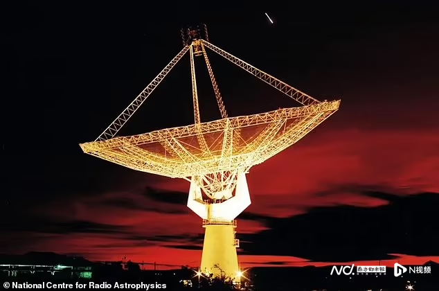
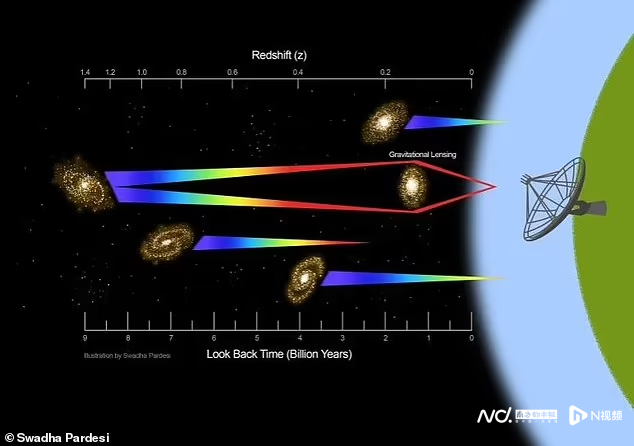

# 印度巨型望远镜首次收到近90亿光年外星系发出的无线电信号

加拿大和印度的研究人员在印度的一个巨型望远镜的帮助下，近日捕捉到来自距离地球近90亿光年、名为“SDSSJ0826+5630
”的星系的无线电信号。这是第一次从如此遥远的地方探测到此类无线电信号。

据报道，这个无线电波可以让天文学家们回到过去，了解早期的宇宙。科学家认为，宇宙大约有137亿年的历史。

_印度巨型望远镜首次收到近90亿光年外星系发出的无线电信号。_

这是第一次从如此遥远的地方探测到此类无线电信号，英国皇家天文学会在他们的每月通知中宣布了这一突破性的成果。

宇宙学家和该电波探测研究的共同作者查克拉博蒂（Arnab Chakraborty）表示，这相当于回看了88亿年。

不过，该信号不是由外星人发出的，而是来自宇宙只有49亿年历史时形成的星系。

查克拉博蒂表示，一个星系会发出不同种类的无线电信号，直到现在，我们只可能从附近的星系捕捉到这种特殊的信号，把我们的知识限制在那些离地球更近的星系。

据悉，这个波的探测是一个特别关键的发现，因为这个频率是在一个被称为“21厘米线”的特定波长上，也被称为“氢线”，是频率为1420的电磁辐射谱线。

氢气分布在整个空间，可以帮助绘制星系图，“21厘米线”就是用来做这个的。

印度的巨型望远镜能够接收到由于“引力透镜”而产生的微弱信号。

_“引力透镜”是一种自然发生的现象，它放大了来自遥远物体的信号，帮助我们窥视早期宇宙。_

研究人员表示，“引力透镜”是一种自然发生的现象，它放大了来自遥远物体的信号，帮助我们窥视早期宇宙。

据悉，另一个星系弯曲了从“SDSSJ0826+5630”发出的无线电信号，然后放大了这个波，使印度的望远镜能够接收到它。

文/南都记者 陈林

