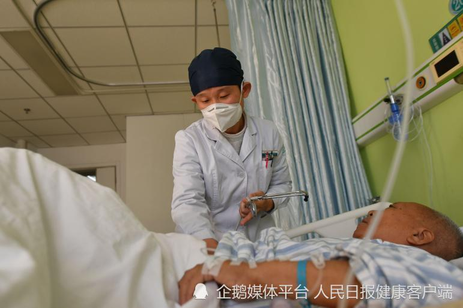
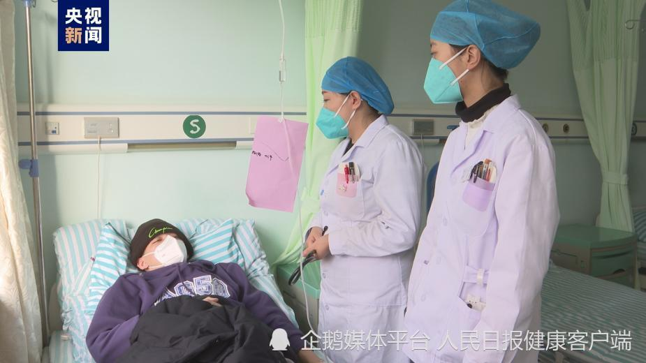

# 多地基层医疗机构：春节阳性感染就医人次大幅减少

**人民日报健康客户端记者 武星如**

春节假期期间，人民日报健康客户端记者致电多地的社区卫生服务中心、乡镇卫生院等基层医疗。春节期间基层医务工作者轮班坚守在岗，做好应急准备，不过春节期间阳性感染就医人数大幅减少。

“春节期间来社区医院的，大多都是开药或者解决一些小问题。但全科的、护理部的、药学的、行政的各个岗位都要有值班人员，这是医疗单位的职责。”北京市朝阳区呼家楼社区第二卫生服务中心值班医生向人民日报健康客户端记者表示。“大年三十、初一初二来社区医院就诊、开药的人比较少，初三开始大概就有几十个人了。”

该值班医生告诉记者，有发热、干咳、乏力、咽痛等11种新冠疑似症状的人群，是社区医院在春节期间需要重点关注的，“如果有这类人群来社区医院就诊，以及经历过新冠感染后出现一些新的症状的患者，我们在用药和治疗上都要格外关注。”为此，该中心在春节期间有严格的交接班制度，轮岗的医生每天交接班的时候，要对每天接诊了多少病人、有多少人存在疑似新冠症状、开了哪些药物等情况做详细的交接。

_1月23日，北京市朝阳区南磨房社区卫生服务中心主治医师正在检查住院病人的健康情况。新京报记者
王飞 摄_

广东省揭阳市揭西县东园镇卫生院春节期间“冷清”了许多。“除了一些因为肠胃不舒服、拉肚子等需要急诊的情况以外，几乎没什么人来。”该卫生院的值班医生告诉记者，尽管如此，为了应对各种可能来就诊的情况，该院春节期间每个科室都有人值守，每天都有十几位医护人员轮流值班。

“来医院的人少是好事。”这位值班医生向记者表示，镇上的人大多都已经“阳过”，来卫生院就诊的比起前段时间已经少了很多。但害怕春节期间疫情有反复的情况，卫生院都提前储备好了药品、相应的医疗设备等，值班的人员和往年相比也有增加。

_1月23日一早，青海省西宁市城西区西关大街社区卫生服务中心就有患者前来问诊开药和住院治疗。央视新闻图_

青海省西宁市城东区东关大街社区卫生服务中心值班的苗医生向人民日报健康客户端记者表示，春节期间该社区卫生服务不“减码”，门诊、开药、疫苗接种等医疗卫生服务都正常开展。

“最近春节期间，主要是来看门诊的比较多，也有来打疫苗的。”苗医生表示，“有打新冠疫苗的，还有很多是来咨询接种狂犬疫苗的。春节期间大家情绪高涨，被猫抓伤、狗咬伤的情况也有不少。”

