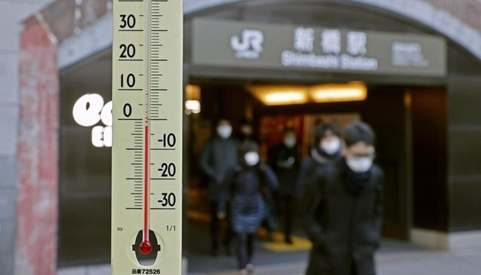

# 寒潮席卷东亚：日本遇10年最低温，韩国济州岛数万游客滞留

这个冬季，北半球各地出现了截然不同的异常天气。

本月初当北美遭暴风雪袭击之时，欧洲迎来了历史性暖冬，法国和西班牙报告近25℃高温。月底，当欧洲气温恢复正常时，东亚则迎来了强寒潮。

受超强极地冷空气影响，日本、韩国、中国和朝鲜近期均遭遇强降温。日本多地将现10年来最低温，韩国济州岛近500架航班取消，中国漠河最低气温达到-53℃，朝鲜发布寒潮预警。

据日本共同社1月25日报道，当天，日本大部分地区继续出现强降温和强降雪，多地交通受阻。日本航空和全日空计划取消200多架航班，东日本铁路公司取消部分高铁线路运行。

日本气象局预计，从周二到周四，日本北部和西部将遭遇今冬最强寒潮，周三多地气温将跌至10年来最低。预计北部札幌市最低温将降至-12℃，仙台市和长野市-6℃，东京都中心地区-2℃。

从周二到周三早上，预计新泻县积雪厚度将达到90厘米，北陆地区积雪80厘米，关西地区积雪70厘米；东京中心地区也可能出现积雪。日本国土交通省已经呼吁民众在强降雪天气避免出门。

受寒潮影响，三菱重工推迟了原定于周三进行的通信卫星发射，最终发射时间取决于天气情况；丰田汽车位于九州岛的工厂也临时停产。强降温将推高日本的能源需求，但彭博社报道称目前日本还能依靠库存的液化天然气发电，尚不需要加大能源进口。

_2023年1月25日上午，日本东京，JR新桥站附近的温度计。图片来源：视觉中国_

在日本经历强降温时，韩国气象局也发布寒潮预警，从周二到至少周三，韩国大部分地区将遭遇强降温、强降雪和大风天气。周二，首尔气温一度降至-19.2℃，江原道部分地区降至-25.5℃。

本轮降温中，旅游胜地济州岛成为重灾区。当地政府已将天气预警等级升为橙色预警，为四级预警中第二高。周二，济州岛最高风速超过75公里/小时，为七年来最强风。

济州岛当局统计，周二当天共有476架航班被取消，其中包括10架国际航班；11艘从济州岛出发的渡轮也因大风天气取消。航班渡轮取消导致4.3万名乘客滞留，预计部分航班能于周三恢复正常运行。

目前韩国当局正在密切监测电网运行情况。本轮强降温正好与韩国的春节假期重叠，去年假期结束后一天，韩国的用电量陡增15吉瓦时。

与韩国相邻的朝鲜也发布了强寒潮预警，预计朝鲜北部地区气温将跌至-30℃，平壤最低气温降至-20℃。朝鲜当局预计，本轮寒潮将为2001年以来最强寒潮。

而中国的本轮寒潮正在接近尾声，北方大部地区回暖。上周日，漠河市最低气温达到-53℃，刷新中国有气象记录以来的最低气温。加上周日，漠河最低气温已连续三天跌破-50℃。

部分研究认为北极冰层加剧融化是造成亚洲冬季寒潮的原因之一。但也有学者认为相关理论尚在研究阶段，不能被用于实际天气预测。

去年夏季，北极圈出现了32.5℃极端高温。《自然》周刊上周发表的论文指出，位于北极圈内的格陵兰岛的冰盖温度已升至1000年以来最高。2001年至2011年，格陵兰岛冰盖温度比20世纪平均升高了1.5℃。

报告认为，人类活动造成的气候变化是格陵兰岛冰盖温度升高的主要原因之一。如果各国继续延续目前的碳排放水平，到2100年，格陵兰岛冰层融化将导致海平面上升最高50厘米，严重威胁海岛国家和沿海地区。

