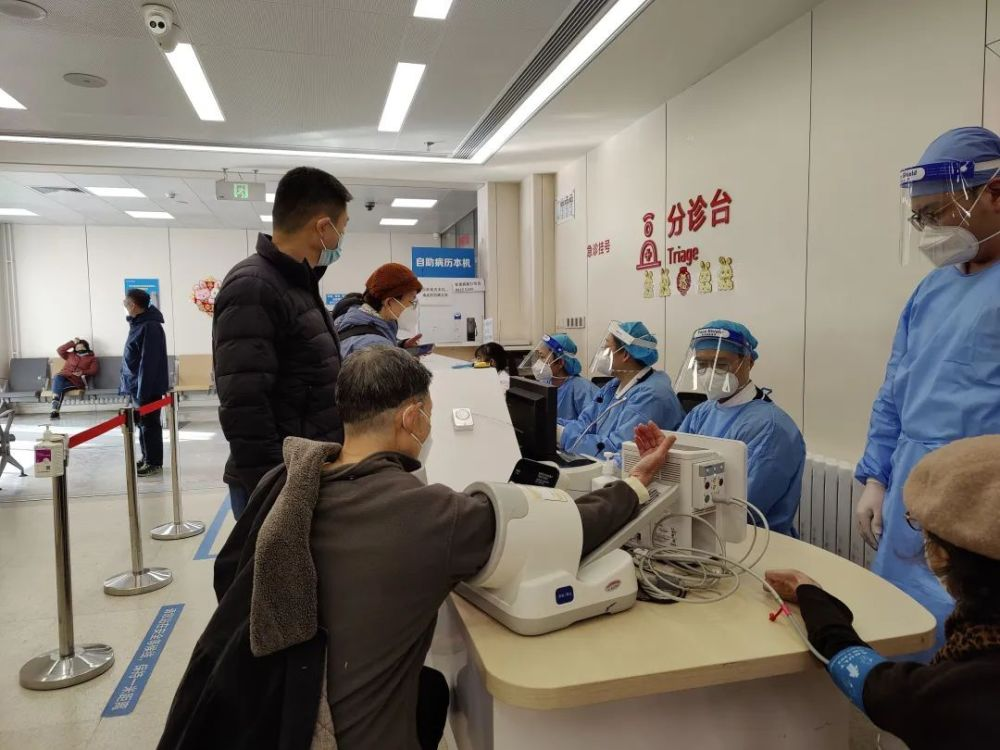

# 年三十，守候在急诊室的他们

**全文5246字，阅读约需11分钟**

**新京报记者 吴小飞 编辑 甘浩 校对 贾宁**

2023年1月21日，农历大年三十。这是新冠疫情“乙类乙管”以后的第一个春节，游子归巢，万家团圆，也是“大疫三年”来，最有年味的春节。

但在中日友好医院的急诊科室，并没有因为“万家团圆”而“清闲”。

“病人先推到这边量一下血压和氧饱和度，没有病历本的话那边机器可以自助取一下……”下午二点，在急诊大厅的分诊台，五名医务人员正引导围在分诊台的患者及家属有序就医。

映入眼帘的急诊大厅，三人一排，五人一队地松散地走动着。病人或排队等待分诊，或在家人搀扶下候诊，或躺在推车上输液，或坐在候诊座位上等待下一步流程……此刻的急诊患者的排号已有两百多人。

中日友好医院将急诊病情分为四个等级，分诊台主要用来指引患者分类就医。一级病情最重，比如患者出现呼吸困难、重创大出血等，一般需要立即抢救；四级病情最轻，比如慢性病发作、动物咬伤等。

这所三甲医院的呼吸科，全国排名第二，北方第一。它与广州医科大学附属第一医院南北呼应，共同构成国家呼吸医学中心。大疫三年，中日友好医院未曾缺席一线防控，2003年非典疫情暴发时，也曾作为定点医院收治患者。

除夕来挂急诊的，不乏感染新冠的病人，但更多人是其它病症：有老人造瘘感染、有中年酒醉误伤、有儿童腹痛难忍……在医院经历过此前诊疗高峰的人，大都明显地感觉到，医院正在恢复常态。除夕夜的急诊室，仍然有无数有关守候与无奈的故事，但至少新冠的阴霾，正在慢慢散去……

**急诊科内**

赵磊，急诊室医生，除夕日负责白天分诊台的接待工作，主要职责是给分诊台的患者量血压和测血氧。他接待的病人多是以老年人为主，有的是自己来，有的坐着轮椅，有的人是躺在担架车上，但大都需要在他那测一测，以研判病情，有序指引分诊。

他对老年患者格外耐心，老人们怕冷，冬天的衣服大都里三层外三层，每脱一件就问“这样行了吧？”他总是不厌其烦地重复让他们尽量裸露手臂，这样测得更准一些。对于那些躺在急救担架上接近意识似有还无的，需要指引急救人员反复调整担架位置，贴近血压仪。

测量完赵磊会把数据大声报给录入的同事，四五名大夫相互配合，各自负责一块，有的详细询问病人病况和病史，有的交待下一步需要做的检测，有的指引购药付费。

除了做初步诊断登记，分诊台还承担了大量患者及家属问询工作。患者的CT袋丢了如何取片、到哪里缴费、哪里买药、如何打印病历本、采完血要什么时候出结果、洗手间在哪里……为了有效给患者讲清流程，赵磊和同事们基本要站着工作，只有在无人问诊的时候，才能坐下来歇一歇。

_▲1月21日，中日友好医院急诊科分诊台，医务人员正在指引患者有序分诊。新京报记者
吴小飞 摄_

中日友好医院的急诊大厅似呈“田”字分布，“十”字主干道区域是分诊台、门诊室、急诊收费处以及等候大厅，四周则依次分布着抢救室、抢救观察室、儿科急诊、急诊输液室、急诊病房和急诊重症监护室。

主干道尽头的墙上贴了一个大大的红底金黄的“福”字，各个诊室，也大都张贴着一些卡通兔子、红色福字串来迎接新年。这些颜色在医院乳白色的背景下十分醒目，但往来步履匆匆、面色凝重的人们，也无心驻足片刻。

年三十日下午3点多，急诊大厅的等候区域，几乎坐满了人，采血室、收费台、取药处，各有三五人群，内科诊室门口人多些，七八个人在排队等待就诊。大厅里门诊的患者多以三级和四级为主，意识清醒，基本可以实现自主就医。

输液室内的十余名患者，大部分以老人为主。护士李敏和一名大夫正在给一名白发苍苍的老妇人看诊，这位患者呼吸声音粗大且急促，并不断“哎哟—哎哟—”地呻吟着。

“除了喘还有哪里不舒服……中午吃了些什么……”大夫问诊，李敏协助输液，她的手指在老人失去弹性的皮肤上细细摩挲着，随即拍打手臂找血管，然后交待家属不要频繁给患者喝水，盯着些点滴和老人的情况，有异常要及时叫人。

老人的呻吟声弥漫在十余平方米的输液室内，在护理站内配药的李敏很不放心，时不时就得出来给老人测测指尖血氧，看看老人点滴的流速，观察老人的反应。直到有患者家属呼喊换药才转身护理其他人。

抢救室外，四五名患者家属坐在便携板凳上贴门等候着，虽然几米外就有一个家属等候区。他们忧心在抢救室的亲人，希望在大夫出来时能第一时间了解病情或者及时给些反馈。

“XXX患者家属在吗？”抢救室大夫卢燕推开门问道。几名家属围了上来，卢燕详细询问了病人的病史和过敏史，并从家属报出的患者常用药品中，敏锐指出病人的病史不可能只有高血压，可能很久之前就伴有冠心病或心衰。

卢燕向家属介绍，患者目前肺部全是积液，还有心包积液，加上年事已高累加多种基础病，随时可能会下病危通知，要求至少一名直系家属在外等候。她还详细介绍了为了抢救患者目前采取的生命支持方案和诊疗优先次序。

家属们一脸茫然，努力屏气凝神地试图理解那些医学词汇和专业术语，卢燕知道他们可能并未完全理解患者的情况，便请他们详细阅读下病情告知书等相关材料，“半小时后我再来，你们先看看，还有哪里不明白我再解释。”

急诊重症监护室外亦有十余名家属等候，这间11个床位的病房目前住着8位病人，有的意识清醒可以自主进食，有的还处于昏迷阶段。病房封闭式管理，不允许病人家属进入病房探视。

重症监护室外，一名医生正在向患者家属介绍患者目前的情况，并阐释了近期可能采取的诊疗方案。另一旁，一家三口正借助护工的手机跟病房里的亲人视频通话：“你加油，我们全家人都等着你康复回家……孩子在家姥姥陪着呢……明天我再来看你，给你带饺子……”

**特殊的“年夜饭”**

除夕下午四五点，很多家庭就开始吃团年饭了，然后看春晚、打麻将……一家人热热闹闹地唠着家常守岁。而中日友好医院的急诊室，却是别样的光景。

“吃了吗？今天的砂糖橘很甜。”

“还没，等着下班回家吃个团圆饭。”

“羡慕你。”

“科室有牛奶，下班记得带上。”

下午四点多是交接班的时间，走廊楼道遇到熟悉的面庞，医护会彼此问候“过年好！”“新年快乐！”

医院给值班医护准备了盒饭，院内食堂也在开放着，“年夜饭”都是普通的家常菜：土豆炖肉、西芹香干、烧小鸡、红烧鱼……主食是米饭和馒头。唯一和过年有关的，就是水饺，大夫们点的，大多是素馅的。

“晚饭打算就在食堂随便吃点。”急诊科室保安王宇也是这天值班。王宇老家是河北的，在中日医院已经工作了十年。每年春节他都主动要求安排值班，因为父母已经不在了，兄弟姐妹各自成家，他孤身一人在北京打工，已经二十多年没回老家了，“一个人过年也没啥意思，不如值班让其他的同事回家团聚。”

“输液室往左边……CT室在右边……”王宇站在急症科最中心的路口位置，为问询的人指路。一般一个工作日，王宇要在岗12小时，主要是来回在科室里巡视，负责科室安保，忙的时候他也会搭把手推下床、指个路。

_▲1月21日下午8时许，一名抢救室患者家属在观看央视春晚。新京报记者
吴小飞 摄_

下午五时许，张勇背着一个厚厚的黑书包来到急诊病房门外，他的母亲因为血液病住进了急诊病房，他跟母亲的主治医生商量了很多次，希望能够接老人回家过个年，但医生考虑到老人的病情，没有同意。

张勇的背包里装着给老人煲的滋补汤，一些橘子、苹果等，还拎着一袋子卷纸。这些吃的和生活用品，只能通过科室里的护工转交给母亲。“汤让她趁热喝，凉了不好喝，我妈就拜托您了。”张磊一面给护工递东西，一面叮嘱着。

煲的汤洒了一些在地上和书包里，张勇赶紧拿出纸巾蹲在地上擦拭，医护出入急诊住院病区时，他会不自觉地透过缝隙勾着头往里看，他希望看到母亲，也希望母亲看到他，“过年了，其实哪怕是进去看一眼，对老人来说也是个心理安慰”。

陆涛已经在急诊大厅的等候席坐了一段时间了，直到一位男护工从急症重症监护室走出来，他才连忙拎起脚边的一箱子梨迎上去。这箱水果是送给护工的，陆涛的父亲因为病重已经不能自主进食了，他一边递上水果，一边用力握了握护工的手。

“这里的护工是负责整个科室的不是一对一的，父亲病得那么严重，我们进不去也没法照顾，连给他做点吃的也不能，送点水果，希望他（护工）能多照应下老人。”陆涛说。

陆涛父亲年过八旬，十多天前因为感染新冠住进了急诊重症监护室，因为累加基础病，所以感染后病情发展得格外凶猛迅速，目前已经实施了气管插管，处于生命维持状态。

这段时间以来，只要有时间陆涛就在医院急诊大厅里坐着，他担心老人有突发情况，万一需要家属签字，从家里赶来会来不及，就让妻子照顾好孩子，自己独自在医院守着，“现在医生几乎每一次传来的都是更糟的消息，我也没什么心思过年。”

抢救室外，家在北京延庆的郭敏一天没有进食了，就一直蹲在墙边，她的妹妹在医院的自动贩售机上给她买了巧克力派和饮料，郭敏放在旁边没动。她一直责备自己没有及时把父亲送到大医院来救治，延误了病情，送进抢救室时老人已经昏迷了，加上还有多种基础病，“恐怕很难熬过去了”。

除夕夜的急诊室没有平日里的嘈杂，个别患者家属手机里，传来春节联欢晚会岳云鹏的相声，声音不大，但视频里的热闹在安静的等候区显得格外突兀，没人出来阻止手机外放，这小小的欢笑声，似乎能让急诊压抑的气氛消散一些，让人心可以短暂松绑。

**迈向新年**

时钟转到零点，新年钟声敲响。

新一批到岗的医护，科室内不断减少的人群，在悄无声息地提醒着新年的到来。这时候的急诊大厅等候区稀疏地散落着三五个人，保安在走道来回巡视着，输液室还有十来位患者及家属，重症监护室、抢救室外的走廊，还有患者家属支起了折叠床守夜。

_▲1月22日零点一刻左右，急诊科门外又来了两辆救护车，分诊台的医务人员又开始忙活起来。新京报记者
吴小飞 摄_

除夕当日，急诊科日挂号病人为340多人。“现在人可少太多了，一个月前这里走廊的地上到处都躺着患者，大厅里人挤人，我们也要一直忙一直忙，干不完的活。”科室保洁杨慧看到眼前急诊的“清闲”，不无感慨地说。

自疫情防控政策调整以来，从2022年12月初至12月中旬，这间只有63张床位的急诊科一天的接诊量曾达到578人，其中危重症占比高达20%。12月下旬，不少媒体探访发现，该科室的日接诊量一度超过800人。

与此同时，医护遭遇阳性减员，重症医学科承受着人员不足的压力。为了全力保障一线救治，一批退休返聘的医师、护士积极响应号召返岗。据院方不完全统计，目前有80余位退休返聘医师坚持出门诊做手术，50余位退休护理人员到岗驰援。年轻住院医师、规培生、研究生、进修生，也都坚守医疗一线，协助诊疗。

1月19日，国务院联防联控机制就春节期间疫情防控有关情况举行发布会，国家卫生健康委医疗应急司司长郭燕红在会上表示，目前，发热门诊、急诊、在院重症患者均度过高峰，正常的医院诊疗正在恢复。

郭燕红介绍，就急诊情况来看，全国急诊就诊人数在2023年1月2日达到峰值，之后持续下降，1月17日较峰值下降了44%。全国在院的阳性重症患者人数是在1月5日达到峰值，之后持续下降，1月17日较峰值数量下降了44.3%。

78岁的王若梅，就专门挑了个人少的时间来挂了急诊。

相较于其他被家属簇拥的老人，王若梅是自己一个人来看病的，她一直有高血压的老毛病，当天突然流鼻血，心里害怕，所以来医院挂个急诊。她说自己是这里的“老主顾”，经常来看病，半个月前这里还是人挤人，所以挑了个稍晚的时间来。

0点前后，王若梅才颤颤巍巍地推着自己的超市购物用的小车回家。

王若梅的两个女儿都在南方工作，也都成家立业了，很少春节回来。两年前老伴儿去世后她就一个人独居，整个挂号、就诊、检测，她一个人折腾了大半天，她说自己腿脚不灵便了，走路很慢，全靠小车借力支撑，医生说她没啥新毛病，都是旧病反复。

“老了，身上的零件不好使了，哪哪都有故障。”王若梅边说边笑，还拍了拍自己的小腿，只是泪水在她不再明亮的双目里打着转儿，随后她扶着小推车慢慢往外走，临走还道了声“过年好”。

李峰已经在重症监护室外守了一个多月，他的女儿因为感染新冠突发心肌炎，曾经三度与死神擦肩而过，如今已经脱离人工心肺（ECMO），正在恢复中。他见证了过去一个多月急诊科的人来人往，很多人进了重症监护室就没有走出来，而自己的女儿还有很大可能平安回家。

李峰除夕也要在这里守着。“我就这么一个女儿，虽然守着也帮不了她什么，但离得近心里好受些。”李峰说新年最大的愿望就是女儿能康复，他心疼女儿所遭的罪，如果女儿平安回家了，会尽自己所能照顾好她。

零点一刻左右，急诊门前又先后来了两辆救护车，分诊台医生文敏再次开始忙乎起来。

文敏是河北人，因为疫情，已经连续三年没回家了，她觉得今年除夕夜的来诊患者比往年的更少些，工作也在慢慢恢复常态。今年排到她值夜班时，她不忍心开口跟同事调班，“大家都想回家，忙完这几天我再抽时间回去吧，父母能理解的。”

（文中受访者均为化名）

**值班编辑 古丽 李加减**

**本文部分内容首发自新京报公号“剥洋葱people”**

**未经新京报书面授权不得转载使用**

