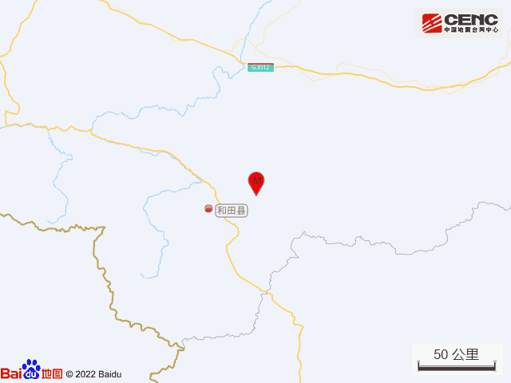
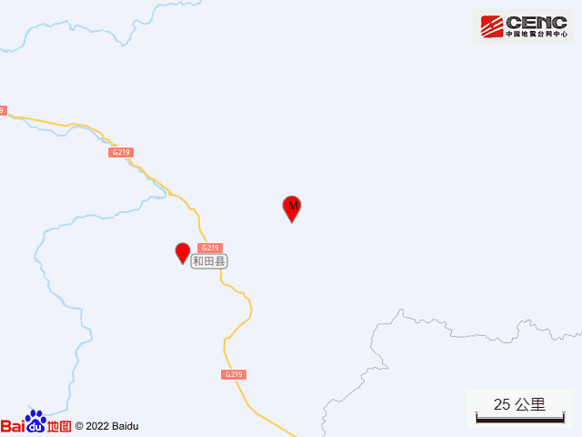
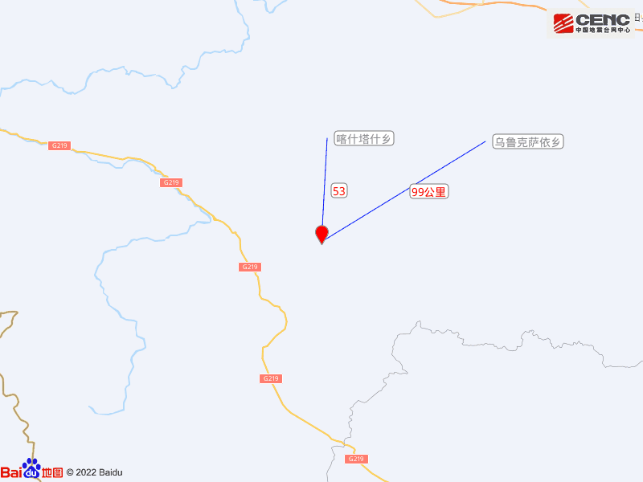
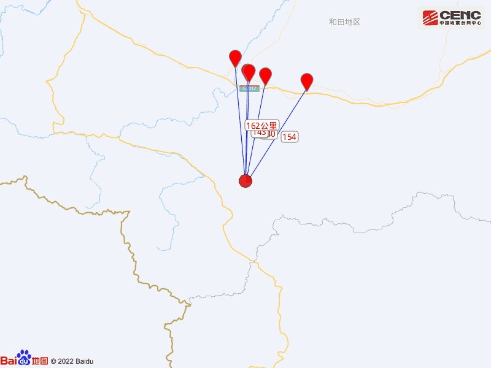
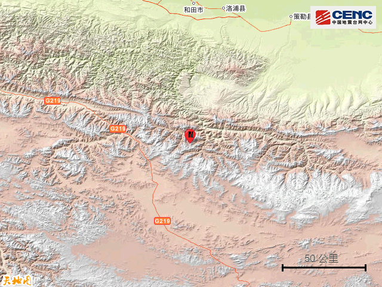
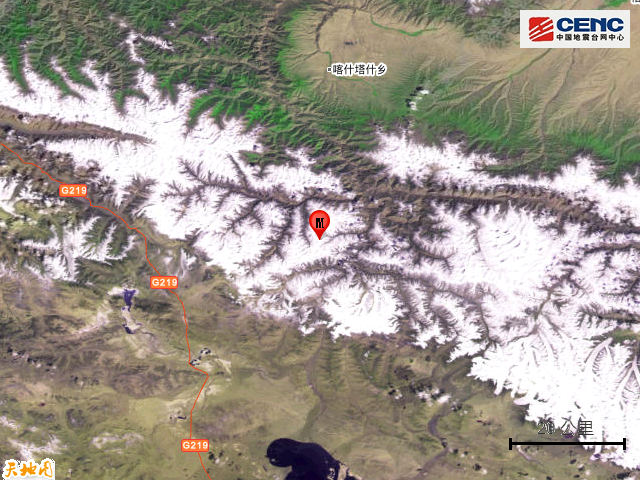
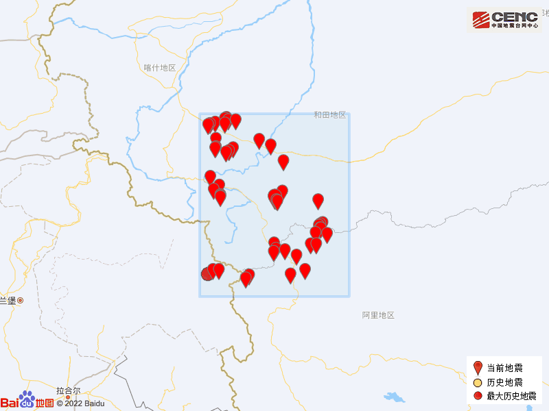

# 新疆和田地区和田县发生4.9级地震

据中国地震台网正式测定，1月26日0时2分在新疆和田地区和田县发生4.9级地震，震源深度10千米，震中位于北纬35.83度，东经79.89度。

本次地震周边20公里内无村庄分布，50公里内无乡镇驻地分布，100公里内的乡镇有喀什塔什乡、乌鲁克萨依乡。

震中距洛浦县140公里、距和田县142公里、距和田市143公里、距策勒县154公里、距墨玉县162公里，距和田地区143公里，距乌鲁木齐市1105公里。

震中5公里范围内平均海拔约5531米。

根据中国地震台网速报目录，震中周边200公里内近5年来发生3级以上地震共68次，最大地震是2020年9月25日在克什米尔发生的5.3级地震（距离本次震中239公里），按震级大小前50次历史地震分布如图。

